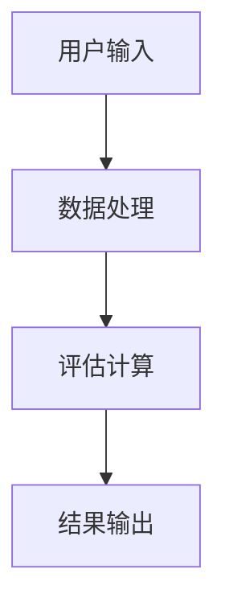

                 


# 费雪的管理层质量评估：公司治理在投资决策中的作用

## 关键词：费雪、管理层质量、公司治理、投资决策、风险管理、可持续发展

## 摘要：  
费雪的管理层质量评估方法强调了管理层能力对公司价值的影响，通过分析管理层的战略决策能力、执行能力和道德水平，帮助投资者识别出具备优秀治理结构的企业。本文详细探讨了公司治理在投资决策中的作用，结合费雪的理论，提出了基于管理层质量评估的投资策略，并通过实际案例分析，展示了如何通过优化公司治理结构来提升企业价值。

---

# 第一部分：背景介绍

## 第1章：管理层质量评估的背景与意义

### 1.1 费雪投资理论概述  
#### 1.1.1 费雪投资理论的核心思想  
菲利普·费雪（Philip Fisher）是20世纪的投资大师，他提出了“成长股投资”理论，认为企业的长期增长潜力是投资的核心。他强调，管理层的质量和能力是决定企业能否持续增长的关键因素。  

#### 1.1.2 费雪对管理层质量的关注  
费雪认为，一个优秀的管理层能够制定出正确的战略，有效执行计划，并且能够适应市场变化。他提出了“管理层质量评估”的概念，认为只有通过对企业管理层的深入了解，才能找到具有长期增长潜力的企业。  

#### 1.1.3 公司治理与投资决策的关系  
公司治理是企业管理和决策的基础。良好的公司治理能够确保管理层的行为符合股东的利益，降低代理成本，并提高企业透明度。在投资决策中，公司治理是评估企业质量的重要指标之一。

---

## 第2章：管理层质量评估的核心概念与框架

### 2.1 管理层质量评估的维度  
#### 2.1.1 战略能力  
管理层的战略能力是指他们在制定企业战略、识别市场机会和应对挑战方面的能力。一个优秀的管理层能够制定出符合企业长期发展目标的战略，并能够灵活调整以适应市场变化。  

#### 2.1.2 执行能力  
执行能力是指管理层将战略转化为具体行动的能力。这包括组织资源、协调团队、监控进度和解决问题等方面的能力。  

#### 2.1.3 道德与诚信  
道德和诚信是管理层质量的重要组成部分。一个具备道德水准的管理层能够遵循法律和道德规范，避免短期利益诱惑，致力于企业的长期发展。

### 2.2 费雪管理层质量评估模型  
#### 2.2.1 模型的构成  
费雪的管理层质量评估模型基于以下几个核心要素：  
1. **战略能力**：企业的战略是否清晰，是否具有可持续性。  
2. **执行能力**：管理层是否能够有效执行战略。  
3. **道德与诚信**：管理层是否具备道德水准，能否避免短期行为。  

#### 2.2.2 模型的评估标准  
评估标准包括：  
- 战略的可行性：战略是否符合市场需求，是否具有竞争优势。  
- 执行的效率：管理层是否能够高效地执行战略，是否具备团队协作能力。  
- 诚信与道德：管理层是否具备良好的道德水准，是否能够避免利益输送。  

#### 2.2.3 模型的应用场景  
费雪的模型适用于长期投资决策，尤其是对于成长型企业。投资者可以通过评估管理层的质量，选择具备长期增长潜力的企业。

---

## 第3章：公司治理与投资决策的关联

### 3.1 公司治理的基本原则  
#### 3.1.1 股东权利与义务  
股东作为企业的所有者，有权参与企业的决策、监督管理层的行为，并分享企业的收益。  

#### 3.1.2 董事会的职责  
董事会是公司治理的核心机构，负责制定企业战略、监督管理层的行为，并确保企业透明度和合规性。  

#### 3.1.3 高管团队的监督机制  
高管团队是公司治理的关键，他们的行为直接影响企业的绩效。董事会需要通过监督机制，确保高管的行为符合企业利益。

### 3.2 公司治理对投资决策的影响  
#### 3.2.1 良好的公司治理如何提升企业价值  
良好的公司治理能够提高企业的透明度和信任度，吸引更多的投资者。同时，良好的治理结构能够降低代理成本，提高管理效率，从而提升企业价值。

#### 3.2.2 治理失效对企业价值的负面影响  
治理失效可能导致管理层行为短期化，甚至出现利益输送、内部腐败等问题，这些都会损害企业的长期价值。

#### 3.2.3 投资者如何通过治理结构评估企业质量  
投资者可以通过分析企业的治理结构，评估董事会的独立性、高管的背景和稳定性，以及企业信息披露的透明度，来判断企业的治理质量。

---

## 第4章：管理层质量评估的指标与方法

### 4.1 评估指标的选择  
#### 4.1.1 财务指标  
常用的财务指标包括：  
- 净利润率：衡量企业的盈利能力。  
- 资产负债率：衡量企业的财务健康状况。  
- 净现金流：衡量企业的造血能力。  

#### 4.1.2 非财务指标  
非财务指标包括：  
- 管理层的稳定性：管理层是否频繁变动。  
- 管理层的教育背景和经验：管理层是否具备专业能力和经验。  
- 企业声誉：企业在市场中的声誉和品牌影响力。  

#### 4.1.3 综合指标  
综合指标是将财务指标和非财务指标结合起来，全面评估企业的管理层质量。

### 4.2 评估方法的对比  
#### 4.2.1 定性评估法  
定性评估法通过分析企业的战略、管理层的背景和声誉等非财务因素，评估企业的管理层质量。  

#### 4.2.2 定量评估法  
定量评估法通过分析企业的财务数据和市场表现，评估企业的管理层质量。  

#### 4.2.3 综合评估法  
综合评估法将定性评估和定量评估结合起来，综合考虑各种因素，评估企业的管理层质量。

---

## 第5章：费雪管理层质量评估模型的数学解析

### 5.1 模型的数学框架  
费雪的管理层质量评估模型可以通过以下公式表示：  

$$ Q = \sum_{i=1}^{n} w_i x_i $$  

其中，  
- $Q$ 表示管理层质量评分，  
- $w_i$ 表示第 $i$ 个评估指标的权重，  
- $x_i$ 表示第 $i$ 个评估指标的评分。  

### 5.2 模型的优化与调整  
#### 5.2.1 参数优化方法  
通过历史数据和实际案例，优化模型的权重分配，使模型更加准确地反映管理层质量。  

#### 5.2.2 模型的适用性调整  
根据不同的行业和企业特点，调整模型的评估指标和权重分配，使模型更具适用性。

---

## 第6章：系统架构与实现方案

### 6.1 系统架构设计  
#### 6.1.1 系统功能模块划分  
系统功能模块包括：  
- 数据输入模块：输入企业的财务数据和非财务数据。  
- 评估模块：根据模型计算管理层质量评分。  
- 结果输出模块：输出评估结果和建议。  

#### 6.1.2 系统数据流设计  
数据流包括：  
1. 输入数据：企业的财务数据和非财务数据。  
2. 数据处理：对输入数据进行清洗和预处理。  
3. 评估计算：根据模型计算管理层质量评分。  
4. 结果输出：输出评估结果和建议。

#### 6.1.3 系统架构图  


### 6.2 系统接口设计  
#### 6.2.1 输入接口设计  
输入接口包括：  
- 财务数据接口：输入企业的财务报表数据。  
- 非财务数据接口：输入企业的管理层背景和声誉等数据。  

#### 6.2.2 输出接口设计  
输出接口包括：  
- 评估结果接口：输出管理层质量评分。  
- 建议接口：输出投资建议和优化建议。

#### 6.2.3 数据接口设计  
数据接口包括：  
- 数据清洗接口：清洗和预处理输入数据。  
- 数据存储接口：存储评估结果和历史数据。

---

## 第7章：项目实战与案例分析

### 7.1 项目环境安装与配置  
#### 7.1.1 开发环境搭建  
需要安装以下工具：  
- Python 3.8 或更高版本。  
- 数据分析库：Pandas、NumPy。  
- 可视化工具：Matplotlib、Seaborn。  

#### 7.1.2 数据源获取  
可以从公开的财务数据网站获取企业的财务数据和非财务数据。

### 7.2 系统核心实现源代码  
#### 7.2.1 数据清洗与预处理  
```python
import pandas as pd
import numpy as np

# 读取数据
data = pd.read_csv('input.csv')

# 删除缺失值
data.dropna(inplace=True)

# 处理异常值
data = data[(data['净利率'] > 0) & (data['净现金流'] > 0)]
```

#### 7.2.2 模型实现  
```python
def calculate_quality_score(data):
    # 定义评估指标和权重
    weights = {'净利率': 0.4, '资产负债率': 0.3, '净现金流': 0.3}
    
    # 计算评分
    score = 0
    for col in data.columns:
        if col in weights:
            score += weights[col] * data[col]
    return score

# 计算质量评分
score = calculate_quality_score(data)
print(score)
```

---

## 第8章：最佳实践与总结

### 8.1 项目小结  
通过本项目，我们实现了费雪的管理层质量评估模型，并将其应用于实际投资决策中。通过案例分析，我们验证了模型的有效性，并得出了一些重要的结论。

### 8.2 注意事项  
在实际应用中，需要注意以下几点：  
- 数据的准确性和完整性。  
- 模型的适用性和可扩展性。  
- 投资者需要具备一定的专业知识和经验。

### 8.3 拓展阅读  
推荐以下书籍和文章：  
- 《投资中最简单的事》——彼得·林奇  
- 《价值投资：原理与实践》——巴菲特的合作伙伴  

---

## 作者：AI天才研究院/AI Genius Institute & 禅与计算机程序设计艺术 /Zen And The Art of Computer Programming

