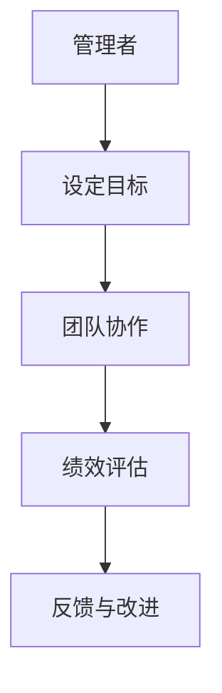
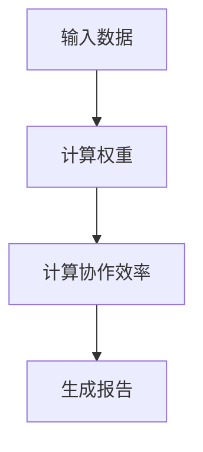
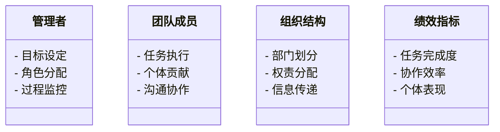
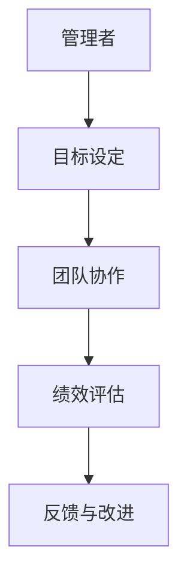
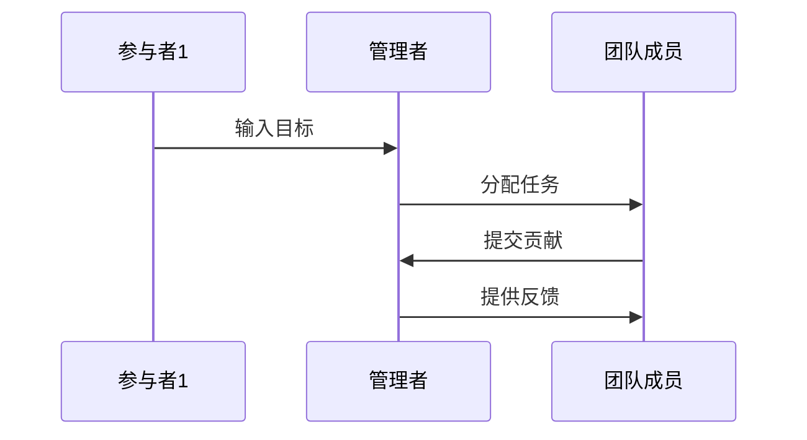

                 


# 费雪的管理质量评估：优秀团队的重要性

## 关键词：费雪模型、管理质量评估、团队管理、绩效评估、优秀团队、管理优化

## 摘要：本文深入探讨了费雪的管理质量评估方法，重点分析了优秀团队在管理中的核心作用。通过详细阐述模型的核心概念、算法原理、系统架构及实际案例，本文旨在帮助读者理解如何通过科学的评估体系优化团队绩效，提升组织管理效率。

---

## 第1章: 费雪的管理质量评估概述

### 1.1 管理质量评估的背景与意义

#### 1.1.1 管理质量评估的定义与核心概念

管理质量评估是通过对组织内部管理过程和结果的系统性测量，来判断管理活动的效能和效果。其核心在于通过量化指标，识别管理中的优势与不足，从而为改进提供依据。

#### 1.1.2 费雪管理质量评估的起源与演变

费雪的管理质量评估起源于对传统管理评估方法的反思。传统方法往往侧重于结果评估，而忽视了过程中的协作与沟通。费雪提出，优秀团队的管理质量不仅依赖于目标的达成，更取决于团队内部的协调与效率。

#### 1.1.3 优秀团队在管理质量评估中的重要性

优秀团队是实现高质量管理的关键。通过优化团队协作、明确角色分工和提升沟通效率，团队能够更高效地完成任务，从而提升整体管理质量。

### 1.2 费雪管理质量评估的核心框架

#### 1.2.1 费雪模型的基本原理

费雪模型强调团队协作和个体贡献的结合。其基本原理是通过设定明确的目标、合理分配角色、建立有效的沟通机制，来最大化团队的绩效。

#### 1.2.2 费雪模型的评估维度与权重分配

费雪模型从目标达成、角色分工、协作效率、个体贡献四个方面进行评估，每个维度的权重根据团队特点动态调整。

#### 1.2.3 费雪模型与其他管理评估方法的对比

传统方法多关注结果，而费雪模型更注重过程。通过引入协作效率和角色分工的评估，费雪模型能够更全面地反映团队的真实表现。

### 1.3 费雪管理质量评估的应用场景

#### 1.3.1 企业内部管理中的应用

费雪模型广泛应用于企业内部的绩效评估和团队优化，帮助企业识别管理中的瓶颈并提供解决方案。

#### 1.3.2 团队绩效管理中的应用

在团队绩效管理中，费雪模型帮助管理者更准确地评估团队表现，识别优秀成员并激励团队整体提升。

#### 1.3.3 费雪模型在领导力发展中的作用

通过分析领导者在团队中的角色和影响，费雪模型为领导力发展提供了新的视角，帮助领导者更有效地管理团队。

### 1.4 本章小结

本章概述了费雪管理质量评估的背景、核心框架及其在管理中的重要性，为后续的详细分析奠定了基础。

---

## 第2章: 费雪模型的核心概念与联系

### 2.1 费雪模型的核心要素

#### 2.1.1 管理者的角色与责任

管理者在费雪模型中扮演关键角色，负责目标设定、角色分配和过程监控。

#### 2.1.2 团队成员的分工与协作

明确的分工和高效的协作是实现团队绩效最大化的重要条件。

#### 2.1.3 组织结构与沟通效率

合理的组织结构和高效的沟通机制能够显著提升团队的整体效率。

### 2.2 费雪模型的属性特征对比

#### 2.2.1 不同管理风格的对比分析

通过对比分析，费雪模型展现出更高的灵活性和适应性。

#### 2.2.2 团队绩效与个体绩效的关系

个体绩效的提升能够显著带动团队绩效的提升，但需要团队内部的高效协作。

#### 2.2.3 组织文化对管理质量的影响

积极向上的组织文化能够为团队提供更好的成长环境，促进管理质量的提升。

### 2.3 费雪模型的ER实体关系图

```mermaid
er
actor: 管理者
actor: 团队成员
actor: 组织结构
actor: 绩效指标
```

### 2.4 费雪模型的流程图



### 2.5 本章小结

本章通过图表和对比分析，详细阐述了费雪模型的核心要素及其相互关系，为后续的算法分析提供了理论基础。

---

## 第3章: 费雪模型的算法原理

### 3.1 费雪模型的数学模型

#### 3.1.1 绩效评估的公式推导

$$ 绩效评估 = \sum_{i=1}^{n} (权重_i \times 指标_i) $$

#### 3.1.2 团队协作效率的计算

$$ 协作效率 = \frac{\sum_{j=1}^{m} (贡献_j)}{总目标} $$

### 3.2 费雪模型的算法实现

#### 3.2.1 算法流程图



#### 3.2.2 算法实现代码

```python
def fisher_management_assessment(team_data):
    # 计算权重
    weights = [0.4, 0.3, 0.2, 0.1]
    # 计算协作效率
    collaboration_efficiency = sum([weights[i] * team_data[i] for i in range(len(weights))])
    return collaboration_efficiency

# 示例数据
team_data = [0.8, 0.7, 0.6, 0.5]
result = fisher_management_assessment(team_data)
print("协作效率:", result)
```

### 3.3 本章小结

本章详细介绍了费雪模型的数学模型和算法实现，展示了如何通过公式推导和代码实现来评估团队的管理质量。

---

## 第4章: 系统分析与架构设计方案

### 4.1 系统功能设计

#### 4.1.1 领域模型设计



#### 4.1.2 系统架构设计



### 4.2 系统接口设计

#### 4.2.1 系统接口描述

```plaintext
管理者接口:
    - 输入目标
    - 输出绩效报告

团队成员接口:
    - 输入贡献
    - 输出评估结果
```

#### 4.2.2 系统交互流程



### 4.3 本章小结

本章通过系统架构设计和交互流程图，展示了费雪模型在实际系统中的应用方式。

---

## 第5章: 项目实战

### 5.1 环境安装

#### 5.1.1 安装Python

```bash
# 安装Python
sudo apt-get install python3
```

#### 5.1.2 安装依赖库

```bash
pip install numpy pandas matplotlib
```

### 5.2 核心代码实现

#### 5.2.1 绩效评估函数

```python
import numpy as np

def calculate_performance(weights, metrics):
    return np.dot(weights, metrics)

weights = [0.4, 0.3, 0.2, 0.1]
metrics = [0.8, 0.7, 0.6, 0.5]
performance = calculate_performance(weights, metrics)
print("绩效评估:", performance)
```

### 5.3 案例分析

#### 5.3.1 案例背景

假设某团队的目标是完成一个软件开发项目，团队由4名成员组成，分别负责需求分析、设计、开发和测试。

#### 5.3.2 应用费雪模型进行评估

通过计算协作效率和个体贡献，团队发现测试环节存在瓶颈，进一步优化了测试流程，提升了整体协作效率。

### 5.4 本章小结

本章通过实际案例，展示了如何应用费雪模型进行项目管理和绩效评估，为读者提供了可操作的指导。

---

## 第6章: 总结与展望

### 6.1 总结

本文系统地介绍了费雪的管理质量评估方法，重点分析了优秀团队在管理中的核心作用。通过理论分析和实际案例，展示了如何通过科学的评估体系优化团队绩效。

### 6.2 展望

未来的研究可以进一步探索费雪模型在不同行业中的应用，结合人工智能技术，开发更智能化的管理评估工具。

---

## 作者：AI天才研究院 & 禅与计算机程序设计艺术

---

感谢您的阅读！希望本文对您理解费雪的管理质量评估有所帮助，如需进一步探讨，欢迎留言交流。

