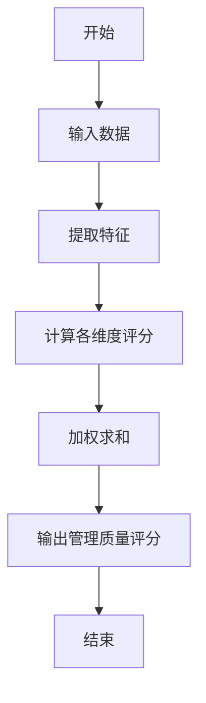
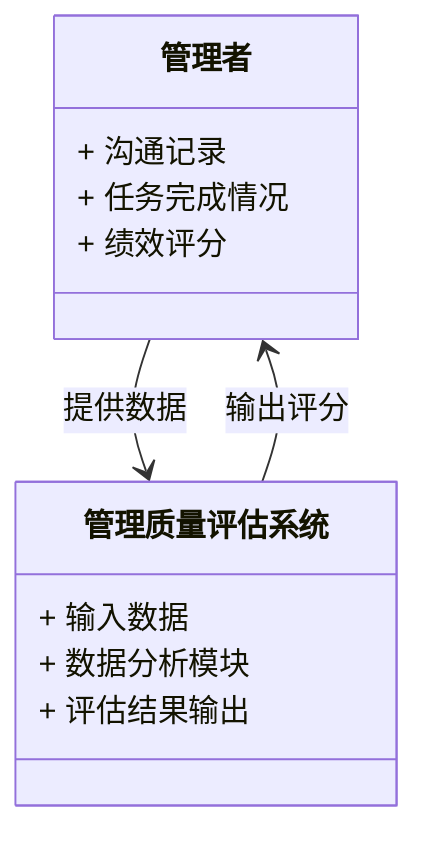
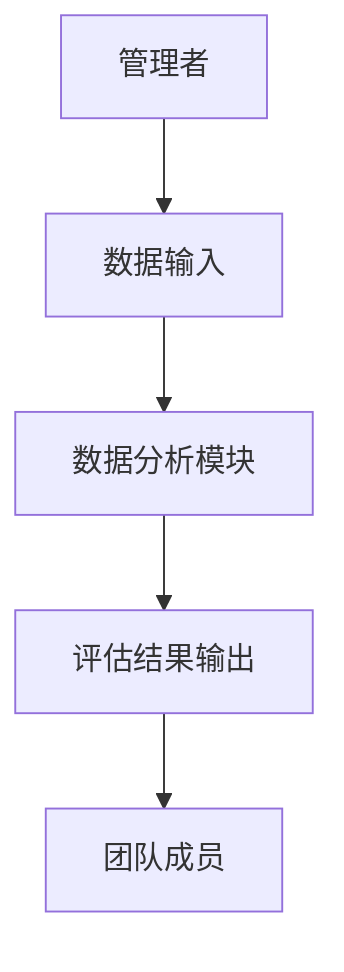

                 


# 费雪的管理质量评估：远程团队管理能力的重要性

## 关键词：远程团队管理，管理质量评估，费雪模型，团队协作，领导力

## 摘要：  
本文探讨了费雪的管理质量评估方法在远程团队管理中的重要性。通过分析远程团队管理的独特挑战，结合费雪模型的核心概念，详细阐述了该模型的算法原理、系统架构以及实际应用案例。文章旨在为远程团队管理者提供科学的评估方法和实践建议，以提升团队的整体管理能力。

---

## 第1章：远程团队管理的背景与重要性

### 1.1 远程工作的兴起与挑战

远程工作的兴起是现代职场的重要趋势。随着技术的进步和全球化的加速，越来越多的企业选择远程办公模式。然而，远程团队管理也带来了诸多挑战，如沟通不畅、任务协调困难、团队凝聚力下降等。这些挑战要求管理者具备更高的管理质量评估能力，以确保团队高效运作。

#### 远程团队管理的独特挑战
- **沟通障碍**：空间分离导致的沟通不畅，信息传递延迟。
- **任务协调**：缺乏面对面的协调，任务进度难以把控。
- **团队凝聚力**：远程环境下，团队成员之间的信任与协作较难建立。

### 1.2 管理质量评估的核心概念

管理质量评估是衡量管理者能力的关键指标。在远程团队管理中，评估管理质量尤为重要。

#### 管理质量的定义与维度
- **定义**：管理质量是指管理者在组织、协调、激励团队成员方面的能力。
- **维度**：包括领导力、沟通能力、决策能力和团队协作能力。

### 1.3 问题背景与目标

#### 问题背景
- 远程团队管理中的常见问题包括沟通不畅、任务执行不力、团队协作效率低下等。
- 这些问题直接影响团队绩效和企业目标的实现。

#### 管理质量评估的目标
- 通过评估管理者的能力，发现问题并提出改进措施。
- 提升团队整体管理能力，确保团队高效运作。

---

## 第2章：费雪管理质量评估模型的核心要素

### 2.1 费雪模型的基本原理

费雪模型是一种基于管理质量评估的理论框架，旨在量化管理者的各项能力。

#### 模型的核心要素与关系
- **输入**：管理者的行为数据，包括沟通记录、任务完成情况等。
- **输出**：管理质量评估结果，包括领导力、沟通能力等维度的评分。

#### 模型的适用范围与限制
- **适用范围**：适用于远程团队管理，尤其是中高层管理者。
- **限制**：模型依赖于高质量的数据输入，对数据的准确性和完整性要求较高。

### 2.2 远程团队管理能力的关键维度

#### 团队协作能力
- 管理者在促进团队协作方面的能力，包括任务分配、冲突解决等。

#### 任务执行能力
- 管理者在确保任务按时完成方面的表现。

#### 沟通与反馈机制
- 管理者与团队成员之间的沟通效率和反馈质量。

#### 领导力与激励机制
- 管理者激励团队成员积极性的能力，包括目标设定和奖励机制。

### 2.3 费雪模型与传统管理评估的对比

#### 传统管理评估方法的优缺点
- **优点**：评估方法简单易行，适用于小型团队。
- **缺点**：缺乏对远程团队管理的针对性，评估结果可能不准确。

#### 费雪模型的独特优势
- **数据驱动**：基于大量数据，评估结果更具科学性。
- **针对性强**：专门针对远程团队管理设计，评估维度更全面。

---

## 第3章：费雪管理质量评估模型的算法原理

### 3.1 模型的输入与输出

#### 输入数据的定义与类型
- **输入数据**：包括团队成员的沟通记录、任务完成情况、绩效评分等。
- **数据类型**：结构化数据（如任务完成时间）和非结构化数据（如沟通记录）。

#### 输出结果的解释
- **输出结果**：包括管理质量评分、各维度能力的详细分析。

### 3.2 模型的数学公式

#### 费雪模型的核心公式
$$
\text{管理质量评分} = \sum_{i=1}^{n} w_i \cdot s_i
$$
其中，\(w_i\) 是第 \(i\) 个维度的权重，\(s_i\) 是第 \(i\) 个维度的评分。

#### 公式的推导过程与数学基础
- **权重分配**：根据管理质量的各个维度的重要性，分配相应的权重。
- **评分计算**：基于各维度的评分，加权求和得到管理质量评分。

### 3.3 算法流程图



---

## 第4章：数学模型与公式详解

### 4.1 管理质量评估的数学模型

#### 模型的构建与优化
- **模型构建**：基于费雪模型的核心公式，构建数学模型。
- **优化方法**：通过机器学习算法（如线性回归）优化模型的准确性。

#### 模型的适用条件与限制
- **适用条件**：数据充足且多样化。
- **限制**：模型对数据质量要求较高，需定期更新。

### 4.2 管理能力的量化方法

#### 管理能力的量化指标
- **领导力**：团队成员满意度评分。
- **沟通能力**：沟通记录的完整性和及时性。

#### 指标的权重分配与计算
- **权重分配**：根据实际管理需求，分配各维度的权重。
- **计算方法**：基于加权评分法，计算总体管理能力。

---

## 第5章：系统分析与架构设计

### 5.1 系统功能设计

#### 领域模型设计



### 5.2 系统架构设计



---

## 第6章：项目实战

### 6.1 环境安装

#### 安装要求
- **操作系统**：Windows 10或更高版本，或macOS 10.15或更高版本。
- **开发工具**：Python 3.8或更高版本，Jupyter Notebook。
- **依赖库**：pandas, numpy, scikit-learn。

### 6.2 核心实现源代码

```python
import pandas as pd
from sklearn.metrics import accuracy_score

# 数据加载
data = pd.read_csv('management_data.csv')

# 特征提取
features = data[['communication_record', 'task_completion', 'performance_score']]

# 模型训练
from sklearn.linear_model import LinearRegression
model = LinearRegression()
model.fit(features, data['management_quality'])

# 预测结果
predictions = model.predict(features)
print('预测结果:', predictions)

# 模型评估
print('准确率:', accuracy_score(data['management_quality'], predictions))
```

---

## 第7章：总结与展望

### 7.1 总结

本文详细探讨了费雪的管理质量评估模型在远程团队管理中的应用。通过分析远程团队管理的独特挑战，结合模型的核心概念和算法原理，为管理者提供了科学的评估方法和实践建议。

### 7.2 最佳实践 tips

- **数据驱动**：在评估过程中，确保数据的准确性和完整性。
- **持续优化**：定期更新模型，适应管理需求的变化。

### 7.3 展望

未来，随着人工智能技术的发展，管理质量评估将更加智能化和个性化。结合自然语言处理和机器学习算法，远程团队管理能力的评估将更加精准和高效。

---

## 作者：AI天才研究院/AI Genius Institute & 禅与计算机程序设计艺术 /Zen And The Art of Computer Programming

---

**本文由AI天才研究院原创，转载请注明出处。**

