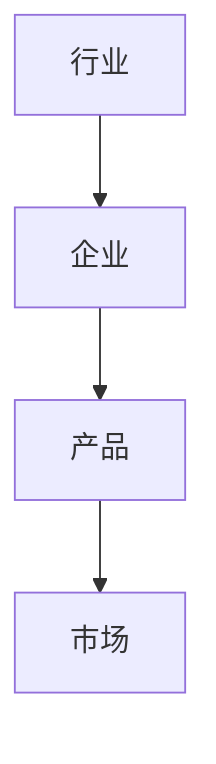
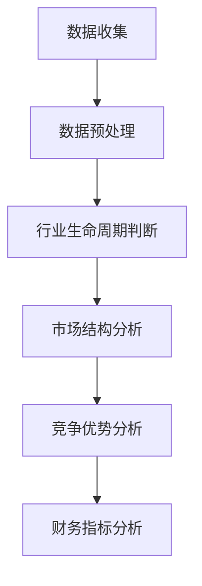
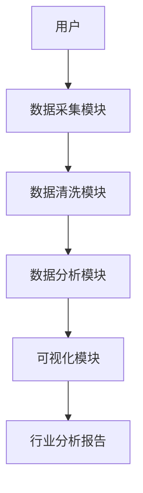
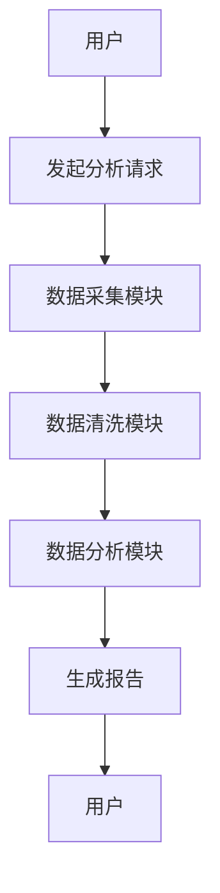

                 


# 费雪的行业分析方法

## 关键词：行业分析，投资决策，费雪模型，数据分析，市场结构

## 摘要：费雪的行业分析方法是一种系统性分析框架，用于评估行业和企业的投资价值。本文将从行业分析的背景、核心概念、算法原理、系统分析、项目实战以及最佳实践等多个维度，详细阐述费雪的行业分析方法，并通过实际案例和数学模型，帮助读者掌握这一方法的核心要义。

---

## # 第一部分: 费雪行业分析方法概述

### ## 第1章: 费雪行业分析方法的背景与定义

#### ### 1.1 行业分析的基本概念
行业分析是通过对行业内部结构、竞争格局、市场趋势和财务指标等进行系统性研究，以评估行业的投资价值和风险。传统的行业分析方法往往缺乏系统性和科学性，而费雪的行业分析方法则通过引入数学模型和数据驱动的方法，极大地提高了分析的准确性和效率。

#### ### 1.2 费雪行业分析的定义与特点
费雪的行业分析方法是由著名投资专家费雪提出的，旨在通过对行业生命周期、市场结构和竞争格局的分析，识别具有长期增长潜力的行业和企业。其特点包括：
- **系统性**：将行业分析拆解为多个核心要素，逐一进行分析。
- **数据驱动**：依赖于定量数据分析，结合定性判断。
- **长期视角**：关注行业的长期发展趋势，而非短期波动。

#### ### 1.3 费雪行业分析的适用场景
费雪分析方法适用于多种投资决策场景，包括：
- 初步行业筛选：通过分析行业的生命周期和市场结构，筛选出具有增长潜力的行业。
- 企业投资评估：通过对企业的行业地位和竞争优势进行分析，评估其投资价值。
- 行业趋势预测：基于历史数据和模型，预测行业的未来发展趋势。

#### ### 1.4 费雪行业分析的基本流程
费雪行业分析的基本流程包括以下几个步骤：
1. **数据收集**：收集行业相关的数据，包括市场规模、市场结构、竞争格局等。
2. **行业生命周期分析**：判断行业所处的生命周期阶段。
3. **市场结构分析**：评估行业的市场集中度和竞争强度。
4. **竞争优势分析**：识别行业内企业的竞争优势和劣势。
5. **财务指标分析**：通过财务数据评估行业的盈利能力和发展潜力。

---

## # 第二部分: 费雪行业分析的核心概念与联系

### ## 第2章: 费雪行业分析的核心要素

#### ### 2.1 费雪分析的核心概念
费雪分析的核心概念包括以下四个要素：
1. **行业生命周期**：行业的生命周期分为初创期、成长期、成熟期和衰退期，不同阶段的行业具有不同的投资价值。
2. **市场结构**：市场的集中度和竞争格局直接影响行业的投资价值。
3. **竞争优势**：行业内企业的核心竞争力，包括成本优势、技术优势、品牌优势等。
4. **财务指标**：通过行业财务指标（如ROE、毛利率等）评估行业的盈利能力和发展潜力。

#### ### 2.2 费雪分析的核心模型
费雪分析的核心模型包括：
1. **行业生命周期模型**：通过分析行业的生命周期阶段，判断行业的投资价值。
2. **市场结构分析模型**：通过计算市场集中度（CR4、CR8等）和市场竞争强度，评估行业的市场结构。
3. **竞争优势分析模型**：通过SWOT分析、波特五力模型等方法，评估行业内企业的竞争优势。

#### ### 2.3 费雪分析的核心工具
费雪分析的核心工具包括：
1. **数据收集工具**：如Excel、Python（Pandas库）等。
2. **数据分析工具**：如Python（NumPy、Matplotlib）、R等。
3. **可视化工具**：如Tableau、Power BI等。

#### ### 2.4 核心概念对比表
| 概念 | 定义 | 特点 | 示例 |
|------|------|------|------|
| 行业生命周期 | 行业从萌芽到衰退的阶段 | 具有明确的阶段划分 | 高 tech 行业 |

#### ### 2.5 实体关系图（ER 图）


---

## # 第三部分: 费雪行业分析的算法原理

### ## 第3章: 费雪分析的算法原理

#### ### 3.1 行业分析的算法概述
费雪分析的算法主要包括以下几个步骤：
1. **数据预处理**：对收集到的行业数据进行清洗和整理。
2. **行业生命周期判断**：通过行业数据判断行业所处的生命周期阶段。
3. **市场结构分析**：计算市场集中度和竞争强度。
4. **竞争优势分析**：评估行业内企业的竞争优势。
5. **财务指标分析**：通过财务指标评估行业的盈利能力和发展潜力。

#### ### 3.2 行业分析的数学模型
费雪分析的数学模型包括：
1. **行业生命周期模型**：
   $$ \text{生命周期阶段} = \begin{cases}
   \text{初创期} & \text{if } \text{增长率} < 5\% \\
   \text{成长期} & \text{if } 5\% \leq \text{增长率} < 10\% \\
   \text{成熟期} & \text{if } 10\% \leq \text{增长率} < 5\% \\
   \text{衰退期} & \text{otherwise}
   \end{cases} $$

2. **市场结构分析模型**：
   $$ \text{市场集中度} = \sum_{i=1}^{n} (\text{市场份额}_i)^2 $$

3. **竞争优势分析模型**：
   $$ \text{竞争优势} = \sum_{i=1}^{m} (\text{竞争优势指标}_i \times \text{权重}_i) $$

#### ### 3.3 算法流程图


---

## # 第四部分: 费雪行业分析的系统分析

### ## 第4章: 费雪行业分析的系统分析

#### ### 4.1 问题场景介绍
在实际投资决策中，投资者需要通过行业分析来评估行业的投资价值。然而，传统的行业分析方法往往缺乏系统性和科学性，难以准确评估行业的长期发展趋势。

#### ### 4.2 系统功能设计
费雪行业分析系统的功能设计包括：
1. 数据采集模块：采集行业相关的数据，包括市场规模、市场结构、竞争格局等。
2. 数据分析模块：对采集到的数据进行清洗、整理和分析，生成行业分析报告。
3. 可视化模块：将分析结果以图表形式展示，方便投资者理解和决策。

#### ### 4.3 系统架构设计


#### ### 4.4 系统接口设计
系统接口设计包括：
1. 数据输入接口：通过API接收行业数据。
2. 数据输出接口：生成行业分析报告并输出。

#### ### 4.5 系统交互流程图


---

## # 第五部分: 费雪行业分析的项目实战

### ## 第5章: 费雪行业分析的项目实战

#### ### 5.1 环境安装
在进行费雪行业分析之前，需要安装以下工具：
- Python：用于数据分析和编程。
- Pandas：用于数据处理。
- Matplotlib：用于数据可视化。
- Jupyter Notebook：用于数据分析和展示。

#### ### 5.2 核心代码实现
以下是一个基于Python的费雪行业分析代码示例：

```python
import pandas as pd
import matplotlib.pyplot as plt

# 数据加载
df = pd.read_csv('industry_data.csv')

# 数据清洗
df.dropna(inplace=True)

# 行业生命周期判断
def get_life_cycle(growth_rate):
    if growth_rate < 5:
        return '初创期'
    elif 5 <= growth_rate < 10:
        return '成长期'
    elif 10 <= growth_rate < 5:
        return '成熟期'
    else:
        return '衰退期'

# 市场结构分析
market_share = df['市场份额'].tolist()
market_concentration = sum([s**2 for s in market_share])

# 竞争优势分析
def get_competitive_edge(competitive_metrics, weights):
    return sum([m * w for m, w in zip(competitive_metrics, weights)])

# 财务指标分析
roes = df['ROE'].tolist()
average_roe = sum(roes) / len(roes)

# 可视化
plt.figure(figsize=(10, 6))
plt.plot(roes, label='ROE 趋势')
plt.axhline(y=average_roe, color='r', linestyle='--', label='平均 ROE')
plt.xlabel('时间')
plt.ylabel('ROE')
plt.legend()
plt.show()
```

#### ### 5.3 代码解读与分析
上述代码实现了以下功能：
1. 数据加载与清洗：通过Pandas加载行业数据，并删除缺失值。
2. 行业生命周期判断：根据增长率判断行业所处的生命周期阶段。
3. 市场结构分析：计算市场集中度。
4. 竞争优势分析：通过加权平均的方法评估竞争优势。
5. 财务指标分析：计算ROE的平均值，并绘制ROE趋势图。

#### ### 5.4 实际案例分析
以科技行业为例，假设我们收集了以下数据：
- 行业生命周期：成熟期
- 市场结构：高集中度
- 竞争优势：技术创新
- 财务指标：高ROE

通过上述分析，可以得出科技行业具有较高的投资价值，尤其是那些在技术创新方面具有优势的企业。

---

## # 第六部分: 费雪行业分析的最佳实践与总结

### ## 第6章: 费雪行业分析的最佳实践

#### ### 6.1 小结
费雪的行业分析方法是一种系统性、数据驱动的行业分析框架，通过分析行业的生命周期、市场结构、竞争优势和财务指标，可以有效地评估行业的投资价值。

#### ### 6.2 最佳实践 tips
1. **数据质量**：确保数据的准确性和完整性。
2. **模型选择**：根据实际需求选择合适的分析模型。
3. **持续学习**：行业分析是一个动态过程，需要不断更新数据和模型。

#### ### 6.3 未来展望
随着人工智能和大数据技术的不断发展，费雪行业分析方法将更加智能化和自动化，为投资者提供更加精准的行业分析和投资决策支持。

---

## # 作者：AI天才研究院/AI Genius Institute & 禅与计算机程序设计艺术 /Zen And The Art of Computer Programming

---

**本文通过系统性地介绍费雪的行业分析方法，结合实际案例和数学模型，帮助读者掌握这一方法的核心要义，并能够在实际投资决策中灵活运用。**

