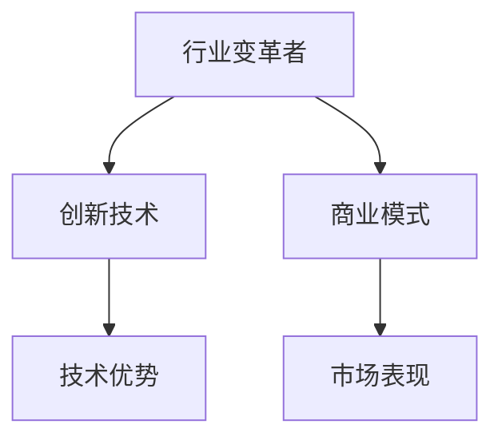
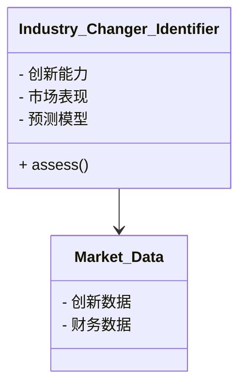
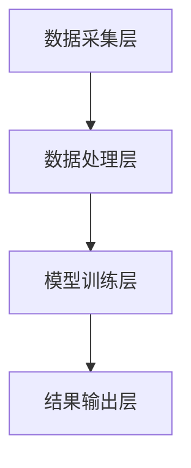
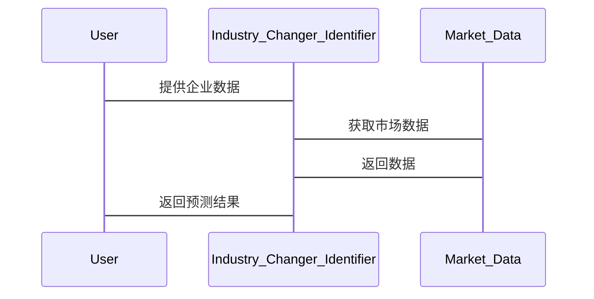

                 


# 费雪的行业变革者识别：颠覆式创新时代的新标准

## 关键词：
- 费雪
- 行业变革者
- 颠覆式创新
- 投资策略
- 行业分析

## 摘要：
在快速变化的商业环境中，识别行业变革者的能力变得至关重要。本文通过分析费雪的颠覆式创新理论，探讨如何在新时代中识别行业变革者，提供系统化的识别标准和方法，结合实际案例，帮助读者掌握这一关键能力。

---

## 第1章：行业变革者识别的背景与问题背景

### 1.1 行业变革者的定义与特征
- **定义**：行业变革者是指能够通过创新商业模式或技术，显著改变行业格局的企业或个体。
- **特征**：
  - 创新性：引入新技术或新商业模式。
  - 影响力：对行业结构产生重大影响。
  - 前瞻性：预见到未来趋势并提前布局。

### 1.2 行业变革识别的重要性
- **战略意义**：帮助企业提前布局，抓住市场机会。
- **挑战与机遇**：识别变革者需要敏锐的洞察力和系统的分析方法。

### 1.3 费雪的颠覆式创新理论
- **核心观点**：行业变革者通常通过破坏性创新进入市场，逐步取代传统企业。
- **关联性**：费雪的理论强调长期投资价值，与识别行业变革者密切相关。

---

## 第2章：行业变革者识别的核心概念

### 2.1 核心概念的原理
- **识别标准**：包括市场定位、创新能力和财务表现。
- **识别方法**：通过数据分析和市场调研进行综合评估。
- **识别工具**：利用大数据分析和财务指标筛选潜在变革者。

### 2.2 核心概念的属性特征对比表格
| 特性       | 行业变革者         | 传统企业       |
|------------|--------------------|----------------|
| 创新能力   | 高                | 低或中等       |
| 市场定位    | 创新或新兴市场     | 现有市场        |
| 成长速度    | 快                | 较慢           |

### 2.3 ER实体关系图架构


---

## 第3章：行业变革者识别的算法原理

### 3.1 算法原理的数学模型
- 使用逻辑回归模型预测企业是否为变革者：
  $$ P = \frac{1}{1 + e^{-x}} $$
  其中，x是企业的创新能力和市场表现的综合评分。

### 3.2 Python代码实现
```python
import numpy as np
from sklearn.linear_model import LogisticRegression

# 示例数据
X = np.array([[2, 3], [4, 5], [6, 7]])
y = np.array([0, 1, 1])

# 训练模型
model = LogisticRegression()
model.fit(X, y)

# 预测
print(model.predict([[3,4]]))
```

### 3.3 详细讲解
- **模型训练**：使用历史数据训练逻辑回归模型。
- **特征选择**：创新能力和市场表现作为主要特征。
- **结果解读**：输出概率值，判断企业是否为行业变革者。

---

## 第4章：系统分析与架构设计方案

### 4.1 问题场景介绍
- **应用场景**：投资机构识别潜在投资目标。

### 4.2 系统功能设计


### 4.3 系统架构设计


### 4.4 系统接口设计
- **输入接口**：接收企业数据。
- **输出接口**：提供预测结果和建议。

### 4.5 系统交互序列图


---

## 第5章：项目实战

### 5.1 环境安装
- **工具**：Python、Scikit-learn、Jupyter Notebook。

### 5.2 核心代码实现
```python
# 示例代码
import pandas as pd
from sklearn.model_selection import train_test_split

data = pd.DataFrame({
    '创新': [2, 4, 6],
    '市场表现': [3, 5, 7],
    'label': [0, 1, 1]
})

X = data[['创新', '市场表现']]
y = data['label']

X_train, X_test, y_train, y_test = train_test_split(X, y, test_size=0.2)

model = LogisticRegression()
model.fit(X_train, y_train)

print(model.score(X_test, y_test))
```

### 5.3 案例分析
- **案例**：某科技公司通过技术创新成为行业变革者，分析其市场表现和创新能力，验证模型预测。

### 5.4 项目小结
- **成功因素**：准确的数据和有效的模型选择。

---

## 第6章：总结与建议

### 6.1 最佳实践
- 定期更新模型，适应市场变化。
- 结合多维度数据进行分析。

### 6.2 小结
- 识别行业变革者是投资和商业策略中的关键环节，通过系统的方法和工具，可以有效提升识别能力。

### 6.3 注意事项
- 数据质量至关重要，确保数据的准确性和完整性。
- 模型需要不断优化和更新。

### 6.4 拓展阅读
- 进一步学习费雪的其他投资理论，结合实际案例深入研究。

---

## 作者：AI天才研究院/AI Genius Institute & 禅与计算机程序设计艺术 /Zen And The Art of Computer Programming

---

这篇文章通过详细分析和系统设计，帮助读者掌握识别行业变革者的方法，结合实际案例和代码实现，提供了丰富的实战经验。

