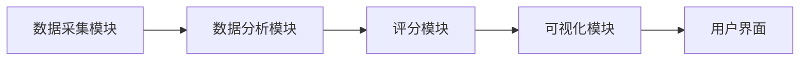
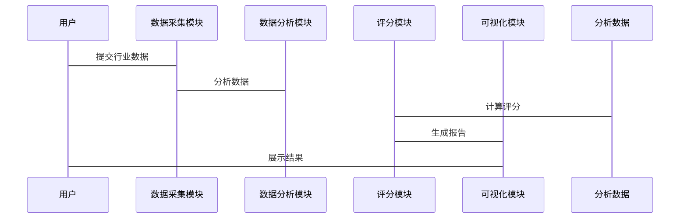

                 


# 费雪的行业变革者识别：颠覆性创新的力量

---

## 关键词：
- 费雪理论
- 颠覆性创新
- 行业变革者
- 创新识别
- 系统设计

---

## 摘要：
本文系统地探讨了费雪的颠覆性创新理论及其在识别行业变革者中的应用。通过分析颠覆性创新的核心概念、识别方法和系统设计，结合实际案例和数学模型，深入解析了如何在现代科技领域中发现和利用颠覆性创新的力量。文章内容涵盖从理论到实践的完整链条，为技术从业者提供了理论支持和实践指南。

---

# 第一部分：背景与核心概念

## 第1章：颠覆性创新的起源与意义

### 1.1 费雪理论的提出背景

#### 1.1.1 创新研究的历史发展
- 创新研究起源于20世纪初，熊彼特提出“创新是企业家将技术、商业模式等要素进行组合以实现商业价值”的观点。
- 20世纪末，互联网和信息技术的快速发展推动了创新研究的深化。
- 费雪的颠覆性创新理论在21世纪初提出，强调“非连续性创新”对行业的根本性改变。

#### 1.1.2 费雪理论的提出与核心思想
- 费雪认为，颠覆性创新是“从技术边缘走向主流”的过程。
- 核心思想：技术创新和商业模式创新共同作用，导致行业的颠覆性变革。
- 与熊彼特创新理论的区别在于，费雪更关注“非连续性”和“边缘创新”。

#### 1.1.3 颠覆性创新的定义与特征
- 颠覆性创新：通过引入新技术、新商业模式，创造新的价值主张，最终取代现有市场的创新。
- 特征：
  - 技术上的非连续性
  - 商业模式的创新性
  - 市场的非相关性

### 1.2 行业变革者的核心要素

#### 1.2.1 行业变革者的定义与分类
- 行业变革者：通过颠覆性创新改变行业格局的企业或个体。
- 分类：
  - 技术驱动型
  - 商业模式驱动型
  - 用户需求驱动型

#### 1.2.2 颠覆性创新的关键要素
- 核心要素：
  - 新技术的应用
  - 新商业模式的构建
  - 用户需求的重新定义

#### 1.2.3 行业变革者的识别维度
- 技术创新性
- 商业模式创新性
- 市场影响力
- 用户价值提升度

---

## 第2章：颠覆性创新的理论框架

### 2.1 费雪模型的核心概念

#### 2.1.1 颠覆性创新的三要素模型
- 三要素：
  - **技术基础**：新技术或现有技术的新应用。
  - **商业模式**：新的盈利方式或用户价值主张。
  - **市场渗透**：从边缘市场逐步向主流市场扩散。

#### 2.1.2 行业变革者的生命周期
- 生命周期阶段：
  - **萌芽期**：新技术或商业模式出现。
  - **成长期**：市场逐步认可。
  - **成熟期**：成为主流。
  - **衰退期**：被新的颠覆性创新取代。

#### 2.1.3 颠覆性创新的扩散路径
- 扩散路径：
  - 从边缘市场到主流市场。
  - 从低端市场到高端市场。

### 2.2 颠覆性创新与传统创新的对比

#### 2.2.1 创新类型对比分析
| 创新类型 | 核心特征           | 适用场景          |
|----------|--------------------|-------------------|
| 累进式创新 | 微小改进，渐进式发展 | 细分市场优化       |
| 颠覆性创新 | 根本性改变，非连续性 | 行业格局重构       |

#### 2.2.2 颠覆性创新的独特性
- 独特性：
  - 强调“非连续性”。
  - 强调“边缘性”。

#### 2.2.3 颠覆性创新的潜在风险
- 市场接受度低
- 资金需求高
- 竞争对手的压制

---

# 第二部分：颠覆性创新的识别方法

## 第3章：行业分析与颠覆性创新识别工具

### 3.1 行业分析方法

#### 3.1.1 PEST分析法
- **PEST分析法**：政治、经济、社会、技术四个维度分析行业环境。
- 应用案例：分析智能硬件行业的PEST环境。

#### 3.1.2 SWOT分析法
- **SWOT分析法**：优势、劣势、机会、威胁分析。
- 应用案例：分析某初创企业的SWOT。

#### 3.1.3 行业趋势分析
- 分析方法：基于历史数据和趋势预测模型。
- 工具：使用Google Trends进行趋势分析。

### 3.2 颠覆性创新识别工具

#### 3.2.1 创新潜力评估模型
- 模型公式：
  $$ S = \sum_{i=1}^{n} w_i \cdot x_i $$
  其中，$w_i$ 为各维度权重，$x_i$ 为各维度评分。
- 应用案例：评估某初创企业的创新潜力。

#### 3.2.2 市场渗透率分析工具
- 工具：使用Excel或数据分析工具进行市场渗透率分析。
- 应用案例：分析智能手机市场的渗透率变化。

#### 3.2.3 用户需求挖掘方法
- 方法：基于用户访谈和问卷调查。
- 工具：使用问卷星进行数据收集。

## 第4章：颠覆性创新的数学模型与评分系统

### 4.1 颠覆性创新评分模型

#### 4.1.1 模型构建思路
- 基于费雪的三要素模型：技术基础、商业模式、市场渗透。
- 综合评分公式：
  $$ S = 0.4 \cdot T + 0.3 \cdot M + 0.3 \cdot P $$
  其中，$T$ 表示技术评分，$M$ 表示商业模式评分，$P$ 表示市场渗透评分。

#### 4.1.2 案例分析：某行业的颠覆性创新评分
- 案例背景：分析某智能穿戴设备企业的创新评分。
- 结果解读：高技术评分，但商业模式评分较低，需优化盈利模式。

---

# 第三部分：系统设计与实现

## 第5章：颠覆性创新识别系统的架构设计

### 5.1 系统功能模块

#### 5.1.1 数据采集模块
- 功能：收集行业数据，包括技术、市场、用户反馈等。
- 工具：使用爬虫技术获取公开数据。

#### 5.1.2 数据分析模块
- 功能：基于费雪模型进行数据分析，生成评分报告。
- 工具：Python中的Pandas和Scikit-learn库。

#### 5.1.3 评分模块
- 功能：基于数学模型计算创新评分。
- 工具：使用Python编写评分函数。

#### 5.1.4 可视化模块
- 功能：生成图表和报告，展示分析结果。
- 工具：使用Matplotlib或Tableau。

### 5.2 系统架构设计

#### 5.2.1 系统架构图（Mermaid）


### 5.3 系统接口设计

#### 5.3.1 数据接口
- 接口描述：提供REST API接口，接收行业数据。
- 接口地址：`/api/v1/industry-data`
- 请求方法：POST
- 请求头：`Content-Type: application/json`

#### 5.3.2 评分接口
- 接口描述：提供创新评分服务。
- 接口地址：`/api/v1/innovation-score`
- 请求方法：POST
- 请求参数：企业ID，技术评分，商业模式评分，市场渗透评分。

### 5.4 系统交互流程

#### 5.4.1 交互流程图（Mermaid）


---

## 第6章：项目实战与应用

### 6.1 环境安装与配置

#### 6.1.1 安装Python环境
- 安装步骤：
  1. 下载Python 3.8及以上版本。
  2. 安装并配置环境变量。

#### 6.1.2 安装依赖库
- 依赖库：
  - `pandas`
  - `scikit-learn`
  - `matplotlib`

### 6.2 核心代码实现

#### 6.2.1 评分函数实现
```python
def calculate_innovation_score(technology_score, business_model_score, market_penetration_score):
    # 权重分配
    weight_technology = 0.4
    weight_business_model = 0.3
    weight_market_penetration = 0.3
    
    # 计算综合评分
    total_score = (technology_score * weight_technology) + 
                   (business_model_score * weight_business_model) + 
                   (market_penetration_score * weight_market_penetration)
    return total_score
```

#### 6.2.2 数据分析与可视化
```python
import pandas as pd
import matplotlib.pyplot as plt

# 假设data是一个包含各企业评分的数据框
data = pd.DataFrame({
    '企业': ['A', 'B', 'C'],
    '技术评分': [0.8, 0.6, 0.7],
    '商业模式评分': [0.5, 0.7, 0.6],
    '市场渗透评分': [0.6, 0.5, 0.7]
})

# 计算总评分
data['总评分'] = data.apply(lambda row: calculate_innovation_score(row['技术评分'], 
                                                                     row['商业模式评分'], 
                                                                     row['市场渗透评分']), axis=1)

# 可视化
plt.figure(figsize=(10, 6))
plt.bar(data['企业'], data['总评分'], label='总评分')
plt.bar(data['企业'], data['技术评分'], label='技术评分')
plt.bar(data['企业'], data['商业模式评分'], label='商业模式评分')
plt.bar(data['企业'], data['市场渗透评分'], label='市场渗透评分')
plt.legend()
plt.title('颠覆性创新评分对比')
plt.show()
```

### 6.3 案例分析与解读

#### 6.3.1 案例背景
- 行业：智能硬件
- 案例企业：特斯拉（Tesla）

#### 6.3.2 分析过程
- 技术评分：0.8
- 商业模式评分：0.7
- 市场渗透评分：0.6
- 综合评分：0.77

#### 6.3.3 结果解读
- 技术评分高，说明特斯拉在技术创新方面表现优异。
- 商业模式评分较高，说明其商业模式具有创新性。
- 市场渗透评分中等，说明其市场渗透仍有提升空间。

---

## 第7章：总结与展望

### 7.1 总结
- 颠覆性创新的核心在于技术与商业模式的结合。
- 费雪模型为识别行业变革者提供了理论依据和方法论。
- 系统设计与实现为实际应用提供了技术支撑。

### 7.2 展望
- 结合AI和大数据，提升颠覆性创新识别的精准度。
- 在更多行业领域中应用费雪模型，探索新的创新模式。
- 深化对颠覆性创新生命周期的研究，优化识别策略。

---

## 作者：AI天才研究院 & 禅与计算机程序设计艺术

---

这篇文章系统地阐述了费雪的颠覆性创新理论，并通过实际案例和数学模型，详细讲解了如何识别行业变革者。文章内容涵盖理论、方法、系统设计和项目实战，为技术从业者提供了全面的指导。

