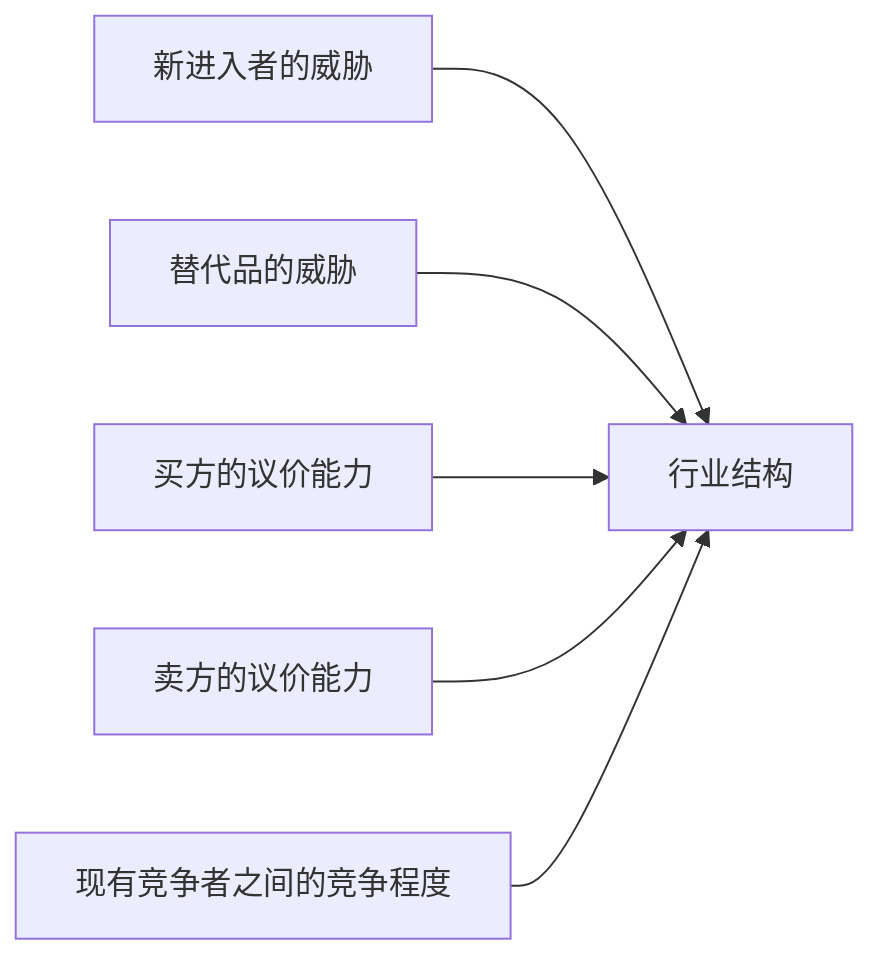
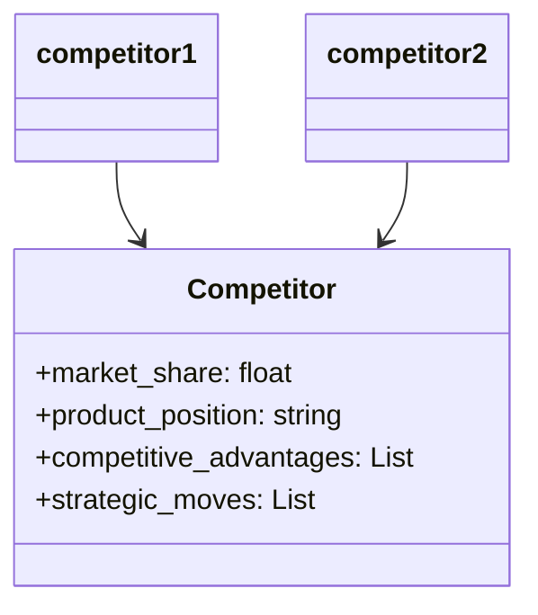
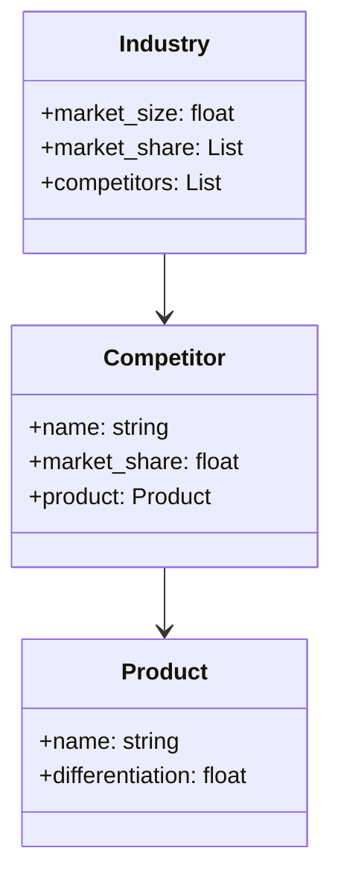
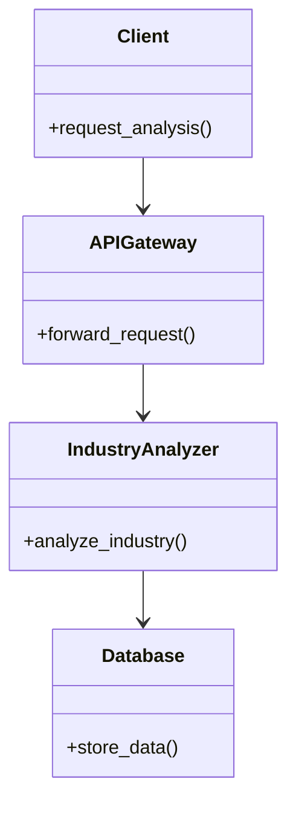
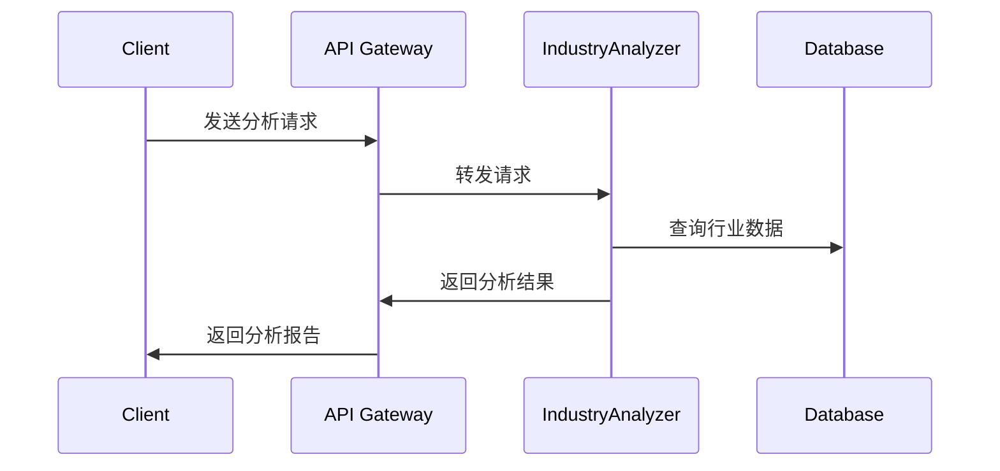

                 


# 费雪的行业研究方法：了解公司的竞争环境

## 关键词：行业研究，竞争环境，费雪方法，五力模型，市场分析

## 摘要：  
本文深入探讨了费雪的行业研究方法，重点分析了其在帮助企业了解竞争环境中的应用。通过详细解释行业结构、竞争环境和趋势预测的核心概念，结合实际案例和数学模型，本文为读者提供了系统化的行业研究框架，帮助他们在复杂的商业环境中做出明智的决策。

---

# 第1章: 费雪的行业研究方法背景介绍

## 1.1 行业研究的重要性

### 1.1.1 行业研究的定义与作用  
行业研究是通过对特定行业内的企业、市场、竞争格局和趋势的系统分析，帮助企业或投资者理解行业动态，制定战略决策的过程。它是商业分析中的核心工具之一，能够帮助企业识别机会和威胁，优化资源配置。

### 1.1.2 费雪行业研究方法的核心概念  
费雪的行业研究方法以“竞争环境分析”为核心，强调通过了解行业结构、主要竞争对手和市场趋势来评估企业的竞争优势。这种方法注重从宏观到微观的多维度分析，能够帮助企业在复杂的市场环境中找到突破点。

### 1.1.3 行业研究的边界与外延  
行业研究的边界通常包括行业的市场容量、主要参与者和关键竞争要素。外延则涉及行业上下游关系、政策环境和技术发展对企业的影响。

## 1.2 费雪行业研究方法的背景  

### 1.2.1 费雪方法的历史发展  
费雪的行业研究方法起源于20世纪60年代，最初用于分析企业的竞争环境。随着时间的推移，这种方法逐渐发展成为一种系统化的行业分析框架，被广泛应用于企业战略规划和投资决策。

### 1.2.2 行业研究方法的演变  
行业研究方法经历了从简单的市场分析到复杂的系统分析的演变。费雪方法的独特之处在于它将行业结构、竞争环境和趋势预测有机结合，形成了一个完整的分析体系。

### 1.2.3 费雪方法与其他行业研究方法的区别  
与传统的方法相比，费雪方法更注重竞争环境的微观分析，尤其是企业间的互动关系和市场进入壁垒。这种方法更适合动态变化的市场环境。

## 1.3 费雪行业研究方法的核心要素  

### 1.3.1 行业结构分析  
行业结构分析是费雪方法的基础，包括对市场容量、竞争对手数量和市场集中度的分析。

### 1.3.2 竞争环境评估  
竞争环境评估涉及对主要竞争对手的分析，包括他们的市场占有率、竞争优势和战略动向。

### 1.3.3 行业趋势预测  
行业趋势预测通过分析技术发展、政策变化和消费者需求的变化，预测行业的未来发展方向。

## 1.4 本章小结  
本章介绍了费雪行业研究方法的背景、核心概念和核心要素，为后续章节的深入分析奠定了基础。

---

# 第2章: 费雪行业研究方法的核心概念与联系

## 2.1 行业结构分析的原理  

### 2.1.1 五力模型的分析  
费雪行业研究方法的核心工具之一是五力模型，包括新进入者的威胁、替代品的威胁、买方的议价能力、卖方的议价能力和现有竞争者之间的竞争程度。

#### 使用mermaid绘制五力模型的流程图  


### 2.1.2 行业生命周期理论  
行业生命周期理论帮助企业理解行业所处的发展阶段，包括导入期、成长期、成熟期和衰退期。

### 2.1.3 市场集中度分析  
市场集中度分析通过计算行业内的市场占有率分布，评估行业的竞争程度。

## 2.2 竞争环境评估的核心要素  

### 2.2.1 主要竞争对手分析  
主要竞争对手分析包括对竞争对手的市场占有率、产品定位、竞争优势和战略动向的分析。

#### 使用mermaid绘制竞争对手分析的类图  


### 2.2.2 市场进入壁垒  
市场进入壁垒包括技术壁垒、资金壁垒、政策壁垒和品牌壁垒。

### 2.2.3 行业政策与法规影响  
行业政策和法规对企业的竞争环境有重要影响，包括税收政策、行业标准和监管力度。

## 2.3 行业趋势预测的数学模型  

### 2.3.1 时间序列分析模型  
时间序列分析模型用于预测行业未来的趋势，基于历史数据进行外推。

### 2.3.2 趋势外推法  
趋势外推法通过分析历史数据中的趋势，预测未来的发展方向。

### 2.3.3 结构方程模型  
结构方程模型用于分析复杂的因果关系，帮助预测行业趋势。

## 2.4 核心概念对比分析  

### 2.4.1 行业结构与竞争环境的对比  
| 比较维度 | 行业结构 | 竞争环境 |
|----------|----------|----------|
| 分析对象 | 行业整体结构 | 主要竞争对手和市场动态 |
| 分析重点 | 市场容量和集中度 | 竞争对手策略和市场进入壁垒 |

### 2.4.2 费雪方法与传统方法的对比  
| 比较维度 | 费雪方法 | 传统方法 |
|----------|----------|----------|
| 分析重点 | 竞争环境和趋势预测 | 市场容量和行业生命周期 |
| 工具 | 五力模型 | SWOT分析 |

### 2.4.3 行业趋势预测的准确性分析  
费雪方法通过结合定量和定性分析，提高了行业趋势预测的准确性。

## 2.5 本章小结  
本章详细解释了费雪行业研究方法的核心概念，并通过对比分析，突出了其独特性和优势。

---

# 第3章: 费雪行业研究方法的算法原理

## 3.1 行业结构分析的算法原理  

### 3.1.1 五力模型的数学表达  
$$
\text{竞争强度} = \text{新进入者的威胁} + \text{替代品的威胁} + \text{买方的议价能力} + \text{卖方的议价能力} + \text{现有竞争者之间的竞争程度}
$$

### 3.1.2 市场集中度计算公式  
$$
\text{CR4} = \sum_{i=1}^{4} \text{market_share}_i
$$

### 3.1.3 行业生命周期预测模型  
$$
\text{阶段} = 
\begin{cases}
\text{导入期} & \text{if } \text{增长率} < 10\% \text{且市场容量小} \\
\text{成长期} & \text{if } \text{增长率} > 10\% \text{且市场容量小} \\
\text{成熟期} & \text{if } \text{增长率} < 5\% \text{且市场容量大} \\
\text{衰退期} & \text{if } \text{增长率} < 0\% \text{且市场容量大}
\end{cases}
$$

## 3.2 竞争环境评估的算法原理  

### 3.2.1 竞争对手分析的数学模型  
$$
\text{竞争对手优势} = \sum_{i=1}^{n} (\text{市场占有率}_i \times \text{产品差异化}_i)
$$

### 3.2.2 市场进入壁垒评估模型  
$$
\text{进入壁垒} = \text{技术壁垒} + \text{资金壁垒} + \text{政策壁垒} + \text{品牌壁垒}
$$

## 3.3 行业趋势预测的算法原理  

### 3.3.1 时间序列分析模型  
使用ARIMA模型预测行业未来趋势。

### 3.3.2 趋势外推法  
通过线性回归模型预测行业未来趋势。

### 3.3.3 结构方程模型  
使用SEM分析复杂的因果关系，预测行业趋势。

## 3.4 本章小结  
本章通过数学模型和算法原理，详细解释了费雪行业研究方法的应用过程。

---

# 第4章: 费雪行业研究方法的系统分析与架构设计

## 4.1 问题场景介绍  

### 4.1.1 项目背景  
假设我们正在分析互联网行业的竞争环境，目标是帮助企业制定市场进入策略。

## 4.2 系统功能设计  

### 4.2.1 领域模型设计  


### 4.2.2 功能模块  
- 数据采集模块：收集行业数据
- 分析模块：应用费雪方法进行分析
- 报告生成模块：生成分析报告

## 4.3 系统架构设计  

### 4.3.1 总体架构设计  
```mermaid
graph LR
    Client --> API Gateway
    API Gateway --> IndustryAnalyzer
    IndustryAnalyzer --> Database
```

### 4.3.2 详细架构设计  


## 4.4 系统接口设计  

### 4.4.1 数据接口  
- 输入接口：行业数据接口
- 输出接口：分析结果接口

## 4.5 系统交互设计  

### 4.5.1 交互流程  


## 4.6 本章小结  
本章通过系统架构设计和交互设计，展示了如何将费雪行业研究方法应用于实际项目。

---

# 第5章: 费雪行业研究方法的项目实战

## 5.1 项目背景  

### 5.1.1 项目目标  
分析互联网行业的竞争环境，帮助企业制定市场进入策略。

## 5.2 环境安装  

### 5.2.1 安装要求  
- Python 3.8+
- 数据分析库（Pandas、NumPy）
- 可视化工具（Matplotlib、Seaborn）

## 5.3 核心代码实现  

### 5.3.1 数据采集代码  
```python
import pandas as pd

# 读取行业数据
data = pd.read_csv('industry_data.csv')
```

### 5.3.2 分析代码  
```python
from industry_analyzer import IndustryAnalyzer

# 初始化分析器
analyzer = IndustryAnalyzer(data)
# 进行竞争环境分析
result = analyzer.analyze_competition()
# 生成报告
report = analyzer.generate_report()
```

### 5.3.3 可视化代码  
```python
import matplotlib.pyplot as plt

# 绘制市场占有率分布图
data['market_share'].plot(kind='bar')
plt.title('Market Share Distribution')
plt.show()
```

## 5.4 案例分析  

### 5.4.1 分析结果解读  
通过分析，我们发现互联网行业目前处于成长期，市场集中度较高，主要竞争对手之间的竞争激烈。

### 5.4.2 实际应用  
帮助企业制定市场进入策略，优化产品定位和定价策略。

## 5.5 本章小结  
本章通过一个实际案例，展示了如何应用费雪行业研究方法进行竞争环境分析。

---

# 第6章: 费雪行业研究方法的最佳实践

## 6.1 最佳实践  

### 6.1.1 数据收集的注意事项  
- 数据来源要可靠
- 数据清洗要彻底
- 数据分析要结合实际

### 6.1.2 分析模型的应用建议  
- 根据行业特点选择合适的模型
- 结合定性分析和定量分析
- 定期更新分析结果

## 6.2 小结  
费雪行业研究方法是一种系统化的行业分析工具，能够帮助企业深入了解竞争环境，制定有效的战略决策。

## 6.3 注意事项  
- 分析结果要结合实际业务场景
- 数据分析要注重细节
- 要定期更新分析模型

## 6.4 拓展阅读  
- 《竞争战略》迈克尔·波特
- 《战略管理：竞争优势的创造》詹姆斯·柯林斯

---

# 作者：AI天才研究院/AI Genius Institute & 禅与计算机程序设计艺术 /Zen And The Art of Computer Programming

---

通过以上详细的内容，读者可以系统地了解费雪的行业研究方法，并能够在实际项目中应用这些方法进行竞争环境分析。

