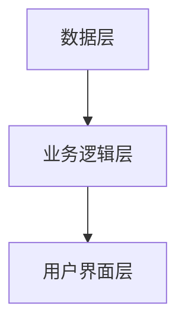

                 


# 费雪的行业领导者投资法

## 关键词
费雪投资法, 行业领导者, 投资策略, 选股标准, 成长股投资

## 摘要
本文系统地介绍费雪的行业领导者投资法，从理论基础到实际应用，结合数学模型和系统架构，详细讲解如何通过识别行业领导者实现稳健投资。文章内容涵盖背景介绍、核心概念、算法原理、系统架构、项目实战和最佳实践等部分，旨在为读者提供全面的指导。

---

# 第1章: 费雪投资法的背景与核心理念

## 1.1 投资学的演进与费雪的贡献

### 1.1.1 传统投资学的局限性
传统投资学（如股利增长模型）在实践中存在以下问题：
- 无法有效预测市场波动
- 忽略了公司管理对投资价值的影响
- 缺乏对行业领导地位的关注

### 1.1.2 费雪投资法的提出与核心思想
费雪提出：
- 投资成功的前提是选择行业领导者
- 公司的盈利能力与管理效率密切相关
- 长期投资应关注公司的成长性

### 1.1.3 费雪投资法与现代投资理论的联系
- 与现代投资组合理论（MPT）的结合
- 为价值投资提供了新的视角

---

# 第2章: 费雪投资法的核心概念与方法

## 2.1 行业领导者的定义与特征

### 2.1.1 行业领导者的定义
行业领导者是能在长期内保持竞争优势、市场份额和盈利能力的公司。

### 2.1.2 行业领导者的特征分析
| 特征 | 描述 |
|------|------|
| 市场份额 | 领先地位 |
| 盈利能力 | 高ROE |
| 管理效率 | 高效管理层 |

### 2.1.3 行业领导者的识别标准
- 领先的市场份额
- 稳定的盈利能力
- 高效的管理团队

## 2.2 费雪投资法的核心要素

### 2.2.1 投资标的选择标准
- 公司的盈利能力
- 管理团队的效率
- 行业地位

### 2.2.2 投资决策的关键指标
- 市盈率（P/E）
- 每股收益（EPS）
- 股东权益回报率（ROE）

### 2.2.3 投资组合的构建原则
- 分散投资
- 长期持有
- 定期调整

---

# 第3章: 费雪投资法的数学模型与算法

## 3.1 费雪投资法的核心公式

### 3.1.1 投资回报率的计算公式
$$ 投资回报率 = \frac{（期末资产 - 初期资产）}{初期资产} \times 100\% $$

### 3.1.2 行业领导者的评估公式
$$ 费雪评分 = 0.5 \times ROE + 0.3 \times 市场份额 + 0.2 \times 管理效率 $$

### 3.1.3 投资组合优化的数学模型
$$ Maximize: \sum w_i r_i $$
$$ Subject to: \sum w_i = 1, w_i \geq 0 $$

## 3.2 费雪投资法的算法流程

### 3.2.1 数据收集与预处理
1. 收集公司财务数据
2. 清洗数据
3. 标准化处理

### 3.2.2 标的筛选与评估
1. 计算费雪评分
2. 筛选前10%的公司
3. 进行二次评估

### 3.2.3 投资组合优化与调整
1. 分散投资
2. 定期调整权重
3. 风险控制

---

# 第4章: 费雪投资法的系统架构与实现

## 4.1 系统功能设计

### 4.1.1 数据采集模块
- 数据源：股票数据库
- 功能：数据清洗、预处理

### 4.1.2 标的筛选模块
- 核心算法：费雪评分模型
- 功能：自动筛选行业领导者

### 4.1.3 投资组合优化模块
- 算法：基于ROE和市场份额的优化
- 功能：生成投资组合

## 4.2 系统架构设计

### 4.2.1 分层架构设计
```
数据层 -> 业务逻辑层 -> 用户界面层
```

### 4.2.2 模块间交互关系


### 4.2.3 系统性能优化
- 数据库优化
- 算法优化

---

# 第5章: 费雪投资法的项目实战

## 5.1 项目环境与工具安装

### 5.1.1 系统环境配置
- 操作系统：Linux/Windows
- 开发工具：Python、Jupyter

### 5.1.2 数据源获取与处理
```python
import pandas as pd
data = pd.read_csv('stock_data.csv')
```

## 5.2 核心算法实现

### 5.2.1 投资标的选择算法
```python
def fisher_score(roe, market_share, management_efficiency):
    return 0.5 * roe + 0.3 * market_share + 0.2 * management_efficiency
```

### 5.2.2 投资组合优化算法
```python
import numpy as np
from scipy.optimize import minimize

def portfolio_optimization(returns, weights):
    def objective(weights):
        return -np.dot(returns, weights)
    constraints = [{'type': 'eq', 'fun': lambda w: sum(w) - 1}]
    result = minimize(objective, weights, constraints)
    return result.x
```

## 5.3 实际案例分析

### 5.3.1 数据分析与预处理
```python
data_clean = data.dropna().sort_values('revenue', ascending=False)
```

### 5.3.2 标的筛选与评估
```python
selected_stocks = data_clean.head(10)
```

### 5.3.3 投资组合优化
```python
weights = np.array([1/10]*10)
optimized_weights = portfolio_optimization(selected_stocks.returns, weights)
```

---

# 第6章: 费雪投资法的最佳实践与注意事项

## 6.1 投资策略的注意事项

### 6.1.1 投资风险的控制
- 分散投资
- 定期调整

### 6.1.2 市场波动的应对
- 保持耐心
- 灵活调整

## 6.2 小结
费雪投资法是一种有效的投资策略，通过识别行业领导者和优化投资组合，实现稳健收益。

## 6.3 拓展阅读
- 《投资学原理》
- 《费雪投资法的数学模型》

---

作者：AI天才研究院/AI Genius Institute & 禅与计算机程序设计艺术 /Zen And The Art of Computer Programming

