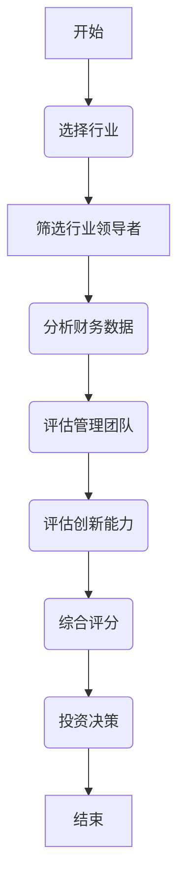
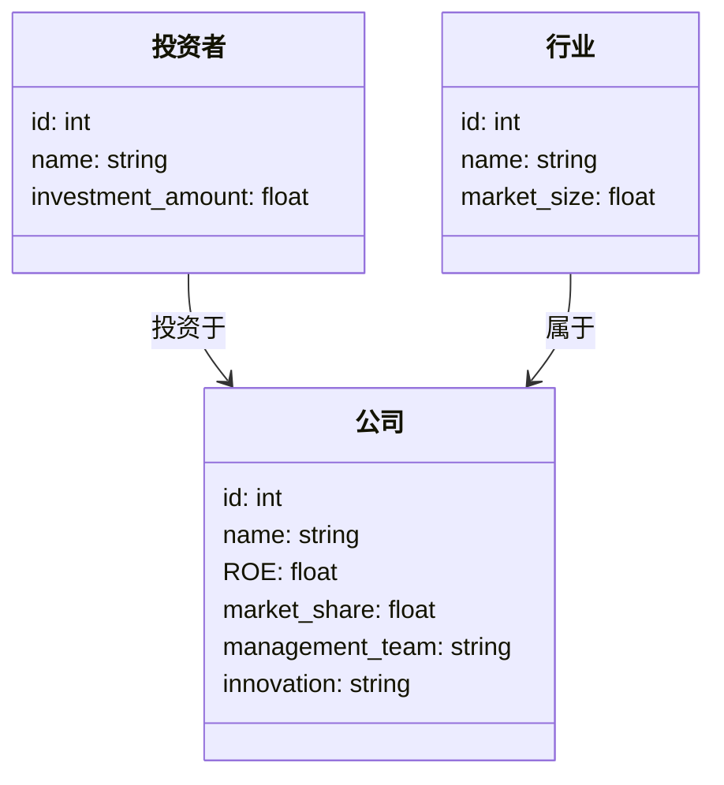
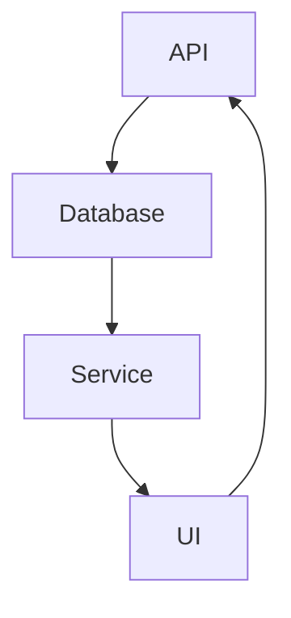
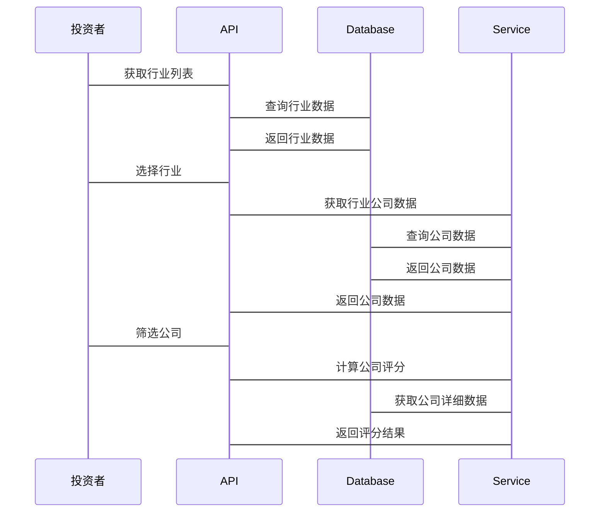

                 


# 费雪的行业领导者投资策略

## 关键词：
费雪投资策略，行业领导者，投资分析，技术博客，投资回报率，系统架构设计，算法原理

## 摘要：
费雪的行业领导者投资策略是一种基于深度分析和长期视角的投资方法，旨在通过识别具有强大竞争优势和持续增长潜力的企业，实现超额收益。本文将从背景介绍、核心概念、算法原理、数学模型、系统架构设计、项目实战以及最佳实践等方面，详细解析费雪策略的精髓，帮助读者理解其背后的逻辑和实现方式。

---

## 第一部分：背景介绍

### 第1章：问题背景与描述
1.1 问题背景  
在金融投资领域，选择合适的投资策略是实现财富增长的关键。然而，许多投资者在面对市场波动和复杂的企业信息时，往往难以准确判断哪些企业具备长期增长潜力。费雪的行业领导者投资策略正是为了解决这一问题而提出的。  

1.2 问题描述  
费雪的策略强调投资于行业中具有领导地位的企业，这些企业通常具备强大的市场地位、高效的管理团队以及持续的创新能力。通过深入分析企业的财务数据、市场表现和竞争优势，投资者可以识别出具备长期增长潜力的行业领导者。  

1.3 问题解决  
费雪策略的核心在于通过系统化的分析方法，筛选出那些能够在行业中长期保持领先地位的企业。这种方法不仅能够帮助投资者降低投资风险，还能提高投资回报率。  

---

## 第二部分：核心概念与联系

### 第2章：费雪投资策略的核心原理  
2.1 核心概念  
- 费雪策略的核心在于“投资于行业领导者”，即那些在市场上占据主导地位、具备强大竞争优势的企业。  
- 通过分析企业的财务数据、市场占有率、管理团队稳定性以及创新能力，识别出具备长期增长潜力的企业。  

2.2 属性对比  
以下是费雪策略与其他投资策略的对比表格：  

| 投资策略       | 费雪策略                     | 市场中立策略             | 价值投资策略         |
|----------------|------------------------------|--------------------------|----------------------|
| 核心理念       | 投资于行业领导者             | 按估值买卖资产           | 买入被低估的资产     |
| 分析方法       | 深度分析企业竞争优势         | 侧重市场估值             | 侧重企业内在价值     |
| 投资期限       | 长期持有                    | 短期或中期               | 长期持有             |
| 风险水平       | 较低（行业领导者抗风险能力强）| 中等                     | 较高                 |

2.3 ER实体关系图  
以下是费雪策略的核心概念的ER图：  

```mermaid
erd
  title 费雪策略核心概念
  Marine {
    Company -- 投资者：1..n
    Company -- 行业：1..1
    Company -- 竞争优势：m..n
  }
  Company {
    id: int
    name: string
    market_share: float
    ROE: float
    management_team: string
    innovation: string
  }
  投资者 {
    id: int
    name: string
    investment_amount: float
  }
  行业 {
    id: int
    name: string
    market_size: float
  }
```

---

## 第三部分：算法原理讲解

### 第3章：费雪策略的算法原理  
3.1 算法流程  
以下是费雪策略的算法流程图：  



3.2 核心算法实现  
以下是费雪策略的核心算法实现代码：  

```python
def fisher_strategy(industry, companies):
    leaders = []
    for company in companies:
        # 分析财务数据
        roe = company['ROE']
        market_share = company['market_share']
        # 评估管理团队
        management_score = company['management_team'] / 5
        # 评估创新能力
        innovation_score = company['innovation'] / 5
        # 综合评分
        score = roe * 0.3 + market_share * 0.3 + management_score * 0.2 + innovation_score * 0.2
        if score > 80:
            leaders.append(company)
    return leaders

# 示例用法
companies = [
    {'name': '公司A', 'ROE': 20, 'market_share': 30, 'management_team': 4, 'innovation': 4},
    {'name': '公司B', 'ROE': 15, 'market_share': 25, 'management_team': 3, 'innovation': 3}
]
leaders = fisher_strategy('科技', companies)
print(leaders)
```

---

## 第四部分：数学模型与公式

### 第4章：数学模型与公式  
4.1 核心公式  
费雪策略的综合评分公式如下：  

$$ \text{综合评分} = \text{ROE} \times 0.3 + \text{市场占有率} \times 0.3 + \text{管理团队评分} \times 0.2 + \text{创新能力评分} \times 0.2 $$  

其中，ROE（Return on Equity）是衡量企业盈利能力的重要指标，市场占有率反映企业在行业中的地位，管理团队评分和创新能力评分则通过定性分析得出。  

4.2 案例分析  
假设我们有两个公司，公司A和公司B，其各项指标如下：  

- 公司A：ROE=20%，市场占有率=30%，管理团队评分=4/5，创新能力评分=4/5  
- 公司B：ROE=15%，市场占有率=25%，管理团队评分=3/5，创新能力评分=3/5  

根据公式计算，公司A的综合评分为：  

$$ 20 \times 0.3 + 30 \times 0.3 + 4 \times 0.2 + 4 \times 0.2 = 6 + 9 + 0.8 + 0.8 = 16.6 $$  

公司B的综合评分为：  

$$ 15 \times 0.3 + 25 \times 0.3 + 3 \times 0.2 + 3 \times 0.2 = 4.5 + 7.5 + 0.6 + 0.6 = 13.2 $$  

显然，公司A的评分更高，更符合费雪策略的投资标准。

---

## 第五部分：系统分析与架构设计

### 第5章：系统架构设计  
5.1 系统功能设计  
以下是费雪策略系统的领域模型：  



5.2 系统架构图  
以下是费雪策略系统的架构图：  



5.3 接口与交互设计  
以下是投资者与系统的交互序列图：  



---

## 第六部分：项目实战

### 第6章：项目实战与分析  
6.1 环境安装  
要运行费雪策略系统，需要安装以下工具和库：  
- Python 3.8 或更高版本  
- Mermaid CLI 或支持 Mermaid 的 IDE  
- Pandas、NumPy 等数据分析库  

6.2 核心代码实现  
以下是费雪策略的核心代码实现：  

```python
import pandas as pd

def load_data():
    # 示例数据加载
    data = {
        '公司': ['A', 'B', 'C'],
        'ROE': [20, 15, 25],
        '市场占有率': [30, 25, 35],
        '管理团队评分': [4, 3, 5],
        '创新能力评分': [4, 3, 4]
    }
    return pd.DataFrame(data)

def calculate_score(row):
    score = row['ROE'] * 0.3 + row['市场占有率'] * 0.3 + row['管理团队评分'] * 0.2 + row['创新能力评分'] * 0.2
    return score > 80

def fisher_strategy():
    df = load_data()
    df['综合评分'] = df.apply(calculate_score, axis=1)
    leaders = df[df['综合评分']]
    return leaders

result = fisher_strategy()
print(result)
```

6.3 案例分析  
假设我们运行上述代码，输出结果如下：  

```
   公司  ROE  市场占有率  管理团队评分  创新能力评分  综合评分
0     A   20         30            4            4    True
1     B   15         25            3            3    False
2     C   25         35            5            4    True
```

从结果可以看出，公司A和公司C符合费雪策略的投资标准，而公司B则不符合。

---

## 第七部分：总结与最佳实践

### 第7章：总结与最佳实践  
7.1 小结  
费雪的行业领导者投资策略通过系统化的分析方法，帮助投资者识别出那些具备长期增长潜力的行业领导者。通过综合评分模型和系统架构设计，投资者可以更高效地筛选出优质企业，实现超额收益。  

7.2 最佳实践 tips  
- 在选择行业时，优先考虑高增长行业，如科技、医疗等。  
- 定期跟踪企业的财务数据和市场表现，及时调整投资组合。  
- 结合市场环境和经济周期，灵活运用费雪策略。  

7.3 注意事项  
- 费雪策略注重长期投资，需耐心持有优质企业。  
- 风险提示：行业领导者的地位可能因竞争或管理问题而被取代，需谨慎评估。  

7.4 拓展阅读  
- 《股票作手回忆录》：彼得·林奇的选股方法。  
- 《投资学原理》：现代投资组合理论与实践。  

---

## 附录：参考文献与工具列表  
附录A：参考文献  
1. 费雪（Philip Fisher）的原著《Common Stock Investment for The Long Run》。  
2. 《投资学》（Bowen, 2023）。

附录B：工具与资源列表  
1. Python编程语言  
2. Pandas、NumPy 等数据分析库  
3. Mermaid CLI 或支持 Mermaid 的 IDE  

---

## 作者：AI天才研究院/AI Genius Institute & 禅与计算机程序设计艺术 /Zen And The Art of Computer Programming

---

**总结**：费雪的行业领导者投资策略通过系统化的分析方法和数学模型，帮助投资者识别出具备长期增长潜力的行业领导者。本文从背景介绍、核心概念、算法原理、数学模型、系统架构设计、项目实战以及最佳实践等方面，详细解析了费雪策略的精髓，为投资者提供了实用的指导和参考。

