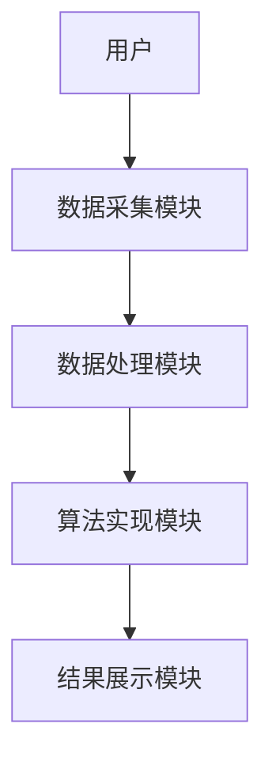
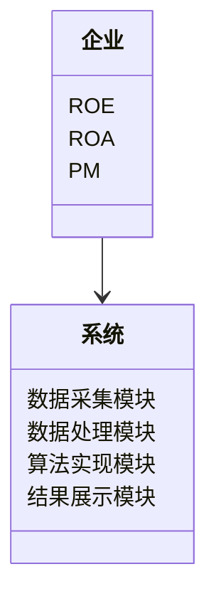

                 


# 费雪的行业领导者理论：寻找市场冠军

> 关键词：费雪，投资理论，行业领导者，市场分析，选股模型

> 摘要：本文深入探讨了菲德烈·费雪（Philip A. Fisher）的行业领导者理论，分析其核心概念、数学模型、系统架构以及实际应用。通过详细阐述费雪的选股标准、行业领导者的定义与特征，结合实际案例，展示如何利用费雪的理论寻找市场冠军企业。文章还提供了基于费雪理论的系统设计与代码实现，帮助读者更好地理解和应用这一理论。

---

## 第1章：费雪的行业领导者理论概述

### 1.1 费雪行业领导者理论的背景

#### 1.1.1 费雪的生平与投资理念
菲德烈·费雪（Philip A. Fisher）是20世纪著名的投资理论家，以“成长股投资”闻名。他提出了一系列选股标准，强调选择那些能够在行业中长期保持领先地位的企业。

#### 1.1.2 费雪理论的提出背景
费雪的理论诞生于20世纪30年代，当时正值经济大萧条时期，传统的企业估值方法显得不足。费雪提出，投资者应关注企业的成长性和管理质量，而非仅仅依赖财务指标。

#### 1.1.3 费雪理论的核心观点
费雪的核心观点是，真正的行业领导者具备以下特征：高利润率、持续增长的收益、强大的管理团队以及行业领先地位。

---

### 1.2 行业领导者的定义与特征

#### 1.2.1 行业领导者的定义
行业领导者是指在特定行业中占据主导地位，能够持续创造超额利润的企业。

#### 1.2.2 行业领导者的特征分析
- **市场地位**：在市场中占据主导地位，拥有较高的市场份额。
- **盈利能力**：具备持续的高利润率和稳定的收益增长。
- **管理团队**：拥有卓越的管理团队，能够推动企业持续创新和发展。
- **竞争优势**：具备独特的竞争优势，如技术壁垒、品牌影响力等。

#### 1.2.3 行业领导者的竞争优势来源
行业领导者的竞争优势通常来源于以下几个方面：
- **成本优势**：通过规模化生产或技术创新降低生产成本。
- **技术优势**：拥有独特的技术或专利，形成技术壁垒。
- **品牌优势**：强大的品牌影响力吸引更多的消费者。
- **网络效应**：通过用户网络效应形成市场壁垒。

---

### 1.3 费雪理论与其他投资理论的对比

#### 1.3.1 基本分析法与技术分析法的区别
- **基本分析法**：关注企业的财务状况、行业地位和管理团队，预测企业的未来表现。
- **技术分析法**：通过分析股票价格和成交量的历史数据，预测未来的价格走势。

#### 1.3.2 费雪理论与价值投资的异同
- **相同点**：都强调长期投资，关注企业的基本面。
- **不同点**：价值投资注重低估值，而费雪理论注重企业的成长性和行业地位。

#### 1.3.3 费雪理论与成长型投资的联系
费雪理论与成长型投资密切相关，强调选择那些具备持续成长潜力的企业。

---

## 第2章：费雪行业领导者理论的核心概念

### 2.1 费雪的选股标准

#### 2.1.1 高ROE（净资产收益率）企业
ROE（Return On Equity，净资产收益率）是衡量企业盈利能力的重要指标，费雪认为高ROE的企业具备更强的盈利能力。

#### 2.1.2 高ROA（资产回报率）企业
ROA（Return On Assets，资产回报率）是衡量企业资产使用效率的重要指标，高ROA表明企业能够更有效地利用资产创造利润。

#### 2.1.3 高利润率企业
利润率（Net Profit Margin）是衡量企业盈利能力的另一个重要指标，高利润率表明企业在市场竞争中具备较强的定价能力。

---

### 2.2 费雪的“三重过滤法”

#### 2.2.1 第一重过滤：排除非行业领导者
通过分析企业的市场地位、行业排名和市场份额，排除那些不具备行业领先地位的企业。

#### 2.2.2 第二重过滤：排除财务健康的企业
通过分析企业的财务报表，排除那些财务状况不佳、盈利能力不稳定的企业。

#### 2.2.3 第三重过滤：排除管理层不诚信的企业
通过分析企业的管理层背景和企业治理结构，排除那些存在管理问题的企业。

---

### 2.3 费雪的选股公式

#### 2.3.1 选股公式的数学模型
费雪的选股公式可以表示为：

$$
\text{选股评分} = \sum_{i=1}^{n} w_i \times s_i
$$

其中，$w_i$ 是第 $i$ 个指标的权重，$s_i$ 是第 $i$ 个指标的评分。

---

## 第3章：费雪行业领导者理论的数学模型与算法

### 3.1 费雪选股模型的数学表达

#### 3.1.1 模型的变量定义
- $ROE_i$：第 $i$ 个企业的净资产收益率
- $ROA_i$：第 $i$ 个企业的资产回报率
- $PM_i$：第 $i$ 个企业的利润率
- $WS_i$：第 $i$ 个指标的权重

#### 3.1.2 模型的公式推导
$$
\text{综合评分} = w_{ROE} \times ROE_i + w_{ROA} \times ROA_i + w_{PM} \times PM_i
$$

---

### 3.2 费雪理论的算法实现

#### 3.2.1 算法的输入与输出
- **输入**：企业的财务数据（ROE、ROA、PM）
- **输出**：企业的选股评分

#### 3.2.2 算法的实现步骤
1. 收集企业的财务数据。
2. 计算每个企业的ROE、ROA和PM。
3. 根据权重计算综合评分。
4. 根据评分排序，选出评分最高的企业。

#### 3.2.3 算法的代码实现

```python
def fisher_score(ROE, ROA, PM, w_ROE, w_ROA, w_PM):
    return w_ROE * ROE + w_ROA * ROA + w_PM * PM

# 示例数据
ROE = 0.2
ROA = 0.15
PM = 0.1
w_ROE = 0.5
w_ROA = 0.3
w_PM = 0.2

score = fisher_score(ROE, ROA, PM, w_ROE, w_ROA, w_PM)
print("选股评分：", score)
```

---

## 第4章：费雪行业领导者理论的系统分析与架构设计

### 4.1 系统需求分析

#### 4.1.1 系统目标
开发一个基于费雪理论的行业领导者筛选系统。

#### 4.1.2 系统功能需求
- 数据采集：获取企业的财务数据。
- 数据处理：计算企业的ROE、ROA和PM。
- 算法实现：根据费雪的选股公式计算评分。
- 结果展示：展示评分结果并排序。

#### 4.1.3 系统性能需求
- 数据处理速度：快速处理大量企业的数据。
- 系统稳定性：确保系统长期稳定运行。

---

### 4.2 系统架构设计

#### 4.2.1 系统架构图



#### 4.2.2 实体关系图



---

## 第5章：项目实战

### 5.1 环境安装与配置

```bash
pip install numpy pandas matplotlib
```

### 5.2 系统核心实现

```python
import pandas as pd

def fisher_score(row):
    return row['ROE'] * 0.5 + row['ROA'] * 0.3 + row['PM'] * 0.2

# 示例数据
data = {
    '企业': ['A', 'B', 'C'],
    'ROE': [0.2, 0.15, 0.3],
    'ROA': [0.15, 0.1, 0.2],
    'PM': [0.1, 0.08, 0.12]
}
df = pd.DataFrame(data)
df['评分'] = df.apply(fisher_score, axis=1)
print(df)
```

---

## 第6章：最佳实践与小结

### 6.1 最佳实践

#### 6.1.1 小结
费雪的行业领导者理论强调选择那些具备行业领先地位、高盈利能力的企业。

#### 6.1.2 注意事项
- 投资者应根据实际情况调整选股标准的权重。
- 需要结合市场环境动态调整投资策略。

#### 6.1.3 拓展阅读
- 《Common Stock Portfolio》 by Philip A. Fisher
- 《投资学基础》 by 张五常

---

## 作者信息

作者：AI天才研究院/AI Genius Institute & 禅与计算机程序设计艺术 /Zen And The Art of Computer Programming

