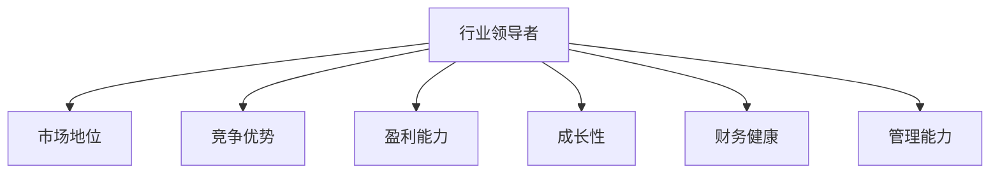
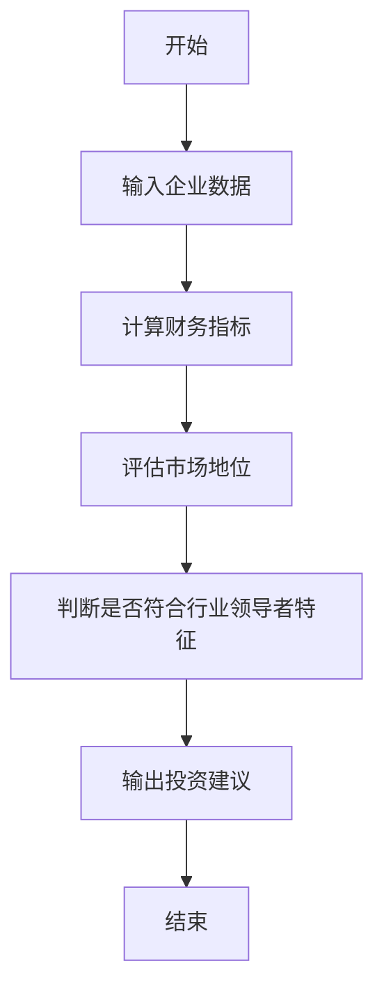
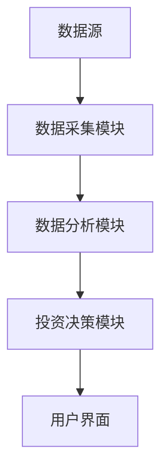

                 


# 费雪的行业领导者理论：投资行业龙头

## 关键词：费雪、行业领导者、投资策略、财务指标、市场地位

## 摘要：本文深入探讨了费雪的行业领导者理论，分析其核心概念、算法原理、系统架构及实际应用。通过详细讲解费雪的投资模型，结合实际案例，帮助读者理解如何在投资中识别和投资行业龙头公司。

---

# 第1章：费雪投资理论的起源与核心思想

## 1.1 费雪的生平简介

菲利普·费雪（Philip Fisher）是20世纪的投资大师，以其“成长型投资”理念闻名。他强调投资于具有强大竞争优势和成长潜力的公司，而非仅仅关注短期股价波动。

## 1.2 行业领导者的定义与特征

费雪认为，行业领导者是指在其所在行业中占据主导地位，具有持续竞争优势和增长潜力的公司。这些公司通常表现出以下特征：

1. 高市场份额和品牌影响力。
2. 强大的研发能力和创新能力。
3. 稳定的盈利能力和高效的管理团队。

## 1.3 费雪理论的哲学基础

费雪的投资哲学基于对公司基本面的深入分析，强调长期投资和对公司内在价值的理解。他认为，市场波动为投资者提供了以合理价格买入优质股票的机会。

---

# 第2章：费雪行业领导者理论的核心概念与联系

## 2.1 行业领导者的分类与特征对比

以下是几种常见的行业领导者的分类及其特征对比：

| 特征          | 行业领导者       | 非领导者       |
|---------------|-----------------|---------------|
| 市场份额       | 高              | 低            |
| 盈利能力       | 高              | 一般          |
| 竞争优势       | 强              | 较弱          |
| 管理团队       | 优秀            | 平平          |

## 2.2 费雪理论中的关键概念

### 2.2.1 市场地位与竞争优势

市场地位是衡量一个公司是否为行业领导者的重要指标。竞争优势则包括技术优势、成本优势和品牌优势。

### 2.2.2 盈利能力与成长性

盈利能力是公司财务健康的核心指标，成长性则反映了公司在未来市场的扩展潜力。

### 2.2.3 财务健康与管理能力

财务健康包括良好的资产负债表和现金流状况，管理能力则体现在高效的战略执行和团队建设上。

## 2.3 行业领导者理论的ER实体关系图



---

# 第3章：费雪投资模型的算法原理

## 3.1 模型概述

费雪投资模型通过分析公司的财务指标和市场地位，判断其是否为行业领导者。模型的输入包括公司财务数据和市场信息，输出为投资建议。

## 3.2 算法流程图



## 3.3 Python代码实现

```python
def fisher_investment_model(company_data):
    # 计算ROE和ROA
    roe = company_data['净利润'] / company_data['股东权益']
    roa = company_data['净利润'] / company_data['总资产']
    
    # 评估市场地位
    market_position = company_data['市场份额'] + company_data['品牌价值']
    
    # 判断是否符合行业领导者特征
    if roe > 0.15 and roa > 0.10 and market_position > 0.8:
        return "买入"
    else:
        return "观望"
```

## 3.4 数学模型

费雪模型通过以下公式计算：

$$ \text{投资建议} = \begin{cases} 
\text{买入} & \text{if } ROE > 0.15 \text{ 且 } ROA > 0.10 \text{ 且 } \text{市场地位} > 0.8 \\
\text{观望} & \text{否则}
\end{cases} $$

---

# 第4章：费雪投资理论的系统架构设计

## 4.1 系统功能模块

1. 数据采集模块：获取公司财务数据和市场信息。
2. 数据分析模块：计算财务指标，评估市场地位。
3. 投资决策模块：根据模型输出投资建议。

## 4.2 系统架构图



---

# 第5章：费雪投资理论的项目实战

## 5.1 实战环境安装

安装Python和相关库，如Pandas和NumPy。

## 5.2 核心代码实现

```python
import pandas as pd

def calculate_financial_ratios(company_data):
    roe = company_data['净利润'] / company_data['股东权益']
    roa = company_data['净利润'] / company_data['总资产']
    return roe, roa

# 示例数据
company_data = {
    '净利润': 100,
    '股东权益': 500,
    '总资产': 600,
    '市场份额': 0.3,
    '品牌价值': 0.5
}

roe, roa = calculate_financial_ratios(company_data)
market_position = company_data['市场份额'] + company_data['品牌价值']

if roe > 0.15 and roa > 0.10 and market_position > 0.8:
    print("买入")
else:
    print("观望")
```

## 5.3 案例分析

以某公司为例，计算其ROE和ROA，评估其市场地位，得出投资建议。

---

# 第6章：最佳实践与注意事项

## 6.1 最佳实践

1. 定期更新财务数据和市场信息。
2. 结合宏观经济因素进行综合判断。
3. 分散投资以降低风险。

## 6.2 注意事项

- 投资需谨慎，避免盲目跟风。
- 保持对市场的持续学习和关注。

---

# 附录

## 参考文献

1. 费雪的原著《投资成功的关键》
2. 投资理论相关的学术论文

## 工具推荐

- Python编程语言
- Pandas和NumPy库
- 数据可视化工具

---

# 作者信息

作者：AI天才研究院 & 禅与计算机程序设计艺术

---

这篇文章详细介绍了费雪的行业领导者理论，从理论基础到实际应用，帮助投资者理解和应用这一投资策略。

