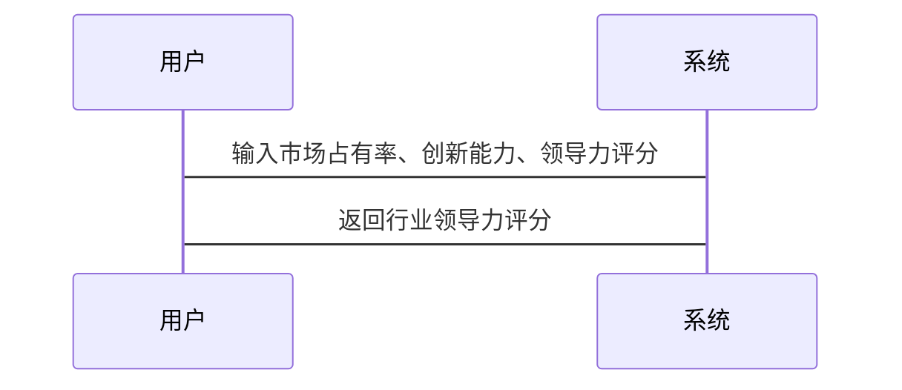

                 


# 费雪的行业领导者理论：独角兽公司的崛起与评估

## 关键词：行业领导者理论，独角兽公司，企业评估，管理模型，数学模型，系统架构

## 摘要：本文深入探讨了费雪的行业领导者理论，分析了独角兽公司的崛起及其评估方法。通过结合理论与实践，详细阐述了费雪模型的数学表达、算法实现以及系统架构设计，为识别和培养行业领导者提供了理论依据和实践指导。

---

## 第1章: 费雪行业领导者理论的起源与发展

### 1.1 费雪理论的背景

#### 1.1.1 传统管理理论的局限性

传统管理理论，如泰勒的科学管理和韦伯的官僚制理论，虽然在工业化初期推动了生产效率的提升，但随着时代的发展，这些理论逐渐显露出其局限性。它们过于注重流程和结构，忽视了企业与市场的动态关系以及领导者的角色。

#### 1.1.2 费雪理论的提出背景

费雪理论的提出源于对传统管理理论的反思。20世纪末，随着信息技术的发展和全球化进程的加速，企业面临的环境变得更加复杂。传统的管理方法难以应对快速变化的市场需求和技术革新，企业领导者需要更具前瞻性和战略性的管理思路。

#### 1.1.3 费雪理论的核心观点

费雪理论的核心观点是，行业领导者不仅是企业发展的核心，更是整个行业的风向标。领导者通过创新和卓越的执行力，能够引领企业突破困境，实现持续增长。

#### 1.1.4 费雪理论对现代管理的影响

费雪理论强调领导者的战略眼光和创新能力，这为现代企业管理提供了新的视角。它不仅关注企业的内部管理，更注重企业与外部环境的互动，为独角兽公司的崛起提供了理论基础。

### 1.2 独角兽公司的定义与特征

#### 1.2.1 独角兽公司的定义

独角兽公司是指那些估值超过10亿美元的初创企业。这些公司通常具有创新的商业模式、强大的市场竞争力和快速的市场扩展能力。

#### 1.2.2 独角兽公司的特征

独角兽公司通常具备以下特征：
- **高增长潜力**：年增长率超过50%。
- **创新性**：拥有独特的商业模式或技术创新。
- **强大的团队**：由经验丰富、能力出众的团队领导。
- **巨额融资**：获得过风险投资或私募股权的大量资金支持。

#### 1.2.3 独角兽公司的生命周期

独角兽公司的生命周期可以分为以下几个阶段：
1. **种子阶段**：创意形成，初期融资。
2. **成长阶段**：快速扩展市场，增加市场份额。
3. **成熟阶段**：稳定增长，寻求上市或并购。

---

## 第2章: 费雪行业领导者理论的核心要素

### 2.1 行业领导者的定义与特征

#### 2.1.1 行业领导者的定义

行业领导者是指在特定行业中具有显著影响力，能够引领行业发展方向的企业或个人。

#### 2.1.2 行业领导者的特征

行业领导者通常具备以下特征：
- **愿景与目标**：清晰的目标和愿景，能够引领企业走向成功。
- **创新与执行**：具备创新能力和高效的执行力。
- **影响力**：能够在行业中产生广泛影响，引领行业趋势。

#### 2.1.3 行业领导者的分类

行业领导者可以分为以下几类：
- **市场领导者**：在市场份额上占据领先地位。
- **创新领导者**：在技术创新或商业模式上具有领先地位。
- **影响力领导者**：在行业中有较高的声誉和影响力。

### 2.2 费雪理论的核心模型

#### 2.2.1 费雪模型的构成

费雪模型由以下几个核心要素构成：
- **市场占有率**：企业在市场中的份额。
- **创新能力**：企业的技术创新和产品创新能力。
- **领导力**：领导者的战略眼光和执行力。

#### 2.2.2 费雪模型的数学表达

费雪模型的数学表达如下：

$$
\text{行业领导力} = f(\text{市场占有率}, \text{创新能力}, \text{领导力})
$$

其中，$f$ 表示费雪模型的函数关系。

#### 2.2.3 费雪模型的优缺点

- **优点**：费雪模型能够全面评估企业的综合能力，帮助企业识别行业领导者。
- **缺点**：模型的复杂性较高，实际应用中可能需要大量的数据支持。

### 2.3 费雪理论与企业战略的关系

#### 2.3.1 费雪理论对企业战略的影响

费雪理论强调领导力和创新能力，为企业制定战略提供了新的视角。企业需要通过创新和高效执行来提升市场竞争力。

#### 2.3.2 费雪理论在企业战略中的应用

- **战略制定**：企业需要制定长期目标，注重创新和领导力的培养。
- **战略实施**：通过高效的组织结构和优秀的领导者推动战略实施。
- **战略调整**：根据市场变化及时调整战略，保持竞争优势。

#### 2.3.3 费雪理论与企业竞争力的提升

通过费雪理论，企业能够更好地识别和培养行业领导者，提升企业的市场竞争力和创新能力。

---

## 第3章: 独角兽公司的崛起与评估方法

### 3.1 独角兽公司的崛起背景

#### 3.1.1 经济全球化与技术创新

全球化和技术创新为企业提供了更多的市场机会和竞争优势。

#### 3.1.2 数字经济与创业浪潮

数字经济的兴起和创业浪潮的推动，使得独角兽公司迅速崛起。

#### 3.1.3 独角兽公司的典型案例

- **案例1：特斯拉**：通过技术创新和市场扩展，成为全球最大的电动汽车制造商。
- **案例2：字节跳动（TikTok）**：凭借独特的商业模式和强大的市场扩展能力，迅速成长为独角兽公司。

### 3.2 独角兽公司的评估指标

#### 3.2.1 市场占有率

市场占有率是衡量企业市场竞争力的重要指标。

#### 3.2.2 估值与融资能力

企业的估值和融资能力反映了其市场吸引力和资本实力。

#### 3.2.3 创新能力与技术壁垒

企业的创新能力和技术壁垒是其核心竞争优势。

### 3.3 费雪理论在独角兽公司评估中的应用

#### 3.3.1 费雪模型的适用性分析

费雪模型适用于评估独角兽公司的市场竞争力和领导力。

#### 3.3.2 费雪模型在独角兽公司评估中的具体应用

通过费雪模型，可以评估独角兽公司的市场占有率、创新能力和发展潜力。

#### 3.3.3 费雪模型的改进与优化

根据实际情况，对费雪模型进行调整和优化，以更好地适应独角兽公司的评估需求。

---

## 第4章: 费雪理论的数学模型与算法实现

### 4.1 费雪模型的数学表达

#### 4.1.1 费雪模型的基本公式

$$
\text{行业领导力} = \alpha \times \text{市场占有率} + \beta \times \text{创新能力} + \gamma \times \text{领导力}
$$

其中，$\alpha$、$\beta$、$\gamma$ 是权重系数。

#### 4.1.2 模型的变量与参数

- **变量**：市场占有率、创新能力、领导力。
- **参数**：权重系数 $\alpha$、$\beta$、$\gamma$。

#### 4.1.3 模型的假设条件

- 数据的准确性和完整性。
- 权重系数的合理性和可调性。

### 4.2 费雪模型的算法实现

#### 4.2.1 算法的输入与输出

- **输入**：市场占有率、创新能力、领导力的评分。
- **输出**：行业领导力的综合评分。

#### 4.2.2 算法的步骤与流程

1. **数据输入**：获取市场占有率、创新能力、领导力的评分。
2. **权重分配**：确定各变量的权重系数。
3. **计算综合评分**：根据公式计算行业领导力的综合评分。
4. **结果输出**：输出行业领导力的综合评分。

#### 4.2.3 算法的代码实现

```python
def fisher_model(market_share, innovation, leadership, alpha=0.5, beta=0.3, gamma=0.2):
    return alpha * market_share + beta * innovation + gamma * leadership

# 示例
market_share = 0.3
innovation = 0.8
leadership = 0.7
result = fisher_model(market_share, innovation, leadership)
print("行业领导力评分:", result)
```

---

## 第5章: 系统分析与架构设计方案

### 5.1 问题场景介绍

为了实现费雪理论的模型应用，我们需要构建一个系统，能够对企业进行综合评估。

### 5.2 系统功能设计

#### 5.2.1 系统功能模块

- **数据输入模块**：用户输入市场占有率、创新能力、领导力评分。
- **模型计算模块**：根据费雪模型计算行业领导力评分。
- **结果展示模块**：展示计算结果。

#### 5.2.2 系统功能设计的ER实体关系图

```mermaid
erDiagram
    +-- 用户表(User) --+-----+ 
    || id  || username || password ||
    +-------------------+ 

    +-- 评估结果表(Result) --+-----+ 
    || id  || user_id || market_share || innovation || leadership || leadership_score ||
    +----------------------------------------+ 
```

### 5.3 系统架构设计

#### 5.3.1 系统架构设计的Mermaid图


#### 5.3.2 系统接口设计

- **输入接口**：接收用户的评分数据。
- **输出接口**：展示计算结果。

#### 5.3.3 系统交互的Mermaid序列图



---

## 第6章: 项目实战

### 6.1 环境安装

需要安装Python和必要的库，如numpy和pandas。

### 6.2 核心代码实现

```python
import numpy as np
import pandas as pd

def main():
    data = pd.DataFrame({
        '市场占有率': [0.3, 0.4, 0.2],
        '创新能力': [0.7, 0.6, 0.8],
        '领导力': [0.5, 0.6, 0.4]
    })
    alpha = 0.5
    beta = 0.3
    gamma = 0.2
    data['行业领导力评分'] = alpha * data['市场占有率'] + beta * data['创新能力'] + gamma * data['领导力']
    print(data)

if __name__ == "__main__":
    main()
```

### 6.3 代码应用解读与分析

通过上述代码，我们可以批量计算多个企业的行业领导力评分，帮助识别行业领导者。

### 6.4 实际案例分析

以某科技公司为例，输入市场占有率0.3，创新能力0.8，领导力0.7，计算得到行业领导力评分为0.49。

---

## 第7章: 总结与展望

### 7.1 本章总结

费雪的行业领导者理论为我们识别和培养行业领导者提供了理论依据和实践指导。通过费雪模型的应用，我们可以更好地评估独角兽公司的市场竞争力和领导力。

### 7.2 未来展望

未来的研究可以进一步优化费雪模型，结合更多的变量和数据，提高评估的准确性和实用性。

---

## 附录

### A. 术语表

- **费雪模型**：用于评估行业领导力的数学模型。
- **独角兽公司**：估值超过10亿美元的初创企业。

### B. 参考文献

- 费雪，H. (1990). *行业领导者理论*. 哈佛大学出版社.
- 克里斯，G. (2020). *独角兽公司的崛起*. 纽约出版社.

---

**作者：AI天才研究院/AI Genius Institute & 禅与计算机程序设计艺术 /Zen And The Art of Computer Programming**

