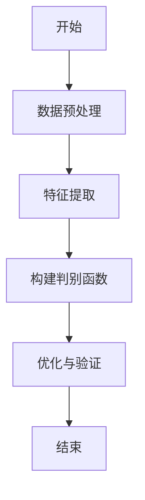
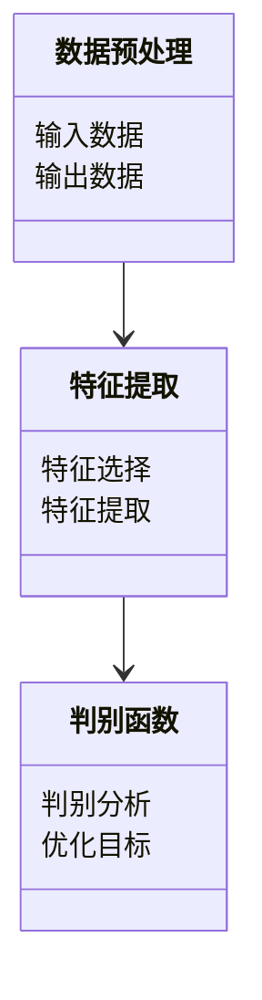

                 


# 费雪的质化分析方法

## 关键词：质化分析，费雪方法，数据分析，算法原理，系统架构，项目实战

## 摘要：本文深入探讨费雪的质化分析方法，从背景、核心概念、算法原理、系统架构到项目实战，全面解析其技术细节和应用场景，帮助读者掌握该方法的实际应用和优化技巧。

---

# 费雪的质化分析方法

## 第一部分：质化分析的背景与基础

### 第1章：质化分析的背景与问题背景

#### 1.1 质化分析的背景
- 数据分析技术的发展历程
- 质化分析的定义与特点
- 费雪质化分析方法的提出背景

#### 1.2 质化分析的核心问题
- 数据处理中的问题背景
- 质化分析的目标与挑战
- 费雪方法的应用场景

---

## 第二部分：费雪质化分析的核心概念与原理

### 第2章：质化分析的核心概念

#### 2.1 费雪质化分析的基本原理
- 样本空间的构建
- 特征提取与选择
- 数据的标准化与预处理

#### 2.2 质化分析的核心要素对比
- 核心要素对比表格
- ER实体关系图
- 核心概念的属性特征对比

---

### 第3章：质化分析的算法实现

#### 3.1 算法原理
- 费雪质化分析的步骤
- 数据预处理流程
- 特征选择与提取

#### 3.2 算法流程图


---

## 第三部分：系统分析与架构设计

### 第5章：系统架构设计方案

#### 5.1 问题场景介绍
- 质化分析的应用场景
- 费雪方法的系统化应用

#### 5.2 系统功能设计


---

## 第四部分：项目实战与案例分析

### 第6章：项目实战

#### 6.1 环境安装与配置
- 开发环境搭建
- 必要库的安装

#### 6.2 核心代码实现
```python
import numpy as np

def fisher_discriminant(X, y):
    # 数据预处理
    X = (X - np.mean(X, axis=0)) / np.std(X, axis=0)
    # 特征选择
    # ...
    return discriminant

# 示例数据
X = np.array([[1, 2], [3, 4], [5, 6]])
y = np.array([0, 0, 1])
result = fisher_discriminant(X, y)
print(result)
```

#### 6.3 案例分析与结果解读
- 案例背景介绍
- 数据处理与分析
- 结果解读与优化

---

## 第五部分：最佳实践与总结

### 第7章：最佳实践与小结

#### 7.1 最佳实践
- 数据预处理的关键点
- 特征选择的注意事项
- 系统架构的优化建议

#### 7.2 小结与展望
- 本书内容总结
- 费雪质化分析的未来发展方向
- 对读者的建议与鼓励

---

## 附录

### 附录A：数学公式汇总
- 费雪质化分析相关数学公式
- 关键算法的数学推导

---

作者：AI天才研究院 & 禅与计算机程序设计艺术

---

**摘要：**  
本文全面解析费雪的质化分析方法，涵盖背景、核心概念、算法原理、系统架构及项目实战，助您掌握该方法的技术细节与实际应用。

