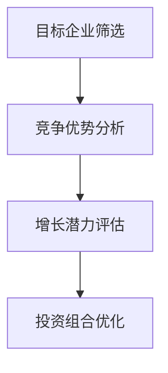

                 


# 费雪的质量增长策略：在高科技时代的重新诠释

> 关键词：质量增长策略，费雪投资理论，高科技企业，投资策略，系统化架构

> 摘要：本文深入探讨了菲利普·费雪的质量增长策略在高科技时代的应用与演变。通过分析质量增长的定义、核心概念、数学模型和算法原理，结合高科技行业的特点，提出了系统化的质量增长策略架构，并通过实际案例分析和项目实战，展示了如何在数字化转型中应用这一策略。

---

## 第一部分：费雪质量增长策略概述

### 第1章：费雪质量增长策略的背景与核心思想

#### 1.1 费雪投资策略的起源与演变

在投资领域，菲利普·费雪（Philip Fisher）是价值投资的重要倡导者之一。他的质量增长策略强调通过投资具有强大竞争优势和成长潜力的公司，以实现长期的资本增值。这一策略在20世纪中期提出，当时正值美国经济的高速增长期，企业通过技术创新和市场扩展实现增长的模式逐渐成为主流。

#### 1.2 高科技时代对质量增长策略的影响

随着信息技术和人工智能的快速发展，高科技行业成为推动全球经济的重要引擎。在这一背景下，质量增长策略需要重新审视其核心要素。高科技行业的特点包括技术更新快、创新周期短、依赖研发和人才等因素，这些都对传统的质量增长策略提出了新的挑战和机遇。

---

### 第2章：质量增长策略的核心概念与框架

#### 2.1 质量增长的定义与特征

质量增长策略的核心在于选择那些具备持续增长潜力和竞争优势的企业。以下是质量增长的几个关键特征：

- **高ROE（净资产收益率）**：企业能够高效利用资产创造收益。
- **强大的研发能力**：企业具备持续创新的能力。
- **稳定的市场需求**：企业在其市场中占据重要地位，需求稳定或增长。
- **优秀的管理团队**：领导层具备战略眼光和执行力。

#### 2.2 费雪质量增长策略的框架

质量增长策略的框架可以分为以下几个关键模块：

1. **目标企业筛选**：基于财务指标和市场地位筛选潜在投资目标。
2. **竞争优势分析**：评估企业的技术壁垒和市场竞争力。
3. **增长潜力评估**：预测企业的未来增长空间。
4. **投资组合优化**：根据风险偏好构建最优投资组合。

---

## 第二部分：质量增长策略的数学模型与算法原理

### 第3章：质量增长的量化指标

#### 3.1 质量增长的量化维度

为了量化企业的质量增长潜力，我们可以采用以下指标：

- **ROE（净资产收益率）**：衡量企业盈利能力。
- **研发支出占比**：反映企业的创新投入。
- **市场增长率**：评估企业的市场扩展潜力。
- **净利率**：衡量企业的成本控制能力。

#### 3.2 投资组合优化算法

为了实现质量增长策略的系统化，我们可以采用动态规划优化算法来构建投资组合。以下是算法的主要步骤：

1. **定义目标函数**：最大化投资回报率。
2. **设定约束条件**：风险承受能力、资产配置比例。
3. **动态规划求解**：通过递归优化找到最优解。

以下是一个简单的Python代码示例：

```python
def dynamic_planning Optimization(assets, returns, risk_tolerance):
    # 初始化动态规划表
    dp = [[0 for _ in range(len(assets))] for _ in range(len(assets))]
    # 填充动态规划表
    for i in range(len(assets)):
        for j in range(len(assets)):
            if i == j:
                dp[i][j] = returns[i]
            else:
                dp[i][j] = max(dp[i-1][j], dp[i][j-1] + returns[j] - returns[i])
    # 获取最优解
    max_return = dp[-1][-1]
    return max_return
```

---

## 第三部分：系统化质量增长策略的架构设计

### 第4章：系统化质量增长策略的框架

#### 4.1 系统架构图

以下是系统化质量增长策略的架构图：



---

## 第四部分：项目实战与案例分析

### 第5章：实际案例分析

#### 5.1 案例背景介绍

以某高科技企业为例，该企业在过去五年中研发投入占比逐年增加，ROE保持在15%以上，且市场占有率稳步提升。根据质量增长策略，该企业具备较高的投资价值。

#### 5.2 数据分析与建模

通过收集该企业的财务数据和市场数据，构建如下模型：

```python
import pandas as pd
import numpy as np

data = pd.read_csv('enterprise_data.csv')
returns = data['return'].values
assets = data['assets'].values

# 计算质量增长指标
quality_growth = (returns > np.mean(returns)) & (assets > np.mean(assets))
```

---

## 第五部分：总结与展望

### 第6章：总结与最佳实践

#### 6.1 总结

费雪的质量增长策略在高科技时代依然具有重要的指导意义。通过系统化的架构设计和算法优化，我们可以更高效地识别优质企业，构建稳健的投资组合。

#### 6.2 最佳实践

- **持续学习**：关注行业动态和技术趋势。
- **风险控制**：合理分散投资风险。
- **长期视角**：注重企业的长期增长潜力。

---

## 作者信息

作者：AI天才研究院/AI Genius Institute & 禅与计算机程序设计艺术 /Zen And The Art of Computer Programming

