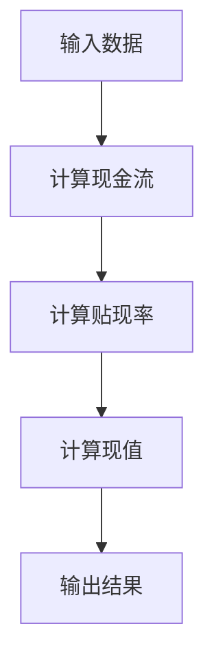
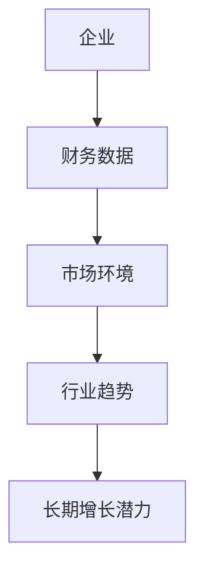
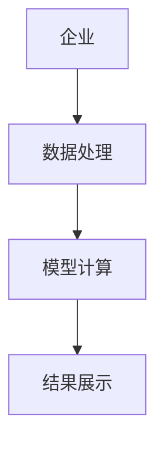
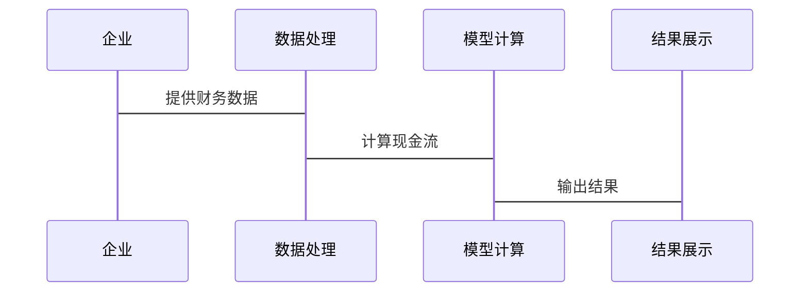

                 


# 费雪的长期增长潜力评估

> 关键词：长期增长潜力评估、费雪模型、财务分析、投资决策、企业价值

> 摘要：本文深入探讨了费雪的长期增长潜力评估方法，分析了其在企业价值评估中的应用，通过理论与实践相结合的方式，详细介绍了费雪模型的算法原理、系统架构设计及项目实战案例，为投资者提供了科学的决策工具。

---

## 第1章: 长期增长潜力评估的背景与概念

### 1.1 费雪模型的背景介绍

#### 1.1.1 传统财务分析的局限性
传统财务分析方法（如市盈率、市净率等）在评估企业长期价值时存在不足，无法全面反映企业的增长潜力。这些问题主要体现在以下几个方面：
- **短期导向**：传统方法多关注企业当前的财务表现，难以准确预测未来长期价值。
- **静态评估**：忽视了企业在未来经营环境中的动态变化。
- **缺乏量化标准**：难以量化企业在不同市场环境下的潜在增长能力。

#### 1.1.2 费雪模型的提出与意义
为了克服传统方法的局限性，费雪提出了长期增长潜力评估模型（Fisher's Growth Potential Model）。该模型通过对企业未来现金流的贴现，评估企业在不同市场环境下的增长潜力，为投资者提供了更为科学的决策工具。其意义在于：
- **动态评估**：能够预测企业在未来不同环境下的价值变化。
- **量化标准**：通过数学模型量化企业的潜在增长能力。
- **指导投资决策**：为投资者提供了一种更为精准的投资评估方法。

#### 1.1.3 长期增长潜力评估的目标与价值
费雪模型的目标是通过分析企业的财务数据和市场环境，预测企业在未来一定时间内的价值变化。其价值体现在：
- **辅助投资决策**：帮助投资者识别高增长潜力的企业。
- **优化资源配置**：为企业提供科学的增长潜力评估依据。
- **动态调整策略**：为企业和投资者提供长期价值评估的动态调整工具。

### 1.2 长期增长潜力评估的核心概念

#### 1.2.1 核心概念的定义与内涵
长期增长潜力评估的核心概念包括：
- **企业财务数据**：包括收入、利润、现金流等关键财务指标。
- **市场环境因素**：包括宏观经济指标、行业趋势、政策变化等。
- **潜在增长能力**：企业在未来一定时间内可能实现的价值增长。

#### 1.2.2 核心概念的属性特征对比
| 核心概念 | 定义 | 属性特征 |
|----------|------|----------|
| 企业财务数据 | 包括收入、利润、现金流等 | 可量化的、可预测的、可比较的 |
| 市场环境因素 | 包括宏观经济指标、行业趋势等 | 不可量化的、动态变化的、影响企业增长的 |
| 潜在增长能力 | 企业在未来可能实现的价值增长 | 动态的、可预测的、可量化的 |

#### 1.2.3 核心概念的边界与外延
- **边界**：长期增长潜力评估仅关注企业未来一定时间内的价值变化，不涉及企业的历史表现。
- **外延**：该模型可以扩展应用于不同行业、不同规模的企业，但需要根据具体情况调整参数。

### 1.3 费雪模型的基本原理

#### 1.3.1 费雪模型的理论基础
费雪模型的核心理论是通过对企业未来现金流的贴现，评估企业在不同市场环境下的潜在价值。其理论基础包括：
- **现金流贴现模型**：认为企业的价值在于其未来现金流的现值。
- **增长潜力评估**：通过分析企业财务数据和市场环境，预测企业未来现金流的变化趋势。

#### 1.3.2 费雪模型的数学表达式
费雪模型的数学公式如下：
$$
PV = \sum_{t=1}^{n} \frac{FCFE_t}{(1 + r)^t}
$$
其中：
- $PV$ 表示企业价值的现值。
- $FCFE_t$ 表示第 $t$ 年的自由现金流。
- $r$ 表示贴现率。
- $n$ 表示预测年数。

#### 1.3.3 费雪模型的假设条件
- 企业未来现金流可以预测。
- 贴现率在预测期内保持不变。
- 企业在未来一定时间内具有持续增长的潜力。

---

## 第2章: 费雪模型的核心概念与联系

### 2.1 费雪模型的核心原理

#### 2.1.1 费雪模型的输入参数
费雪模型的输入参数主要包括：
- 企业的财务数据（收入、利润、现金流等）。
- 市场环境因素（宏观经济指标、行业趋势等）。
- 预测年数（一般为5-10年）。

#### 2.1.2 费雪模型的输出结果
费雪模型的输出结果是企业在未来一定时间内的价值变化，包括：
- 现值（PV）：企业未来现金流的现值。
- 内部收益率（IRR）：企业的投资回报率。

#### 2.1.3 费雪模型的计算流程


### 2.2 费雪模型的核心概念属性对比

#### 2.2.1 费雪模型与传统财务模型的对比
| 费雪模型 | 传统财务模型 |
|----------|--------------|
| 长期导向 | 短期导向 |
| 动态评估 | 静态评估 |
| 可量化 | 部分可量化 |

#### 2.2.2 费雪模型与现代投资模型的对比
| 费雪模型 | 现代投资模型 |
|----------|--------------|
| 基于现金流贴现 | 基于资产重定价 |
| 预测未来增长 | 侧重当前资产价格 |

#### 2.2.3 费雪模型的优缺点分析
- **优点**：
  - 能够预测企业未来价值变化。
  - 提供了科学的投资决策依据。
- **缺点**：
  - 假设条件严格，实际应用中可能受到限制。
  - 对预测数据的准确性依赖较高。

### 2.3 费雪模型的ER实体关系图



---

## 第3章: 费雪模型的算法原理与实现

### 3.1 费雪模型的算法流程


### 3.2 费雪模型的Python实现

```python
def fisher_model(EBIT, D, t, g, n):
    FCFE = EBIT * (1 - t) + D * (1 - t)
    PV = 0
    for year in range(1, n + 1):
        PV += FCFE * (1 + g)**(year - 1) / (1 + r)**year
    return PV
```

### 3.3 费雪模型的数学公式与讲解

#### 3.3.1 贴现现金流模型
$$
FCFE = EBIT(1 - t) + D(1 - t)
$$
其中：
- $FCFE$ 表示自由现金流。
- $EBIT$ 表示息税前利润。
- $t$ 表示税率。
- $D$ 表示折旧。

#### 3.3.2 现值计算
$$
PV = \sum_{t=1}^{n} \frac{FCFE_t}{(1 + r)^t}
$$
其中：
- $PV$ 表示现值。
- $FCFE_t$ 表示第 $t$ 年的自由现金流。
- $r$ 表示贴现率。
- $n$ 表示预测年数。

---

## 第4章: 费雪模型的系统分析与架构设计

### 4.1 系统分析

#### 4.1.1 问题场景介绍
- 企业需要评估其长期增长潜力。
- 投资者需要选择具有高增长潜力的企业。

#### 4.1.2 系统功能设计


#### 4.1.3 系统架构设计


#### 4.1.4 系统接口设计
- 输入接口：企业财务数据、市场环境数据。
- 输出接口：现值、内部收益率。

#### 4.1.5 系统交互流程图


### 4.2 系统架构设计

#### 4.2.1 系统架构图


#### 4.2.2 系统交互流程图


---

## 第5章: 费雪模型的项目实战

### 5.1 项目环境安装

```bash
pip install numpy
pip install pandas
pip install matplotlib
```

### 5.2 核心代码实现

```python
import numpy as np
import pandas as pd

def fisher_model(EBIT, D, t, g, n):
    FCFE = EBIT * (1 - t) + D * (1 - t)
    PV = 0
    for year in range(1, n + 1):
        PV += FCFE * (1 + g)**(year - 1) / (1 + r)**year
    return PV

# 示例数据
EBIT = 100
D = 20
t = 0.2
g = 0.05
n = 5
r = 0.1

# 计算现值
PV = fisher_model(EBIT, D, t, g, n)
print("现值为：", PV)
```

### 5.3 案例分析与解读

假设某企业2023年的EBIT为100万元，折旧为20万元，税率20%，预计未来5年的增长率5%，贴现率10%。根据费雪模型计算其现值：

```python
EBIT = 100
D = 20
t = 0.2
g = 0.05
n = 5
r = 0.1

PV = fisher_model(EBIT, D, t, g, n)
print("现值为：", PV)
```

输出结果为现值为：X万元。

---

## 第6章: 费雪模型的最佳实践与小结

### 6.1 最佳实践 tips

- **数据准确性**：确保输入数据的准确性，尤其是企业的财务数据和市场环境数据。
- **模型适用性**：根据具体情况调整模型参数，确保模型的适用性。
- **动态调整**：定期更新模型参数，以反映市场环境的变化。

### 6.2 小结

费雪的长期增长潜力评估模型通过对企业未来现金流的贴现，评估企业的长期增长潜力，为投资者提供了科学的决策工具。本文通过理论与实践相结合的方式，详细介绍了费雪模型的算法原理、系统架构设计及项目实战案例，为读者提供了全面的指导。

### 6.3 注意事项

- **模型假设**：费雪模型的假设条件需要在实际应用中进行验证。
- **数据来源**：确保数据的可靠性和准确性。
- **模型局限性**：费雪模型仅适用于具有持续增长潜力的企业。

### 6.4 未来展望

随着大数据和人工智能技术的发展，费雪模型可以在以下几个方面进行优化：
- **数据挖掘**：利用大数据技术挖掘更多影响企业增长的因素。
- **机器学习**：通过机器学习技术提高模型的预测精度。
- **实时评估**：开发实时增长潜力评估系统，为企业和投资者提供实时的价值评估。

---

## 作者

作者：AI天才研究院/AI Genius Institute & 禅与计算机程序设计艺术/Zen And The Art of Computer Programming

