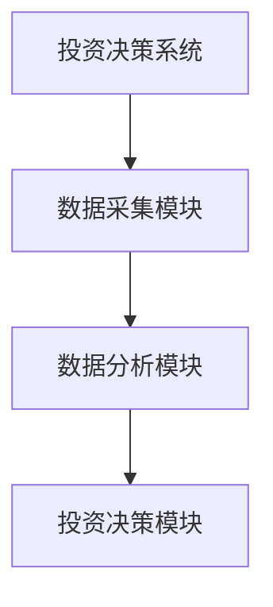
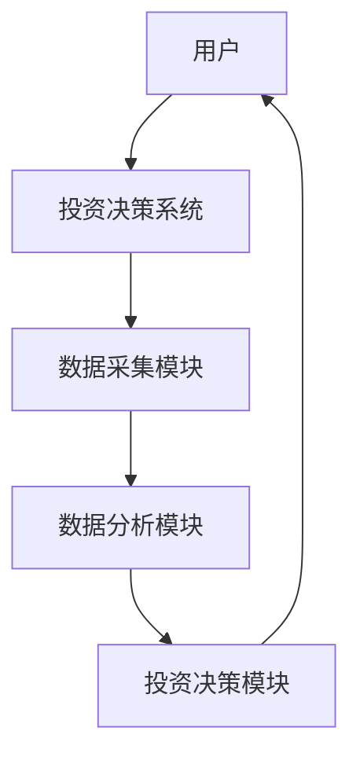

                 


# 费雪的长期持股策略

## 关键词：费雪，长期持股，成长股，投资策略，价值投资，数学模型

## 摘要：费雪是投资界的重要人物，提出长期持股策略，强调投资成长股和优质企业。本文详细探讨费雪的投资理念、长期持股策略的核心概念、数学模型、系统架构设计、项目实战以及最佳实践，帮助读者理解并应用这一策略。

---

# 第一部分: 费雪的长期持股策略概述

## 第1章: 费雪及其投资理念

### 1.1 费雪的生平与投资历程
#### 1.1.1 费雪的早期经历
菲利普·费雪（Philip Fisher）于1907年出生在美国，是一位著名的投资家和作家。他在1934年出版了《共同股的证券分析》一书，确立了他在投资界的权威地位。费雪的职业生涯始于父亲的证券公司，早期的经历使他对股票市场产生了浓厚的兴趣。

#### 1.1.2 费雪的投资哲学形成
费雪在职业生涯中逐渐形成了自己的投资哲学。他认为，投资不仅仅是购买股票，而是选择具有强大竞争优势和良好管理的公司。他强调长期持有优质股票，而不是频繁交易。

#### 1.1.3 费雪的投资成就与影响力
费雪以其长期持股策略和对成长股的投资而闻名。他的投资理念影响了后来的投资者，如彼得·林奇和沃伦·巴菲特。费雪的投资哲学强调选择优质企业，并长期持有，这种策略在长期中表现出色。

### 1.2 长期持股策略的背景
#### 1.2.1 20世纪美国股市的背景
20世纪是美国股市快速发展的时期，费雪的投资策略正是在这一背景下形成的。当时，许多公司通过技术创新和市场扩展实现了快速增长，为长期持股策略提供了良好的环境。

#### 1.2.2 费雪长期持股策略的提出
费雪在《共同股的证券分析》中首次系统地提出了长期持股策略。他认为，选择具有强大竞争优势和良好管理的公司，并长期持有，能够在市场波动中实现稳定收益。

#### 1.2.3 长期持股策略的核心思想
费雪的核心思想是，投资应该着眼于公司的长期成长潜力，而不是短期的价格波动。他强调选择那些具有强大竞争优势、良好管理团队和稳定财务表现的公司，并长期持有。

## 第2章: 长期持股策略的核心概念

### 2.1 长期持股策略的定义
#### 2.1.1 长期持股的定义
长期持股是指投资者在购买股票后，长期持有这些股票，而不是频繁买卖。这种策略强调选择具有长期增长潜力的公司，并在市场波动中保持耐心。

#### 2.1.2 长期持股与短期投资的区别
短期投资关注市场波动，试图通过频繁买卖获利。而长期持股则关注公司的长期表现，忽略短期波动。长期持股需要投资者具备耐心和信心，相信公司的长期增长潜力。

#### 2.1.3 长期持股的核心要素
长期持股的核心要素包括选择具有强大竞争优势的公司、良好的管理团队、稳定的财务表现以及长期增长潜力。此外，投资者需要具备耐心和纪律，避免短期波动的干扰。

### 2.2 长期持股策略的特点
#### 2.2.1 长期持股的稳定性
长期持股策略强调稳定，投资者不会因为市场的短期波动而改变投资决策。这种稳定性有助于投资者在市场下跌时保持信心。

#### 2.2.2 长期持股的收益性
长期持股策略通过选择具有长期增长潜力的公司，能够在长期内实现较高的收益。历史数据显示，长期持有优质股票的回报率远高于短期交易。

#### 2.2.3 长期持股的风险性
尽管长期持股策略具有较高的收益潜力，但仍然存在风险。市场的波动、公司的经营状况变化以及宏观经济因素都可能影响股票价格。投资者需要具备风险管理和分散投资的能力。

### 2.3 长期持股策略与其他投资策略的对比
#### 2.3.1 长期持股与短线交易的对比
长期持股策略与短线交易策略在时间跨度、交易频率和风险承受方面存在显著差异。长期持股强调稳定性，而短线交易强调灵活性和高频率交易。

#### 2.3.2 长期持股与价值投资的对比
长期持股策略与价值投资策略在某些方面有相似之处，但也有不同。价值投资强调以低于内在价值的价格购买股票，而长期持股策略则更关注公司的长期增长潜力。

#### 2.3.3 长期持股与成长投资的对比
长期持股策略与成长投资策略在某些方面相似，但也有不同。成长投资强调投资于增长速度快的公司，而长期持股策略更关注公司的长期稳定性和竞争优势。

## 第3章: 长期持股策略的数学模型与公式

### 3.1 费雪长期持股策略的数学模型
#### 3.1.1 费雪模型的构建
费雪的长期持股策略可以通过数学模型来量化。模型的核心在于评估公司的内在价值和成长潜力。通过分析公司的财务数据和市场表现，投资者可以确定股票的合理价值。

#### 3.1.2 费雪模型的公式推导
费雪模型的核心公式可以表示为：

$$ V = \frac{E}{k} $$

其中，V是股票的内在价值，E是公司的年收益，k是资本化率。通过计算内在价值，投资者可以确定股票的合理价格范围。

#### 3.1.3 费雪模型的验证与应用
通过历史数据验证，费雪模型能够有效评估公司的内在价值。投资者可以使用该模型来选择具有长期增长潜力的公司，并长期持有这些股票。

### 3.2 长期持股策略的量化分析
#### 3.2.1 股票内在价值的计算
股票的内在价值可以通过多种方法计算，包括现金流折现法和相对估值法。这些方法可以帮助投资者确定股票的合理价格范围。

#### 3.2.2 股票价格波动的预测
尽管长期持股策略强调稳定，但股票价格仍然存在波动。通过分析历史数据和市场趋势，投资者可以更好地预测价格波动，并制定相应的投资策略。

#### 3.2.3 股票收益的数学期望
长期持股策略的收益可以通过计算股票的长期回报率来评估。数学期望可以帮助投资者确定长期持有股票的平均收益。

## 第4章: 长期持股策略的系统架构设计

### 4.1 投资决策系统的总体架构
#### 4.1.1 系统目标与范围
投资决策系统的目的是帮助投资者制定长期持股策略。系统需要涵盖数据采集、分析和决策模块，确保投资者能够做出明智的投资决策。

#### 4.1.2 系统功能模块划分
投资决策系统主要包括数据采集模块、数据分析模块和投资决策模块。数据采集模块负责收集市场数据，数据分析模块对数据进行处理和分析，投资决策模块基于分析结果制定投资策略。

#### 4.1.3 系统架构图（Mermaid）


### 4.2 投资决策系统的详细设计
#### 4.2.1 数据采集模块
数据采集模块负责从多个来源收集市场数据，包括股票价格、财务数据和行业趋势。这些数据为后续分析提供基础。

#### 4.2.2 数据分析模块
数据分析模块对收集到的数据进行处理和分析。通过应用数学模型和统计方法，投资者可以评估公司的内在价值和成长潜力。

#### 4.2.3 投资决策模块
投资决策模块基于分析结果制定投资策略。模块需要考虑市场趋势、公司基本面和宏观经济因素，帮助投资者做出明智的决策。

### 4.3 系统接口与交互设计
#### 4.3.1 系统接口定义
系统接口包括数据输入接口和用户界面接口。数据输入接口用于接收市场数据，用户界面接口供投资者与系统交互。

#### 4.3.2 系统交互流程图（Mermaid）


## 第5章: 长期持股策略的项目实战

### 5.1 项目环境与工具安装
#### 5.1.1 系统环境要求
项目需要安装Python、Jupyter Notebook和Pandas等工具。这些工具可以帮助投资者进行数据分析和建模。

#### 5.1.2 开发工具安装
安装步骤如下：
1. 安装Python：`python --version`
2. 安装Jupyter Notebook：`pip install jupyter-notebook`
3. 安装Pandas：`pip install pandas`

#### 5.1.3 数据源准备
投资者需要收集相关股票的市场数据，包括历史价格、财务数据和行业趋势。数据可以从Yahoo Finance等网站获取。

### 5.2 系统核心实现源代码
#### 5.2.1 数据采集模块
```python
import pandas as pd
import requests

def get_stock_data(ticker):
    url = f"https://query1.finance.yahoo.com/.../{ticker}"
    response = requests.get(url)
    data = response.json()
    df = pd.DataFrame(data)
    return df
```

#### 5.2.2 数据分析模块
```python
def calculate_intrinsic_value(df):
    E = df['Earnings'].mean()
    k = 0.1  # 假设资本化率为10%
    V = E / k
    return V
```

#### 5.2.3 投资决策模块
```python
def make_investment_decision(V, price):
    if V > price:
        return "买入"
    elif V < price:
        return "卖出"
    else:
        return "持有"
```

### 5.3 代码应用解读与分析
#### 5.3.1 数据采集模块的实现
数据采集模块通过API接口获取股票数据，并将其存储在DataFrame中。投资者可以使用该模块获取实时数据，为后续分析提供基础。

#### 5.3.2 数据分析模块的实现
数据分析模块基于费雪模型计算股票的内在价值。通过比较股票的内在价值和市场价格，投资者可以确定股票的合理价格范围。

#### 5.3.3 投资决策模块的实现
投资决策模块根据分析结果制定投资策略。如果股票的内在价值高于市场价格，投资者可以选择买入；如果内在价值低于市场价格，投资者可以选择卖出。

### 5.4 实际案例分析
#### 5.4.1 案例选择
以苹果公司为例，分析其长期持股策略。收集苹果公司的历史数据，计算其内在价值，并制定投资决策。

#### 5.4.2 案例分析
通过分析苹果公司的财务数据和市场表现，投资者可以确定其内在价值。如果苹果公司的内在价值高于市场价格，投资者可以选择长期持有。

### 5.5 项目小结
通过项目实战，投资者可以更好地理解长期持股策略的应用。通过数据分析和模型计算，投资者可以做出明智的投资决策，并在长期中实现稳定收益。

## 第6章: 总结与最佳实践

### 6.1 小结
长期持股策略是一种有效的投资策略，通过选择具有长期增长潜力的公司，投资者可以在市场波动中实现稳定收益。

### 6.2 注意事项
投资者需要注意市场的波动和公司的经营状况变化。长期持股策略需要投资者具备耐心和纪律，避免短期波动的干扰。

### 6.3 拓展阅读
推荐投资者阅读《共同股的证券分析》和《投资之道》等书籍，进一步深入理解长期持股策略。

## 作者：AI天才研究院/AI Genius Institute & 禅与计算机程序设计艺术 /Zen And The Art of Computer Programming

