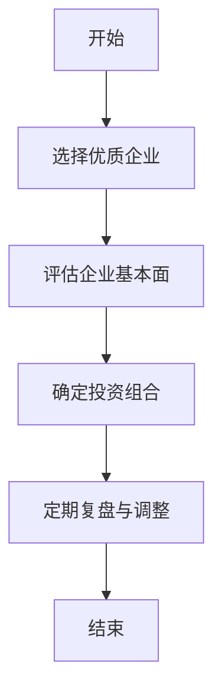
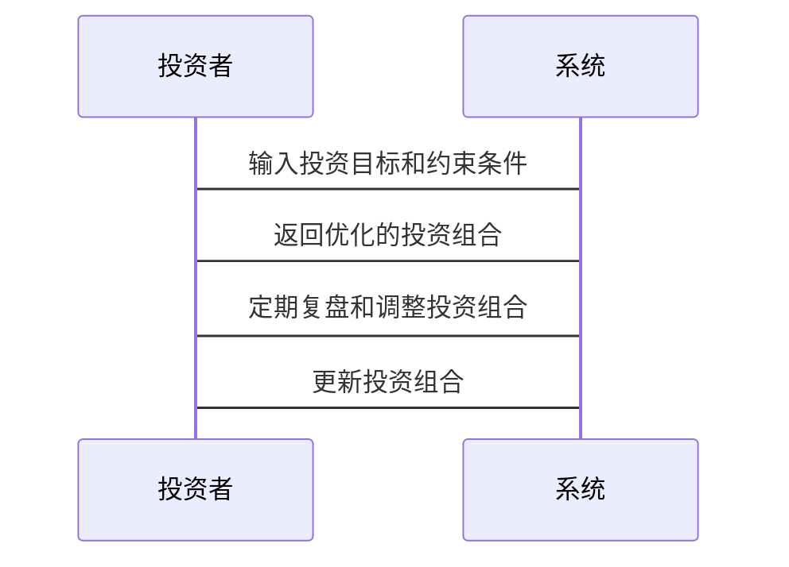

                 

# 费雪的长期持股策略：减少交易成本的智慧之举

## 关键词：
- 费雪
- 长期持股
- 交易成本
- 投资策略
- 风险管理
- 价值投资
- 复利效应

## 摘要：
本文深入探讨了费雪的长期持股策略，分析其如何通过减少交易成本实现长期投资收益。文章从费雪的投资理念出发，详细阐述了长期持股的优势与挑战、优质企业的选择标准、风险管理措施，以及长期持股策略的系统性分析与实战案例。通过理论与实践相结合的方式，本文为投资者提供了科学的投资方法和实用的决策支持。

---

# 费雪的长期持股策略：减少交易成本的智慧之举

## 第1章: 费雪的投资理念与长期持股策略

### 1.1 费雪的投资哲学
#### 1.1.1 费雪的生平与投资思想
菲利普·费雪（Philip Fisher）是20世纪著名的投资家，被誉为“成长型投资之父”。他倡导长期持股策略，注重选择具有强大竞争优势和持续增长潜力的企业。费雪的投资理念强调企业质量而非市场波动，认为投资者应专注于挑选优质企业，而非试图预测市场短期走势。

#### 1.1.2 费雪对价值投资的贡献
费雪是价值投资的重要倡导者之一，他的投资理念深刻影响了后来的投资者。他提出了“护城河”概念，认为企业应具备强大的竞争优势，能够在长期竞争中保持领先地位。此外，费雪还强调了企业管理和创新能力的重要性，认为这是企业持续增长的关键因素。

#### 1.1.3 长期持股策略的核心理念
费雪的长期持股策略基于以下核心理念：
- **长期视角**：投资应着眼于企业的长期增长，而非短期市场波动。
- **优质企业**：选择那些具有强大竞争优势、管理优秀、财务健康的企业。
- **复利效应**：通过长期持有优质企业，实现收益的复利增长。

### 1.2 长期持股策略的基本概念
#### 1.2.1 长期持股的定义与特征
长期持股策略是指投资者在较长的时间内持有优质股票，不因短期市场波动而频繁买卖。其核心特征包括：
- **低交易频率**：减少买卖操作，降低交易成本。
- **注重企业质量**：选择具备长期增长潜力的企业。
- **耐心与纪律**：坚持长期投资，避免短期情绪干扰。

#### 1.2.2 长期持股与短期交易的对比
| 对比维度 | 长期持股 | 短期交易 |
|----------|----------|----------|
| 投资目标 | 企业长期增长 | 短期价格波动 |
| 交易频率 | 低 | 高 |
| 风险承受 | 较低 | 较高 |
| 成本 | 低 | 高 |

#### 1.2.3 长期持股策略的适用场景
长期持股策略适用于以下场景：
- 投资者具备长期投资的耐心和纪律。
- 市场环境稳定，具备长期增长潜力。
- 投资者能够识别和选择优质企业。

---

## 第2章: 长期持股策略的优势与挑战

### 2.1 长期持股的优势
#### 2.1.1 减少交易成本
长期持股通过减少交易次数，显著降低交易成本，包括佣金、税费和市场冲击等。研究表明，频繁交易的投资者往往难以跑赢指数，而长期持有优质股票的投资者则能通过复利效应实现超额收益。

#### 2.1.2 复利效应的长期积累
长期持股的核心优势在于复利效应。通过持续持有优质股票，投资者能够将收益再投资，从而实现收益的指数增长。复利效应在长期投资中表现尤为显著，尤其是在企业持续增长的情况下。

#### 2.1.3 避免市场波动的干扰
短期市场波动往往会对投资者的心理产生重大影响，导致非理性决策。长期持股策略通过忽略短期波动，帮助投资者保持冷静，专注于企业的长期价值。

### 2.2 长期持股的挑战
#### 2.2.1 市场波动对长期投资者的影响
尽管长期投资者应关注企业的长期价值，但市场波动仍可能对投资组合产生重大影响。例如，金融危机或行业政策变化可能导致优质企业的短期估值大幅下降。

#### 2.2.2 选股难度的增加
长期持股要求投资者具备较高的选股能力，能够识别出那些具备持续增长潜力的优质企业。选股难度的增加意味着投资者需要投入更多时间和精力进行研究和分析。

#### 2.2.3 心理因素对长期持股的干扰
长期持股需要投资者具备强大的心理素质，能够承受短期市场的波动和不确定性。许多投资者在市场下跌时容易失去信心，导致中途卖出，错失长期收益。

---

## 第3章: 如何选择优质企业

### 3.1 优质企业的基本面分析
#### 3.1.1 收入与利润的持续增长
优质企业应具备持续增长的收入和利润，这表明企业具备较强的市场竞争力和盈利能力。通过分析企业的财务报表，投资者可以评估其收入增长的稳定性和利润的可持续性。

#### 3.1.2 财务健康状况的评估
企业的财务健康状况是评估其长期价值的重要指标。投资者需要关注企业的资产负债表、现金流量表和利润表，确保企业具备健康的财务状况，例如较低的债务负担和充足的现金流。

#### 3.1.3 行业地位与竞争优势
优质企业应具备强大的行业地位和竞争优势，能够在竞争中占据领先地位。这包括较高的市场占有率、独特的技术优势、强大的品牌影响力等因素。

### 3.2 企业竞争优势的评估
#### 3.2.1 技术壁垒的建立
技术壁垒是企业竞争优势的重要来源。具备强大研发能力和技术优势的企业能够通过技术创新保持竞争优势，从而实现长期增长。

#### 3.2.2 市场占有率的分析
市场占有率是衡量企业竞争力的重要指标。高市场占有率表明企业具备较强的市场影响力和客户忠诚度，能够在行业中占据主导地位。

#### 3.2.3 企业创新与研发能力
企业的创新能力和研发能力是其长期增长的关键驱动力。具备强大研发能力的企业能够不断推出新产品、改进技术，从而保持竞争优势。

---

## 第4章: 长期持股的风险管理

### 4.1 风险管理的重要性
#### 4.1.1 风险管理的核心概念
风险管理是长期投资成功的关键。通过识别、评估和控制投资风险，投资者能够降低投资组合的波动性，确保长期收益的稳定性。

#### 4.1.2 长期持股中的常见风险
长期持股面临的主要风险包括市场风险、企业风险和流动性风险。市场风险指市场波动对投资组合的影响；企业风险指个别企业基本面变化导致的投资损失；流动性风险指在市场低迷时难以变现投资。

#### 4.1.3 风险管理的必要性
有效的风险管理能够帮助投资者在市场波动中保持冷静，避免非理性决策。同时，通过分散投资和风险控制，投资者能够降低投资组合的整体风险。

### 4.2 风险管理的具体措施
#### 4.2.1 个股集中度的控制
避免过度集中投资于少数股票，通过分散投资降低风险。通常建议将资金分配到10-20只优质股票，以减少个别股票波动对整体投资组合的影响。

#### 4.2.2 估值区间的设定
在长期持股过程中，投资者需要设定合理的估值区间，避免在高估时买入或低估时卖出。通过定期复盘和评估，投资者可以及时调整持仓，确保投资组合的合理性。

#### 4.2.3 定期复盘与调整
定期复盘投资组合的表现，评估企业的基本面变化和市场环境的变化。根据复盘结果，投资者可以进行必要的调整，优化投资组合的结构和质量。

---

## 第5章: 长期持股策略的系统性分析

### 5.1 投资组合的构建
#### 5.1.1 投资组合的构成要素
一个成功的投资组合应包含以下要素：
- **优质企业**：具备长期增长潜力和竞争优势。
- **分散投资**：避免过度集中，降低风险。
- **长期视角**：关注企业的长期价值，而非短期波动。

#### 5.1.2 投资组合的风险与收益平衡
在构建投资组合时，投资者需要在风险和收益之间找到平衡点。通过合理配置不同类型和行业的股票，投资者能够降低整体风险，同时追求长期收益。

#### 5.1.3 投资组合的动态调整
投资组合需要定期进行动态调整，以适应市场环境和企业基本面的变化。动态调整包括增加或减少持仓、替换表现不佳的股票等。

### 5.2 系统架构设计
#### 5.2.1 投资决策的流程图
以下是一个简化的投资决策流程图，展示了长期持股策略的基本步骤：

#### 5.2.2 投资组合的优化模型
通过数学模型优化投资组合的配置，能够提高投资效率。以下是一个简单的投资组合优化模型：

$$
\text{目标函数：最大化收益} \quad \sum_{i=1}^{n} w_i r_i
$$

$$
\text{约束条件：} \quad \sum_{i=1}^{n} w_i = 1, \quad w_i \geq 0
$$

其中，\( w_i \) 表示第 \( i \) 只股票的权重，\( r_i \) 表示第 \( i \) 只股票的预期收益。

#### 5.2.3 系统接口的设计
为了实现长期持股策略，投资者可以借助投资管理系统进行操作。以下是一个简化的系统接口设计：

---

## 第6章: 长期持股策略的实战案例

### 6.1 案例分析
#### 6.1.1 优质企业的长期表现
以下以苹果公司为例，分析其长期表现：

从2000年至今，苹果公司的股价增长了数十倍，充分体现了优质企业的长期增长潜力。

#### 6.1.2 风险管理的实际应用
在2008年金融危机期间，优质企业的股票可能遭受重创，但长期投资者通过分散投资和估值控制，能够有效降低风险。例如，投资者在市场高点时降低持仓比例，避免了大幅亏损。

#### 6.1.3 投资组合的优化过程
通过定期复盘和调整，投资者可以优化投资组合的配置。例如，当某行业出现政策变化时，及时减少对该行业的投资，增加其他行业的配置。

### 6.2 实战经验总结
#### 6.2.1 成功案例的经验分享
成功的长期持股案例表明，选择优质企业、坚持长期投资和合理风险管理是实现超额收益的关键。

#### 6.2.2 失败案例的教训总结
失败的案例通常发生在投资者未能坚持长期策略、过度集中投资或未能有效管理风险的情况下。例如，投资者在市场高点买入高价股，导致大幅亏损。

---

# 总结

费雪的长期持股策略是一种科学且有效的投资方法，通过减少交易成本、复利效应和优质企业选择，帮助投资者实现长期收益。然而，长期持股策略也面临市场波动、选股难度和心理压力等挑战。投资者需要具备长期视角、理性心态和风险管理能力，才能成功实施这一策略。

---

## 作者：AI天才研究院/AI Genius Institute & 禅与计算机程序设计艺术 /Zen And The Art of Computer Programming

