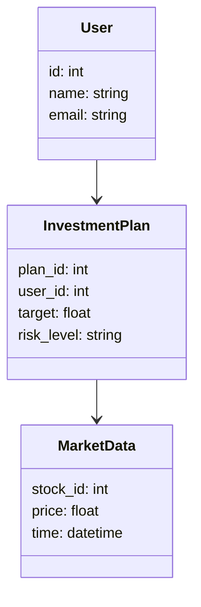
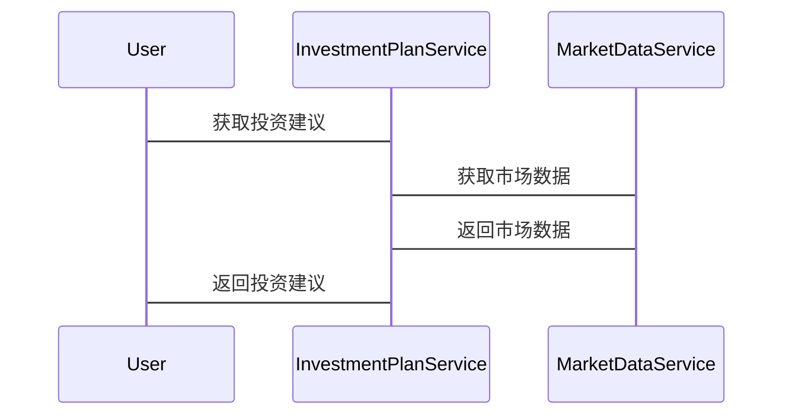

                 


# 跨平台投資理財智能助手的開發技巧

## 關鍵詞：
跨平台开发、投资理财、智能助手、推荐算法、系统架构、风险管理

## 摘要：
本文将详细探讨跨平台投资理财智能助手的开发技巧，从跨平台开发的基础概念到智能助手的核心算法，再到系统架构设计，逐步解析开发过程中的关键技术和实践技巧。通过分析用户需求、设计推荐算法、优化系统架构，本文将为开发者提供一套完整的开发指南，帮助他们高效地构建跨平台投资理财智能助手。

---

# 第一部分: 跨平台投資理財智能助手的開發基礎

## 第1章: 跨平台開發與投資理財智能助手概述

### 1.1 跨平台開發的概念與優勢

#### 1.1.1 跨平台開發的定義
跨平台开发是指通过使用统一的开发工具和技术，将应用程序部署到多个操作系统或平台上，而无需为每个平台单独编写代码。这种方式能够显著降低开发成本和维护复杂性。

#### 1.1.2 跨平台開發的主要優勢
- **成本降低**：跨平台开发减少了重复开发不同平台代码的工作量。
- **快速部署**：开发者可以快速将应用部署到多个平台，节省时间和资源。
- **用户体验一致**：用户可以在不同设备上获得一致的应用体验。

#### 1.1.3 智能助手在跨平台開發中的應用
智能助手作为投资理财领域的工具，需要在多个平台上运行，如Web、iOS和Android。跨平台开发能够确保智能助手在不同平台上的功能一致性和用户体验的一致性。

### 1.2 投資理財智能助手的定義與功能

#### 1.2.1 投資理財智能助手的定義
投资理财智能助手是一款通过分析用户的投资需求、财务状况和市场数据，提供个性化的投资建议和理財规划的应用程序。

#### 1.2.2 智能助手的核心功能
- **用户信息收集**：包括用户的财务状况、投资目标和风险偏好。
- **投资建议**：基于用户数据，推荐合适的投资组合和理财产品。
- **市场监控**：实时跟踪市场动态，提醒用户关注重要事件。
- **风险评估**：通过数据分析，评估用户的投资组合风险。

#### 1.2.3 投資理財智能助手的市場價值
随着投资者对个性化和高效投资工具的需求增加，智能助手在市场中具有重要的价值。它能够帮助用户做出更明智的投资决策，提高投资效率。

### 1.3 跨平台投資理財助手的發展趨勢

#### 1.3.1 技術進步對跨平台開發的影響
随着技术的进步，跨平台开发工具如React Native和Flutter不断完善，使得开发更加高效和便捷。

#### 1.3.2 投資理財行業的數字化轉型
数字化转型使得投资理财行业更加依赖智能工具和自动化服务，跨平台开发成为行业趋势。

#### 1.3.3 智能助手的未來發展方向
未来的智能助手将更加智能化和个性化，结合人工智能技术，提供更精准的投资建议和风险管理。

### 1.4 本章小結
本章介绍了跨平台开发的基本概念及其在投资理财智能助手中的应用，分析了智能助手的核心功能和市场价值，展望了其未来的发展趋势。

---

## 第2章: 推荐算法原理與實現

### 2.1 推荐算法的分類與原理

#### 2.1.1 協同過濾推薦
协同过滤基于用户的行为和偏好，寻找相似的用户或物品，推荐相似的内容。

#### 2.1.2 基於內容的推薦
基于内容的推荐通过分析物品的特征，找到与用户兴趣相符的内容。

#### 2.1.3 混合推薦算法
混合推荐结合协同过滤和基于内容的推荐，利用两种方法的优势，提高推荐的准确性和多样性。

### 2.2 基於用戶行為的推薦模型

#### 2.2.1 用戶行為數據的收集與分析
通过收集用户的点击、浏览、购买等行为数据，分析用户的兴趣和偏好。

#### 2.2.2 基於協同過濾的推薦公式
$$ sim(i,j) = \frac{\sum_{k} (r_{ik} - \bar{r_i})(r_{jk} - \bar{r_j})}{\sqrt{\sum_{k}(r_{ik} - \bar{r_i})^2} \cdot \sqrt{\sum_{k}(r_{jk} - \bar{r_j})^2}}$$
其中，$sim(i,j)$ 表示用户i和j的相似度，$\bar{r_i}$ 和 $\bar{r_j}$ 分别是用户i和j的平均评分。

### 2.3 算法實現與優化

#### 2.3.1 算法實現步驟
1. 收集用户数据和行为数据。
2. 构建用户-物品矩阵。
3. 计算用户之间的相似度。
4. 根据相似度推荐物品。

#### 2.3.2 算法優化的關鍵點
- **数据预处理**：去除异常值和噪声数据。
- **相似度计算**：使用高效的计算方法减少计算量。
- **推荐结果排序**：根据业务需求对推荐结果进行排序。

#### 2.3.3 算法效果的評價指標
- **准确率**：推荐结果与实际用户行为的匹配程度。
- **召回率**：推荐结果覆盖用户需求的能力。
- **F1分数**：综合准确率和召回率的指标。

### 2.4 本章小結
本章详细介绍了推荐算法的分类和实现，重点讲解了协同过滤算法的原理和实现步骤，并提供了数学公式和代码示例，帮助读者更好地理解和应用推荐算法。

---

## 第3章: 系統架構設計

### 3.1 系統功能模塊劃分

#### 3.1.1 用戶模塊
- 用户注册与登录。
- 用户信息管理。
- 用户行为数据收集。

#### 3.1.2 理財規劃模塊
- 投资目标设定。
- 投资组合推荐。
- 风险评估与管理。

#### 3.1.3 投資監控模塊
- 市场数据实时监控。
- 投资组合表现跟踪。
- 重要事件提醒。

### 3.2 系統架構設計

#### 3.2.1 分層架構設計

该类图展示了用户、投资计划和市场数据之间的关系，用户通过投资计划与市场数据进行交互。

### 3.3 系統接口設計

#### 3.3.1 API接口設計
- `/api/users/login`：用户登录接口。
- `/api/investment_recommend`：获取投资推荐接口。
- `/api/market_data`：获取市场数据接口。

### 3.4 系統交互設計

#### 3.4.1 系統交互流程

该序列图展示了用户请求投资建议，系统通过调用市场数据服务生成投资建议并返回给用户的过程。

### 3.5 本章小結
本章详细介绍了系统架构设计，包括功能模块划分、类图设计、API接口设计和系统交互流程，为后续的开发提供了清晰的指导。

---

## 第四部分: 項目實戰

## 第4章: 環境安裝與核心實現

### 4.1 開發環境安裝
- 安装Node.js和npm。
- 安装React Native或Flutter开发工具。

### 4.2 核心實現源代碼
以下是一个简单的投资推荐算法实现：

```python
def calculate_recommendation(user_data):
    # 用户数据预处理
    user_vector = preprocess(user_data)
    # 计算相似用户
    similar_users = find_similar_users(user_vector)
    # 获取推荐结果
    recommendations = get_recommendations(similar_users)
    return recommendations
```

### 4.3 代碼應用解讀
- `preprocess`函数用于清洗用户数据。
- `find_similar_users`函数基于余弦相似度计算相似用户。
- `get_recommendations`函数根据相似用户的行为生成推荐列表。

### 4.4 項目小結
本章通过实际案例展示了如何在跨平台环境下开发投资理财智能助手，提供了环境安装和核心代码实现的详细步骤，帮助读者快速上手。

---

## 第五部分: 最佳實踐與未來展望

## 第5章: 最佳實踐與小結

### 5.1 最佳實踴
- 定期更新市场数据和算法模型。
- 确保用户数据的安全性和隐私性。
- 提供良好的用户反馈机制，持续优化用户体验。

### 5.2 小結
本文从跨平台开发的基础到智能助手的核心算法，再到系统架构设计，为开发者提供了一套完整的开发指南。通过实际案例和最佳实践，帮助开发者高效地构建跨平台投资理财智能助手。

---

## 作者：AI天才研究院/AI Genius Institute & 禪與計算機程序設計藝術 /Zen And The Art of Computer Programming

---

**注**：由于篇幅限制，本文仅为目录大纲和部分内容展示，完整文章需根据上述结构进一步扩展和详细编写。

