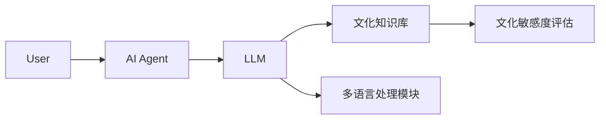

                 


# 跨文化交流AI Agent：增强LLM的文化敏感度

## 关键词
- 跨文化交流
- AI Agent
- LLM
- 文化敏感度
- 多语言处理
- 注意力机制
- 对比学习

## 摘要
跨文化交流在当今全球化社会中变得越来越重要，而AI Agent在这一过程中扮演着关键角色。本文探讨了如何通过增强大语言模型（LLM）的文化敏感度，使其更好地理解和应对不同文化背景下的交流需求。通过分析跨文化交流的核心概念、算法原理、数学模型、系统架构以及实际项目案例，本文详细阐述了如何设计和实现一个高效的跨文化交流AI Agent。最后，本文还提供了最佳实践和未来研究方向，为相关领域的研究和应用提供了有价值的参考。

---

## 第一部分: 背景介绍

### 第1章: 背景介绍

#### 1.1 跨文化交流的重要性
- **1.1.1 全球化背景下的跨文化交流需求**  
  随着全球化的发展，跨文化交流已成为日常生活的一部分。无论是商业合作、旅游还是国际事务，理解不同文化背景下的语言、习俗和价值观至关重要。AI Agent作为人机交互的桥梁，需要具备文化敏感性以提供更优质的服务。

- **1.1.2 AI Agent在跨文化交流中的角色**  
  AI Agent通过自然语言处理（NLP）技术，帮助用户跨越语言和文化障碍。它不仅需要理解语言本身，还需要理解语言背后的文化含义，以提供准确且符合用户期望的回应。

- **1.1.3 当前LLM在跨文化交流中的局限性**  
  当前的大语言模型虽然在语言处理能力上取得了显著进展，但在跨文化交流中仍存在不足。例如，LLM可能无法准确理解特定文化背景下的隐喻、俚语或习俗，导致回应不符合预期。

#### 1.2 跨文化交流AI Agent的定义与问题描述
- **1.2.1 跨文化交流AI Agent的定义**  
  跨文化交流AI Agent是一种能够理解和适应不同文化背景的智能体，通过自然语言处理技术，提供跨文化环境下的交互服务。

- **1.2.2 当前LLM在跨文化交流中的主要问题**  
  - **文化知识的不足**：LLM通常基于通用语言数据训练，缺乏对特定文化背景的深入理解。  
  - **文化敏感性不足**：在处理跨文化交流时，模型可能因为文化差异而产生误解。  
  - **动态文化适应能力有限**：不同文化背景下，用户的表达方式和需求可能差异显著，AI Agent需要动态调整以适应这些变化。

- **1.2.3 跨文化交流AI Agent的目标与边界**  
  目标是通过增强LLM的文化敏感性，使其能够在跨文化环境中提供准确、自然且符合用户期望的交互服务。边界包括不涉及文化无关的任务以及避免过度拟合特定文化背景。

#### 1.3 跨文化交流AI Agent的核心要素
- **1.3.1 文化知识库的构建**  
  文化知识库是AI Agent的核心组成部分，包含不同文化背景下的语言习惯、习俗、价值观等信息。  
- **1.3.2 多语言处理能力**  
  跨文化交流AI Agent需要支持多种语言，并能够根据上下文切换语言，以满足用户的需求。  
- **1.3.3 文化敏感度的评估标准**  
  文化敏感度的评估标准包括模型对文化差异的识别能力、对文化背景的适应能力和对文化隐含信息的理解能力。

---

## 第二部分: 跨文化交流AI Agent的核心概念与联系

### 第2章: 跨文化交流AI Agent的核心概念与联系

#### 2.1 核心概念原理
- **2.1.1 大语言模型（LLM）的基本原理**  
  LLM通过大量数据训练，能够理解和生成人类语言。然而，其文化敏感性主要依赖于训练数据中的文化多样性。  
- **2.1.2 跨文化交流的关键要素**  
  跨文化交流的关键要素包括语言、语境、非语言表达（如肢体语言）和文化背景。  
- **2.1.3 AI Agent的交互机制**  
  AI Agent通过自然语言处理技术与用户交互，根据用户的输入生成回应，并动态调整其输出以适应文化背景。

#### 2.2 核心概念属性特征对比
- **2.2.1 不同文化背景下语言表达的差异**  
  例如，在英语中，“No”直接表达拒绝，但在某些亚洲文化中，可能通过委婉的方式表达拒绝。  
- **2.2.2 不同文化背景下语境理解的差异**  
  在西方文化中，直接性是重要的；而在东方文化中，间接性和含蓄性更为常见。  
- **2.2.3 不同文化背景下用户需求的差异**  
  用户的需求可能因文化背景而异，例如在商业谈判中，西方文化更注重逻辑和效率，而东方文化更注重关系和情感。

#### 2.3 ER实体关系图


---

## 第三部分: 跨文化交流AI Agent的算法原理

### 第3章: 跨文化交流AI Agent的算法原理

#### 3.1 对比学习算法
- **3.1.1 对比学习的基本原理**  
  对比学习是一种通过比较不同样本的相似性来学习特征的方法。在跨文化交流中，对比学习可以用于识别不同文化背景下语言表达的差异。  
- **3.1.2 跨文化对比学习的实现**  
  通过将不同文化背景下的文本数据进行对比，模型可以学习到文化差异，并生成更符合目标文化背景的回应。  
- **3.1.3 对比学习在文化敏感度提升中的应用**  
  对比学习可以用于优化模型的跨文化适应能力，例如在多语言模型中，通过对比不同语言的表达方式，提升模型对文化差异的敏感性。

#### 3.2 注意力机制
- **3.2.1 注意力机制的基本原理**  
  注意力机制通过在生成文本时聚焦于关键信息，帮助模型更好地理解上下文。  
- **3.2.2 跨文化注意力机制的改进**  
  为了增强文化敏感性，注意力机制可以引入文化相关的特征，例如语言、地区或文化背景的嵌入。  
- **3.2.3 注意力机制在跨文化交流中的应用**  
  在处理跨文化对话时，注意力机制可以帮助模型理解不同文化背景下的语境差异，生成更贴切的回应。

---

## 第四部分: 数学模型与公式

### 第4章: 数学模型与公式

#### 4.1 对比学习的数学模型
- **对比损失函数**  
  $$ L = \log(\text{sim}(x, y) + 1) + \log(1 - \text{sim}(x, y)) $$
  其中，$\text{sim}(x, y)$表示输入$x$和$y$的相似度。

#### 4.2 注意力机制的数学公式
- **查询、键、值向量的计算**  
  $$ Q = W_q h_q $$
  $$ K = W_k h_k $$
  $$ V = W_v h_v $$
  其中，$h_q, h_k, h_v$分别是查询、键、值的隐藏层输出，$W_q, W_k, W_v$是对应的权重矩阵。

---

## 第五部分: 系统分析与架构设计

### 第5章: 系统分析与架构设计

#### 5.1 系统功能设计
- **领域模型（Mermaid类图）**  
  ```mermaid
  classDiagram
      class User {
          - name: string
          - language: string
          + greeting(): string
      }
      class AI Agent {
          - llm: LLM
          - cultural Knowledge Base: KnowledgeBase
          + processInput(input: string): string
      }
      class LLM {
          - model: string
          + generateText(input: string): string
      }
      class KnowledgeBase {
          - data: map<string, string>
          + retrieveInfo(key: string): string
      }
      User --> AI Agent
      AI Agent --> LLM
      AI Agent --> KnowledgeBase
  ```

- **系统架构设计（Mermaid架构图）**  
  ```mermaid
  context diagram
      User
      AI Agent
      LLM
      KnowledgeBase
  ```

#### 5.2 系统接口设计
- **输入接口**  
  用户通过自然语言输入与AI Agent交互。  
- **输出接口**  
  AI Agent根据输入生成符合文化背景的回应。  
- **文化知识库接口**  
  知识库提供文化相关的数据支持。

#### 5.3 系统交互（Mermaid序列图）  
  ```mermaid
  sequenceDiagram
      User -> AI Agent: 提问
      AI Agent -> LLM: 请求生成回答
      LLM -> KnowledgeBase: 查询文化背景信息
      KnowledgeBase --> LLM: 返回文化背景信息
      LLM -> AI Agent: 返回生成的回答
      AI Agent -> User: 返回最终回答
  ```

---

## 第六部分: 项目实战

### 第6章: 项目实战

#### 6.1 环境安装
- 安装Python和相关库（如TensorFlow、PyTorch、transformers）。  
- 安装自然语言处理工具（如spaCy）。

#### 6.2 系统核心实现源代码
```python
import torch
import torch.nn as nn
from transformers import AutoTokenizer, AutoModel

class CrossCulturalAgent:
    def __init__(self, model_name, tokenizer_name):
        self.llm = AutoModel.from_pretrained(model_name)
        self.tokenizer = AutoTokenizer.from_pretrained(tokenizer_name)
        self.cultural_kb = {}  # 简单的文化知识库实现

    def process_input(self, input_str, culture_context):
        # 使用文化背景信息调整模型输入
        input_with_context = f"{input_str} {self.cultural_kb.get(culture_context, '')}"
        inputs = self.tokenizer.encode(input_with_context, return_tensors="pt")
        outputs = self.llm.generate(inputs, max_length=50)
        return self.tokenizer.decode(outputs[0], skip_special_tokens=True)

# 示例用法
agent = CrossCulturalAgent("gpt2", "gpt2")
response = agent.process_input("How are you?", "Western")
print(response)
```

#### 6.3 代码应用解读与分析
- **代码功能**  
  该代码实现了一个简单的跨文化交流AI Agent，通过文化知识库调整模型输入，生成更符合文化背景的回应。  
- **文化知识库的实现**  
  文化知识库是一个字典，存储不同文化背景下的关键词和短语，帮助模型更好地理解用户意图。

#### 6.4 案例分析
- **旅游助手案例**  
  在旅游场景中，用户询问“附近有什么好吃的？”AI Agent可以根据用户的文化背景，推荐符合其饮食偏好的餐馆。

---

## 第七部分: 总结与展望

### 第7章: 总结与展望

#### 7.1 总结
本文详细探讨了跨文化交流AI Agent的设计与实现，重点分析了文化敏感度的提升方法，包括对比学习和注意力机制的应用。通过实际案例分析，展示了如何将理论应用于实践。

#### 7.2 未来展望
未来的研究可以进一步优化文化知识库的构建方法，探索更高效的对比学习算法，并扩展跨文化交流AI Agent的应用场景。

---

## 附录

### 附录A: 工具与技术列表
- **自然语言处理框架**：TensorFlow、PyTorch、transformers  
- **文化知识库构建工具**：spaCy、NLTK、WordNet  
- **跨文化交流分析工具**：Dialogflow、Rasa、Botium

### 附录B: 联系方式
- **作者邮箱**：[您的邮箱]  
- **GitHub仓库**：[您的GitHub链接]  
- **联系方式**：[您的联系方式]

---

## 作者信息
作者：AI天才研究院 & 禅与计算机程序设计艺术  
联系邮箱：[您的邮箱]  
GitHub：[您的GitHub链接]  

---

感谢您的阅读！希望这篇文章能够为跨文化交流AI Agent的研究和应用提供有价值的参考。

