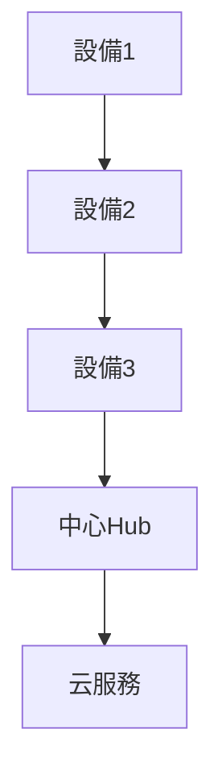
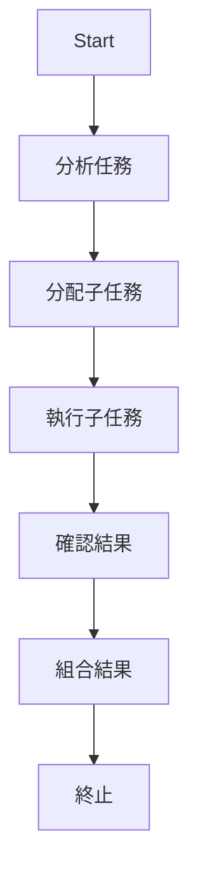
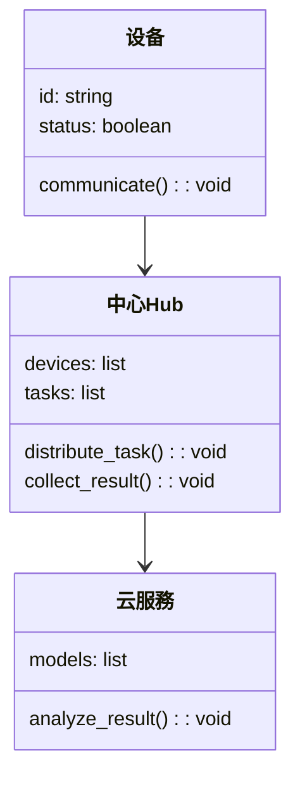
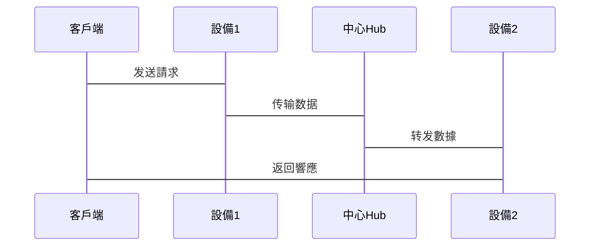

                 


# 跨設備AI Agent：LLM在物聯網環境中的部署

> **关键词**: 跨設備AI Agent, 物聯網, 大語言模型, 跨設備通信, 分布式計算, 智慧系統

> **摘要**: 本文探討如何在物聯網環境中部署跨設備AI Agent，特別是基於大語言模型（LLM）的實現。文章首先介紹背景與核心概念，然後分析算法原理，設計系統架構，並提供項目實戰案例。最終總結最佳實踐與未來方向。

---

# 第一部分: 背景與核心概念

## 第1章: 背景與問題描述

### 1.1 物聯網的發展與挑戰
物聯網（IoT）連接了數十億設備，形成龐大的分布式網絡。然而，設備的異構性、資源受限以及通信延遲等問題，限制了傳統算法的直接應用。

### 1.2 大語言模型（LLM）的崛起
大語言模型（如GPT-3、GPT-4）具備強大的語義理解和生成能力，但其高計算需求使其難以直接在輕量級設備上運行。

### 1.3 跨設備AI Agent的定義與目標
跨設備AI Agent是一種分布式智能體，能夠在多設備之間協作，共同完成複雜任務。其目標是在資源受限的環境中，實現高效的任務分配與數據處理。

---

## 第2章: 核心概念與概念模型

### 2.1 跨設備AI Agent的核心概念
- **智能體**: 具備感知、決策和執行能力的實體。
- **分布式計算**: 在多設備之間分佈計算任務。
- **通信協議**: 跨設備之間進行數據傳遞的規則。

### 2.2 概念模型
以下是跨設備AI Agent的概念模型：



圖表解釋：設備之間通過通信協議（如MQTT、HTTP）進行數據傳遞，最終數據傳輸到中心Hub或雲服務進行集中處理。

---

# 第二部分: 算法原理與實踐

## 第3章: 跨設備AI Agent的算法原理

### 3.1 分布式任務分配算法
以下是分層任務分配的算法原理：



公式解釋：
- 確定性分層算法：$$\text{Task}(x) = \sum_{i=1}^{n} \text{SubTask}(x_i)$$
- 概率性分層算法：$$P(\text{Task}) = \prod_{i=1}^{n} P(\text{SubTask}_i)$$

---

## 第4章: 基於LLM的跨設備數據處理

### 4.1 LLM在物聯網中的數據處理
LLM能夠將設備傳輸的數據進行語義分析，例如：

```python
def semantic_analysis(text):
    # 使用LLM進行語義分析
    return {
        'intent': '智能家居控制',
        'entities': {'device': '冰箱', 'action': '調溫'}
    }
```

公式解釋：
- 概率計算模型：$$P(\text{語義}} | \text{文本}) = \prod_{i=1}^{n} P(w_i | w_{i-1})$$
- 風險評估模型：$$R = \sum_{i=1}^{n} \text{Risk}(x_i) \times P(x_i)$$

---

# 第三部分: 系統架構與設計

## 第5章: 系統架構設計

### 5.1 系統功能模塊
以下是系統功能模塊的實例：



---

## 第6章: 設備間的通信協議

### 6.1 設備間通信協議
以下是設備間通信的示例：



---

# 第四部分: 項目實戰與案例分析

## 第7章: 項目實戰

### 7.1 環境安裝
以下是環境安裝步驟：

```bash
# 安裝依賴
pip install mqtt-python
pip install requests
pip install transformers
```

### 7.2 代碼實現

```python
import mqtt_python
from transformers import GPT2Tokenizer, GPT2Model

# 初始化mqtt客戶端
client = mqtt_python.Client()
client.connect("localhost", 1883)

# 初始化LLM模型
tokenizer = GPT2Tokenizer.from_pretrained("gpt2")
model = GPT2Model.from_pretrained("gpt2")

# 接收數據並處理
def on_message(client, userdata, msg):
    data = msg.payload.decode()
    inputs = tokenizer(data, return_tensors="np")
    outputs = model.generate(inputs.input_ids)
    response = tokenizer.decode(outputs[0])
    print(response)

client.subscribe("iot/devices")
client.on_message = on_message
client.loop_forever()
```

---

## 第8章: 案例分析

### 8.1 智慧家居案例
以下是智慧家居中跨設備AI Agent的實現：

```mermaid
graph TD
    智能音箱 --> 灯泡: 調整亮度
    灯泡 --> 智能門鎖: 解鎖門禁
    智能門鎖 --> 電視: 開啟電視
```

---

# 第五部分: 最佳實踐與未來方向

## 第9章: 最佳實踐

### 9.1 技術實踐建議
- 選擇適合的通信協議（如MQTT、HTTP）
- 確保數據的安全性與隱私性
- 使用輕量化模型以適應資源受限的設備

### 9.2 開發與部署
- 使用容器化技術（如Docker）進行模塊化部署
- 建立測試環境，進行模擬測試

---

## 第10章: 未來方向

### 10.1 技術發展
- 更高效的模型壓縮技術
- 更智能的分布式計算框架

### 10.2 應用拓展
- 更多行業的應用，如工業物聯網、智慧城市等

---

# 總結

跨設備AI Agent的實現離不開物聯網環境和大語言模型的結合。通過本文的探討，我們了解了其背後的算法原理、系統架構，並通過具體案例展示了其實現過程。未來，隨著技術的進步，跨設備AI Agent將在更多領域發揮重要作用。

---

**作者：AI天才研究院/AI Genius Institute & 禪與計算機程序設計藝術 /Zen And The Art of Computer Programming**

