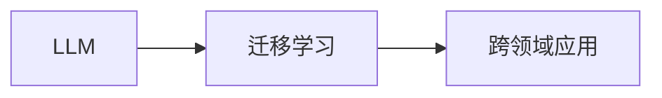
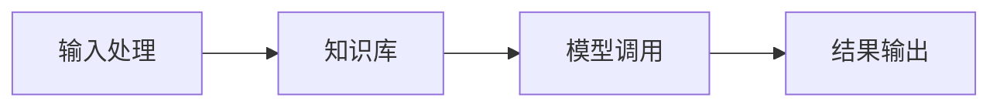

                 


# 跨领域AI Agent：LLM在不同专业领域的迁移学习

**关键词**：跨领域AI Agent，大语言模型，迁移学习，领域适应，知识迁移，模型优化

**摘要**：  
随着大语言模型（LLM）的快速发展，跨领域AI Agent的应用潜力逐渐显现。本文旨在探讨LLM在不同专业领域的迁移学习策略，分析其在法律、医疗、金融等领域的具体应用场景。通过介绍迁移学习的基本原理、算法实现、系统设计以及实际案例，本文将深入剖析LLM如何在跨领域任务中实现高效的知识迁移与应用。

---

## 第1章 背景介绍：AI Agent与迁移学习的背景

### 1.1 AI Agent的基本概念  
AI Agent（人工智能代理）是指能够感知环境、自主决策并执行任务的智能实体。它可以是一个软件程序、机器人或其他智能系统，核心目标是通过与环境交互完成特定目标。AI Agent的关键特征包括：  
1. **自主性**：能够在无需外部干预的情况下自主决策。  
2. **反应性**：能够实时感知环境并做出响应。  
3. **目标导向性**：基于目标驱动行为，优化决策过程。  

### 1.2 LLM的基本原理  
大语言模型（LLM）是以Transformer架构为基础的深度学习模型，通过大量文本数据的预训练，具备强大的语言理解和生成能力。LLM的核心优势在于：  
1. **参数规模**：通常拥有 billions 级别的参数，能够捕捉复杂的语言模式。  
2. **迁移能力**：通过迁移学习，可以在不同领域中快速适应新任务。  

### 1.3 迁移学习的背景  
迁移学习（Transfer Learning）是一种机器学习技术，旨在将从源领域学到的知识迁移到目标领域，以减少目标领域的数据需求和计算成本。在跨领域AI Agent中，迁移学习的作用尤为突出：  
1. **减少数据需求**：在目标领域数据 scarce的情况下，迁移学习可以利用源领域的知识。  
2. **提升泛化能力**：通过跨领域迁移，模型能够更好地应对多样化任务。  

### 1.4 跨领域AI Agent的应用场景  
跨领域AI Agent的应用场景广泛，以下是几个典型领域：  
1. **法律咨询**：通过LLM分析法律文本，提供合同审查、案例分析等服务。  
2. **医疗诊断**：利用迁移学习，将医学知识迁移到疾病诊断和治疗建议中。  
3. **金融分析**：基于历史数据和市场信息，提供股票预测、风险评估等服务。  

---

## 第2章 核心概念：LLM与迁移学习的关系

### 2.1 LLM的结构与工作原理  
LLM的结构通常由编码器（Encoder）和解码器（Decoder）组成，编码器负责将输入文本转化为向量表示，解码器则根据向量生成输出文本。其核心组件包括：  
- **注意力机制（Attention）**：用于捕捉文本中的语义关系。  
- **前馈神经网络（FFN）**：用于对向量进行非线性变换。  

### 2.2 迁移学习的类型与特点  
迁移学习可以分为以下几种类型：  
1. **数据迁移**：直接利用源领域的数据进行训练。  
2. **任务迁移**：将源任务的知识迁移到目标任务。  
3. **领域适应**：通过调整模型参数，使模型适应目标领域。  

### 2.3 跨领域迁移学习的关键技术  
跨领域迁移学习的关键技术包括：  
1. **领域适配技术**：通过调整模型参数或引入领域适配层，使模型适应目标领域。  
2. **知识迁移技术**：通过知识图谱或领域特定规则，实现跨领域的知识共享。  
3. **模型压缩与优化**：在保持性能的同时，减少模型的参数规模，提升计算效率。  

### 2.4 核心概念对比表  
以下是LLM与迁移学习的核心概念对比：  

| 概念 | 描述 | 属性 |
|------|------|------|
| LLM | 大语言模型 | 参数量大，迁移能力强 |
| 迁移学习 | 利用已有知识适应新任务 | 减少数据需求，提升泛化能力 |

### 2.5 ER实体关系图  


---

## 第3章 算法原理：迁移学习的数学模型

### 3.1 迁移学习的基本流程  
1. **数据预处理**：对源领域和目标领域的数据进行清洗和标注。  
2. **特征提取**：利用LLM提取文本的特征表示。  
3. **模型训练**：在源领域数据上预训练模型，然后在目标领域数据上微调。  

### 3.2 参数调整与优化  
在跨领域迁移学习中，模型的参数需要进行适当的调整。假设我们有一个源任务和目标任务，参数调整的目标是最小化目标任务的损失函数。数学表示如下：  
$$ L = L_{\text{source}} + \lambda L_{\text{target}} $$  
其中，$\lambda$ 是调节参数，用于平衡源任务和目标任务的损失。  

### 3.3 模型压缩与优化  
为了减少计算成本，通常会对模型进行压缩。例如，可以使用剪枝技术移除冗余的参数，或者使用低秩分解降低参数维度。  

### 3.4 代码实现  
以下是一个简单的迁移学习代码示例：  
```python
def train_model(model, source_loader, target_loader, num_epochs=10):
    for epoch in range(num_epochs):
        for inputs, labels in source_loader:
            outputs = model(inputs)
            loss = source_criterion(outputs, labels)
            loss.backward()
            optimizer.step()
            
        for inputs, labels in target_loader:
            outputs = model(inputs)
            loss = target_criterion(outputs, labels)
            loss.backward()
            optimizer.step()
    return model
```

---

## 第4章 系统分析：跨领域AI Agent的系统架构

### 4.1 系统功能设计  
跨领域AI Agent的系统功能模块包括：  
1. **输入处理模块**：接收用户输入并解析需求。  
2. **知识库模块**：存储和管理各领域的知识库。  
3. **模型调用模块**：根据需求调用合适的LLM模型。  
4. **结果输出模块**：生成并返回最终的响应。  

### 4.2 系统架构设计  
以下是系统的架构图：  


### 4.3 接口设计  
系统接口包括：  
1. **输入接口**：接收用户的自然语言输入。  
2. **输出接口**：返回生成的文本或结构化数据。  

---

## 第5章 项目实战：LLM在法律领域的迁移应用

### 5.1 环境安装  
需要安装以下工具：  
- Python 3.8+  
- PyTorch 1.9+  
- Hugging Face Transformers库  

### 5.2 系统实现  
以下是代码实现：  
```python
from transformers import AutoTokenizer, AutoModelForMaskedLM
import torch

model_name = "bert-base-uncased"
tokenizer = AutoTokenizer.from_pretrained(model_name)
model = AutoModelForMaskedLM.from_pretrained(model_name)
```

### 5.3 实际案例分析  
通过迁移学习，将法律领域的知识迁移到模型中，可以实现合同审查、案例分析等任务。  

### 5.4 案例分析  
以下是一个法律合同审查的案例：  
1. **输入**：合同文本。  
2. **处理**：模型对合同进行语法和法律条款的分析。  
3. **输出**：生成审查报告，指出潜在的法律风险。  

---

## 第6章 总结与展望

### 6.1 本章小结  
本文详细探讨了跨领域AI Agent与LLM迁移学习的核心概念、算法原理和实际应用。通过理论分析和案例实践，展示了LLM在不同领域的迁移能力。  

### 6.2 未来展望  
随着LLM技术的不断发展，跨领域AI Agent的应用前景广阔。未来的研究方向包括：  
1. **模型优化**：进一步降低模型的计算成本。  
2. **领域扩展**：探索更多领域的迁移学习应用。  
3. **人机协作**：结合人类专家的知识，提升AI Agent的决策能力。  

### 6.3 注意事项  
在实际应用中，需要注意数据隐私和模型的泛化能力，避免过拟合和数据泄漏问题。  

### 6.4 拓展阅读  
推荐阅读以下文献：  
1. "迁移学习：理论与实践"，作者：李航。  
2. "大语言模型的原理与应用"，作者：周明。  

---

## 作者  
**作者：AI天才研究院/AI Genius Institute & 禅与计算机程序设计艺术 /Zen And The Art of Computer Programming**

