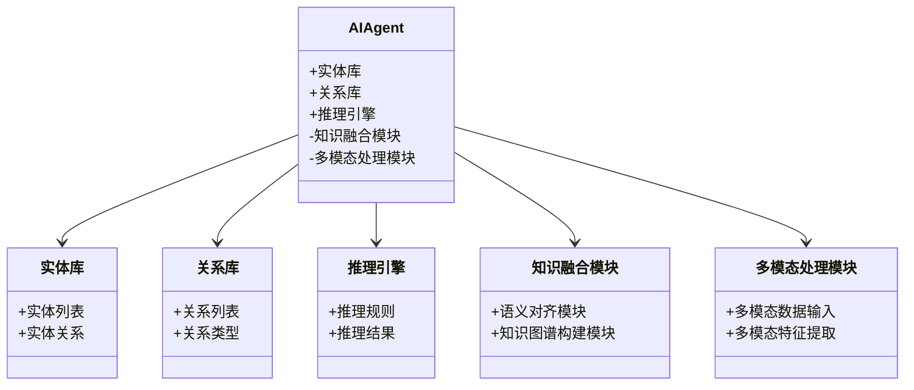
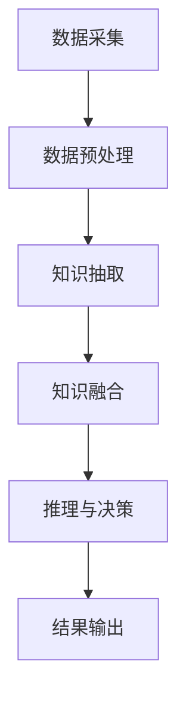

                 


# 跨领域知识融合AI Agent：LLM的跨学科应用

## 关键词：AI Agent、跨领域知识融合、LLM、跨学科应用、多模态数据、知识图谱、大语言模型

## 摘要：  
本文深入探讨了跨领域知识融合AI Agent的核心概念、算法原理及实际应用。通过分析LLM（Large Language Model）在跨学科中的作用，结合知识图谱和多模态数据的处理能力，提出了构建跨领域知识融合AI Agent的系统架构和实现方法。文章还通过实际案例展示了LLM在医疗、法律等领域的跨学科应用，并展望了未来的发展趋势。

---

## 第一部分: 跨领域知识融合的背景与基础

### 第1章: 跨领域知识融合的背景与核心概念

#### 1.1 跨领域知识融合的背景

跨领域知识融合是指将不同学科或领域的知识进行整合，以解决复杂问题或创造新的价值。随着人工智能技术的快速发展，跨领域知识融合的重要性日益凸显。例如，在医疗领域，医生需要结合医学知识和患者的行为数据来制定治疗方案；在法律领域，律师需要综合法律条文和案例数据来辅助判决。然而，不同领域的知识通常以孤立的形式存在，难以直接融合。

AI Agent（人工智能代理）是一种能够感知环境、执行任务并做出决策的智能体。它能够通过与环境交互来获取信息、执行操作并优化目标。AI Agent的核心能力在于理解和处理复杂的信息，这使其成为跨领域知识融合的理想工具。

LLM（Large Language Model）是一种基于大规模数据训练的自然语言处理模型，具有强大的文本理解和生成能力。LLM能够处理多种语言、理解和生成复杂文本，并通过上下文推理解决实际问题。LLM在跨学科应用中的优势在于其能够将不同领域的知识进行语义对齐，从而实现跨领域知识的融合与应用。

#### 1.2 AI Agent的基本概念

AI Agent是一种智能体，能够感知环境、执行任务并做出决策。AI Agent的核心能力包括：

1. **感知能力**：通过传感器或数据源获取环境信息。
2. **推理能力**：基于获取的信息进行逻辑推理和决策。
3. **学习能力**：通过经验或数据不断优化自身的知识和能力。
4. **交互能力**：与用户或其他系统进行自然语言交互。

AI Agent可以分为两类：**反应式AI Agent** 和 **认知式AI Agent**。反应式AI Agent主要基于当前感知的信息做出实时决策，而认知式AI Agent则具备更复杂的推理和规划能力，能够处理长期目标和复杂任务。

#### 1.3 LLM的跨学科应用

LLM（Large Language Model）是一种基于深度学习的自然语言处理模型，具有强大的文本理解和生成能力。LLM在跨学科应用中的优势在于其能够处理多种语言、理解和生成复杂文本，并通过上下文推理解决实际问题。

LLM在跨学科应用中的核心作用包括：

1. **知识整合**：将不同领域的文本数据进行语义对齐，实现知识的跨领域融合。
2. **多模态处理**：结合文本、图像、语音等多种数据形式，提升信息处理能力。
3. **推理与决策**：通过上下文推理和逻辑推理，辅助AI Agent做出更准确的决策。

---

## 第二部分: 跨领域知识融合的核心概念与联系

### 第2章: 跨领域知识融合的机制

#### 2.1 知识表示与知识图谱

知识表示是跨领域知识融合的基础。知识图谱是一种以图结构形式表示知识的工具，由节点（实体）和边（关系）组成。例如，在医疗领域，知识图谱可以表示疾病、症状、药物之间的关系。

**知识图谱的构建过程**：

1. **数据抽取**：从文本、数据库中提取实体和关系。
2. **语义对齐**：将不同来源的知识进行语义对齐，确保一致性。
3. **知识融合**：将多个知识源的数据进行整合，消除冲突。

**跨领域知识图谱的挑战**：

- **语义歧义**：不同领域中相同的术语可能有不同的含义。
- **数据异构性**：不同领域数据的结构和格式差异较大。
- **知识稀疏性**：某些领域的知识可能较为匮乏。

**解决方法**：

- 使用多模态数据进行语义对齐。
- 借助LLM进行上下文推理，消除语义歧义。

#### 2.2 LLM的多模态能力

多模态数据是指同时包含文本、图像、语音等多种数据形式的数据。LLM具备多模态处理能力，能够通过上下文推理将不同模态的数据进行语义对齐。

**多模态数据处理的流程**：

1. **数据预处理**：将不同模态的数据进行标准化处理。
2. **特征提取**：提取各模态数据的特征表示。
3. **融合与推理**：将特征进行融合，并通过LLM进行上下文推理。

**LLM在多模态数据处理中的优势**：

- 能够通过上下文推理将不同模态的数据关联起来。
- 具备强大的语义理解能力，能够处理复杂的语义关系。

#### 2.3 跨领域知识融合的ER实体关系图

ER实体关系图（Entity-Relationship Diagram）是一种用于描述数据模型的工具，常用于数据库设计。在跨领域知识融合中，ER图可以用于描述不同领域实体之间的关系。

**ER实体关系图的构建步骤**：

1. **确定核心实体**：例如，在医疗领域，核心实体可能是“患者”、“疾病”、“药物”。
2. **定义实体关系**：例如，“患者”与“疾病”之间可能有“患病”关系。
3. **绘制ER图**：通过图形化的方式展示实体及其关系。

**跨领域知识融合中的ER图应用**：

- 用于知识图谱的构建和设计。
- 用于跨领域数据的语义对齐。

---

## 第三部分: 跨领域知识融合的算法原理

### 第3章: LLM的训练与优化

#### 3.1 LLM的训练过程

LLM的训练过程通常包括以下几个步骤：

1. **数据准备**：收集和整理大规模多语言文本数据。
2. **模型构建**：选择合适的模型架构，例如Transformer模型。
3. **参数初始化**：随机初始化模型参数。
4. **模型训练**：通过反向传播算法优化模型参数，最小化预测误差。
5. **模型评估**：通过验证集或测试集评估模型的性能。

**LLM的训练目标**：

- 学习输入文本的分布，生成与输入语义一致的输出文本。
- 通过上下文推理，生成符合逻辑的文本。

#### 3.2 多模态融合算法

多模态融合算法的核心在于如何将不同模态的数据进行语义对齐。常见的多模态融合方法包括：

1. **早期融合**：在特征提取阶段将不同模态的数据进行融合。
2. **晚期融合**：在特征提取之后将不同模态的数据进行融合。
3. **混合融合**：结合早期和晚期融合的优点。

**多模态融合的挑战**：

- 不同模态的数据具有不同的特征空间。
- 数据的异构性可能导致融合困难。

**LLM在多模态融合中的应用**：

- 通过上下文推理将不同模态的数据进行语义对齐。
- 通过多模态特征的融合，提升模型的语义理解能力。

---

## 第四部分: 系统分析与架构设计

### 第4章: 跨领域知识融合AI Agent的系统设计

#### 4.1 系统功能设计

跨领域知识融合AI Agent的核心功能包括：

1. **知识抽取**：从多源数据中提取实体和关系。
2. **知识融合**：将不同领域的知识进行语义对齐。
3. **推理与决策**：基于融合后的知识进行推理和决策。

**系统功能设计的ER类图**：



#### 4.2 系统架构设计

跨领域知识融合AI Agent的系统架构可以分为以下几个层次：

1. **数据层**：负责数据的采集和存储。
2. **知识层**：负责知识的抽取和融合。
3. **应用层**：负责推理和决策。

**系统架构设计的流程图**：



---

## 第五部分: 项目实战

### 第5章: 跨领域知识融合AI Agent的实现

#### 5.1 环境配置

**所需工具与库**：

- Python 3.8+
- TensorFlow或PyTorch
- NLTK或spaCy
- 图数据库（例如Neo4j）

#### 5.2 核心代码实现

**知识抽取模块**：

```python
import spacy

nlp = spacy.load("en_core_web_sm")

def extract_entities(text):
    doc = nlp(text)
    entities = []
    for ent in doc.ents:
        entities.append((ent.text, ent.label_))
    return entities
```

**知识融合模块**：

```python
from neo4j import GraphDatabase

class KnowledgeFusion:
    def __init__(self, uri, user, password):
        self.driver = GraphDatabase.driver(uri, auth=(user, password))
    
    def create_entity(self, entity):
        with self.driver.session() as session:
            session.run("CREATE (:Entity {name: $name})", name=entity)
    
    def create_relationship(self, entity1, relationship, entity2):
        with self.driver.session() as session:
            session.run("MATCH (a {name: $a}), (b {name: $b}) CREATE (a)-[r:$relationship]->(b)", 
                        a=entity1, b=entity2, relationship=relationship)
```

#### 5.3 功能解读与案例分析

**案例分析**：

在医疗领域，跨领域知识融合AI Agent可以用于辅助医生诊断。例如，当医生输入患者的症状和病史时，AI Agent可以通过知识图谱快速检索相关疾病，并结合药物数据库提供治疗建议。

**功能解读**：

1. **知识抽取**：从患者的病历中提取实体（如症状、疾病）和关系（如“症状-疾病”关系）。
2. **知识融合**：将抽取的知识与知识图谱中的知识进行融合，消除语义歧义。
3. **推理与决策**：基于融合后的知识，推理出可能的疾病，并推荐最优治疗方案。

---

## 第六部分: 高级应用与未来趋势

### 第6章: 跨领域知识融合的高级应用

#### 6.1 教育领域的应用

跨领域知识融合在教育领域的应用包括：

1. **智能辅导系统**：通过分析学生的学习行为和知识掌握情况，提供个性化的学习建议。
2. **跨学科知识整合**：将不同学科的知识进行整合，帮助学生建立知识体系。

#### 6.2 法律领域的应用

跨领域知识融合在法律领域的应用包括：

1. **案例分析**：通过分析大量法律案例，辅助律师制定诉讼策略。
2. **法律文本理解**：通过自然语言处理技术，理解复杂的法律文本。

#### 6.3 医疗领域的应用

跨领域知识融合在医疗领域的应用包括：

1. **辅助诊断**：通过分析患者的症状和病史，辅助医生诊断疾病。
2. **药物研发**：通过分析大量的医学文献，辅助研究人员发现新的药物。

---

## 作者：AI天才研究院/AI Genius Institute & 禅与计算机程序设计艺术 /Zen And The Art of Computer Programming

