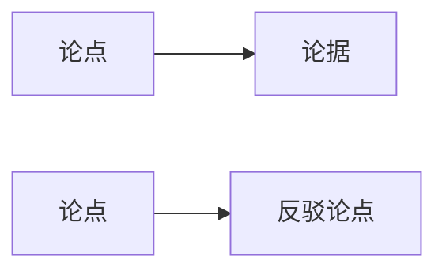
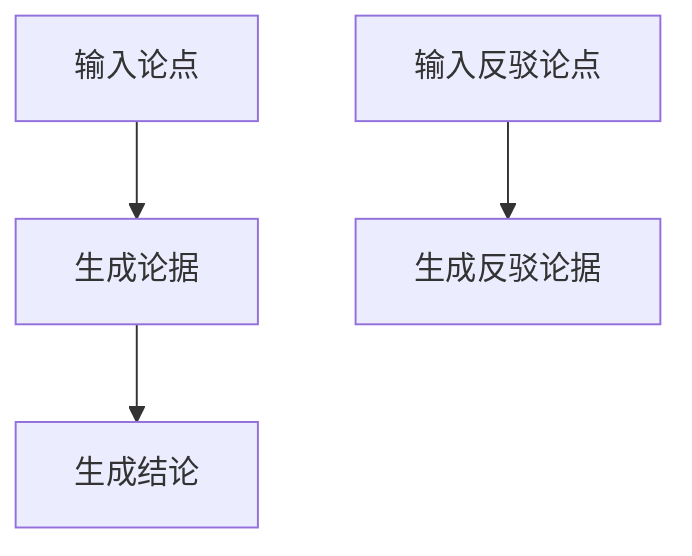
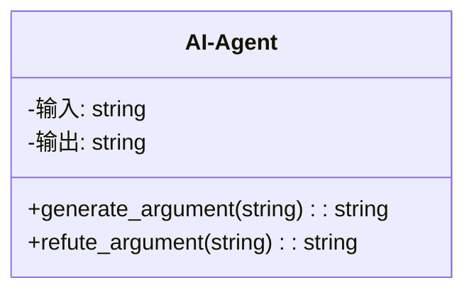
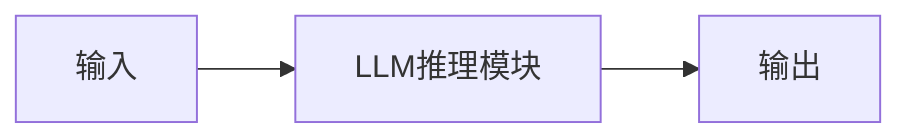
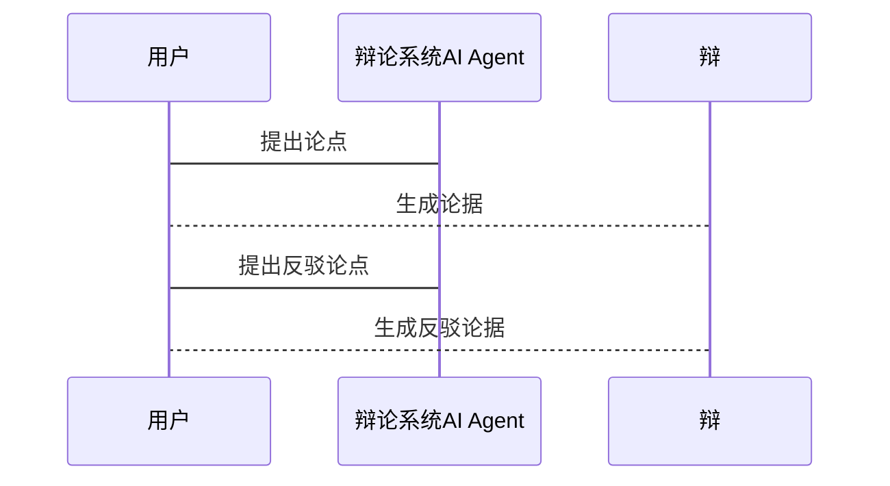

                 


# 辩论系统AI Agent：LLM驱动的论证与反驳能力

> 关键词：AI Agent，LLM，辩论系统，论证，反驳，逻辑推理

> 摘要：本文深入探讨了基于LLM的辩论系统AI Agent的构建与应用。从背景介绍到核心概念，从算法原理到系统架构，再到项目实战和最佳实践，系统性地分析了如何利用LLM实现高效的论证与反驳能力。通过具体的案例分析和代码实现，展示了如何设计和优化一个高效的辩论系统AI Agent。

---

# 第一部分: 背景介绍

# 第1章: 辩论系统AI Agent概述

## 1.1 辩论系统的基本概念

### 1.1.1 辩论系统的核心概念

辩论系统是一种基于逻辑推理和自然语言处理的智能系统，旨在通过AI Agent模拟人类的辩论能力，能够自动生成和反驳论点。其核心在于理解和生成复杂的逻辑结构，从而实现高效的论证与反驳。

### 1.1.2 边界与外延

- 辩论系统专注于逻辑推理和语言生成，不涉及情感分析或图像处理等其他任务。
- 辩论系统可以应用于教育、法律咨询、政策分析等领域。

## 1.2 辩论系统的功能需求

### 1.2.1 功能需求概述

- 自动生成论点和论据
- 反驳对手的论点
- 维护逻辑一致性和 coherence

## 1.3 辩论系统的挑战与边界

- 逻辑推理的复杂性
- 数据质量和多样性的影响
- 计算资源的限制

## 1.4 本章小结

通过本章的介绍，读者可以理解辩论系统的基本概念、功能需求以及面临的挑战，为后续章节的深入分析打下基础。

---

# 第二部分: 核心概念与联系

# 第2章: 辩论系统的核心概念与联系

## 2.1 LLM驱动的论证与反驳能力

### 2.1.1 LLM的基本原理

- 基于大规模预训练的Transformer模型
- 利用自注意力机制捕捉上下文信息
- 通过生成式模型输出自然语言文本

### 2.1.2 LLM在论证中的应用

- 生成支持论点的论据
- 维护逻辑一致性
- 处理复杂语义关系

### 2.1.3 LLM在反驳中的应用

- 分析对手论点的逻辑漏洞
- 生成有效的反驳论据
- 维护反驳的逻辑严谨性

## 2.2 论证与反驳的逻辑结构

### 2.2.1 论证的基本逻辑结构

- 论点（Claim）
- 论据（Evidence）
- 结论（Conclusion）

### 2.2.2 反驳的基本逻辑结构

- 分析对手论点的漏洞
- 提供反面论据
- 得出反驳结论

## 2.3 辩论系统中的实体关系

### 2.3.1 实体关系图

- 论点与论据的关系
- 论点与反驳论点的关系

### 2.3.2 用Mermaid绘制的实体关系图



---

# 第三部分: 算法原理讲解

# 第3章: 辩论系统中的算法原理

## 3.1 LLM的训练与优化

### 3.1.1 LLM的训练目标

- 最小化生成文本与训练数据的分布差异
- 通过交叉熵损失函数优化模型

### 3.1.2 LLM的损失函数

$$ \text{损失函数} = -\sum_{i=1}^{n} \log P(y_i | y_{<i}) $$

### 3.1.3 LLM的优化策略

- 监督学习：直接使用标注数据训练
- 强化学习：通过奖励机制优化生成结果

## 3.2 论证与反驳的逻辑推理

### 3.2.1 论证的逻辑推理过程

1. 识别论点的核心要素
2. 生成支持论点的论据
3. 维护逻辑一致性

### 3.2.2 反驳的逻辑推理过程

1. 分析对手论点的逻辑结构
2. 找出论点中的漏洞
3. 生成有效的反驳论据

### 3.2.3 论证与反驳的逻辑关系

- 论证是构建支持论点的过程
- 反驳是挑战和削弱对手论点的过程

## 3.3 辩论系统的算法流程

### 3.3.1 算法流程图



---

# 第四部分: 系统分析与架构设计

# 第4章: 辩论系统的系统分析与架构设计

## 4.1 问题场景介绍

- 辩论系统需要处理复杂的逻辑推理和语言生成任务
- 系统需要支持实时交互和高效的推理过程

## 4.2 项目介绍

### 4.2.1 项目目标

- 实现一个基于LLM的辩论系统AI Agent
- 提供高效的论证与反驳能力

## 4.3 系统功能设计

### 4.3.1 领域模型设计



### 4.3.2 系统架构设计



### 4.3.3 系统接口设计

- 输入接口：接收论点或反驳论点
- 输出接口：生成论据或反驳论据

## 4.4 系统交互设计

### 4.4.1 系统交互流程图



---

# 第五部分: 项目实战

# 第5章: 辩论系统AI Agent的项目实战

## 5.1 环境配置

- 使用Python 3.8及以上版本
- 安装必要的库：transformers、numpy、torch

## 5.2 系统核心实现

### 5.2.1 代码实现

```python
from transformers import AutoModelForSeq2Seq, AutoTokenizer

model_name = "facebook/pyparticle"
model = AutoModelForSeq2Seq.from_pretrained(model_name)
tokenizer = AutoTokenizer.from_pretrained(model_name)

def generate_argument(prompt):
    inputs = tokenizer.encode(prompt, return_tensors="pt")
    outputs = model.generate(inputs, max_length=50)
    return tokenizer.decode(outputs[0], skip_special_tokens=True)

def refute_argument(prompt):
    inputs = tokenizer.encode(prompt, return_tensors="pt")
    outputs = model.generate(inputs, max_length=50)
    return tokenizer.decode(outputs[0], skip_special_tokens=True)
```

### 5.2.2 代码应用解读与分析

- 使用预训练的LLM模型生成论据和反驳论据
- 通过调整模型参数优化生成结果

## 5.3 项目小结

通过实际案例的分析和代码实现，展示了如何构建一个基于LLM的辩论系统AI Agent，并通过优化实现高效的论证与反驳能力。

---

# 第六部分: 最佳实践

# 第6章: 辩论系统AI Agent的最佳实践

## 6.1 经验与技巧

### 6.1.1 数据质量的重要性

- 使用多样化的训练数据
- 确保数据的逻辑一致性和相关性

### 6.1.2 模型调优技巧

- 调整生成长度和温度参数
- 使用奖励机制优化生成结果

## 6.2 小结

通过本文的介绍，读者可以全面了解基于LLM的辩论系统AI Agent的设计与实现，并掌握相关的最佳实践技巧。

---

# 作者：AI天才研究院/AI Genius Institute & 禅与计算机程序设计艺术 /Zen And The Art of Computer Programming

