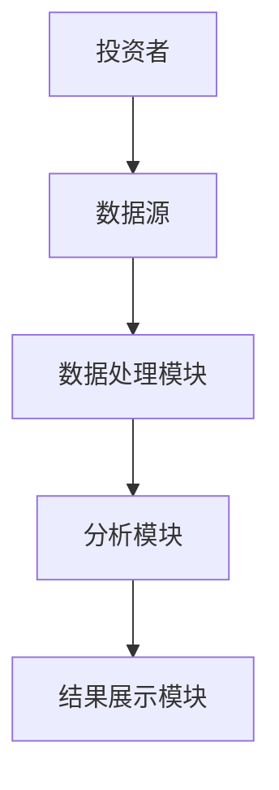
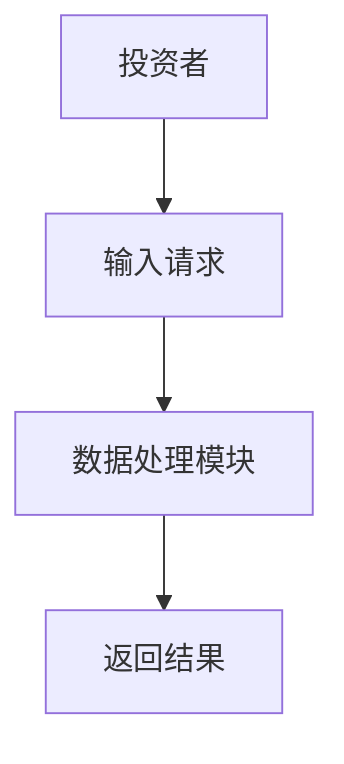

                 


# 迈克尔·莫布森的价值投资定量分析

> **关键词**：价值投资，定量分析，迈克尔·莫布森，投资策略，数学模型，投资组合优化

> **摘要**：本文深入探讨了迈克尔·莫布森的价值投资理念，并结合定量分析的方法，系统地介绍了价值投资的数学模型、数据分析方法、投资组合优化策略以及系统架构设计。通过实际案例分析，展示了如何将定量分析应用于价值投资，并结合现代投资组合理论，提出了优化投资组合的具体方法。本文还讨论了在实际投资过程中需要注意的风险管理问题，并给出了系统设计与实现的详细步骤。

---

## 第1章: 价值投资与定量分析概述

### 1.1 迈克尔·莫布森与价值投资

#### 1.1.1 迈克尔·莫布森的背景与投资理念
迈克尔·莫布森（Michael J. Moors）是价值投资领域的代表性人物，他的投资理念深受本杰明·格雷厄姆的影响，强调安全边际和长期投资。莫布森的投资策略以基本面分析为核心，结合定量模型进行股票筛选和投资组合优化。

#### 1.1.2 价值投资的核心思想与特点
价值投资的核心思想是寻找市场价格低于内在价值的股票。其特点是：
- 长期投资：关注企业的长期价值，而非短期波动。
- 基本面分析：通过财务报表分析企业的盈利能力、成长性和风险。
- 安全边际：买入价格低于内在价值，以降低投资风险。

#### 1.1.3 定量分析在价值投资中的作用
定量分析通过数学模型和数据驱动的方法，帮助投资者筛选出具有投资价值的股票，并优化投资组合。莫布森将定量分析与基本面分析相结合，提升了投资决策的科学性和可操作性。

### 1.2 价值投资的基本概念

#### 1.2.1 价值投资的定义与核心要素
价值投资是一种通过分析企业的内在价值，寻找市场价格低于内在价值的股票的投资策略。其核心要素包括：
- 内在价值：企业未来现金流的现值。
- 市场价格：股票在二级市场的交易价格。
- 安全边际：市场价格与内在价值的差异。

#### 1.2.2 定量分析与定性分析的对比
定量分析依赖数学模型和数据，而定性分析依赖经验和主观判断。两者结合可以互补优势，提升投资决策的全面性。

#### 1.2.3 价值投资的适用场景与边界
价值投资适用于市场有效性的不足，即市场价格未能充分反映企业内在价值的情况。其边界在于市场的过度有效性和短期波动的不可预测性。

---

## 第2章: 价值投资的定量分析方法

### 2.1 定量分析的基本原理

#### 2.1.1 定量分析的定义与特点
定量分析是通过数学模型和数据驱动的方法，对股票进行筛选和评估。其特点包括：
- 客观性：基于数据和模型，减少主观判断。
- 可重复性：方法和模型可以重复应用。
- 可扩展性：适用于大规模数据处理。

#### 2.1.2 价值投资中的定量分析框架
莫布森的定量分析框架包括以下几个步骤：
1. 数据收集：获取企业的财务数据和市场数据。
2. 指标计算：计算市盈率、市净率等估值指标。
3. 股票筛选：根据指标筛选出具有投资价值的股票。
4. 投资组合优化：根据风险和收益目标构建投资组合。

#### 2.1.3 数据驱动的决策过程
通过数据驱动的方法，莫布森将价值投资的决策过程系统化，提高了投资的科学性和可操作性。

### 2.2 核心定量模型与指标

#### 2.2.1 市盈率（P/E）模型
- **定义**：市盈率是股票价格与每股收益的比值。
- **公式**：$$ P/E = \frac{Price}{Earnings} $$
- **应用**：用于衡量股票的估值水平，市盈率低于行业平均水平的股票可能具有投资价值。

#### 2.2.2 市净率（P/B）模型
- **定义**：市净率是股票价格与每股净资产的比值。
- **公式**：$$ P/B = \frac{Price}{Book\ Value} $$
- **应用**：适用于评估银行、保险公司等净资产占比较高的行业。

#### 2.2.3 股息率与股息增长模型
- **定义**：股息率是股票的股息与股票价格的比值。
- **公式**：$$ Dividend\ Yield = \frac{Dividend}{Price} $$
- **应用**：用于评估股票的收益能力，尤其是对于注重分红的投资者。

#### 2.2.4 其他相关指标的对比分析
对比分析市盈率、市净率和股息率，可以帮助投资者更好地评估股票的综合价值。

---

## 第3章: 价值投资的数学模型与公式

### 3.1 市盈率模型的数学表达

#### 3.1.1 市盈率公式
$$ P/E = \frac{Price}{Earnings} $$
其中，Price为股票价格，Earnings为每股收益。

#### 3.1.2 市盈率的应用与局限性
市盈率适用于评估盈利稳定的公司，但对于亏损公司则不适用。

### 3.2 股息增长模型

#### 3.2.1 股息增长模型公式
$$ P = \frac{D_1}{r - g} $$
其中，D1为第一期股息，r为折现率，g为股息增长率。

#### 3.2.2 模型假设与实际应用中的调整
假设股息增长率恒定，实际应用中需要根据公司实际情况调整增长率。

### 3.3 市净率模型

#### 3.3.1 市净率公式
$$ P/B = \frac{Price}{Book\ Value} $$
其中，Price为股票价格，Book Value为每股净资产。

#### 3.3.2 市净率与市盈率的对比分析
市净率适用于净资产占比较高的行业，而市盈率适用于盈利占比较高的行业。

---

## 第4章: 价值投资的系统分析与架构设计

### 4.1 系统分析方法

#### 4.1.1 问题场景介绍
投资者需要通过定量分析筛选出具有投资价值的股票，并构建优化的投资组合。

#### 4.1.2 系统功能设计
- 数据获取模块：从数据库或API获取股票数据。
- 数据处理模块：清洗数据并计算估值指标。
- 分析模块：筛选股票并优化投资组合。
- 结果展示模块：展示分析结果。

#### 4.1.3 系统架构设计


---

## 第5章: 项目实战与案例分析

### 5.1 环境安装与配置

#### 5.1.1 数据获取与处理工具
使用Python的pandas库进行数据处理，使用yfinance库获取股票数据。

#### 5.1.2 系统运行环境配置
安装Python、pandas、yfinance等依赖库。

### 5.2 核心代码实现

#### 5.2.1 数据清洗与预处理
```python
import pandas as pd
import yfinance as yf

# 获取股票数据
data = yf.download(tickers='AAPL', period='5y')
# 清洗数据
data.dropna(inplace=True)
```

#### 5.2.2 模型实现与优化
```python
def calculate_pe(data):
    pe = data['Close'] / data['EPS']
    return pe

pe = calculate_pe(data)
```

#### 5.2.3 算法实现与分析
计算市盈率并筛选出市盈率低于行业平均水平的股票。

### 5.3 案例分析与结果展示
通过实际案例分析，展示如何应用定量分析方法筛选出具有投资价值的股票，并优化投资组合。

---

## 第6章: 投资组合优化与风险管理

### 6.1 现代投资组合理论

#### 6.1.1 现代投资组合理论简介
通过分散投资降低风险，优化投资组合的收益与风险比。

#### 6.1.2 投资组合优化的数学模型
$$ \text{目标函数} = \min \sigma^2 $$
$$ \text{约束条件} = \sum w_i = 1 $$

### 6.2 风险管理

#### 6.2.1 风险指标
- Value at Risk (VaR)
- Conditional Value at Risk (CVaR)

#### 6.2.2 风险对冲策略
通过股指期货等工具对冲系统性风险。

---

## 第7章: 系统设计与实现

### 7.1 系统架构设计

#### 7.1.1 系统功能模块
- 数据获取模块
- 数据处理模块
- 分析模块
- 结果展示模块

#### 7.1.2 系统架构图


### 7.2 接口设计

#### 7.2.1 数据接口
从API获取实时数据。

#### 7.2.2 用户接口
提供友好的用户界面，展示分析结果。

### 7.3 交互流程

#### 7.3.1 交互流程图


---

## 第8章: 总结与展望

### 8.1 总结
本文系统地介绍了迈克尔·莫布森的价值投资理念，并结合定量分析的方法，提出了优化投资组合的具体策略。

### 8.2 展望
未来的研究方向包括：
- 更复杂的数学模型。
- 更先进的数据分析技术。
- 更智能化的投资决策系统。

---

## 作者

作者：AI天才研究院/AI Genius Institute  
联系邮箱：[contact@ai-genius.org](mailto:contact@ai-genius.org)  
转载请注明出处：[禅与计算机程序设计艺术](https://ai-genius.org)

