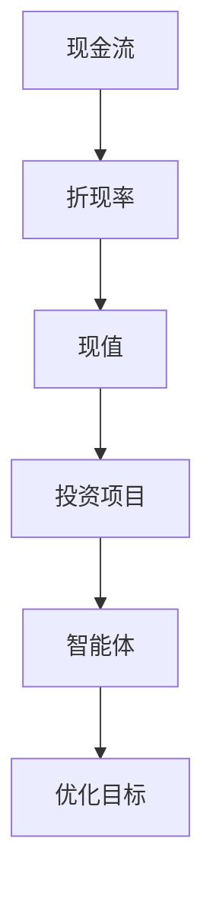
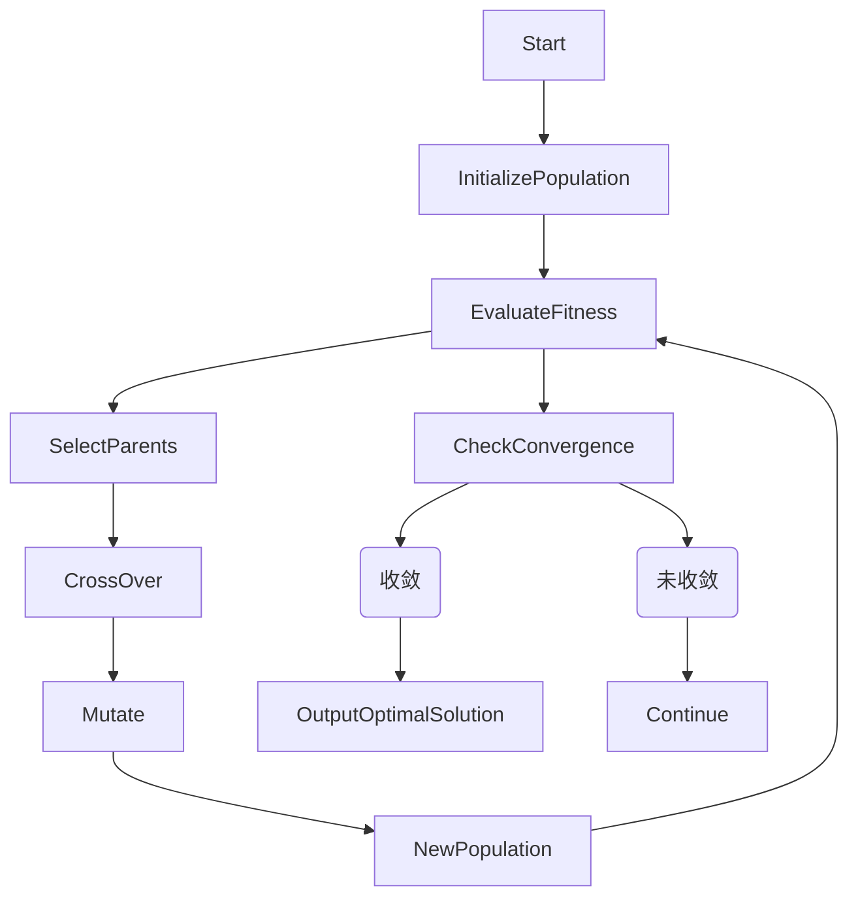
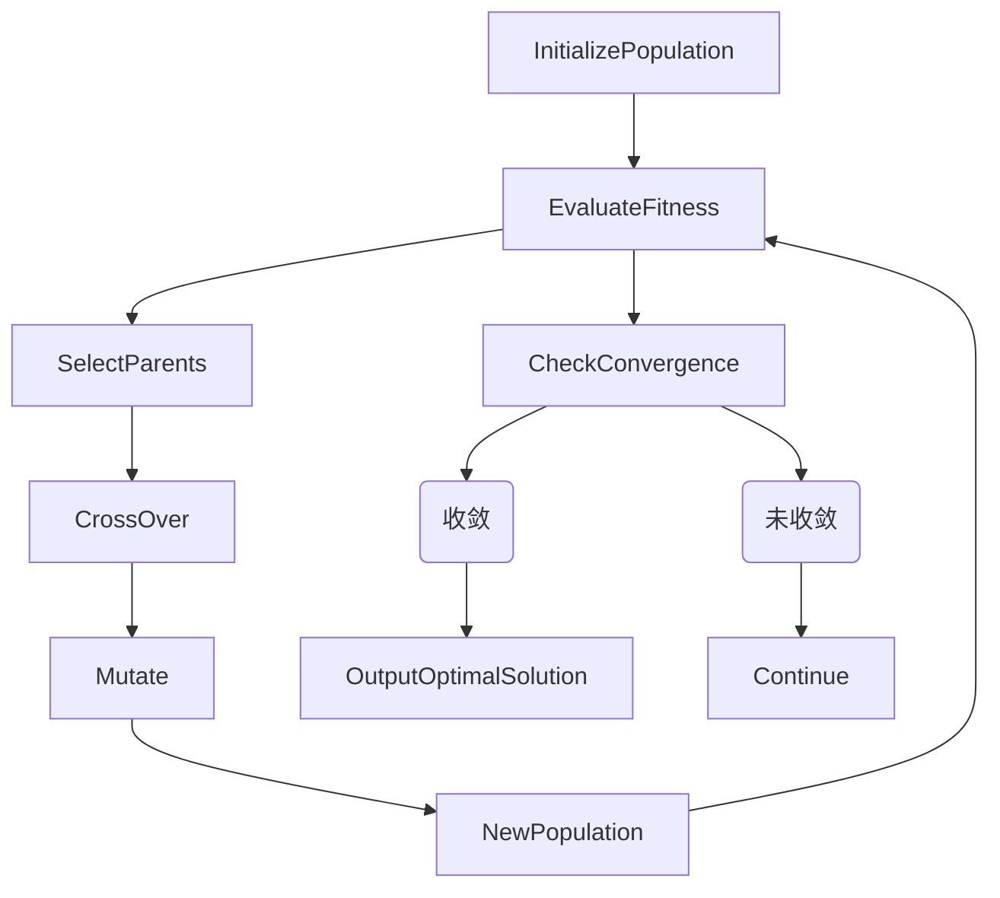
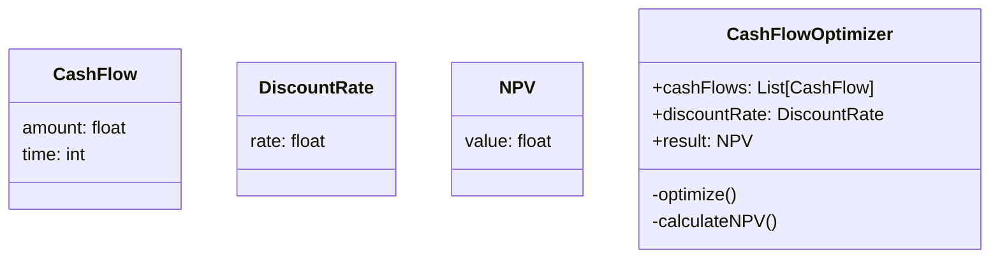
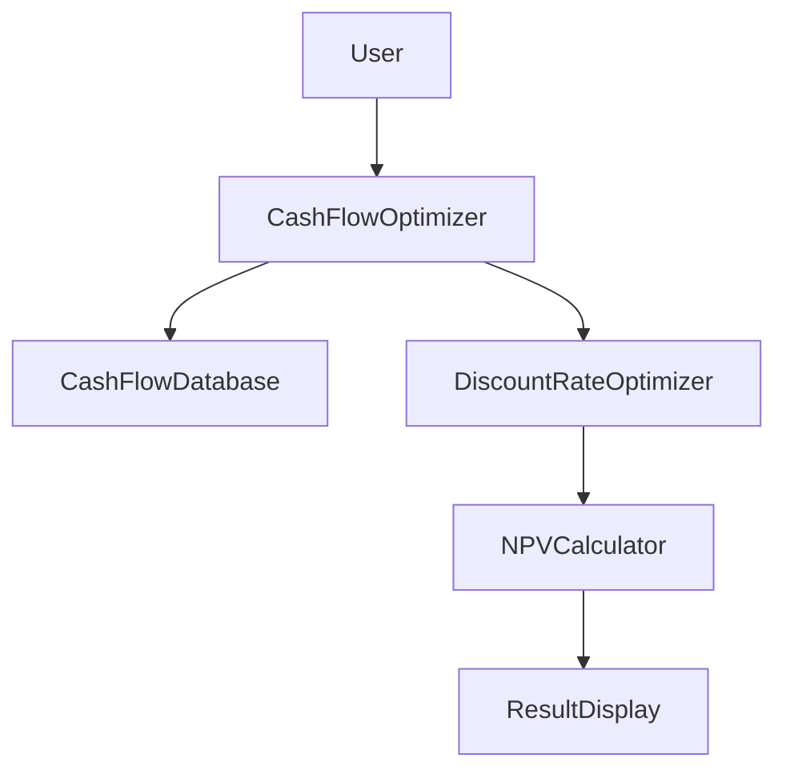
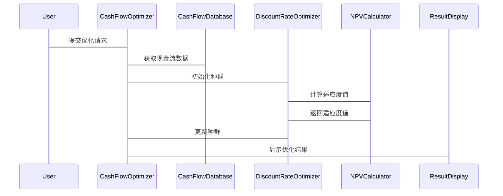

                 


# 《运用AI智能体群体优化现金流折现模型》

---

## 关键词：
现金流折现模型、AI智能体、群体优化、机器学习、财务建模、智能算法

---

## 摘要：
本文深入探讨了如何利用AI智能体的群体优化技术来改进现金流折现模型。通过分析现金流折现模型的传统方法及其局限性，结合AI智能体的群体智能特性，提出了一种基于智能体的优化算法。本文详细阐述了该算法的原理、实现步骤及实际应用，展示了其在财务建模中的优势。通过具体案例分析和系统设计，本文为读者提供了一种高效、准确的现金流预测与评估方法，为现代财务管理提供了新的思路。

---

# 目录大纲

## 第一部分: 背景介绍

### 第1章: 现金流折现模型的背景与问题

#### 1.1 现金流折现模型的背景
- 1.1.1 传统现金流折现模型概述  
  - 现金流的基本定义与分类  
  - 折现模型的数学基础  
  - 现金流折现模型的适用场景  

- 1.1.2 现金流折现模型的应用场景  
  - 投资项目评估  
  - 股权价值评估  
  - 企业并购中的应用  

- 1.1.3 现有模型的局限性与改进方向  
  - 数据依赖性问题  
  - 参数估计的不确定性  
  - 计算复杂性与实时性需求  

#### 1.2 AI智能体群体优化的背景
- 1.2.1 AI智能体的基本概念  
  - 智能体的定义与分类  
  - 群体智能的特征与优势  
  - 智能体在优化问题中的应用  

- 1.2.2 群体智能的基本原理  
  - 群体智能的核心机制  
  - 智能体之间的信息交互  
  - 群体优化的收敛性分析  

- 1.2.3 AI智能体在优化问题中的优势  
  - 并行计算能力  
  - � 强大的全局搜索能力  
  - 自适应性与鲁棒性  

#### 1.3 本章小结
- 1.3.1 现金流折现模型的核心思想  
- 1.3.2 AI智能体群体优化的基本思路  
- 1.3.3 本书的研究目标与意义  

---

## 第二部分: 核心概念与联系

### 第2章: 现金流折现模型的核心概念

#### 2.1 现金流折现模型的定义与组成
- 2.1.1 现金流的定义与分类  
- 2.1.2 折现模型的基本原理  
- 2.1.3 模型的核心要素与关系  

#### 2.2 AI智能体群体优化的基本原理
- 2.2.1 AI智能体的定义与属性  
- 2.2.2 群体智能的优化机制  
- 2.2.3 智能体与现金流折现模型的结合点  

#### 2.3 核心概念的对比分析
- 2.3.1 现金流折现模型与AI智能体的对比  
- 2.3.2 传统优化方法与AI智能体的优劣势对比  
- 2.3.3 群体智能与个体智能的对比  

### 第3章: 现金流折现模型与AI智能体的实体关系分析

#### 3.1 实体关系图（ER图）


#### 3.2 群体智能优化流程图


---

## 第三部分: 算法原理与数学模型

### 第4章: AI智能体群体优化算法的原理与实现

#### 4.1 群体智能算法的概述
- 4.1.1 群体智能算法的基本类型  
  - 遗传算法（Genetic Algorithm）  
  - 蚁群算法（Ant Colony Optimization）  
  - 粒子群优化算法（Particle Swarm Optimization）  

- 4.1.2 群体智能算法的核心步骤  
  - 初始化种群  
  - 计算适应度值  
  - 选择父代  
  - 交叉与变异  
  - 更新种群  

#### 4.2 现金流折现模型的优化目标
- 4.2.1 折现率的优化  
- 4.2.2 现金流预测的优化  
- 4.2.3 模型整体优化  

#### 4.3 基于AI智能体的优化算法实现
- 4.3.1 算法流程图


- 4.3.2 Python实现代码示例  
  ```python
  import random

  def fitness(cash_flows, discount_rate):
      # 计算净现值
      return sum(cf / (1 + discount_rate)**i for i, cf in enumerate(cash_flows))

  def generate_population(size, min_rate, max_rate):
      return [random.uniform(min_rate, max_rate) for _ in range(size)]

  def select_parents(population, fitness_values, k=2):
      # 选择适应度值前k大的个体
      parents = sorted(zip(population, fitness_values), key=lambda x: x[1], reverse=True)[:k]
      return [p[0] for p in parents]

  def crossover(parent1, parent2):
      # 单点交叉
      crossover_point = random.randint(1, len(parent1)-1)
      return parent1[:crossover_point] + parent2[crossover_point:], parent2[:crossover_point] + parent1[crossover_point:]

  def mutate(individual, min_rate, max_rate):
      # 随机变异
      return individual + random.uniform(-0.05, 0.05)

  def optimize(cash_flows, population_size=100, generations=50, min_rate=0.05, max_rate=0.2):
      population = generate_population(population_size, min_rate, max_rate)
      for _ in range(generations):
          fitness_values = [fitness(cash_flows, rate) for rate in population]
          parents = select_parents(population, fitness_values)
          if len(parents) < 2:
              break
          parent1, parent2 = parents[0], parents[1]
          child1, child2 = crossover(parent1, parent2)
          child1 = mutate(child1, min_rate, max_rate)
          child2 = mutate(child2, min_rate, max_rate)
          new_population = population + [child1, child2]
          new_population = new_population[:population_size]
          population = new_population
      best_rate = max(zip(fitness_values, population))[1]
      return best_rate
  ```

#### 4.4 数学模型与公式推导
- 4.4.1 现金流折现的数学公式
$$ NPV = \sum_{t=0}^{n} \frac{CF_t}{(1 + r)^t} $$

- 4.4.2 群体智能优化的目标函数
$$ \text{最大化 } NPV $$

---

## 第四部分: 系统分析与架构设计

### 第5章: 系统分析与架构设计

#### 5.1 问题场景介绍
- 5.1.1 现金流折现模型的优化需求  
- 5.1.2 系统的目标与范围  

#### 5.2 系统功能设计
- 5.2.1 系统功能模块划分  
  - 数据输入与处理模块  
  - 智能体优化模块  
  - 结果展示与分析模块  

- 5.2.2 领域模型类图


#### 5.3 系统架构设计
- 5.3.1 系统架构图


- 5.3.2 系统接口设计  
  - 输入接口：现金流数据、初始折现率范围  
  - 输出接口：优化后的折现率、净现值结果  

#### 5.4 交互序列图


---

## 第五部分: 项目实战

### 第6章: 项目实战与案例分析

#### 6.1 环境安装与配置
- 6.1.1 安装Python与相关库  
  - 安装NumPy、Matplotlib、Scikit-learn  

- 6.1.2 安装与配置开发环境  
  - 安装Jupyter Notebook  
  - 配置代码风格与调试工具  

#### 6.2 系统核心实现
- 6.2.1 现金流数据的读取与处理  
  ```python
  import pandas as pd

  cash_flows = pd.read_csv('cash_flows.csv')
  ```

- 6.2.2 智能体优化算法的实现  
  - 优化函数的定义  
  - 种群的初始化与迭代  

- 6.2.3 结果的可视化与分析  
  - 折现率收敛曲线  
  - 净现值的对比分析  

#### 6.3 实际案例分析
- 6.3.1 案例背景与数据准备  
- 6.3.2 算法实现与参数设置  
- 6.3.3 优化结果与分析  

#### 6.4 项目小结
- 6.4.1 项目实现的关键点  
- 6.4.2 项目中的常见问题与解决方案  
- 6.4.3 项目经验总结  

---

## 第六部分: 最佳实践与小结

### 第7章: 最佳实践与小结

#### 7.1 本章小结
- 7.1.1 现金流折现模型的优化思路  
- 7.1.2 AI智能体群体优化的核心优势  
- 7.1.3 本书的主要内容与结论  

#### 7.2 注意事项与常见问题
- 7.2.1 数据输入的注意事项  
- 7.2.2 算法参数的调整建议  
- 7.2.3 系统性能优化的建议  

#### 7.3 拓展阅读与进一步思考
- 7.3.1 群体智能的其他应用领域  
- 7.3.2 现金流预测的其他优化方法  
- 7.3.3 财务建模的未来趋势  

---

## 作者信息

作者：AI天才研究院/AI Genius Institute & 禅与计算机程序设计艺术 /Zen And The Art of Computer Programming

---

通过以上详细的大纲，您可以根据实际内容进一步填充每一部分的具体内容，确保文章逻辑清晰、结构紧凑、简单易懂，同时深入分析技术原理和本质，撰写一篇高质量的技术博客文章。

