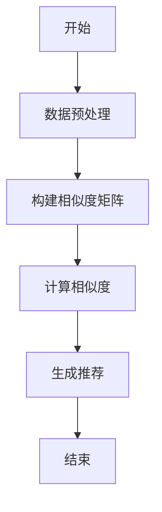
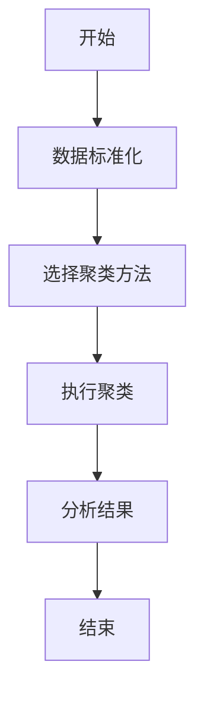
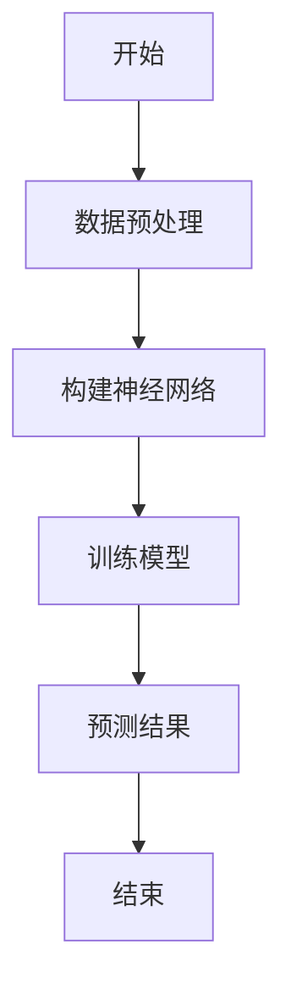
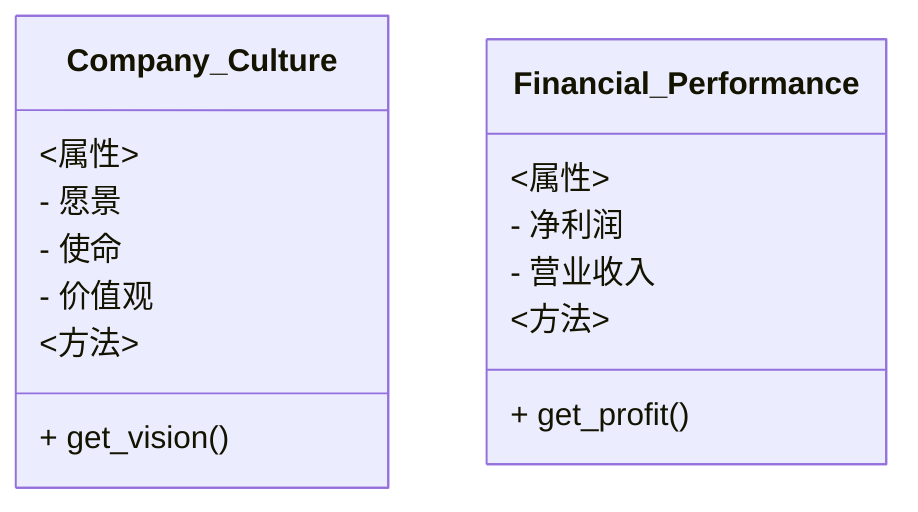

                 


---

# 运用AI智能体群体分析公司文化与财务表现关联

> 关键词：AI智能体，公司文化，财务表现，关联性分析，群体智能，企业绩效，数据分析

> 摘要：本文深入探讨了运用AI智能体群体分析公司文化与财务表现关联的方法与技术。通过系统化的分析框架，结合实际案例，展示了如何利用AI技术从公司文化中提取关键指标，进而预测和优化企业财务表现。文章不仅提供了理论支持，还详细介绍了算法实现和系统架构设计，为企业的智能化管理提供了新的思路。

---

## 第一部分：背景介绍与核心概念

### 第1章：问题背景与问题描述

#### 1.1 问题背景
- 1.1.1 公司文化与财务表现的关联性研究  
  公司文化是企业成功的关键因素之一，但它与财务表现之间的具体关联机制尚未被充分揭示。  
- 1.1.2 AI智能体在企业分析中的应用前景  
  AI技术的进步为企业文化分析提供了新的工具，尤其是群体智能技术的应用，能够更深入地挖掘企业文化的潜在价值。  
- 1.1.3 当前研究的空白与挑战  
  当前研究多关注单一维度的分析，缺乏对文化与财务表现的动态关联性研究，且缺乏系统化的AI解决方案。

#### 1.2 问题描述
- 1.2.1 公司文化的定义与维度  
  公司文化包括愿景、使命、价值观、领导风格、员工关系等多个维度。  
- 1.2.2 财务表现的核心指标  
  财务表现包括净利润、营业收入、资产负债率、现金流等关键指标。  
- 1.2.3 AI智能体群体分析的必要性  
  通过AI智能体群体分析，可以发现企业文化与财务表现之间的隐性关联，为企业决策提供支持。

---

### 第2章：核心概念与问题解决

#### 2.1 核心概念
- 2.1.1 AI智能体的定义与特征  
  AI智能体是具备感知、决策和执行能力的智能系统，能够通过群体协作完成复杂任务。  
- 2.1.2 公司文化的构成要素  
  包括组织结构、管理风格、员工价值观、沟通方式等。  
- 2.1.3 财务表现的关键指标  
  包括盈利能力、成长能力、偿债能力、运营能力等。

#### 2.2 问题解决框架
- 2.2.1 AI智能体群体分析的总体思路  
  通过数据采集、特征提取、关联建模和结果预测，实现对公司文化与财务表现的动态关联分析。  
- 2.2.2 数据收集与处理方法  
  数据来源包括企业年报、员工调查、管理报告等，需进行清洗、转换和特征提取。  
- 2.2.3 关联性分析的实施步骤  
  包括数据预处理、特征选择、模型训练和结果验证。

---

### 第3章：核心概念的边界与外延

#### 3.1 AI智能体的边界
- 3.1.1 智能体的自主性与可控性  
  AI智能体需在可控范围内自主决策，避免偏离预定目标。  
- 3.1.2 智能体的群体行为与个体行为  
  群体行为是基于个体行为的集合，个体行为又受群体行为的影响。  
- 3.1.3 智能体的适应性与学习能力  
  智能体需具备持续学习和适应环境变化的能力。

#### 3.2 公司文化的边界
- 3.2.1 文化与战略的关系  
  公司文化影响战略制定和执行效果。  
- 3.2.2 文化与绩效的互动  
  公司文化通过影响员工行为间接影响财务绩效。  
- 3.2.3 文化与外部环境的关联  
  公司文化需与外部环境相适应，才能发挥最大作用。

#### 3.3 财务表现的外延
- 3.3.1 财务健康状况的多维度评估  
  包括短期偿债能力、长期偿债能力、盈利能力等。  
- 3.3.2 财务表现与企业生命周期的关系  
  不同生命周期阶段的财务表现侧重点不同。  
- 3.3.3 财务表现与市场环境的互动  
  市场环境的变化会影响财务表现，同时也受公司文化的影响。

---

## 第二部分：核心概念与联系

### 第4章：核心概念的结构与组成

#### 4.1 AI智能体群体分析的系统结构
- 4.1.1 系统输入：公司文化数据  
  包括员工满意度、管理风格、组织结构等。  
- 4.1.2 系统处理：智能体分析  
  通过群体智能算法对文化数据进行建模和分析。  
- 4.1.3 系统输出：财务表现预测  
  预测未来财务表现并提出优化建议。

#### 4.2 公司文化与财务表现的关联结构
- 4.2.1 文化维度与财务指标的对应关系  
  比如，开放的沟通文化与高的员工满意度可能与较高的营业收入相关。  
- 4.2.2 关联性分析的数学模型  
  使用相关性分析、回归分析等方法量化文化与财务表现的关联程度。

---

### 第5章：核心概念的属性特征对比与ER实体关系

#### 5.1 属性特征对比
| 核心概念 | 属性特征 |
|----------|----------|
| AI智能体 | 自主性、学习性、协作性 |
| 公司文化 | 价值观、使命、愿景 |
| 财务表现 | 净利润、现金流、负债率 |

#### 5.2 ER实体关系图
```mermaid
er
  actor(AI智能体)
  actor(公司文化)
  actor(财务表现)
  relation(影响)
  relation(关联)
  relation(预测)
```

---

## 第三部分：算法原理

### 第6章：协同过滤算法

#### 6.1 算法原理
协同过滤是一种基于相似性推荐的算法，适用于发现公司文化与财务表现之间的隐性关联。

#### 6.2 算法流程


#### 6.3 Python实现
```python
import numpy as np

def cosine_similarity(a, b):
    return np.dot(a, b) / (np.linalg.norm(a) * np.linalg.norm(b))

# 示例数据
culture_features = np.array([...])
financial_features = np.array([...])

similarity_matrix = cosine_similarity(culture_features, financial_features)
```

---

### 第7章：聚类分析算法

#### 7.1 算法原理
聚类分析用于将公司文化与财务表现进行分组，发现潜在的关联模式。

#### 7.2 算法流程


#### 7.3 Python实现
```python
from sklearn.cluster import KMeans

clusters = KMeans(n_clusters=3).fit_predict(financial_features)
```

---

### 第8章：深度学习模型

#### 8.1 算法原理
深度学习模型（如神经网络）可用于非线性关联分析，捕捉复杂的企业文化与财务表现之间的关系。

#### 8.2 算法流程


#### 8.3 Python实现
```python
import tensorflow as tf

model = tf.keras.Sequential([
    tf.keras.layers.Dense(64, activation='relu'),
    tf.keras.layers.Dense(1, activation='sigmoid')
])
model.compile(optimizer='adam', loss='binary_crossentropy')
model.fit(culture_data, financial_labels, epochs=10)
```

---

## 第四部分：系统分析与架构设计

### 第9章：系统功能设计

#### 9.1 领域模型


#### 9.2 系统架构


#### 9.3 接口设计
- API接口：`GET /api/culture_financial_correlation`

---

## 第五部分：项目实战

### 第10章：环境安装与代码实现

#### 10.1 环境安装
- 安装Python、TensorFlow、Scikit-learn等库。

#### 10.2 核心代码实现
```python
# 数据预处理
def preprocess(data):
    return data.dropna().astype(float)

# 模型训练
def train_model(X_train, y_train):
    model = KMeans(n_clusters=4)
    model.fit(X_train, y_train)
    return model

# 模型预测
def predict(model, X_test):
    return model.predict(X_test)
```

#### 10.3 实际案例分析
以某公司为例，分析其文化数据与财务表现的关联性，并提出优化建议。

---

## 第六部分：最佳实践

### 第11章：小结与注意事项

- 小结：AI智能体群体分析为公司文化与财务表现的关联研究提供了新思路。
- 注意事项：数据质量和模型选择对分析结果影响重大，需谨慎处理。

### 第12章：拓展阅读与未来展望

- 拓展阅读：推荐相关领域的书籍和论文。
- 未来展望：AI技术在企业分析中的深度应用。

---

## 作者信息

作者：AI天才研究院/AI Genius Institute & 禅与计算机程序设计艺术 /Zen And The Art of Computer Programming

