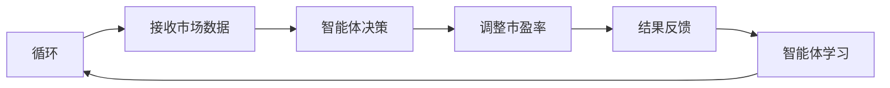
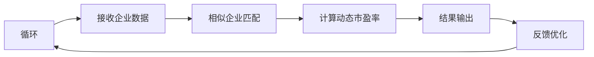
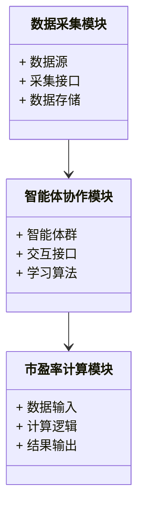
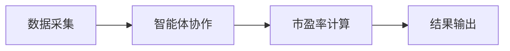

                 


# 运用AI智能体群体实现动态市盈率调整

> 关键词：AI智能体、动态市盈率、群体协作、算法优化、金融市场、实时调整

> 摘要：本文详细探讨了运用AI智能体群体实现动态市盈率调整的技术与方法。通过分析市盈率动态调整的背景与问题，阐述了AI智能体群体的核心概念与联系，详细讲解了相关算法原理，设计了系统的架构方案，并通过项目实战展示了如何实现这一目标。最后，本文总结了AI智能体群体在动态市盈率调整中的优势，并展望了未来的发展方向。

---

# 第一部分: 背景介绍

## 第1章: 动态市盈率调整的背景与问题

### 1.1 问题背景

#### 1.1.1 市盈率的基本概念
市盈率（P/E Ratio）是衡量企业股票价值的重要指标，计算公式为：
$$ P/E = \frac{\text{股票价格}}{\text{每股净利润}} $$

市盈率反映了市场对企业的估值，高市盈率意味着市场对未来盈利增长的预期较高，而低市盈率则可能表示企业处于价值低估状态。

#### 1.1.2 市盈率动态调整的必要性
传统的市盈率计算通常是基于历史数据，无法实时反映市场动态变化。随着市场环境、企业经营状况和外部经济因素的变化，市盈率需要动态调整以保持准确性。

#### 1.1.3 传统市盈率调整方法的局限性
传统方法依赖于手动调整或基于单一模型的预测，存在以下问题：
1. **数据滞后性**：无法实时更新，可能导致估值偏差。
2. **单一模型限制**：无法综合考虑多种因素（如市场情绪、行业趋势等）。
3. **人工干预成本高**：需要大量人工分析和调整，效率低下。

### 1.2 问题描述

#### 1.2.1 动态市盈率调整的目标
动态市盈率调整的目标是实时更新市盈率，使其更准确地反映当前市场状况和企业经营情况。

#### 1.2.2 动态市盈率调整的核心问题
如何在复杂多变的市场环境中，快速、准确地调整市盈率，同时考虑多种动态因素（如市场情绪、行业趋势等）。

#### 1.2.3 动态市盈率调整的边界与外延
- **边界**：市盈率调整仅考虑企业的基本面和市场环境，不涉及企业内部管理等因素。
- **外延**：动态市盈率调整可以与其他金融工具结合，如动态资产配置、风险管理等。

### 1.3 问题解决

#### 1.3.1 AI智能体群体的概念
AI智能体（AI Agent）是指能够感知环境、自主决策并采取行动的智能实体。AI智能体群体则是多个智能体通过协作完成复杂任务的集合。

#### 1.3.2 AI智能体群体在动态市盈率调整中的作用
AI智能体群体能够实时收集、分析和处理数据，快速调整市盈率，同时通过协作优化结果。

#### 1.3.3 AI智能体群体实现动态市盈率调整的优势
1. **实时性**：AI智能体能够快速响应市场变化。
2. **准确性**：通过多智能体协作，提高决策的准确性。
3. **可扩展性**：能够处理大规模数据和复杂场景。

---

## 第2章: 核心概念与联系

### 2.1 核心概念原理

#### 2.1.1 AI智能体群体的定义与特征
- **定义**：AI智能体群体是由多个智能体组成的系统，每个智能体都有明确的目标和任务。
- **特征**：
  1. **自主性**：智能体能够自主决策。
  2. **协作性**：智能体之间能够协作完成复杂任务。
  3. **适应性**：智能体能够根据环境变化调整行为。

#### 2.1.2 动态市盈率调整的数学模型
动态市盈率调整的数学模型可以表示为：
$$ P/E_{\text{动态}} = f(\text{市场数据}, \text{企业数据}, \text{时间因素}) $$

其中，$f$ 是一个动态调整函数，可以根据不同因素调整市盈率。

#### 2.1.3 AI智能体群体与动态市盈率调整的关系
AI智能体群体通过协作和学习，优化动态市盈率调整的准确性和实时性。

### 2.2 核心概念属性特征对比

| **属性**       | **AI智能体群体**                     | **传统市盈率调整方法**                 |
|-----------------|------------------------------------|---------------------------------------|
| 数据处理能力   | 高，能够处理大规模数据             | 低，依赖历史数据                       |
| 决策速度       | 快，实时调整                        | 慢，需要人工干预                     |
| 精确性         | 高，通过协作优化                   | 低，依赖单一模型                      |

### 2.3 ER实体关系图

```mermaid
er
actor: AI智能体
actor: 市场数据源
actor: 企业数据源
```

---

## 第3章: 算法原理讲解

### 3.1 强化学习算法

#### 3.1.1 算法流程



#### 3.1.2 数学模型
强化学习的核心是通过Q-learning算法更新策略：
$$ Q(s, a) = Q(s, a) + \alpha \cdot (r + \gamma \cdot \max Q(s', a') - Q(s, a)) $$

其中：
- $s$ 表示状态
- $a$ 表示动作
- $r$ 表示奖励
- $\alpha$ 表示学习率
- $\gamma$ 表示折扣因子

### 3.2 协同过滤算法

#### 3.2.1 算法流程



#### 3.2.2 数学模型
协同过滤的核心是通过相似性计算：
$$ \text{相似度} = \frac{\sum (x_i - \mu)(y_i - \mu)}{\sqrt{\sum (x_i - \mu)^2} \cdot \sqrt{\sum (y_i - \mu)^2}} $$

---

## 第4章: 系统分析与架构设计方案

### 4.1 系统功能设计

#### 4.1.1 数据采集模块
- **功能**：实时采集市场数据和企业数据。

#### 4.1.2 智能体协作模块
- **功能**：多个智能体协作完成动态市盈率调整。

#### 4.1.3 市盈率计算模块
- **功能**：根据调整后的数据计算动态市盈率。

### 4.2 系统架构设计

#### 4.2.1 系统类图



#### 4.2.2 系统架构图



---

## 第5章: 项目实战

### 5.1 环境安装

- **工具**：Python、TensorFlow、Kafka
- **环境配置**：安装依赖库，配置数据源。

### 5.2 核心代码实现

#### 5.2.1 数据采集模块

```python
import kafka
from kafka import KafkaProducer

class DataCollector:
    def __init__(self, bootstrap_servers):
        self.producer = KafkaProducer(bootstrap_servers=bootstrap_servers)
    
    def send_data(self, data):
        self.producer.send('market_data', value=data)
```

#### 5.2.2 智能体协作模块

```python
from tensorflow import keras

class Agent:
    def __init__(self, model):
        self.model = model
    
    def decide(self, state):
        return self.model.predict(state)
```

#### 5.2.3 市盈率计算模块

```python
def calculate_pe(stock_price, net_income):
    return stock_price / net_income
```

### 5.3 代码应用解读与分析

- **数据采集模块**：通过Kafka实时采集市场数据。
- **智能体协作模块**：使用TensorFlow模型进行决策。
- **市盈率计算模块**：基于调整后的数据计算动态市盈率。

### 5.4 实际案例分析

- **案例背景**：某科技公司股价波动较大，需要动态调整市盈率。
- **实施步骤**：实时采集数据，智能体协作调整，输出动态市盈率。

---

## 第6章: 总结与展望

### 6.1 总结

本文详细探讨了运用AI智能体群体实现动态市盈率调整的技术与方法，通过理论分析和实际案例展示了其优势。

### 6.2 未来展望

未来，AI智能体群体将在金融领域发挥更大的作用，动态市盈率调整将更加智能化和实时化。

---

# 附录

## 附录A: 参考文献

- [1] 强化学习相关文献
- [2] 协同过滤相关文献
- [3] AI智能体相关文献

## 附录B: 工具推荐

- [1] TensorFlow
- [2] Kafka
- [3] Mermaid

---

作者：AI天才研究院/AI Genius Institute & 禅与计算机程序设计艺术 /Zen And The Art of Computer Programming

