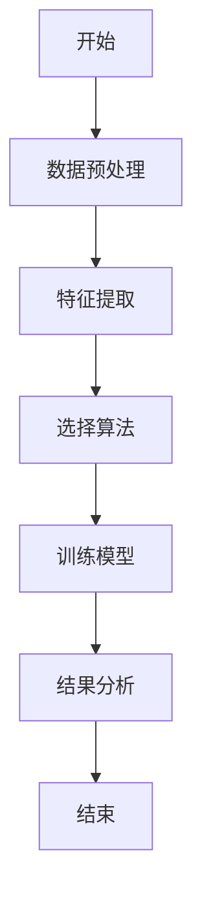

                 


# 运用AI智能体群体实现动态消费者行为分析

## 关键词：AI智能体，消费者行为分析，群体智能，动态分析，协同过滤

## 摘要：本文深入探讨了如何利用AI智能体群体进行动态消费者行为分析，通过系统化的分析框架、算法原理和实际案例，展示了如何利用群体智能技术实时捕捉和分析消费者行为，为企业提供数据驱动的决策支持。

---

## 第1章：动态消费者行为分析的背景与挑战

### 1.1 问题背景

#### 1.1.1 消费者行为分析的传统方法
传统消费者行为分析依赖于问卷调查、焦点小组和销售数据分析，这些方法通常耗时长、成本高，且难以捕捉实时行为数据。

#### 1.1.2 传统方法的局限性
- 数据采集范围有限，难以覆盖全渠道消费者行为。
- 数据分析滞后，无法实时反馈消费者行为变化。
- 消费者行为的动态性未得到充分捕捉。

#### 1.1.3 动态消费者行为分析的重要性
动态分析能够实时捕捉消费者行为变化，帮助企业快速响应市场趋势，优化产品和服务策略。

### 1.2 问题描述

#### 1.2.1 动态消费者行为的定义
动态消费者行为是指消费者在不同时间和场景下表现出的各种行为模式，包括浏览、点击、购买、评论等。

#### 1.2.2 动态消费者行为的特征
- 时间依赖性：行为会随着时间变化。
- 场景多样性：行为发生在不同场景中。
- 数据实时性：需要实时捕捉和分析。

#### 1.2.3 动态消费者行为分析的目标
- 实时监测消费者行为。
- 分析行为模式和趋势。
- 提供数据驱动的决策支持。

### 1.3 问题解决

#### 1.3.1 AI智能体在消费者行为分析中的作用
AI智能体能够实时收集、分析和反馈消费者行为数据，提供动态洞察。

#### 1.3.2 群体智能体的优势
- 分布式计算能力。
- 高度协作。
- 实时响应。

### 1.4 边界与外延

#### 1.4.1 动态消费者行为分析的边界
- 数据采集范围。
- 分析的时间窗口。
- 应用场景限制。

#### 1.4.2 相关概念的外延
- 用户画像。
- 行为预测。
- 个性化推荐。

---

## 第2章：AI智能体群体的核心概念与联系

### 2.1 核心概念原理

#### 2.1.1 AI智能体的基本定义
AI智能体是指能够感知环境并采取行动以实现目标的实体。

#### 2.1.2 群体智能体的协同机制
群体智能体通过通信和协作完成复杂任务。

#### 2.1.3 智能体之间的通信与协作
- 通信协议。
- 协作任务分配。

### 2.2 核心概念属性特征对比

| 属性       | 单个智能体 | 群体智能体 |
|------------|------------|------------|
| 计算能力   | 有限       | 高         |
| 学习能力   | 单一       | 多元       |
| 行为范围    | 独立       | 协作       |

### 2.3 ER实体关系图架构
```mermaid
er
actor: 消费者行为分析系统
entity: 消费者行为数据
relationship: 包含
```

---

## 第3章：动态消费者行为分析的算法原理

### 3.1 算法原理讲解

#### 3.1.1 协同过滤算法
协同过滤通过相似用户或商品推荐相似内容。

#### 3.1.2 聚类分析算法
聚类分析将消费者行为数据分成不同类别。

#### 3.1.3 分类算法
分类算法用于预测消费者行为类别。

### 3.2 算法流程图


### 3.3 Python源代码实现
```python
def collaborative_filtering(data, user):
    # 数据预处理
    pass
```

---

## 第4章：系统分析与架构设计

### 4.1 问题场景介绍

#### 4.1.1 动态消费者行为分析的场景
- 实时监测消费者行为。
- 分析行为模式和趋势。

### 4.2 系统功能设计

#### 4.2.1 领域模型
```mermaid
classDi
```

---

## 第5章：项目实战

### 5.1 环境搭建

#### 5.1.1 Python安装
安装Python和必要的库。

### 5.2 核心代码实现

#### 5.2.1 协同过滤算法实现
```python
def collaborative_filtering(data, user):
    # 实现协同过滤算法
    pass
```

### 5.3 案例分析

#### 5.3.1 案例背景
分析某电商平台的消费者行为数据。

#### 5.3.2 数据分析结果
展示分析结果和业务价值。

### 5.4 项目总结

#### 5.4.1 项目成果
总结项目实现的效果。

#### 5.4.2 经验总结
总结项目实施中的经验教训。

---

## 第6章：最佳实践与小结

### 6.1 最佳实践

#### 6.1.1 数据质量的重要性
确保数据准确性和完整性。

#### 6.1.2 算法选择的策略
根据业务需求选择合适的算法。

### 6.2 小结

#### 6.2.1 核心观点回顾
回顾文章的核心观点。

#### 6.2.2 未来展望
展望动态消费者行为分析的未来发展。

---

## 作者：AI天才研究院/AI Genius Institute & 禅与计算机程序设计艺术 /Zen And The Art of Computer Programming

