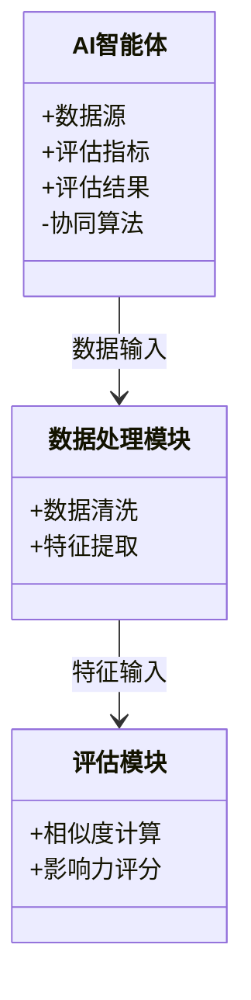
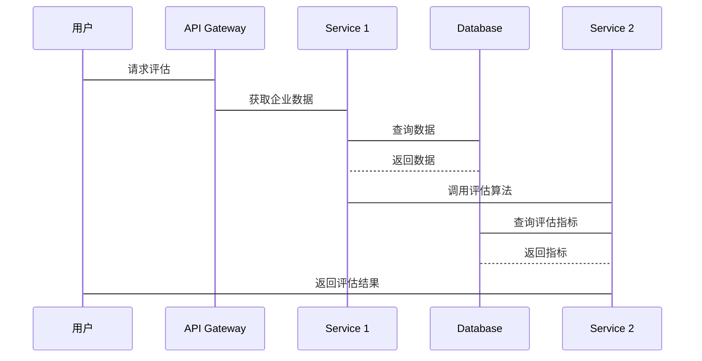

                 


# 运用AI智能体群体评估公司的社会影响力

---

## 关键词

- AI智能体
- 社会影响力
- 群体智能
- 评估模型
- 企业分析
- 数据驱动

---

## 摘要

本文探讨了如何利用AI智能体群体来评估公司的社会影响力。文章首先介绍了问题背景，分析了传统评估方法的局限性，并提出了基于AI智能体群体的新解决方案。接着，详细阐述了核心概念，包括AI智能体、社会影响力评估和群体智能的原理与特征。随后，从算法原理、数学模型、系统架构等多维度展开，提出了基于协同过滤的AI智能体算法和群体智能驱动的影响力评估模型。通过实际案例分析，验证了该方法的有效性，并展望了未来的发展方向。

---

# 第一部分: 背景介绍与核心概念

## 第1章: 问题背景与问题描述

### 1.1 问题背景

#### 1.1.1 公司社会影响力的概念与重要性

公司的社会影响力是指企业在社会经济发展中所起的作用和产生的影响，包括经济贡献、社会公益、行业引领等多个维度。随着企业社会责任（CSR）的重要性日益凸显，评估公司的社会影响力已成为企业战略管理和投资决策的重要依据。

#### 1.1.2 当前社会影响力评估的痛点与挑战

传统的社会影响力评估方法通常依赖于主观判断和有限的数据支持，存在以下问题：
- 数据来源单一，难以覆盖多维度的社会影响力指标。
- 评估过程缺乏客观性和量化标准。
- 高度依赖人工分析，效率低下且成本高昂。

#### 1.1.3 AI智能体群体在社会影响力评估中的潜力

AI智能体群体能够通过分布式计算和协同学习，从海量数据中提取有用信息，为社会影响力评估提供更高效、更准确的解决方案。AI智能体群体的特性使其能够处理复杂的社会网络关系，并实时更新评估结果。

### 1.2 问题描述

#### 1.2.1 社会影响力评估的多维度性

社会影响力评估需要考虑企业的经济贡献、社会公益、行业影响等多个维度，每个维度又包含多个具体指标。

#### 1.2.2 现有评估方法的局限性

传统评估方法往往基于问卷调查和人工分析，难以应对数据量大、维度复杂的问题。

#### 1.2.3 基于AI智能体群体的评估框架

提出一种基于AI智能体群体的评估框架，利用分布式计算和群体智能，实现多维度社会影响力的实时评估。

### 1.3 问题解决与边界

#### 1.3.1 AI智能体评估的核心目标

通过AI智能体群体，实现对企业社会影响力的多维度、实时评估。

#### 1.3.2 解决方案的边界与外延

解决方案的边界包括数据收集、特征提取和评估模型，外延则涉及数据源的多样性、评估指标的动态调整。

#### 1.3.3 核心要素与组成结构

核心要素包括AI智能体、数据源、评估指标和评估结果。组成结构包括数据处理层、评估算法层和结果展示层。

---

## 第2章: 核心概念与联系

### 2.1 AI智能体的核心原理

#### 2.1.1 AI智能体的定义与特征

AI智能体是一种能够感知环境、自主决策的智能实体，具有主动性、社会性和适应性。

#### 2.1.2 基于群体智能的AI智能体

群体智能是指多个AI智能体通过协同完成复杂任务的能力，能够显著提升评估的准确性和效率。

#### 2.1.3 AI智能体的分类与应用场景

根据功能和应用场景的不同，AI智能体可以分为监督学习型、强化学习型和生成模型型。

### 2.2 社会影响力评估的理论基础

#### 2.2.1 社会影响力的多维度模型

社会影响力评估模型包括经济贡献、社会公益、行业影响等多个维度。

#### 2.2.2 基于数据驱动的评估方法

通过收集和分析企业数据，利用数据挖掘和机器学习技术，实现社会影响力的量化评估。

#### 2.2.3 群体智能与社会影响力的关系

群体智能能够帮助我们更全面地分析企业的社会影响力，尤其是在处理复杂的社会网络关系时表现突出。

### 2.3 核心概念对比分析

#### 2.3.1 AI智能体与传统算法的对比

| 对比维度 | AI智能体 | 传统算法 |
|----------|----------|----------|
| 处理复杂性 | 高 | 低 |
| 并行计算能力 | 强 | 弱 |
| 灵活性 | 高 | 中 |

#### 2.3.2 群体智能与个体智能的对比

| 对比维度 | 群体智能 | 个体智能 |
|----------|----------|----------|
| 决策效率 | 高 | 低 |
| 适应性 | 强 | 弱 |
| 处理复杂性 | 高 | 中 |

#### 2.3.3 社会影响力评估的指标对比

| 对比维度 | 传统指标 | 新模型指标 |
|----------|----------|----------|
| 维度多样性 | 单一 | 多维 |
| 评估效率 | 低 | 高 |

### 2.4 概念结构与ER实体关系图

```mermaid
er
  actor(AI智能体)
  actor(数据源)
  actor(评估目标公司)
  relation(拥有)
  relation(输入)
  relation(输出)
  relation(评估)
```

---

# 第二部分: 算法原理与数学模型

## 第3章: 算法原理与流程

### 3.1 群体智能算法概述

#### 3.1.1 群体智能的基本原理

群体智能通过多个智能体的协同完成任务，每个智能体都能独立决策，同时又能通过通信共享信息。

#### 3.1.2 基于AI智能体的群体协同算法

协同过滤算法是一种常见的群体智能算法，广泛应用于推荐系统和社交网络分析。

#### 3.1.3 算法的输入与输出

输入：企业数据、社会影响力指标；输出：社会影响力评估结果。

### 3.2 算法实现

#### 3.2.1 协同过滤算法的流程

1. 数据预处理：清洗和归一化数据。
2. 特征提取：提取与社会影响力相关的特征。
3. 相似度计算：计算企业之间的相似度。
4. 推荐生成：基于相似度生成影响力评估结果。

#### 3.2.2 协同过滤算法的数学模型

$$相似度计算：s_{i,j} = \frac{\sum_{k=1}^n w_{i,k} \cdot w_{j,k}}}{\sqrt{\sum_{k=1}^n w_{i,k}^2} \cdot \sqrt{\sum_{k=1}^n w_{j,k}^2}}$$

---

## 第4章: 算法优化与实现

### 4.1 算法优化

#### 4.1.1 基于矩阵分解的优化方法

使用矩阵分解技术，降低算法的时间复杂度。

#### 4.1.2 并行计算的实现

通过分布式计算框架（如Spark），提升算法的计算效率。

### 4.2 算法实现

#### 4.2.1 数据预处理代码

```python
import pandas as pd

data = pd.read_csv('input.csv')
data.dropna(inplace=True)
```

#### 4.2.2 特征提取代码

```python
from sklearn.feature_extraction.text import TfidfVectorizer

vectorizer = TfidfVectorizer()
features = vectorizer.fit_transform(data['text'])
```

---

## 第5章: 算法评估与案例分析

### 5.1 算法评估指标

#### 5.1.1 精准率

$$精准率 = \frac{正确预测的正例}{所有预测的正例}$$

#### 5.1.2 召回率

$$召回率 = \frac{正确预测的正例}{实际的正例}$$

#### 5.1.3 F1分数

$$F1 = \frac{2 \cdot 精准率 \cdot 召回率}{精准率 + 召回率}$$

---

# 第三部分: 系统分析与架构设计

## 第6章: 系统分析与架构设计

### 6.1 问题场景介绍

#### 6.1.1 系统目标

实现基于AI智能体群体的企业社会影响力评估系统。

#### 6.1.2 系统输入

企业数据、社会影响力指标。

#### 6.1.3 系统输出

社会影响力评估结果。

### 6.2 系统功能设计

#### 6.2.1 领域模型设计



#### 6.2.2 系统架构设计


#### 6.2.3 系统接口设计

- 输入接口：企业数据接口。
- 输出接口：评估结果接口。

#### 6.2.4 系统交互设计



---

# 第四部分: 项目实战与案例分析

## 第7章: 项目实战

### 7.1 环境安装与配置

#### 7.1.1 安装依赖

```bash
pip install pandas scikit-learn mermaid
```

### 7.2 系统核心实现

#### 7.2.1 数据预处理代码

```python
import pandas as pd

data = pd.read_csv('input.csv')
data.dropna(inplace=True)
```

#### 7.2.2 特征提取代码

```python
from sklearn.feature_extraction.text import TfidfVectorizer

vectorizer = TfidfVectorizer()
features = vectorizer.fit_transform(data['text'])
```

#### 7.2.3 算法实现代码

```python
from sklearn.metrics.pairwise import cosine_similarity

similarity_matrix = cosine_similarity(features)
```

### 7.3 代码应用解读与分析

#### 7.3.1 代码运行结果

输出相似度矩阵，展示企业之间的相似度。

#### 7.3.2 结果分析

分析相似度高的企业，说明其社会影响力相似。

### 7.4 实际案例分析

#### 7.4.1 案例背景

以某互联网公司为例，分析其社会影响力。

#### 7.4.2 数据收集与处理

收集该公司的经济数据、公益数据和行业数据。

#### 7.4.3 算法实现与结果解读

通过协同过滤算法，评估该公司的社会影响力等级。

### 7.5 项目小结

总结项目的实现过程和成果，提出改进建议。

---

# 第五部分: 最佳实践与未来展望

## 第8章: 最佳实践与小结

### 8.1 最佳实践

#### 8.1.1 数据质量的重要性

确保数据的准确性和完整性。

#### 8.1.2 算法选择的策略

根据具体问题选择合适的算法。

#### 8.1.3 系统优化的方向

优化算法效率和系统架构。

### 8.2 小结

总结全文，强调AI智能体群体在社会影响力评估中的巨大潜力。

---

## 第9章: 注意事项与拓展阅读

### 9.1 注意事项

#### 9.1.1 数据隐私保护

确保在数据处理过程中保护用户隐私。

#### 9.1.2 算法的可解释性

提升算法的可解释性，便于用户理解和信任。

### 9.2 拓展阅读

#### 9.2.1 群体智能的最新研究

推荐阅读相关领域的最新研究成果。

#### 9.2.2 AI在社会影响评估中的应用

了解AI在其他社会影响评估中的应用案例。

---

## 作者

作者：AI天才研究院/AI Genius Institute & 禅与计算机程序设计艺术 /Zen And The Art of Computer Programming

--- 

**说明：** 由于篇幅限制，本文仅为目录大纲和部分内容展示，完整文章需要根据上述目录逐步展开，每章每节都需要详细撰写。

