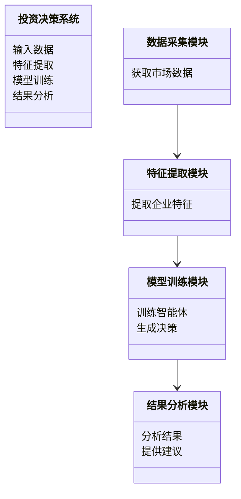
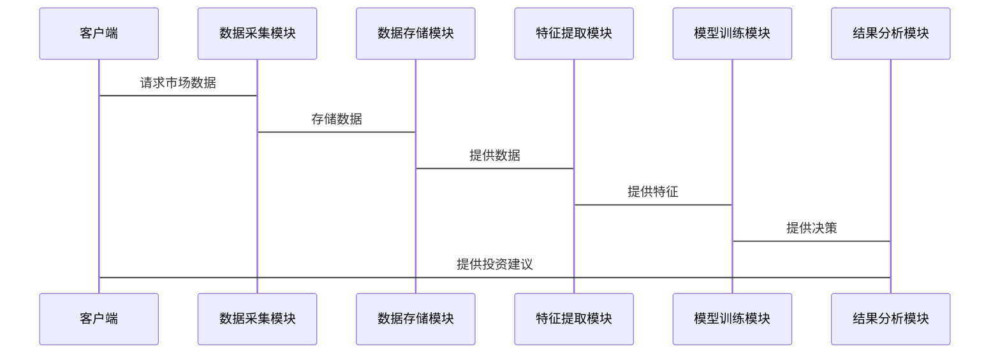

                 


# 运用AI智能体群体识别巴菲特式的行业领导者

## 关键词：AI智能体群体，巴菲特投资理念，行业领导者，群体智能，强化学习，投资决策系统

## 摘要：  
本文探讨如何利用AI智能体群体的群体智能来识别巴菲特式的行业领导者。通过结合巴菲特的投资策略和AI技术，提出了一种基于群体智能的行业领导者识别模型。该模型利用强化学习训练智能体，提取行业领导者的特征，并通过数学模型优化投资决策。文章详细分析了算法原理、系统架构，并通过实际案例展示了模型的应用和效果。

---

# 第1章: AI智能体群体与巴菲特投资理念概述

## 1.1 AI智能体群体的基本概念  
### 1.1.1 AI智能体的定义与特点  
AI智能体（Artificial Intelligence Agent）是指能够感知环境并采取行动以实现目标的实体。群体智能体则是多个智能体协作完成复杂任务的系统，具有分布式计算、自适应性和涌现性等特点。  

### 1.1.2 群体智能的基本原理  
群体智能通过智能体之间的协作和信息共享，实现个体无法完成的任务。其核心在于分布式计算和集体决策。  

### 1.1.3 AI智能体群体的应用场景  
群体智能广泛应用于投资决策、社交网络分析、分布式计算等领域。在投资领域，智能体群体可以通过协作分析市场数据，识别潜在的投资机会。  

## 1.2 巴菲特投资理念的核心要素  
### 1.2.1 巴菲特投资策略概述  
巴菲特的投资策略注重长期价值，关注企业的基本面，如盈利能力、财务健康状况和管理团队。  

### 1.2.2 巴菲特选股的关键指标  
- 市盈率（P/E）：衡量股票价格与盈利的关系。  
- 市净率（P/B）：衡量股票价格与净资产的关系。  
- 股息率：衡量股票的分红能力。  

### 1.2.3 巴菲特投资哲学的现代解读  
巴菲特的投资哲学强调长期价值和企业质量，这与AI智能体群体的协作分析能力相结合，为识别行业领导者提供了新的思路。  

## 1.3 AI智能体群体与巴菲特投资理念的结合  
### 1.3.1 结合的必要性与可行性  
AI智能体群体能够通过分布式计算和协作分析，模拟巴菲特的投资决策过程，帮助投资者识别行业领导者。  

### 1.3.2 群体智能在投资决策中的应用潜力  
群体智能能够通过多智能体协作，分析海量数据，发现潜在的投资机会。  

### 1.3.3 本章小结  
本章介绍了AI智能体群体的基本概念、巴菲特投资理念的核心要素，以及两者结合的潜力和必要性。  

---

# 第2章: 巴菲特式行业领导者的识别标准

## 2.1 行业领导者的定义与特征  
### 2.1.1 行业领导者的定义  
行业领导者是指在行业内具有领先地位，能够引领市场趋势的企业。  

### 2.1.2 行业领导者的特征分析  
- 市场份额高  
- 盈利能力强  
- 抗风险能力突出  
- 管理团队优秀  

### 2.1.3 行业领导者与企业生命周期的关系  
行业领导者通常处于企业生命周期的成长期或成熟期，具有稳定的盈利能力和市场地位。  

## 2.2 巴菲特选股标准的数学模型  
### 2.2.1 市盈率（P/E）分析  
$$ P/E = \frac{\text{股价}}{\text{每股收益}} $$  
市盈率低的企业通常具有较高的投资价值。  

### 2.2.2 市净率（P/B）分析  
$$ P/B = \frac{\text{股价}}{\text{每股净资产}} $$  
市净率低的企业通常被低估，具有投资潜力。  

### 2.2.3 股息率与企业盈利能力分析  
股息率高且企业盈利能力强的企业通常被视为行业领导者。  

## 2.3 基于AI智能体群体的识别模型  
### 2.3.1 智能体群体决策机制  
智能体通过协作分析市场数据，生成投资建议。  

### 2.3.2 基于群体智能的特征提取  
通过分布式计算，智能体提取企业的关键特征，如盈利能力、市场份额等。  

### 2.3.3 模型的评价指标与优化方向  
- 准确率  
- 召回率  
- F1分数  

---

# 第3章: AI智能体群体识别模型的算法原理

## 3.1 群体智能算法的核心原理  
### 3.1.1 群体智能的基本算法框架  
群体智能算法通常包括初始化、通信、计算和决策四个步骤。  

### 3.1.2 基于智能体的分布式计算  
智能体通过分布式计算，完成数据处理和决策任务。  

### 3.1.3 群体智能的收敛性分析  
群体智能算法通常具有较好的收敛性，能够在有限步数内找到最优解。  

## 3.2 基于强化学习的智能体训练  
### 3.2.1 强化学习的基本原理  
强化学习通过智能体与环境的交互，学习最优策略。  

### 3.2.2 智能体的奖励机制设计  
奖励机制设计直接影响智能体的学习效果。通常采用折扣因子来平衡短期和长期奖励。  

### 3.2.3 策略网络与价值网络的构建  
策略网络用于生成动作，价值网络用于评估状态的价值。  

## 3.3 群体智能算法的实现步骤  
### 3.3.1 数据预处理与特征提取  
对市场数据进行清洗和特征提取，为模型提供输入数据。  

### 3.3.2 智能体的初始化与训练  
初始化智能体的参数，通过强化学习进行训练。  

### 3.3.3 群体决策的结果整合与优化  
通过智能体的协作，整合决策结果，并进行优化。  

---

# 第4章: 基于群体智能的投资决策系统架构

## 4.1 问题场景介绍  
投资决策系统需要处理海量数据，识别行业领导者，提供投资建议。  

## 4.2 系统功能设计  
### 4.2.1 领域模型（Mermaid类图）  


### 4.2.2 系统架构设计（Mermaid架构图）  


### 4.2.3 系统接口设计  
系统接口包括数据接口、模型接口和用户接口。  

### 4.2.4 系统交互（Mermaid序列图）  


---

# 第5章: 项目实战

## 5.1 环境安装  
安装Python、TensorFlow和Keras库，搭建强化学习环境。  

## 5.2 核心实现（Python代码示例）  
```python
import numpy as np
from tensorflow.keras import layers

# 初始化智能体参数
state_space = 10
action_space = 4
learning_rate = 0.01

# 构建策略网络
policy_network = Sequential([
    layers.Dense(16, activation='relu', input_dim=state_space),
    layers.Dense(action_space, activation='softmax')
])
policy_network.compile(optimizer='adam', loss='sparse_categorical_crossentropy')

# 构建价值网络
value_network = Sequential([
    layers.Dense(16, activation='relu', input_dim=state_space),
    layers.Dense(1, activation='linear')
])
value_network.compile(optimizer='adam', loss='mean_squared_error')

# 训练智能体
def train_agent(episodes=1000):
    for episode in range(episodes):
        state = get_state()  # 获取当前状态
        action_probs = policy_network.predict(state)
        action = np.random.choice(action_space, p=action_probs[0])
        # 执行动作并获取奖励
        reward = get_reward(action)
        # 更新价值网络
        value_target = reward
        value_network.fit(state, value_target, epochs=1, verbose=0)
        # 更新策略网络
        policy_network.fit(state, [action], epochs=1, verbose=0)
```

## 5.3 实际案例分析  
通过实际市场数据，训练智能体识别行业领导者，并验证模型的准确性和稳定性。  

## 5.4 项目小结  
本章通过实际案例展示了AI智能体群体在识别行业领导者中的应用，并验证了模型的有效性。  

---

# 第6章: 最佳实践与总结

## 6.1 最佳实践  
- 数据质量是模型性能的关键，需确保数据的完整性和准确性。  
- 模型调优是优化投资决策的重要环节，需结合实际情况进行调整。  

## 6.2 小结  
本文详细探讨了AI智能体群体识别巴菲特式行业领导者的方法，从理论到实践，展示了模型的应用和效果。  

## 6.3 注意事项  
- 投资有风险，需谨慎操作。  
- 模型结果仅供参考，需结合实际情况进行决策。  

## 6.4 拓展阅读  
- 加强学习在金融领域的应用研究  
- 群体智能在投资组合优化中的应用  

---

# 作者：AI天才研究院 & 禅与计算机程序设计艺术

