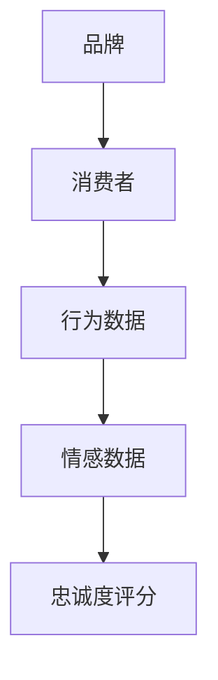
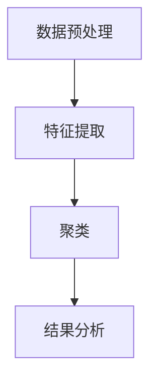
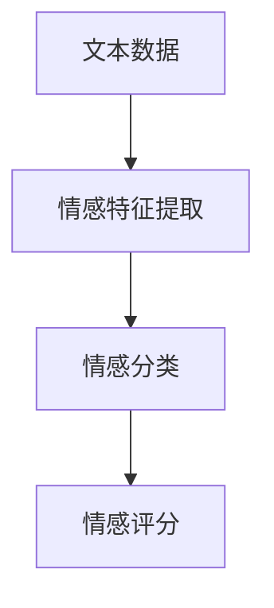
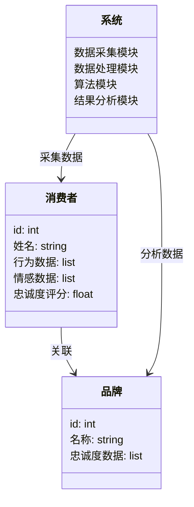
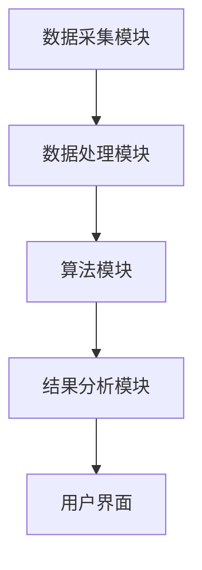
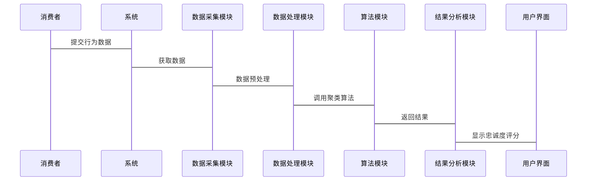

                 


# 运用AI智能体群体量化品牌忠诚度

## 关键词：品牌忠诚度，AI智能体，群体智能，量化分析，情感分析，聚类分析

## 摘要：  
随着人工智能技术的飞速发展，品牌忠诚度的量化分析已成为企业提升客户满意度和市场竞争力的关键。本文通过引入AI智能体和群体智能的概念，提出了一种基于智能体群体的品牌忠诚度量化方法。文章首先介绍了品牌忠诚度的定义及其在企业中的重要性，然后详细阐述了AI智能体和群体智能的基本原理。接着，从算法原理、系统架构设计、项目实战等多个维度深入探讨了如何利用AI技术量化品牌忠诚度。通过具体案例分析，展示了该方法的实际应用价值，并总结了未来的发展方向。

---

# 第一部分: 背景与问题分析

## 第1章: 品牌忠诚度的量化与AI应用背景

### 1.1 品牌忠诚度的定义与重要性

#### 1.1.1 品牌忠诚度的定义  
品牌忠诚度是指消费者对某一品牌产品或服务的长期偏好和持续购买行为。一个高度忠诚的消费者通常会在多个选择中优先选择该品牌，并在面对竞争对手时表现出更强的购买倾向。

#### 1.1.2 品牌忠诚度对企业价值的影响  
品牌忠诚度高的消费者通常具有更高的消费频率、更大的消费金额以及更强的抗干扰能力。此外，忠诚的消费者还会通过口碑传播为品牌带来更多的潜在客户，从而降低企业的营销成本。

#### 1.1.3 当前品牌忠诚度测量的挑战  
传统的品牌忠诚度测量方法主要依赖于问卷调查和数据分析，存在耗时长、成本高、结果不够精准等问题。此外，消费者行为的复杂性和多样性使得传统的测量方法难以捕捉到实时的动态变化。

### 1.2 AI智能体与群体智能的背景

#### 1.2.1 AI智能体的基本概念  
AI智能体（Artificial Intelligence Agent）是指能够感知环境、自主决策并采取行动以实现特定目标的智能系统。AI智能体可以根据环境反馈不断优化自身的决策策略。

#### 1.2.2 群体智能的定义与特点  
群体智能是指通过多个智能体协同工作，利用群体行为的涌现特性来完成复杂任务。群体智能具有分布式、自组织、去中心化等特点，能够在复杂环境中实现高效的信息处理和问题解决。

#### 1.2.3 AI智能体在群体智能中的作用  
AI智能体作为群体智能的核心单元，通过分布式计算和协同学习，能够实现复杂问题的群体决策和优化。群体智能的优势在于能够利用多个智能体的多样性来提高整体的智能水平。

### 1.3 问题背景与目标

#### 1.3.1 传统品牌忠诚度测量方法的局限性  
传统方法依赖于静态数据和问卷调查，难以捕捉消费者行为的实时动态变化。此外，传统方法往往忽略了消费者行为的复杂性和多样性。

#### 1.3.2 基于AI智能体群体的量化优势  
AI智能体群体能够通过实时数据采集、分布式计算和协同学习，动态量化消费者对品牌的忠诚度。这种量化方法不仅高效，还能捕捉到消费者行为的细微变化。

#### 1.3.3 本书的研究目标与范围  
本书旨在通过AI智能体群体的方法，提出一种动态量化品牌忠诚度的新方法。研究范围包括算法设计、系统实现和实际应用案例分析。

---

## 第2章: 问题描述与解决方案

### 2.1 品牌忠诚度量化的核心问题

#### 2.1.1 数据获取与处理的挑战  
品牌忠诚度的量化需要整合消费者的行为数据、情感数据和社交数据。这些数据往往分散在不同的平台，且格式多样，处理难度较大。

#### 2.1.2 群体智能算法的设计难点  
群体智能算法需要设计高效的通信机制和协同策略，以确保多个智能体能够协同工作并快速收敛到最优解。

#### 2.1.3 结果分析与应用的障碍  
品牌忠诚度的量化结果需要具有可解释性和可操作性，才能为企业决策提供有效的支持。

### 2.2 AI智能体群体量化的方法论

#### 2.2.1 数据驱动的量化模型  
通过收集消费者的行为数据和情感数据，利用机器学习算法构建品牌忠诚度的量化模型。

#### 2.2.2 群体智能算法的选择与优化  
选择适合的群体智能算法（如PSO、ACO等），并对其进行优化，以提高算法的效率和准确性。

#### 2.2.3 结果的可解释性与应用性  
量化结果需要能够被企业理解和应用，以便制定有效的市场策略。

### 2.3 解决方案的边界与外延

#### 2.3.1 解决方案的适用场景  
适用于需要实时动态监测品牌忠诚度的场景，如线上零售、社交媒体等领域。

#### 2.3.2 解决方案的局限性  
目前的算法在处理大规模数据时可能存在计算效率的问题，且模型的可解释性有待进一步提高。

#### 2.3.3 解决方案的未来发展方向  
未来可以进一步优化算法，引入深度学习技术，提高模型的准确性和可解释性。

---

## 第3章: 核心概念与联系

### 3.1 核心概念的原理

#### 3.1.1 AI智能体的基本原理  
AI智能体通过感知环境、决策和行动来实现目标。其核心是状态表示、目标函数和行动选择机制。

#### 3.1.2 群体智能的核心机制  
群体智能通过个体智能体的协同行为，实现群体智能的整体目标。其核心机制包括通信、协调和协同。

#### 3.1.3 品牌忠诚度的量化模型  
量化模型基于消费者的行为数据和情感数据，利用机器学习算法进行预测和评估。

### 3.2 核心概念的属性特征对比

| **属性**       | **AI智能体**          | **群体智能**          |
|-----------------|----------------------|----------------------|
| 智能体数量     | 单个                 | 多个                 |
| 决策方式       | 中央化               | 分布式               |
| 优化目标       | 单一目标             | 多个目标             |
| 稳定性         | 较高                 | 较低                 |

### 3.3 ER实体关系图架构



### 3.4 算法原理讲解

#### 3.4.1 聚类分析算法



#### 3.4.2 情感分析算法



### 3.5 数学模型与公式

#### 3.5.1 聚类分析的数学模型
$$
d(x_i, x_j) = \sqrt{(x_i - x_j)^2}
$$

#### 3.5.2 情感分析的数学模型
$$
p(y|x) = \frac{P(y|x_1) \cdot P(x_2|y) \cdot ...}{P(x)}
$$

---

## 第4章: 系统架构设计

### 4.1 问题场景介绍  
本系统旨在实时监测和量化消费者对品牌的忠诚度，帮助企业制定精准的市场策略。

### 4.2 系统功能设计

#### 4.2.1 领域模型


#### 4.2.2 系统架构


#### 4.2.3 系统接口设计  
系统接口包括数据输入接口、算法调用接口和结果输出接口。

#### 4.2.4 系统交互


---

## 第5章: 项目实战

### 5.1 环境安装与配置

```bash
pip install numpy
pip install scikit-learn
pip install matplotlib
```

### 5.2 核心代码实现

```python
from sklearn.cluster import KMeans
from sklearn.preprocessing import StandardScaler
import pandas as pd
import numpy as np

# 数据预处理
data = pd.read_csv('consumer_data.csv')
scaled_data = StandardScaler().fit_transform(data)

# 聚类分析
model = KMeans(n_clusters=3, random_state=0)
model.fit(scaled_data)

# 获取聚类结果
labels = model.labels_
print(labels)
```

### 5.3 实际案例分析  
以某电商平台为例，分析消费者对品牌A和品牌B的忠诚度。

---

## 第6章: 总结与展望

### 6.1 最佳实践 tips  
- 数据质量是模型准确性的关键，需确保数据的完整性和代表性。
- 算法的选择应根据实际场景灵活调整，避免盲目追求复杂性。

### 6.2 小结  
本文通过AI智能体和群体智能的方法，提出了一种动态量化品牌忠诚度的新方法。该方法在理论上具有创新性，在实践中也具有可操作性。

### 6.3 注意事项  
- 数据隐私和安全问题需高度重视。
- 模型的可解释性和透明度需要进一步优化。

### 6.4 拓展阅读  
推荐阅读《群体智能：算法与应用》和《机器学习实战》。

---

## 作者：AI天才研究院 & 禅与计算机程序设计艺术

