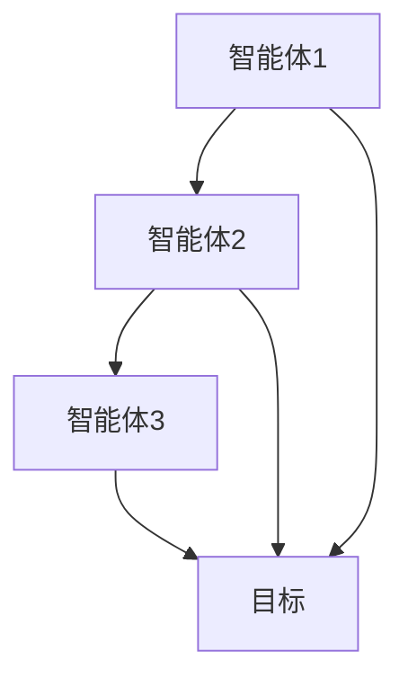
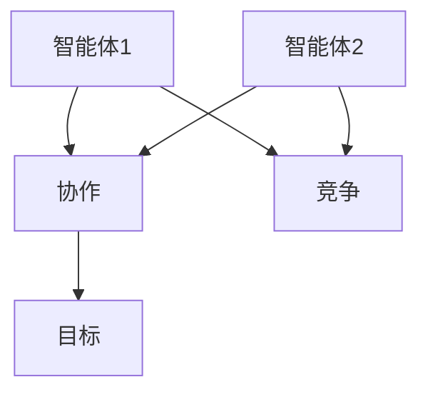
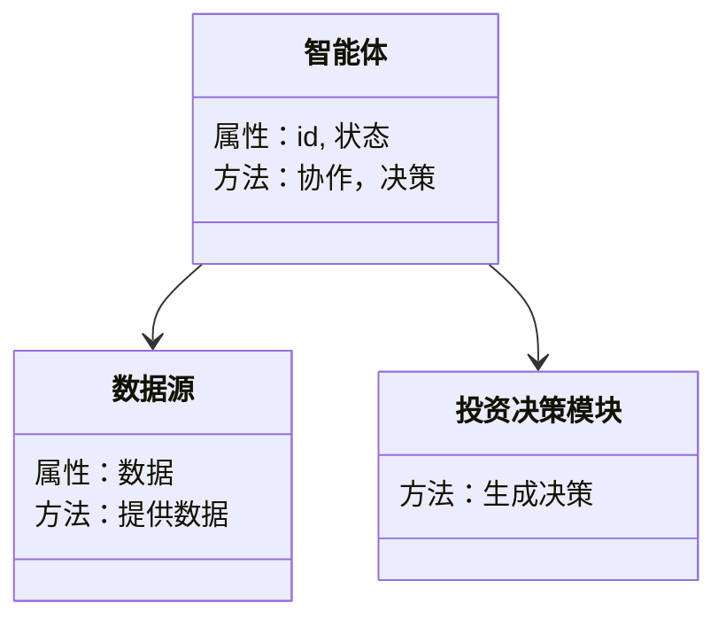
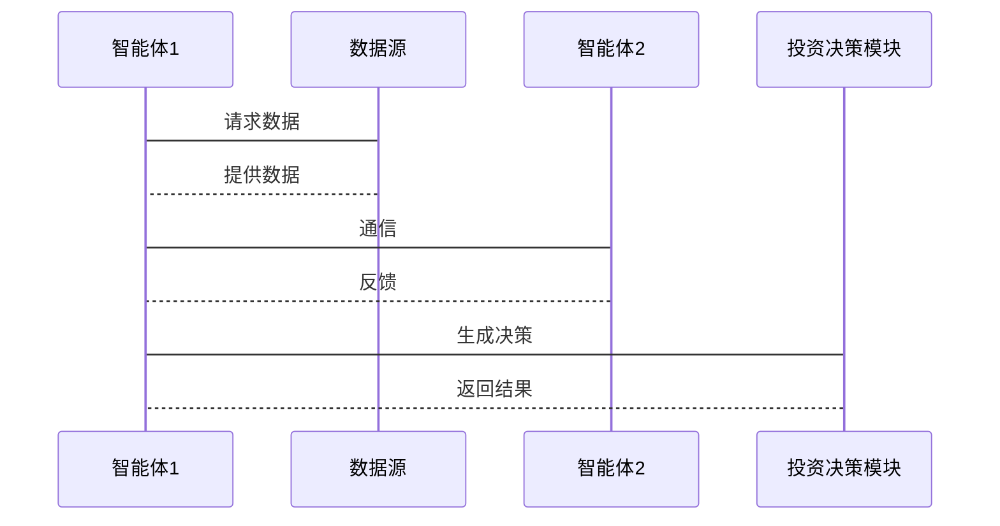

                 


# 运用多智能体AI优化巴菲特的行业集中度分析

> 关键词：多智能体AI，巴菲特，行业集中度分析，投资策略，金融数据分析

> 摘要：本文通过结合多智能体人工智能技术与巴菲特的行业集中度分析方法，提出了一种优化的投资策略分析框架。通过详细阐述多智能体AI的核心概念、算法原理、系统设计与实现，本文旨在探索如何利用AI技术提升行业集中度分析的效率与准确性。文章结合实际案例分析，展示了多智能体AI在金融投资领域的应用潜力，并为读者提供了从理论到实践的完整指导。

---

# 第1章: 多智能体AI与巴菲特投资方法概述

## 1.1 多智能体AI的基本概念

### 1.1.1 多智能体系统的定义与特点

多智能体系统（Multi-Agent System, MAS）是由多个智能体组成的系统，这些智能体能够通过协作完成复杂任务。其特点包括：

1. **自主性**：每个智能体都能独立决策。
2. **反应性**：智能体能够实时感知环境并做出反应。
3. **协作性**：智能体之间通过通信和协作完成共同目标。
4. **分布性**：任务分布在多个智能体之间，避免单点依赖。

### 1.1.2 多智能体AI的核心优势

1. **分布式计算能力**：通过多个智能体协作，提升计算效率。
2. **灵活性**：智能体可以动态调整策略，适应环境变化。
3. **容错性**：单个智能体故障不影响整体系统运行。

### 1.1.3 多智能体AI在金融领域的应用潜力

在金融领域，多智能体AI可以用于股票分析、风险评估、投资组合优化等场景。其分布式协作能力能够帮助投资者快速捕捉市场机会。

## 1.2 巴菲特投资方法的核心理念

### 1.2.1 巴菲特的行业集中度分析方法

巴菲特的投资方法强调对行业的深度研究和集中投资，通过分析行业集中度来判断行业的竞争格局和投资价值。

### 1.2.2 巴菲特投资的三大核心原则

1. **长期投资**：避免频繁交易，降低交易成本。
2. **行业集中**：集中投资于少数优质行业，降低风险。
3. **价值评估**：通过基本面分析判断企业的内在价值。

### 1.2.3 巴菲特方法在现代金融中的局限性

随着市场的复杂化，巴菲特的传统方法在应对高频交易、大数据分析等方面显得力不从力。多智能体AI的引入可以弥补这一不足。

## 1.3 多智能体AI与巴菲特投资方法的结合

### 1.3.1 问题背景与研究意义

传统投资分析方法依赖人工判断，效率低下且容易受到主观因素影响。通过引入多智能体AI，可以实现数据的自动化分析和决策优化。

### 1.3.2 结合的必要性与可行性

多智能体AI的分布式计算能力和高效协作机制为行业集中度分析提供了新的思路。通过智能体之间的协作，可以实现对行业的多维度分析。

### 1.3.3 研究目标与预期成果

本研究旨在构建一个多智能体AI系统，用于优化巴菲特的行业集中度分析方法，提升投资决策的效率和准确性。

## 1.4 本章小结

本章介绍了多智能体AI的基本概念、核心优势以及其在金融领域的应用潜力。同时，详细阐述了巴菲特投资方法的核心理念及其局限性。最后，提出了将多智能体AI与巴菲特投资方法结合的研究目标和意义。

---

# 第2章: 多智能体AI的核心概念与联系

## 2.1 多智能体系统的组成与关系

### 2.1.1 实体关系图（ER图）分析



### 2.1.2 智能体之间的协作与竞争



### 2.1.3 系统边界与外延

通过实体关系图可以看出，多智能体系统由多个智能体组成，智能体之间可以通过协作和竞争关系实现目标。

## 2.2 多智能体AI的核心要素

### 2.2.1 智能体的属性与特征对比

| 属性 | 特征 |
|------|------|
| 自主性 | 高   |
| 反应性 | 高   |
| 协作性 | 高   |
| 分布式 | 高   |

### 2.2.2 智能体的协作机制


### 2.2.3 智能体的通信协议

智能体之间的通信协议包括消息传递、状态同步等，确保协作的高效性。

## 2.3 多智能体AI的数学模型与公式

### 2.3.1 多智能体协作的数学表达

$$
\text{收益} = \sum_{i=1}^{n} \text{智能体i的贡献}
$$

### 2.3.2 智能体间通信的数学模型

$$
\text{通信效率} = \frac{\text{有效信息量}}{\text{总通信量}}
$$

### 2.3.3 多智能体决策的优化目标

$$
\min \sum_{i=1}^{n} \text{成本i}, \quad \text{约束条件}
$$

## 2.4 本章小结

本章详细阐述了多智能体AI的核心概念，包括智能体的组成、协作机制以及数学模型。通过对比分析，展示了多智能体AI在金融领域的潜力。

---

# 第3章: 多智能体AI算法原理

## 3.1 多智能体协作算法

### 3.1.1 分散式计算与集中式决策

分散式计算通过多个智能体协作完成任务，集中式决策则由一个或多个智能体进行最终决策。

### 3.1.2 基于博弈论的协作机制

通过博弈论模型，智能体可以实现最优协作策略。

### 3.1.3 跨智能体通信协议设计

智能体之间的通信协议需要确保信息传递的高效性和准确性。

## 3.2 多智能体优化算法

### 3.2.1 分布式优化算法

通过分布式计算实现全局优化。

### 3.2.2 联合优化与协调

智能体之间通过联合优化实现协同决策。

### 3.2.3 基于强化学习的优化策略

通过强化学习算法，智能体可以不断优化其决策策略。

## 3.3 多智能体AI的数学模型与公式

### 3.3.1 分散式计算的数学表达

$$
\text{任务分配} = \argmin_{i} \text{负载i}
$$

### 3.3.2 联合优化的数学模型

$$
\min \sum_{i=1}^{n} \text{成本i}, \quad \text{约束条件}
$$

### 3.3.3 强化学习的算法公式

通过Q-learning算法实现智能体的决策优化。

## 3.4 本章小结

本章详细介绍了多智能体AI的算法原理，包括协作算法、优化算法以及数学模型。通过这些算法，可以实现多智能体系统的高效协作与优化。

---

# 第4章: 巴菲特行业集中度分析的系统设计

## 4.1 系统功能设计

### 4.1.1 行业数据采集模块

负责采集行业数据，包括行业集中度、市场占有率等。

### 4.1.2 行业分析模块

通过对行业数据的分析，评估行业的集中度和竞争格局。

### 4.1.3 投资决策模块

基于分析结果，生成投资决策建议。

## 4.2 系统架构设计

### 4.2.1 领域模型设计



### 4.2.2 系统架构设计


### 4.2.3 系统接口设计

通过API接口实现智能体之间的通信和数据交互。

### 4.2.4 系统交互设计



## 4.3 本章小结

本章详细设计了巴菲特行业集中度分析的系统架构，包括功能模块、架构设计和系统交互流程。

---

# 第5章: 巴菲特行业集中度分析的项目实战

## 5.1 项目介绍

### 5.1.1 项目背景

通过多智能体AI优化巴菲特的行业集中度分析方法，提升投资决策效率。

### 5.1.2 项目目标

构建一个多智能体AI系统，实现行业集中度分析的自动化和优化。

## 5.2 系统核心实现

### 5.2.1 环境安装

安装必要的Python库，如numpy、pandas、scikit-learn等。

### 5.2.2 核心代码实现

```python
class Agent:
    def __init__(self, id):
        self.id = id
        self.state = None
    def collaborate(self, other_agents):
        # 实现协作逻辑
        pass
    def decide(self):
        # 实现决策逻辑
        pass

def main():
    agents = [Agent(1), Agent(2), Agent(3)]
    for agent in agents:
        agent.collaborate(agents)
    for agent in agents:
        agent.decide()

if __name__ == "__main__":
    main()
```

### 5.2.3 代码应用解读与分析

通过对上述代码的解读，可以看出多智能体AI系统的基本实现逻辑。

## 5.3 实际案例分析

### 5.3.1 案例背景

以某个具体行业为例，分析其集中度。

### 5.3.2 数据分析与处理

通过数据分析工具对行业数据进行处理和分析。

### 5.3.3 投资决策分析

基于分析结果，生成投资决策建议。

## 5.4 本章小结

本章通过实际案例分析，展示了多智能体AI在巴菲特行业集中度分析中的应用。

---

# 第6章: 最佳实践、小结与注意事项

## 6.1 最佳实践

### 6.1.1 系统设计

建议在系统设计中充分考虑智能体之间的协作机制和通信协议。

### 6.1.2 算法选择

根据具体场景选择合适的多智能体AI算法。

## 6.2 小结

通过本文的分析与实践，我们可以看到多智能体AI在优化巴菲特行业集中度分析中的巨大潜力。

## 6.3 注意事项

在实际应用中，需要注意系统的可扩展性和可维护性。

## 6.4 拓展阅读

推荐相关领域的书籍和论文，供读者进一步学习。

---

# 作者：AI天才研究院/AI Genius Institute & 禅与计算机程序设计艺术 /Zen And The Art of Computer Programming

