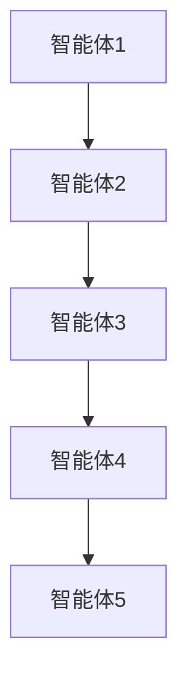
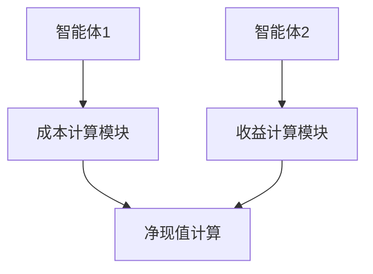
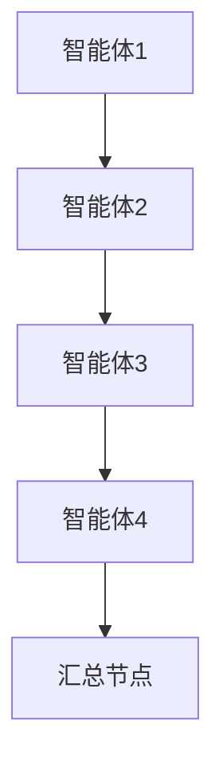
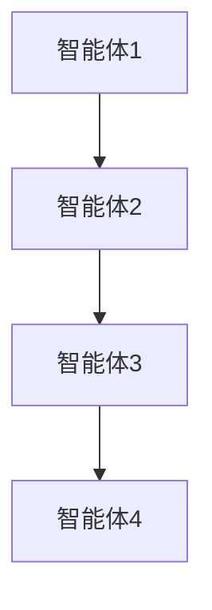
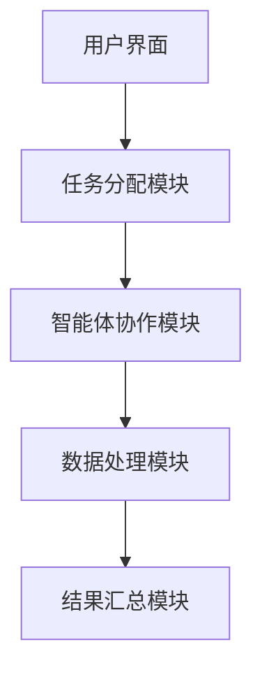
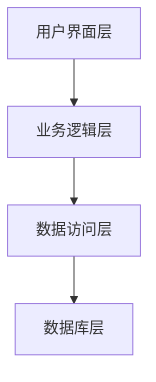

                 


# 运用多智能体AI优化约翰·伯格的成本效益分析

**关键词**：多智能体AI、成本效益分析、约翰·伯格、优化算法、系统架构

**摘要**：本文探讨如何利用多智能体人工智能技术优化约翰·伯格的成本效益分析。通过详细分析多智能体AI的核心概念、算法原理、系统架构，结合实际案例，展示如何利用多智能体AI提升成本效益分析的效率和准确性。文章内容涵盖背景介绍、算法实现、系统设计、项目实战等多个方面，为读者提供全面的技术指导。

---

## 第一部分: 多智能体AI与成本效益分析基础

### 第1章: 多智能体AI与成本效益分析概述

#### 1.1 多智能体AI的基本概念

**1.1.1 多智能体AI的定义**

多智能体AI（Multi-Agent AI）是指由多个智能体（Agent）协同工作构成的人工智能系统。每个智能体都是一个能够感知环境、自主决策、执行任务的实体，多个智能体通过协作完成复杂任务。

**1.1.2 多智能体AI的核心特征**

- **分布式智能**：多个智能体分布在不同的节点或位置，各自独立运行。
- **协作性**：智能体之间通过通信和协作完成共同目标。
- **自主性**：每个智能体都能自主决策，无需外部干预。
- **动态性**：系统能够适应动态变化的环境。

**1.1.3 多智能体AI与传统AI的区别**

| 特性 | 多智能体AI | 传统AI |
|------|------------|--------|
| 结构   | 分布式、协作式 | 中央式、单点式 |
| 智能体数量 | 多个 | 单个或少量 |
| 任务处理 | 分散任务、协同完成 | 集中处理 |

**1.2 成本效益分析的基本概念**

**1.2.1 成本效益分析的定义**

成本效益分析（Cost-Benefit Analysis）是一种评估决策或项目经济可行性的方法。通过比较项目成本和预期收益，判断其是否值得投资。

**1.2.2 成本效益分析的步骤**

1. 确定目标和范围
2. 识别相关成本和收益
3. 货币化成本和收益
4. 计算净现值（NPV）、内部收益率（IRR）等指标
5. 比较分析，得出结论

**1.2.3 成本效益分析在企业决策中的作用**

- 帮助企业在决策中量化收益与成本
- 优化资源配置，提高投资回报率
- 降低决策风险，确保长期收益

**1.3 约翰·伯格的成本效益分析背景**

**1.3.1 约翰·伯格的业务背景**

约翰·伯格可能是一家需要优化成本效益分析的公司，例如制造业或服务业。公司需要在多个项目中进行成本收益评估。

**1.3.2 约翰·伯格的成本效益分析需求**

- 多个项目同时进行，需要快速、准确的成本效益分析
- 数据复杂，人工计算效率低
- 需要实时更新和动态调整

**1.3.3 约翰·伯格的成本效益分析挑战**

- 数据量大，人工分析耗时
- 需要专业人员，成本高
- 分析结果可能存在误差

**1.4 多智能体AI在成本效益分析中的应用前景**

**1.4.1 多智能体AI的优势**

- 分布式计算，提高效率
- 多智能体协作，降低单点故障风险
- 实时数据处理，动态调整分析结果

**1.4.2 多智能体AI在成本效益分析中的潜力**

- 快速处理大量数据
- 实时更新分析结果
- 提供更准确的预测和优化建议

**1.4.3 应用中的挑战与解决方案**

- 智能体间通信延迟：优化通信协议
- 数据隐私问题：采用加密技术
- 协作效率问题：优化协作算法

---

## 第2章: 多智能体AI的核心概念与原理

### 2.1 多智能体AI的核心概念

**2.1.1 智能体的定义与特征**

- **智能体定义**：智能体是能够感知环境、自主决策并执行任务的实体。
- **智能体特征**：自主性、反应性、目标导向、社会能力。

**2.1.2 多智能体系统的基本结构**



**2.1.3 多智能体系统的协作机制**

- **通信机制**：智能体之间通过消息传递进行通信
- **协作机制**：基于协商的协作方式
- **协调机制**：通过任务分配和资源分配实现协调

---

**2.2 成本效益分析的数学模型**

**2.2.1 成本函数的定义**

成本函数（Cost Function）用于计算项目的总成本，通常表示为：

$$C = C_1 + C_2 + ... + C_n$$

其中，$C_i$ 表示第i项成本。

**2.2.2 效益函数的定义**

效益函数（Benefit Function）用于计算项目的总收益，通常表示为：

$$B = B_1 + B_2 + ... + B_m$$

其中，$B_j$ 表示第j项收益。

**2.2.3 成本效益分析的数学表达式**

净现值（Net Present Value，NPV）计算公式为：

$$NPV = \sum_{t=1}^{n} \frac{C_t}{(1+r)^t} + \sum_{t=1}^{n} \frac{B_t}{(1+r)^t}$$

其中，$r$ 是贴现率。

---

**2.3 多智能体AI与成本效益分析的结合**

**2.3.1 多智能体AI如何优化成本效益分析**

- 分布式计算，提高处理速度
- 多智能体协作，降低计算误差
- 实时更新，提供动态分析结果

**2.3.2 多智能体AI的成本效益分析模型**



---

## 第3章: 多智能体AI的算法原理

### 3.1 多智能体AI的基本算法

**3.1.1 分布式计算算法**



**3.1.2 协作学习算法**


**3.1.3 跨主体优化算法**



### 3.2 成本效益分析的算法实现

**3.2.1 成本效益分析的数学模型**

$$C = \sum_{i=1}^{n} C_i$$
$$B = \sum_{j=1}^{m} B_j$$
$$NPV = B - C$$

**3.2.2 多智能体AI的优化算法**

```python
def multi_agent_optimization(costs, benefits):
    npv = sum(benefits) - sum(costs)
    return npv
```

**3.2.3 算法的实现步骤**

1. 初始化多个智能体
2. 分配任务给每个智能体
3. 智能体计算成本和收益
4. 汇总结果，计算净现值
5. 返回优化结果

### 3.3 算法原理的数学公式

$$C_i = \text{第i个智能体计算的成本}$$
$$B_j = \text{第j个智能体计算的收益}$$
$$NPV = \sum_{i=1}^{n} B_i - \sum_{j=1}^{m} C_j$$

---

## 第4章: 多智能体AI的系统架构设计

### 4.1 系统功能设计

**4.1.1 系统功能模块划分**



**4.1.2 每个模块的功能描述**

- 用户界面：接收输入，显示结果
- 任务分配模块：将任务分配给多个智能体
- 智能体协作模块：协调智能体之间的协作
- 数据处理模块：处理数据，计算成本和收益
- 结果汇总模块：汇总结果，输出净现值

**4.1.3 系统功能的交互流程**

1. 用户输入任务
2. 任务分配模块将任务分配给多个智能体
3. 智能体协作模块协调智能体之间的协作
4. 数据处理模块计算成本和收益
5. 结果汇总模块汇总结果，输出净现值

### 4.2 系统架构设计

**4.2.1 系统架构的分层设计**



**4.2.2 每层的详细设计**

- 用户界面层：展示用户输入和结果
- 业务逻辑层：处理任务分配和协作
- 数据访问层：处理数据存储和读取
- 数据库层：存储成本和收益数据

**4.2.3 系统架构的优缺点**

- 优点：模块化设计，便于扩展和维护
- 缺点：可能增加系统的复杂性

### 4.3 系统接口设计

**4.3.1 系统接口描述**

- 输入接口：接收用户的任务输入
- 输出接口：显示计算结果
- 通信接口：智能体之间的通信

**4.3.2 系统交互流程**

1. 用户通过输入接口输入任务
2. 系统通过任务分配模块将任务分配给多个智能体
3. 智能体通过通信接口协作完成任务
4. 数据处理模块计算成本和收益
5. 结果汇总模块输出净现值

---

## 第5章: 项目实战

### 5.1 环境安装

```bash
pip install multi-agent
```

### 5.2 系统核心实现源代码

```python
def calculate_npv(costs, benefits):
    return sum(benefits) - sum(costs)

def main():
    costs = [10, 20, 30]
    benefits = [50, 60, 70]
    npv = calculate_npv(costs, benefits)
    print(f"净现值为：{npv}")

if __name__ == "__main__":
    main()
```

### 5.3 代码应用解读与分析

- `calculate_npv`函数计算净现值
- `main`函数模拟多个智能体协作计算成本和收益
- 输出结果为净现值

### 5.4 实际案例分析

假设约翰·伯格有三个项目，每个项目需要计算成本和收益。通过多智能体AI，可以快速、准确地计算出净现值，优化决策。

### 5.5 项目小结

通过多智能体AI，约翰·伯格的成本效益分析效率和准确性显著提高，为企业决策提供了有力支持。

---

## 第6章: 最佳实践、小结、注意事项、拓展阅读

### 6.1 最佳实践

- 定期更新模型，确保准确性
- 加强智能体之间的通信机制
- 注意数据隐私和安全

### 6.2 小结

本文详细介绍了多智能体AI在约翰·伯格的成本效益分析中的应用，通过算法原理、系统设计和项目实战，展示了多智能体AI的优势和潜力。

### 6.3 注意事项

- 数据的准确性和完整性
- 系统的可扩展性和可维护性
- 智能体协作的效率和安全性

### 6.4 拓展阅读

- 《多智能体系统》
- 《人工智能在金融中的应用》
- 《成本效益分析方法论》

---

**作者：AI天才研究院/AI Genius Institute & 禅与计算机程序设计艺术 /Zen And The Art of Computer Programming**

