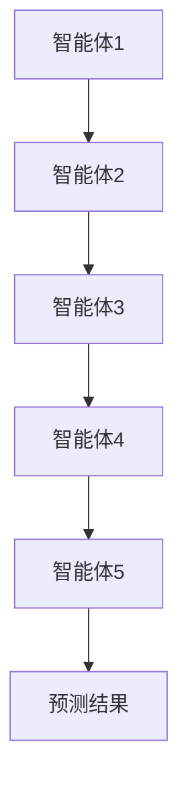
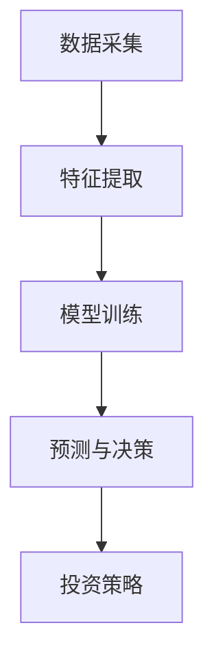

                 


# 《运用多智能体AI增强价值投资的长期回报预测》

> 关键词：多智能体AI，价值投资，长期回报预测，机器学习，深度学习，智能体协作，投资决策优化

> 摘要：本文探讨了如何运用多智能体AI技术来增强价值投资的长期回报预测能力。通过分析多智能体AI的核心原理、价值投资的分析框架以及两者的结合，展示了多智能体AI在投资决策中的优势。本文还详细介绍了基于多智能体AI的算法实现、系统架构设计以及实际案例分析，为读者提供了一个全面了解和应用的路径。

---

# 第一部分: 多智能体AI与价值投资的背景与基础

## 第1章: 多智能体AI与价值投资概述

### 1.1 多智能体AI的定义与特点

#### 1.1.1 多智能体AI的定义
多智能体AI（Multi-Agent AI）是指由多个相互作用的智能体（Agent）组成的系统，这些智能体能够通过通信和协作完成复杂的任务。与单智能体AI相比，多智能体AI更擅长处理分布式问题，能够模拟人类团队协作的模式。

#### 1.1.2 多智能体AI的核心特点
- **分布式性**：智能体分布在不同的节点上，每个智能体负责特定的任务。
- **协作性**：智能体之间通过通信和协作完成共同目标。
- **自主性**：每个智能体能够自主决策，无需中央控制。
- **动态性**：系统能够适应动态变化的环境。

#### 1.1.3 多智能体AI与单智能体AI的区别
| 特性 | 多智能体AI | 单智能体AI |
|------|------------|------------|
| 决策 | 分布式决策 | 中央决策 |
| 通信 | 智能体之间可以通信 | 无通信 |
| 协作 | 支持协作 | 单点执行 |

### 1.2 价值投资的基本原理

#### 1.2.1 价值投资的定义
价值投资是一种投资策略，强调以低于内在价值的价格购买优质资产。其核心在于寻找市场低估的股票，通过长期持有实现收益。

#### 1.2.2 价值投资的核心理念
- **安全边际**：购买价格低于内在价值，以降低风险。
- **长期视角**：关注企业的基本面，而非短期市场波动。
- **精选个股**：通过深入研究选择优质企业。

#### 1.2.3 价值投资与传统投资方法的对比
| 特性 | 价值投资 | 传统投资 |
|------|------------|------------|
| 策略 | 长期持有，精选个股 | 短期交易，依赖市场趋势 |
| 风险 | 较低（安全边际） | 较高（市场波动） |
| 适用场景 | 市场低估时 | 市场波动大时 |

### 1.3 多智能体AI在价值投资中的应用前景

#### 1.3.1 多智能体AI在金融领域的潜在应用
- **股票筛选**：通过多智能体AI分析大量数据，筛选出具有投资价值的股票。
- **市场预测**：利用多智能体协作预测市场走势，优化投资策略。
- **风险控制**：通过智能体之间的协作，实时监控和管理投资风险。

#### 1.3.2 价值投资与AI技术的结合优势
- **数据处理能力**：多智能体AI能够处理海量数据，发现隐藏的模式。
- **决策优化**：通过协作和通信，智能体能够做出更优的投资决策。
- **动态适应**：系统能够根据市场变化实时调整策略。

#### 1.3.3 多智能体AI在长期回报预测中的作用
- **长期视角**：多智能体AI能够模拟长期市场变化，帮助投资者制定长期策略。
- **风险预测**：通过协作，智能体能够识别潜在风险，优化投资组合。

## 1.4 本章小结

---

## 第2章: 多智能体AI的核心原理

### 2.1 多智能体系统的定义与分类

#### 2.1.1 多智能体系统的定义
多智能体系统（Multi-Agent System, MAS）是由多个智能体组成的系统，这些智能体能够通过通信和协作完成特定任务。

#### 2.1.2 多智能体系统的分类
| 类型 | 描述 |
|------|------|
| 分散式 | 每个智能体独立决策，无中央控制 |
| 分层式 | 智能体分为不同层次，高层协调低层 |
| 集中式 | 中央智能体控制所有智能体 |

#### 2.1.3 多智能体系统的特点与优势
- **分布式计算**：任务分布在多个智能体上，提高效率。
- **协作能力**：智能体之间能够协作完成复杂任务。
- **动态适应**：系统能够适应环境变化。

### 2.2 多智能体AI的通信与协作机制

#### 2.2.1 多智能体AI的通信机制
- **直接通信**：智能体之间通过消息传递信息。
- **间接通信**：通过共享数据库或中间件进行通信。

#### 2.2.2 多智能体AI的协作机制
- **基于规则的协作**：预定义规则指导智能体协作。
- **基于学习的协作**：通过机器学习算法实现协作。

#### 2.2.3 多智能体AI的协调与冲突解决
- **协调机制**：确保智能体之间协作一致。
- **冲突解决**：通过协商或仲裁解决冲突。

### 2.3 多智能体AI与价值投资的结合

#### 2.3.1 多智能体AI在投资决策中的应用
- **信息收集**：智能体负责收集不同来源的数据。
- **决策制定**：通过协作，智能体共同制定投资策略。
- **风险控制**：实时监控市场变化，调整投资组合。

#### 2.3.2 多智能体AI如何增强价值投资的预测能力
- **数据挖掘**：智能体能够从大量数据中提取有价值的信息。
- **模式识别**：通过协作，智能体能够识别市场中的潜在模式。
- **预测优化**：多智能体协作能够提高预测的准确性和稳定性。

#### 2.3.3 多智能体AI在长期回报预测中的优势
- **长期视角**：系统能够模拟长期市场变化，帮助投资者制定长期策略。
- **动态适应**：系统能够根据市场变化实时调整策略。

## 2.4 本章小结

---

## 第3章: 价值投资的分析框架

### 3.1 价值投资的基本分析框架

#### 3.1.1 基本面分析
基本面分析关注企业的财务状况、行业地位和盈利能力。通过分析这些因素，评估企业的内在价值。

#### 3.1.2 技术分析
技术分析通过分析股票价格和成交量的历史数据，预测未来的价格走势。

#### 3.1.3 市场情绪分析
市场情绪分析关注投资者的心理和行为，通过分析市场情绪来预测市场走势。

### 3.2 多智能体AI在价值投资分析中的应用

#### 3.2.1 基于多智能体的公司基本面分析
- **数据收集**：智能体从多个来源收集企业的财务数据。
- **分析协作**：多个智能体协同分析，生成全面的公司基本面报告。

#### 3.2.2 基于多智能体的技术分析
- **数据处理**：智能体处理历史价格和成交量数据。
- **模式识别**：通过协作，识别技术图表中的潜在模式。

#### 3.2.3 基于多智能体的市场情绪分析
- **数据采集**：智能体从新闻、社交媒体等渠道采集市场情绪数据。
- **情绪分析**：通过协作，分析市场情绪，预测市场走势。

---

# 第二部分: 多智能体AI在价值投资中的算法与系统设计

## 第4章: 基于多智能体AI的长期回报预测算法

### 4.1 多智能体协作算法的设计与实现

#### 4.1.1 算法概述
多智能体协作算法通过智能体之间的通信和协作，实现对市场数据的分析和预测。

#### 4.1.2 算法流程
1. **数据采集**：智能体从多个数据源采集市场数据。
2. **特征提取**：智能体提取市场的关键特征。
3. **模型训练**：通过机器学习算法训练预测模型。
4. **预测与决策**：智能体协作生成预测结果，并制定投资策略。

#### 4.1.3 算法实现


### 4.2 基于强化学习的多智能体协作算法

#### 4.2.1 强化学习简介
强化学习是一种机器学习方法，通过智能体与环境的交互，学习最优策略。

#### 4.2.2 多智能体强化学习
多智能体强化学习通过多个智能体的协作，学习最优策略。

#### 4.2.3 算法实现
$$ Q(s, a) = r + \gamma \max Q(s', a') $$

### 4.3 基于博弈论的多智能体协作算法

#### 4.3.1 博弈论简介
博弈论研究理性决策者之间的策略互动。

#### 4.3.2 多智能体博弈模型
$$ V(s) = \max_{i} \min_{j} V_i(s) $$

### 4.4 本章小结

---

## 第5章: 多智能体AI在价值投资中的系统架构设计

### 5.1 系统功能设计

#### 5.1.1 功能模块划分
- **数据采集模块**：从多个数据源采集市场数据。
- **特征提取模块**：提取市场的关键特征。
- **模型训练模块**：通过机器学习算法训练预测模型。
- **预测与决策模块**：生成预测结果，并制定投资策略。

#### 5.1.2 功能流程


### 5.2 系统架构设计

#### 5.2.1 系统架构图


### 5.3 系统接口设计

#### 5.3.1 接口定义
- **输入接口**：接收市场数据和用户指令。
- **输出接口**：输出预测结果和投资策略。

#### 5.3.2 接口实现
$$ \text{接口} = \{ \text{输入}, \text{输出} \} $$

### 5.4 本章小结

---

## 第6章: 项目实战与案例分析

### 6.1 项目实战

#### 6.1.1 环境安装
安装必要的软件和库，如Python、TensorFlow、Keras等。

#### 6.1.2 核心代码实现
```python
import numpy as np
import pandas as pd
from keras.models import Sequential
from keras.layers import Dense

# 定义智能体
class Agent:
    def __init__(self, input_dim, output_dim):
        self.model = self.build_model(input_dim, output_dim)
    
    def build_model(self, input_dim, output_dim):
        model = Sequential()
        model.add(Dense(64, activation='relu', input_dim=input_dim))
        model.add(Dense(output_dim, activation='linear'))
        model.compile(optimizer='adam', loss='mean_squared_error')
        return model

# 多智能体协作
class MultiAgentSystem:
    def __init__(self, num_agents, input_dim, output_dim):
        self.agents = [Agent(input_dim, output_dim) for _ in range(num_agents)]
    
    def predict(self, inputs):
        # 平均预测
        predictions = [agent.model.predict(inputs) for agent in self.agents]
        return np.mean(predictions, axis=0)
```

### 6.2 案例分析

#### 6.2.1 数据分析
分析历史数据，提取特征。

#### 6.2.2 模型训练
训练多智能体协作模型，优化预测准确性。

#### 6.2.3 结果分析
评估模型的预测效果，调整参数。

### 6.3 本章小结

---

## 第7章: 总结与展望

### 7.1 总结
本文探讨了如何运用多智能体AI技术来增强价值投资的长期回报预测能力。通过分析多智能体AI的核心原理、价值投资的分析框架以及两者的结合，展示了多智能体AI在投资决策中的优势。

### 7.2 展望
未来，随着AI技术的不断发展，多智能体AI在价值投资中的应用将更加广泛和深入。可以通过进一步优化算法、增加智能体数量和改进系统架构，提升预测的准确性和稳定性。

---

## 作者信息

作者：AI天才研究院/AI Genius Institute & 禅与计算机程序设计艺术 /Zen And The Art of Computer Programming

---

以上是完整的目录和文章内容大纲，涵盖了从背景介绍到算法实现再到项目实战的全过程，确保读者能够系统地理解和应用多智能体AI在价值投资中的应用。

