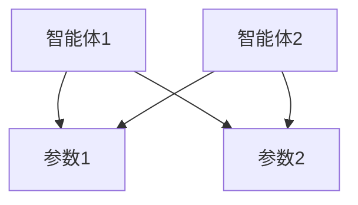
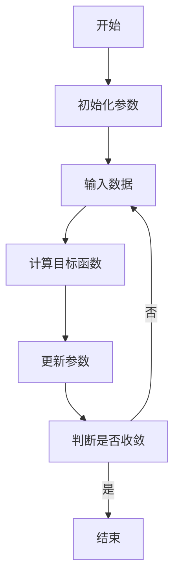
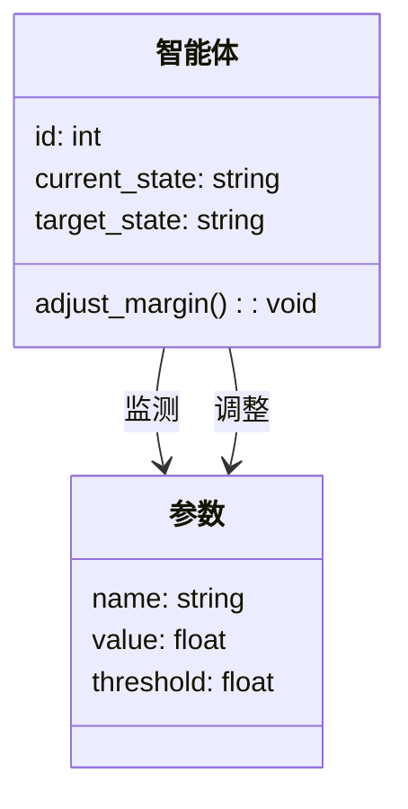
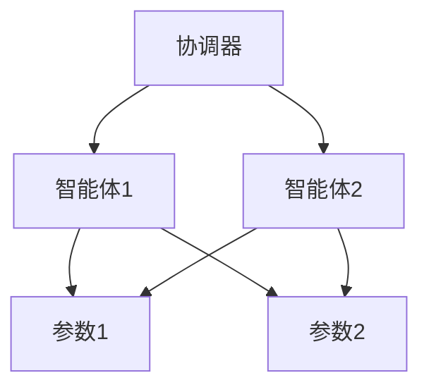
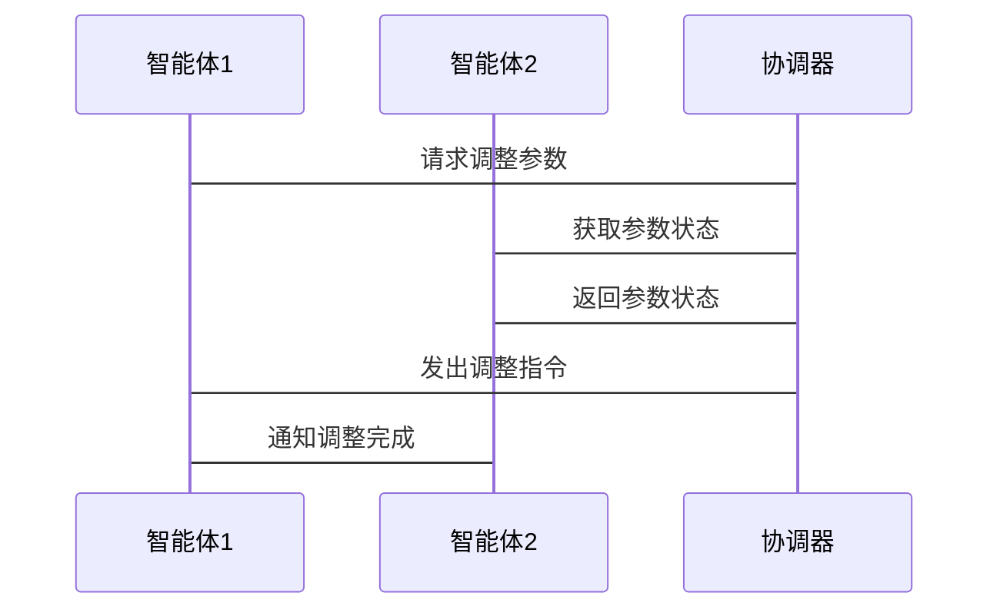

                 


# 运用多智能体AI实现动态安全边际调整

> 关键词：多智能体AI，动态安全边际调整，协作算法，实时优化，系统架构

> 摘要：本文探讨如何利用多智能体人工智能技术实现动态安全边际调整。通过分析多智能体AI的核心概念、算法原理、系统架构及项目实战，本文详细阐述了如何在实时环境下动态调整安全边际，以应对复杂多变的生产环境。文章从背景介绍、核心概念、算法实现、系统设计、项目实战到总结展望，层层递进，为读者提供了一个全面的技术解决方案。

---

## 第一部分：多智能体AI与动态安全边际调整基础

### 第1章：多智能体AI与动态安全边际调整概述

#### 1.1 多智能体AI的基本概念

- **1.1.1 多智能体系统定义**  
  多智能体系统（Multi-Agent System，MAS）是由多个智能体（Agent）组成的分布式系统，每个智能体具有自主性、反应性、协作性和社会性。智能体能够感知环境、做出决策并采取行动，以实现特定目标。

- **1.1.2 多智能体AI的核心特点**  
  - **自主性**：智能体能够独立决策。  
  - **协作性**：多个智能体通过协作完成复杂任务。  
  - **分布式计算**：任务分布在多个智能体之间，避免单点故障。  
  - **动态适应性**：能够根据环境变化自适应调整行为。

- **1.1.3 多智能体AI的应用场景**  
  多智能体AI广泛应用于机器人协作、交通控制、网络安全等领域，尤其适合需要实时协作和动态调整的任务。

#### 1.2 动态安全边际调整的背景与意义

- **1.2.1 安全边际的概念**  
  安全边际是指在生产过程中，为防止产品超出规格而预留的范围。传统安全边际是静态的，而动态安全边际调整则是根据实时数据不断优化这个范围。

- **1.2.2 动态调整的必要性**  
  在复杂多变的生产环境中，静态的安全边际可能导致资源浪费或安全隐患。动态调整能够提高效率并降低风险。

- **1.2.3 多智能体AI在其中的作用**  
  多智能体AI能够实时感知环境变化，通过协作快速调整安全边际，确保生产过程的安全性和高效性。

#### 1.3 问题背景与目标

- **1.3.1 当前安全边际调整的挑战**  
  - 环境动态变化导致静态调整效果差。  
  - 单一智能体难以处理多维数据。  
  - 跨机构协作复杂，难以统一调整策略。

- **1.3.2 多智能体AI的目标设定**  
  实现多智能体协作，实时感知、分析和调整安全边际，适应复杂环境。

- **1.3.3 解决方案的框架**  
  通过多智能体协作，建立动态调整机制，优化安全边际。

### 第2章：多智能体AI的核心概念与联系

#### 2.1 多智能体AI的核心原理

- **2.1.1 分布式智能**  
  每个智能体负责特定任务，通过分布式计算实现全局目标。

- **2.1.2 协作与竞争机制**  
  智能体之间可以通过协作或竞争优化决策。

- **2.1.3 自适应学习**  
  智能体通过学习适应环境变化，提升调整精度。

#### 2.2 动态安全边际调整的系统模型

- **2.2.1 系统模型的构建**  
  动态安全边际调整系统由多个智能体组成，每个智能体负责不同参数的监测和调整。

- **2.2.2 实体关系图（ER图）**  
  使用Mermaid绘制的ER图展示系统中实体及其关系。



- **2.2.3 用例分析**  
  比如，温度和压力传感器的数据输入，智能体协作调整安全边际。

#### 2.3 核心概念对比表

- **表2-1：多智能体AI与传统AI的对比**

| 特性                | 多智能体AI                | 传统AI                 |
|---------------------|--------------------------|------------------------|
| 分布式计算          | 是                       | 否                     |
| 协作性              | 强                       | 弱                     |
| 适应性              | 高                       | 中                     |
| 应用场景            | 复杂协作任务             | 简单任务               |

---

## 第二部分：算法原理与数学模型

### 第3章：多智能体AI的算法原理

#### 3.1 基础算法

- **3.1.1 分布式协作算法**  
  比如，基于消息传递的协作算法，通过智能体之间的信息交换实现协作。

- **3.1.2 聚类与分类算法**  
  使用聚类算法将相似的数据分组，分类算法预测安全边际的变化趋势。

- **3.1.3 跨机构协调算法**  
  跨机构间的协调需要考虑通信延迟和数据隐私，采用分布式协调算法。

#### 3.2 动态调整算法

- **3.2.1 基于反馈的调整算法**  
  根据实时反馈调整参数，如PID控制算法。

- **3.2.2 实时优化算法**  
  使用强化学习优化调整策略，如Q-learning算法。

- **3.2.3 自适应增强学习**  
  在动态环境中，智能体通过强化学习不断优化策略。

#### 3.3 算法流程图（Mermaid）



### 第4章：数学模型与公式解析

#### 4.1 动态调整模型

- **4.1.1 目标函数**  
  $$f(x) = \min_{x} \sum_{i=1}^{n} (x_i - a_i)^2$$  
  其中，\(x_i\)是调整后的参数，\(a_i\)是原始数据。

- **4.1.2 约束条件**  
  $$\sum_{i=1}^{n} x_i \leq S$$  
  其中，\(S\)是系统允许的最大调整幅度。

#### 4.2 多智能体协作模型

- **4.2.1 分**

---

## 第三部分：系统分析与架构设计

### 第5章：系统分析与架构设计

#### 5.1 问题场景介绍

- **复杂生产环境**：多参数实时监测，需要动态调整安全边际。

#### 5.2 系统功能设计

- **领域模型（Mermaid类图）**



#### 5.3 系统架构设计

- **架构图（Mermaid）**



#### 5.4 系统接口设计

- **REST API接口**  
  - `/api/sensor-data`：接收传感器数据。  
  - `/api/margin-adjustment`：返回调整后的安全边际。

#### 5.5 系统交互（Mermaid序列图）



---

## 第四部分：项目实战

### 第6章：项目实战

#### 6.1 环境安装

- **安装Python和相关库**  
  使用Anaconda环境，安装`numpy`, `scikit-learn`, `flask`等库。

#### 6.2 系统核心实现源代码

- **智能体协作代码（Python）**

```python
import numpy as np
from sklearn.cluster import KMeans

class Agent:
    def __init__(self, id):
        self.id = id
        self.data = []
    
    def collect_data(self, value):
        self.data.append(value)
    
    def analyze(self):
        if len(self.data) < 5:
            return None
        # 使用KMeans进行聚类分析
        model = KMeans(n_clusters=2)
        model.fit(np.array(self.data).reshape(-1,1))
        return model.cluster_centers_
    
    def adjust_margin(self, target):
        current = np.mean(self.data)
        adjustment = target - current
        return adjustment

# 初始化智能体
agents = [Agent(1), Agent(2)]

# 模拟数据采集
for agent in agents:
    for _ in range(10):
        agent.collect_data(np.random.normal(0, 1))
        
# 分析数据并调整
for agent in agents:
    result = agent.analyze()
    if result is not None:
        adjustment = agent.adjust_margin(result[0])
        print(f"Agent {agent.id}调整后的安全边际：{adjustment}")
```

#### 6.3 案例分析与应用解读

- **案例分析**  
  模拟一个化工厂的温度和压力监控系统，智能体协作动态调整安全边际，确保生产安全。

#### 6.4 项目总结

- **实现的功能**  
  - 实时数据采集与分析。  
  - 动态调整安全边际。  
  - 多智能体协作优化。

---

## 第五部分：总结与展望

### 第7章：总结与展望

#### 7.1 总结

- 本文详细探讨了多智能体AI在动态安全边际调整中的应用，从概念、算法到系统实现，提供了全面的技术解决方案。

#### 7.2 未来展望

- **算法优化**：引入更先进的强化学习算法。  
- **系统扩展**：支持更多智能体协作。  
- **应用场景拓展**：应用于更多领域，如金融风险控制等。

---

## 作者

作者：AI天才研究院/AI Genius Institute & 禅与计算机程序设计艺术 /Zen And The Art of Computer Programming

