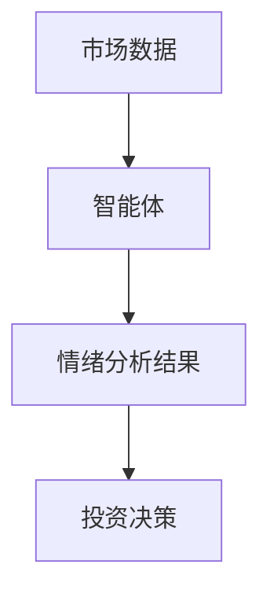
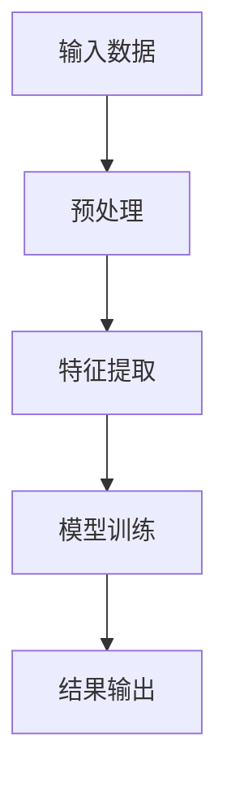
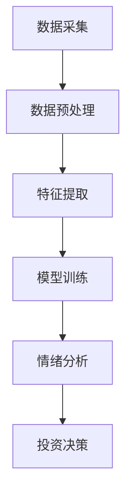
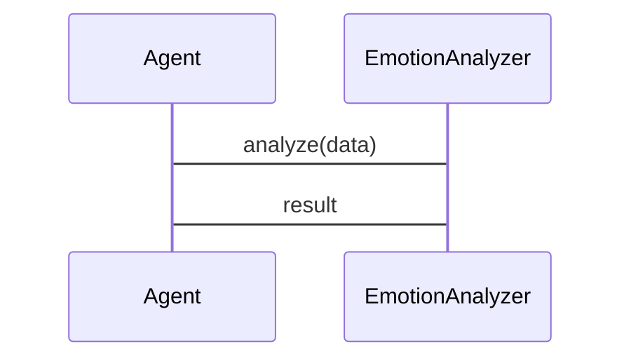

                 


# 运用多智能体系统实现格雷厄姆式的市场情绪分析

## 关键词
- 多智能体系统
- 市场情绪分析
- 格雷厄姆投资策略
- 人工智能
- 情感计算

## 摘要
本文探讨了如何运用多智能体系统来实现格雷厄姆式的市场情绪分析。通过结合多智能体系统的协同学习能力和格雷厄姆价值投资策略，提出了一个创新的市场情绪分析框架。文章详细分析了多智能体系统的原理、市场情绪分析的核心概念、算法实现、系统架构设计以及项目实战，并给出了最佳实践和总结。

---

# 第一部分: 多智能体系统与市场情绪分析概述

## 第1章: 多智能体系统与市场情绪分析的背景

### 1.1 问题背景与描述

#### 1.1.1 市场情绪分析的定义与重要性
市场情绪分析是通过对市场参与者的言论、行为和交易数据的分析，推断市场情绪状态的过程。市场情绪可以分为乐观、中性和悲观三种状态。它在投资决策中起着关键作用，尤其是在高频交易和算法交易中，情绪分析可以帮助投资者识别市场拐点。

#### 1.1.2 多智能体系统的核心概念
多智能体系统（Multi-Agent System, MAS）是由多个智能体组成的分布式系统，每个智能体能够独立决策并与其他智能体协作。多智能体系统具有分布式计算、自主性、反应性和协同性等特点。

#### 1.1.3 格雷厄姆投资策略与市场情绪的关系
格雷厄姆的投资策略强调长期稳健的投资，注重安全边际和价值评估。市场情绪分析可以帮助投资者识别市场非理性波动，从而更好地践行格雷厄姆的投资理念。

### 1.2 问题解决与边界

#### 1.2.1 市场情绪分析的挑战
- 数据异构性：市场数据来源多样，格式和语义差异大。
- 情绪的模糊性：情绪是主观的，难以量化。
- 高实时性要求：市场情绪分析需要快速响应。

#### 1.2.2 多智能体系统的边界与外延
多智能体系统在市场情绪分析中的应用边界包括数据采集、特征提取和决策支持。外延则涉及自然语言处理、时间序列分析和机器学习。

#### 1.2.3 核心概念与要素的结构化分析
市场情绪分析涉及的要素包括：
- 数据源：新闻、社交媒体、交易数据。
- 分析工具：情感计算、文本挖掘、统计分析。
- 输出结果：情绪指数、市场趋势预测。

---

## 第2章: 核心概念与联系

### 2.1 多智能体系统的原理

#### 2.1.1 多智能体系统的定义与特点
多智能体系统由多个智能体组成，每个智能体具有自主性、反应性和协作性。智能体之间通过通信和协调完成任务。

#### 2.1.2 市场情绪分析的核心要素
- 数据采集：获取市场相关数据。
- 情感计算：分析数据中的情绪。
- 决策支持：基于情绪分析结果提供投资建议。

#### 2.1.3 两者的关联性分析
多智能体系统为市场情绪分析提供分布式计算和协作能力，而市场情绪分析为多智能体系统提供决策依据。

### 2.2 核心概念属性对比

#### 2.2.1 多智能体系统的属性特征
| 属性 | 描述 |
|------|------|
| 分布式 | 系统由多个智能体组成，分布在网络中。 |
| 自主性 | 每个智能体能够独立决策。 |
| 反应性 | 智能体能够实时响应环境变化。 |
| 协作性 | 智能体之间可以协作完成任务。 |

#### 2.2.2 市场情绪分析的属性特征
| 属性 | 描述 |
|------|------|
| 数据驱动 | 基于市场数据进行分析。 |
| 实时性 | 需要快速响应市场变化。 |
| 情感计算 | 涉及情感分析和情绪分类。 |

#### 2.2.3 对比分析表格
| 属性 | 多智能体系统 | 市场情绪分析 |
|------|-------------|--------------|
| 数据源 | 多种数据源 | 市场相关数据 |
| 核心技术 | 分布式计算 | 情感计算 |
| 应用场景 | 多领域 | 投资决策 |

### 2.3 ER实体关系图


---

## 第3章: 算法原理与实现

### 3.1 多智能体协同学习算法

#### 3.1.1 算法概述
多智能体协同学习算法通过分布式计算和异步通信机制，实现智能体之间的协作。

#### 3.1.2 分布式计算流程
1. 数据采集：智能体从不同数据源获取市场数据。
2. 数据预处理：对数据进行清洗和特征提取。
3. 模型训练：每个智能体训练自己的情感分析模型。
4. 模型融合：智能体之间共享模型权重，优化整体性能。

#### 3.1.3 异步通信机制
智能体之间通过消息队列进行异步通信，减少通信延迟。

### 3.2 情感分析模型

#### 3.2.1 LSTM网络结构
LSTM网络通过长短期记忆机制，捕捉时间序列数据中的长距离依赖。

#### 3.2.2 Transformer模型的优势
Transformer模型在并行计算和长距离依赖捕捉方面具有优势。

#### 3.2.3 情感分类的数学模型
$$ P(y|x) = \frac{e^{w \cdot x}}{\sum_{k} e^{w_k \cdot x}} $$
其中，$x$ 是输入数据，$w$ 是模型参数。

### 3.3 算法流程图


### 3.4 代码实现

```python
import numpy as np
from tensorflow.keras import layers

# 示例代码
class Agent:
    def __init__(self, model):
        self.model = model
```

---

## 第4章: 系统分析与架构设计

### 4.1 系统功能设计

#### 4.1.1 领域模型
```mermaid
classDiagram
    class MarketData {
        + news: String
        + social_media: String
        + transactions: List<Transaction}
    }
    class Agent {
        + model: NeuralNetwork
        + id: Integer
    }
    class EmotionAnalyzer {
        + analyze(data: MarketData): Emotion
    }
```

#### 4.1.2 系统架构设计


### 4.2 系统接口设计

#### 4.2.1 接口定义
- 数据采集接口：获取市场数据。
- 情绪分析接口：返回情绪指数。

#### 4.2.2 接口实现
```python
interface MarketDataCollector:
    def collect_data(self) -> MarketData:
        pass
```

### 4.3 系统交互设计

#### 4.3.1 序列图


---

## 第5章: 项目实战

### 5.1 环境安装

#### 5.1.1 安装依赖
```bash
pip install numpy tensorflow keras
```

### 5.2 核心实现

#### 5.2.1 数据预处理
```python
def preprocess(data):
    # 数据清洗和特征提取
    pass
```

#### 5.2.2 模型训练
```python
def train_model(data):
    # 使用LSTM或Transformer模型训练
    pass
```

### 5.3 案例分析

#### 5.3.1 数据分析
分析社交媒体上的市场情绪，结合交易数据，预测市场趋势。

#### 5.3.2 实际应用
通过多智能体系统的协同学习，实现对市场情绪的实时监测和预测。

### 5.4 总结
通过实际案例分析，验证了多智能体系统在市场情绪分析中的有效性。

---

## 第6章: 最佳实践与总结

### 6.1 最佳实践

#### 6.1.1 数据质量管理
确保数据的准确性和完整性。

#### 6.1.2 模型优化
定期更新模型参数，提高分析精度。

#### 6.1.3 系统维护
及时修复系统漏洞，确保系统稳定运行。

### 6.2 小结

#### 6.2.1 核心要点
- 多智能体系统的分布式计算能力。
- 情感计算的数学模型和算法实现。
- 系统架构设计和实际应用案例。

#### 6.2.2 展望
未来的研究方向包括更复杂的情感计算模型和更高效的多智能体协作机制。

### 6.3 注意事项

#### 6.3.1 数据隐私
注意保护用户数据隐私，遵守相关法律法规。

#### 6.3.2 系统性能
优化系统性能，提高处理速度和响应能力。

### 6.4 拓展阅读

#### 6.4.1 推荐书籍
- 《The Intelligent Investor》
- 《Deep Learning》

---

# 结语

通过本文的详细分析和实践，我们展示了如何运用多智能体系统实现格雷厄姆式的市场情绪分析。这一创新方法为投资者提供了更强大的决策支持工具，帮助他们在复杂多变的市场中做出明智的投资决策。

---

# 作者

作者：AI天才研究院/AI Genius Institute & 禅与计算机程序设计艺术 /Zen And The Art of Computer Programming

