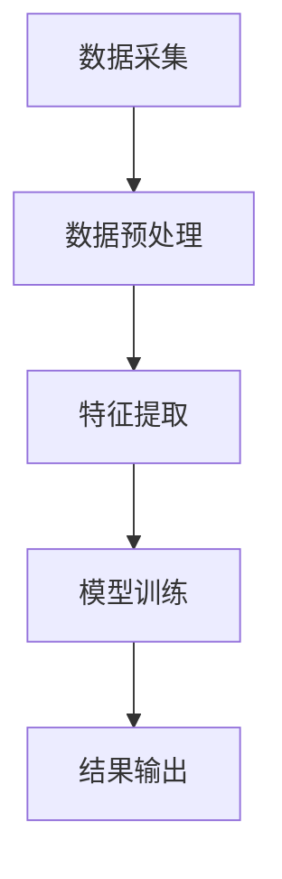
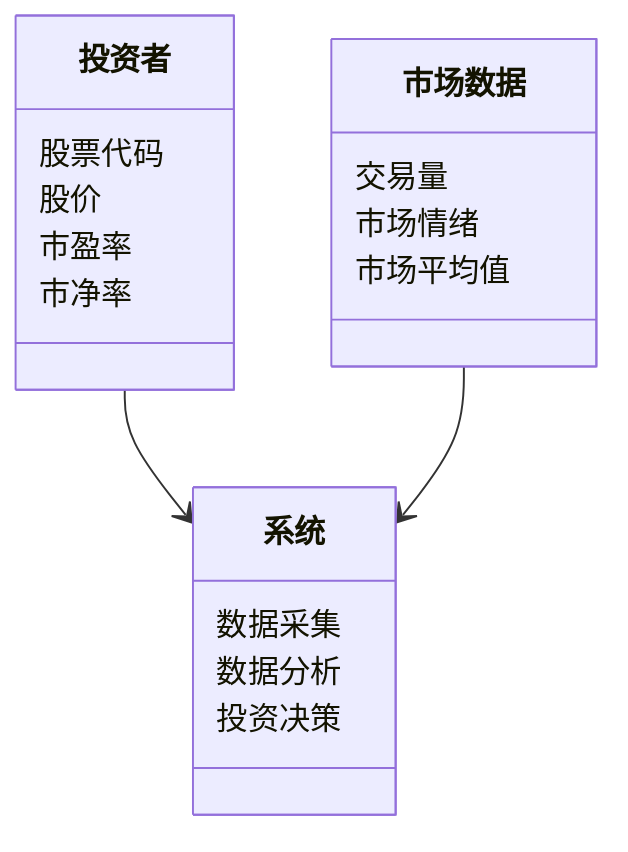
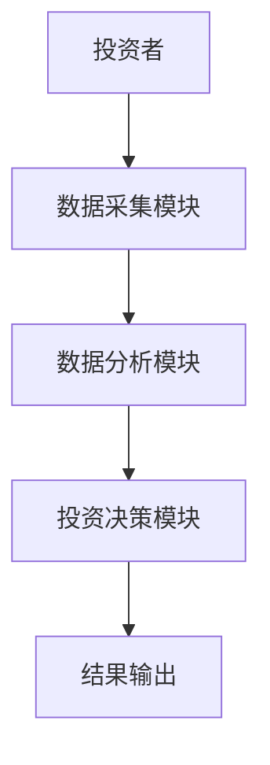
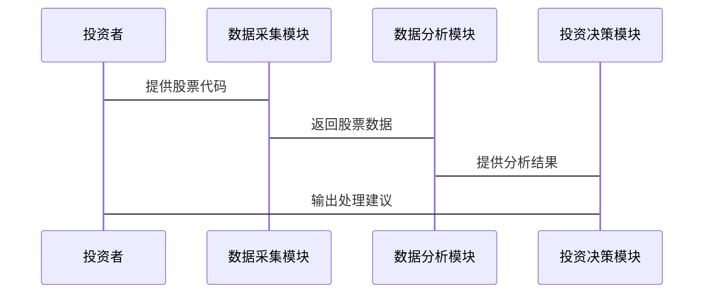

                 


# 连续两年表现不佳的特价股票处理方法

> 关键词：特价股票，表现不佳，股票处理，投资策略，风险管理

> 摘要：本文探讨了连续两年表现不佳的特价股票的定义、分析方法和处理策略。通过结合市场数据、公司基本面和算法模型，提出了基于股价波动、财务指标和市场情绪的多维度分析框架。同时，本文详细讲解了如何利用数据分析工具和机器学习算法，实现对表现不佳股票的智能识别和投资决策优化。

---

## 第一部分：特价股票与表现不佳的定义与背景

### 第1章：特价股票的定义与分类

#### 1.1 特价股票的定义与分类
- **特价股票的定义**：特价股票是指价格显著低于市场平均水平的股票，通常反映市场对公司的估值较低或市场情绪低迷。
- **特价股票的分类**：
  - 按价格波动：低波动特价股票、高波动特价股票
  - 按行业：科技类特价股票、金融类特价股票、消费类特价股票
  - 按市场：大盘特价股票、小盘特价股票
- **特价股票的市场特征**：
  - 价格弹性大
  - 市场流动性较低
  - 投资情绪影响显著

#### 1.2 表现不佳股票的定义与特征
- **表现不佳股票的定义**：指在过去两年内，股价持续下跌、市盈率和市净率低于行业平均水平的股票。
- **表现不佳股票的特征**：
  - 股价持续低迷
  - 财务指标恶化
  - 市场关注度下降
- **表现不佳股票的形成原因**：
  - 公司基本面恶化
  - 市场情绪低迷
  - 行业环境变化

#### 1.3 连续两年表现不佳的特价股票的背景
- **特价股票表现不佳的市场背景**：
  - 经济下行周期
  - 行业竞争加剧
  - 公司治理问题
- **连续两年表现不佳的特殊性**：
  - 投资者信心丧失
  - 市场流动性枯竭
  - 公司重组难度增加
- **本文研究的核心问题**：
  - 如何识别连续两年表现不佳的特价股票
  - 如何制定有效的股票处理策略
  - 如何优化投资组合以规避风险

---

## 第二部分：特价股票表现不佳的核心概念与联系

### 第2章：特价股票表现不佳的核心概念分析

#### 2.1 特价股票的表现指标
- **股价波动指标**：
  - 涨跌幅
  - 波动率
- **市盈率与市净率分析**：
  - 市盈率（P/E）
  - 市净率（P/B）
- **股东权益与盈利能力指标**：
  - 净利润
  - 资产负债率
  - 股东权益回报率（ROE）

#### 2.2 特价股票表现不佳的属性特征
- **股票价格持续下跌特征**：
  - 年度跌幅超过10%
  - 季度跌幅持续扩大
- **市场流动性不足特征**：
  - 交易量急剧下降
  - 市场深度不足
- **公司基本面恶化特征**：
  - 净利润持续亏损
  - 营收增速放缓
  - 债务风险上升

#### 2.3 特价股票表现不佳的ER实体关系图
```mermaid
er
actor: 投资者
actor: 市场分析师
actor: 公司管理层
entity: 特价股票
entity: 股票价格数据
entity: 公司财务数据
entity: 市场交易数据
```

---

## 第三部分：特价股票表现不佳的算法原理与数学模型

### 第3章：特价股票表现不佳的算法原理

#### 3.1 数据采集与预处理
- **数据来源与采集方法**：
  - 从股票交易所获取历史数据
  - 从财经网站获取实时数据
- **数据清洗与标准化**：
  - 去除缺失值
  - 标准化处理
- **数据特征提取**：
  - 计算技术指标（如RSI、MACD）
  - 提取财务指标（如ROE、净利润）

#### 3.2 表现不佳股票识别算法
- **基于价格波动的识别算法**：
  - 计算年跌幅
  - 判断是否低于阈值
- **基于财务指标的识别算法**：
  - 计算ROE、净利润增速
  - 判断是否低于行业平均水平
- **基于市场情绪的识别算法**：
  - 调用市场情绪指数（如恐慌指数）
  - 判断市场情绪是否低迷

#### 3.3 算法流程图


#### 3.4 算法实现代码示例
```python
import pandas as pd
import numpy as np

# 示例数据集
data = pd.DataFrame({
    '股票代码': ['A', 'B', 'C'],
    '股价': [10, 20, 30],
    '市盈率': [15, 30, 45],
    '市净率': [2, 4, 6]
})

# 计算表现不佳股票
def is_underperforming(row):
    if row['股价'] < 15 and row['市盈率'] > 30:
        return True
    return False

data['表现不佳'] = data.apply(is_underperforming, axis=1)
print(data)
```

#### 3.5 数学模型
- **数学模型**：
  - 假设股价为 $P_t$，市盈率为 $PE_t$，市净率为 $PB_t$
  - 表现不佳的判断标准：
    - $P_t < P_{avg}$
    - $PE_t > PE_{avg}$
    - $PB_t > PB_{avg}$
  - 其中，$P_{avg}$、$PE_{avg}$、$PB_{avg}$分别为市场平均值。

---

## 第四部分：特价股票表现不佳的系统分析与设计

### 第4章：系统分析与架构设计方案

#### 4.1 问题场景介绍
- **问题场景**：
  - 投资者需要识别连续两年表现不佳的特价股票
  - 投资者需要制定股票处理策略
- **项目介绍**：
  - 开发一个股票分析系统，帮助投资者识别和处理表现不佳的特价股票

#### 4.2 系统功能设计
- **功能需求**：
  - 数据采集模块
  - 数据分析模块
  - 投资决策模块
- **领域模型**：


#### 4.3 系统架构设计


#### 4.4 系统接口设计
- **输入接口**：
  - 股票代码
  - 数据时间范围
- **输出接口**：
  - 表现不佳股票列表
  - 处理建议

#### 4.5 系统交互流程


---

## 第五部分：项目实战与案例分析

### 第5章：项目实战

#### 5.1 环境安装
- **工具安装**：
  - 安装Python
  - 安装Pandas、NumPy、Matplotlib
  - 安装金融数据接口（如Yahoo Finance）

#### 5.2 系统核心实现源代码
```python
import pandas as pd
import requests

# 数据采集
def get_stock_data(stock_code):
    url = f"https://query1.finance.yahoo.com/.../{stock_code}"
    response = requests.get(url)
    return pd.DataFrame(response.json())

# 数据分析
def analyze_underperformance(data):
    data['表现不佳'] = data.apply(is_underperforming, axis=1)
    return data

# 投资决策
def generate_recommendation(data):
    recommendations = []
    for index, row in data.iterrows():
        if row['表现不佳']:
            recommendations.append(f"建议卖出 {row['股票代码']}")
    return recommendations

# 主程序
if __name__ == "__main__":
    stock_code = input("请输入股票代码：")
    data = get_stock_data(stock_code)
    result = analyze_underperformance(data)
    recommendations = generate_recommendation(result)
    for rec in recommendations:
        print(rec)
```

#### 5.3 案例分析
- **案例背景**：某科技公司股票连续两年表现不佳
- **数据分析**：
  - 股价从50跌至20
  - 市盈率从15升至40
  - 净利润持续亏损
- **处理建议**：
  - 建议投资者卖出该股票
  - 建议关注替代投资机会

#### 5.4 项目小结
- **项目总结**：
  - 成功识别了表现不佳的特价股票
  - 提供了有效的投资决策建议
- **项目意义**：
  - 为投资者提供了科学的决策支持
  - 为后续研究提供了数据支持

---

## 第六部分：最佳实践与注意事项

### 第6章：最佳实践

#### 6.1 小结
- **核心要点**：
  - 特价股票的表现不佳可能由多种因素引起
  - 需要结合市场数据和公司基本面进行综合分析
  - 投资者应制定合理的股票处理策略

#### 6.2 注意事项
- **数据质量**：
  - 确保数据的准确性和完整性
- **模型选择**：
  - 根据实际情况选择合适的算法
- **风险管理**：
  - 设置止损点
  - 分散投资风险

#### 6.3 拓展阅读
- **推荐书籍**：
  - 《股票投资策略与风险管理》
  - 《算法交易与量化投资》
- **推荐网站**：
  - Yahoo Finance
  - Bloomberg

---

## 作者：AI天才研究院/AI Genius Institute & 禅与计算机程序设计艺术 /Zen And The Art of Computer Programming

