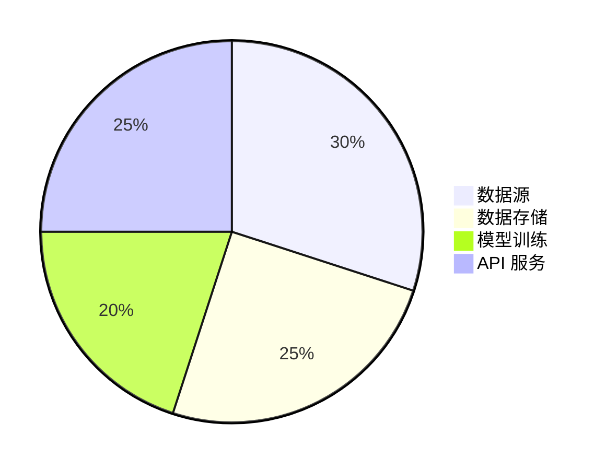
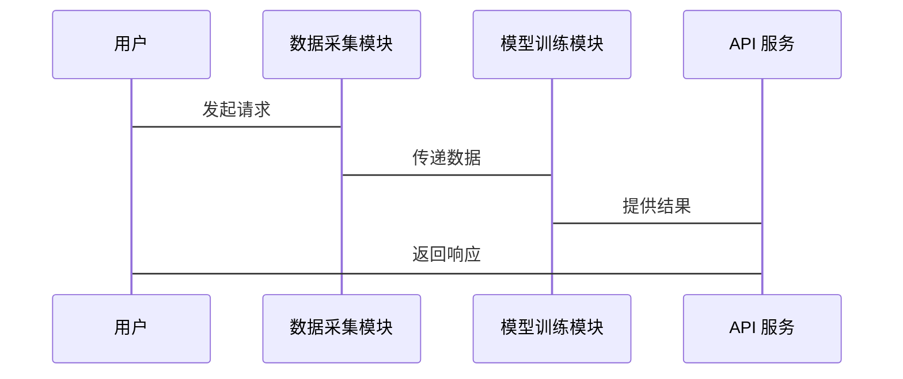

                 


# 《金融AI应用的DevOps流程设计与实施》

**关键词**：金融AI，DevOps流程，CI/CD，自动化运维，金融大数据

**摘要**：  
本文详细探讨了金融AI应用的DevOps流程设计与实施，涵盖从背景介绍到项目实战的全过程。文章首先分析了金融行业的数字化转型与人工智能技术的发展，随后深入讲解了金融AI应用的核心技术与DevOps的基本原理。通过结合实际案例，文章详细阐述了金融AI系统的算法原理、系统架构设计以及DevOps工具链的实施，最后给出了项目实战的指导与最佳实践。本文旨在为金融领域的技术从业者提供一套系统化的设计与实施方法，帮助他们在复杂的金融环境中高效落地AI应用。

---

# 第一部分: 金融AI应用的背景与概述

## 第1章: 金融AI应用的背景与现状

### 1.1 人工智能在金融领域的应用背景

#### 1.1.1 金融行业的数字化转型  
随着数字化转型的推进，金融机构正在积极拥抱新技术，以提升效率、降低成本并增强客户体验。人工智能（AI）作为当前最炙手可热的技术之一，在金融领域的应用日益广泛。从智能投顾到风险管理，AI正在改变金融行业的运作方式。

#### 1.1.2 人工智能技术的发展与成熟  
近年来，AI技术取得了长足进步，尤其是在深度学习和自然语言处理（NLP）领域。这些技术的成熟为金融行业的自动化和智能化提供了坚实基础。

#### 1.1.3 金融AI应用的典型场景与案例  
- **智能投顾**：基于客户风险偏好，提供个性化的投资建议。  
- **风险管理**：利用AI进行实时市场监控和异常检测。  
- **信用评估**：通过机器学习模型评估客户的信用风险。  

### 1.2 DevOps在金融行业中的应用背景

#### 1.2.1 DevOps的基本概念与特点  
DevOps是一种强调开发（Development）与运维（Operations）协作的实践方式。其核心理念是通过自动化工具和流程，实现快速交付、持续集成和持续交付（CI/CD）。

#### 1.2.2 金融行业对DevOps的需求  
金融行业对系统的高可用性和安全性要求极高，传统的手工运维方式已难以满足需求。DevOps通过自动化和标准化流程，显著提高了金融系统的稳定性和交付效率。

#### 1.2.3 金融行业DevOps的现状与挑战  
- **现状**：越来越多的金融机构开始采用DevOps实践，尤其是在云原生技术的推动下。  
- **挑战**：金融系统的复杂性、合规性要求以及人才短缺是主要挑战。

### 1.3 金融AI应用与DevOps的结合

#### 1.3.1 金融AI应用的复杂性与挑战  
金融AI应用通常涉及大量数据处理和模型训练，对计算资源和系统性能要求高。同时，模型的实时更新和部署也带来了复杂性。

#### 1.3.2 DevOps在金融AI应用中的作用  
- **自动化部署**：通过CI/CD管道实现AI模型的快速部署和迭代。  
- **监控与维护**：实时监控AI系统的性能和稳定性。  
- **协作与管理**：通过DevOps文化促进开发团队与运维团队的高效协作。

#### 1.3.3 金融AI应用与DevOps结合的必要性  
AI模型的快速迭代和金融系统的高稳定性要求必须通过DevOps的自动化流程来实现。

### 1.4 本章小结  
本章介绍了金融AI应用和DevOps的基本背景，分析了两者结合的必要性和挑战。

---

# 第二部分: 金融AI应用的核心概念与技术

## 第2章: 金融AI应用的核心技术

### 2.1 机器学习在金融中的应用

#### 2.1.1 监督学习与无监督学习在金融中的应用  
- **监督学习**：用于分类任务，如客户信用评估。  
- **无监督学习**：用于聚类分析，如客户行为分析。  

#### 2.1.2 常见金融机器学习模型  
- **随机森林**：适用于分类和回归任务。  
- **神经网络**：适用于复杂非线性关系的建模。  

#### 2.1.3 时间序列分析在金融中的应用  
时间序列分析用于预测股票价格和市场趋势。

### 2.2 自然语言处理在金融中的应用

#### 2.2.1 文本挖掘与情感分析  
通过分析新闻和社交媒体数据，预测市场情绪。

#### 2.2.2 基于NLP的金融新闻分析  
利用NLP技术从新闻中提取关键信息，辅助投资决策。

#### 2.2.3 聊天机器人  
用于客户服务，提供实时金融信息查询。

### 2.3 数据挖掘与特征工程

#### 2.3.1 数据清洗与预处理  
去除噪声数据，处理缺失值。

#### 2.3.2 特征选择与特征工程  
通过特征选择提高模型性能，通过特征工程增强模型的表达能力。

#### 2.3.3 数据增强与数据安全  
数据增强技术用于缓解数据不足问题，同时确保数据安全。

### 2.4 本章小结  
本章详细介绍了金融AI应用的核心技术，包括机器学习、NLP和数据挖掘。

---

# 第三部分: DevOps在金融AI应用中的实施

## 第3章: DevOps的基本原理与工具链

### 3.1 DevOps的核心理念

#### 3.1.1 理解DevOps的核心思想  
DevOps强调自动化、协作和持续改进。

#### 3.1.2 DevOps的三要素：文化、流程、工具  
- **文化**：打破开发与运维的 silo。  
- **流程**：建立标准化的 CI/CD 流程。  
- **工具**：选择合适的 DevOps 工具链。

#### 3.1.3 DevOps与CI/CD的关系  
CI/CD 是 DevOps 的核心实践，通过自动化构建、测试和部署，实现快速交付。

### 3.2 DevOps工具链

#### 3.2.1 版本控制工具  
- **Git**：用于代码版本管理。  
- **GitHub/GitLab**：提供代码托管和协作功能。

#### 3.2.2 持续集成工具  
- **Jenkins**：功能强大，支持多种插件。  
- **GitHub Actions**：集成在 GitHub 中，适合 GitHub 用户。

#### 3.2.3 持续交付工具  
- **Docker**：容器化技术，确保环境一致性。  
- **Kubernetes**：容器编排工具，用于大规模部署。

#### 3.2.4 监控与日志工具  
- **Prometheus**：监控系统状态。  
- **Grafana**：可视化监控数据。  
- **ELK Stack**：日志收集与分析。

### 3.3 本章小结  
本章介绍了 DevOps 的核心理念和常用工具，为后续实施打下基础。

---

## 第4章: 金融AI应用的DevOps流程设计

### 4.1 金融AI应用的开发流程

#### 4.1.1 项目开发流程  
1. 需求分析  
2. 数据收集与预处理  
3. 模型开发与训练  
4. 模型部署与测试

#### 4.1.2 CI/CD 管道设计  
- **代码提交**：触发构建。  
- **单元测试**：自动化测试。  
- **集成测试**：验证模块间协作。  
- **部署**：自动化发布到生产环境。

#### 4.1.3 使用Jenkins 实现CI/CD  
```python
# Jenkins Pipeline 示例
pipeline {
    stages {
        stage('Build') {
            steps {
                sh 'mvn clean install'
            }
        }
        stage('Test') {
            steps {
                sh 'mvn test'
            }
        }
        stage('Deploy') {
            steps {
                sh 'mvn deploy'
            }
        }
    }
}
```

### 4.2 金融AI应用的运维流程

#### 4.2.1 自动化部署与扩缩容  
- **Docker Compose**：定义服务的运行环境。  
- **Kubernetes**：实现容器的自动扩缩。

#### 4.2.2 实时监控与告警  
- **Prometheus**：监控系统性能。  
- **Alertmanager**：配置告警规则。

#### 4.2.3 日志收集与分析  
- **ELK Stack**：收集、存储和分析日志。

### 4.3 本章小结  
本章详细设计了金融AI应用的DevOps流程，包括开发和运维的各个环节。

---

## 第5章: 金融AI应用的系统架构设计

### 5.1 系统功能设计

#### 5.1.1 系统功能模块  
- **数据采集模块**：从多种数据源获取数据。  
- **模型训练模块**：训练机器学习模型。  
- **API 接口模块**：提供外部调用接口。  
- **监控模块**：实时监控系统状态。

#### 5.1.2 系统功能流程图  


### 5.2 系统架构设计

#### 5.2.1 系统架构图  


#### 5.2.2 系统交互图  


### 5.3 本章小结  
本章通过系统功能和架构设计，展示了金融AI应用的整体结构。

---

## 第6章: 项目实战

### 6.1 环境安装与配置

#### 6.1.1 安装JDK  
```bash
sudo apt update
sudo apt install openjdk-8-jdk
```

#### 6.1.2 安装Maven  
```bash
sudo apt-get install maven
```

#### 6.1.3 安装Jenkins  
```bash
sudo apt-get install jenkins
```

### 6.2 核心代码实现

#### 6.2.1 数据预处理代码  
```python
import pandas as pd

# 加载数据
data = pd.read_csv('data.csv')

# 数据清洗
data = data.dropna()
```

#### 6.2.2 模型训练代码  
```python
from sklearn.ensemble import RandomForestClassifier

# 训练模型
model = RandomForestClassifier()
model.fit(X_train, y_train)
```

#### 6.2.3 API 接口实现  
```python
from flask import Flask, request, jsonify

app = Flask(__name__)

@app.route('/predict', methods=['POST'])
def predict():
    data = request.json
    # 进行预测
    result = model.predict(data)
    return jsonify({'result': result.tolist()})
```

### 6.3 案例分析与实战

#### 6.3.1 使用Jupyter Notebook 进行数据探索  
```python
import matplotlib.pyplot as plt

plt.hist(data['feature'], bins=10)
plt.show()
```

#### 6.3.2 使用Flask部署API  
```bash
flask run --port=5000
```

#### 6.3.3 使用Jenkins 实现CI/CD  
在 Jenkins 中配置 Pipeline 任务，实现自动构建、测试和部署。

### 6.4 本章小结  
本章通过实际案例，详细讲解了金融AI应用的开发和部署过程。

---

## 第7章: 最佳实践与注意事项

### 7.1 最佳实践

#### 7.1.1 代码版本控制  
- 使用 Git 进行代码管理。  
- 定期提交代码，保持代码整洁。

#### 7.1.2 安全与合规  
- 确保数据安全，符合金融行业法规。  
- 定期进行安全审计。

#### 7.1.3 团队协作  
- 建立高效的 DevOps 文化，促进开发与运维的协作。

### 7.2 注意事项

#### 7.2.1 性能优化  
- 定期优化模型和系统性能。  
- 使用缓存技术减少重复计算。

#### 7.2.2 系统监控  
- 实时监控系统状态，及时发现异常。  
- 配置告警规则，避免问题扩大。

#### 7.2.3 持续学习  
- 关注 AI 和 DevOps 的最新技术。  
- 不断提升自身技能。

### 7.3 本章小结  
本章总结了金融AI应用实施中的最佳实践和注意事项，为读者提供了宝贵的实践经验。

---

# 第四部分: 结语与展望

## 第8章: 结语与展望

### 8.1 本文总结  
本文系统地探讨了金融AI应用的DevOps流程设计与实施，从背景介绍到项目实战，全面覆盖了相关技术和实践。

### 8.2 未来展望  
随着AI技术的不断进步和金融行业的数字化转型，金融AI应用的DevOps流程将更加智能化和自动化。未来，我们需要关注更多的技术创新和实践优化，以应对日益复杂的金融环境。

---

# 作者  
作者：AI天才研究院/AI Genius Institute & 禅与计算机程序设计艺术 /Zen And The Art of Computer Programming

