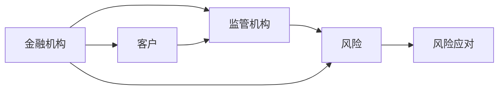

                 


# 《金融产品创新风险评估框架》

> 关键词：金融创新，风险评估，风险框架，风险模型，系统设计，算法原理，项目实战

> 摘要：本文构建了一个全面的金融产品创新风险评估框架，涵盖了背景分析、核心概念、算法原理、系统设计、项目实战和最佳实践等关键内容。通过层次分析法和模糊综合评价法，结合数学模型和系统架构设计，提供了一套可操作的风险评估方法。文章还通过实际案例分析，展示了如何在金融产品创新中应用该框架，以降低风险，确保创新的稳健性。

---

## 第1章: 金融产品创新与风险评估背景

### 1.1 金融创新的背景与意义

#### 1.1.1 金融创新的定义与特征
金融创新是指在金融领域中，通过引入新的金融工具、产品、服务或业务模式，以满足市场多样化需求的过程。其主要特征包括创新性、风险性、收益性和适应性。

#### 1.1.2 金融创新的驱动因素
- **市场需求**：客户对个性化、多样化的金融服务需求增加。
- **技术进步**：大数据、人工智能等技术推动了金融创新。
- **政策支持**：监管机构鼓励金融创新，以促进金融体系的健康发展。
- **竞争压力**：金融机构之间的竞争迫使企业不断创新。

#### 1.1.3 金融创新对金融体系的影响
金融创新能够提升金融服务效率，降低交易成本，但同时也可能带来系统性风险，需要通过有效的风险管理来平衡。

### 1.2 风险评估的重要性

#### 1.2.1 风险评估的基本概念
风险评估是指在金融活动中，对可能面临的各种风险进行识别、量化和分析的过程。

#### 1.2.2 金融创新中的主要风险类型
- **市场风险**：由于市场波动导致的损失。
- **信用风险**：由于交易对手无法履行义务导致的损失。
- **操作风险**：由于内部操作失误或外部事件导致的损失。
- **流动性风险**：无法及时以合理价格变现资产的风险。
- **法律风险**：由于法律法规变化或不合规操作导致的风险。

#### 1.2.3 风险评估在金融产品创新中的作用
通过风险评估，金融机构可以提前识别潜在风险，制定应对策略，确保创新活动的稳健性。

### 1.3 金融产品创新风险评估框架的必要性

#### 1.3.1 当前金融创新中的风险挑战
随着金融创新的加速，风险种类和复杂性也在增加，传统的风险评估方法已难以满足需求。

#### 1.3.2 现有风险评估方法的局限性
现有方法通常单一化，难以全面覆盖金融创新中的多种风险因素。

#### 1.3.3 构建统一框架的迫切需求
构建一个统一的框架，可以整合多种风险评估方法，实现风险的全面、动态评估。

---

## 第2章: 金融产品创新风险评估框架的核心概念

### 2.1 金融产品创新风险评估框架的定义

#### 2.1.1 框架的基本构成要素
- **风险识别**：识别可能的风险来源。
- **风险量化**：量化各风险的影响程度。
- **风险评估**：综合评估整体风险。
- **风险应对**：制定应对策略。

#### 2.1.2 框架的目标与功能
框架的目标是通过系统化的方法，全面评估金融产品创新中的各种风险，并提供应对策略。

### 2.2 核心概念与联系

#### 2.2.1 金融产品创新的主要参与者
- **金融机构**：包括银行、证券公司、保险公司等。
- **监管机构**：如央行、证监会等。
- **客户**：包括个人和企业客户。

#### 2.2.2 风险来源与影响路径
风险来源于市场、信用、操作等多个方面，通过影响金融机构的收益和稳定性，最终影响金融创新的成果。

#### 2.2.3 框架中的关键实体关系（Mermaid图）



---

## 第3章: 金融产品创新风险评估框架的数学模型与算法原理

### 3.1 风险评估的基本数学模型

#### 3.1.1 风险概率计算公式
$$ P = \sum_{i=1}^{n} w_i \cdot p_i $$
其中，$w_i$ 是风险因素的权重，$p_i$ 是风险发生的概率。

#### 3.1.2 风险影响程度评估公式
$$ I = \sum_{i=1}^{n} w_i \cdot i_i $$
其中，$i_i$ 是风险因素的影响程度。

#### 3.1.3 综合风险指数计算公式
$$ CRI = \frac{\sum_{i=1}^{n} (w_i \cdot p_i \cdot i_i)}{\sum_{i=1}^{n} (w_i \cdot p_i)} $$

### 3.2 基于层次分析法（AHP）的权重计算

#### 3.2.1 层次分析法的基本原理
层次分析法是一种定性和定量相结合的决策分析方法，适用于多目标决策问题。

#### 3.2.2 权重计算的数学公式
$$ w_i = \frac{a_i}{\sum_{j=1}^{n} a_j} $$
其中，$a_i$ 是第$i$个因素的得分，$n$ 是因素总数。

#### 3.2.3 示例计算过程
假设我们有三个风险因素，其得分分别为3、5、2，总得分为10。则权重分别为0.3、0.5、0.2。

### 3.3 模糊综合评价法的应用

#### 3.3.1 模糊评价的基本概念
模糊综合评价法是一种基于模糊数学的评价方法，适用于模糊性较强的评价对象。

#### 3.3.2 模糊评价矩阵的构建
构建模糊评价矩阵，其中行代表评价指标，列代表评价等级。

#### 3.3.3 综合评价结果的计算
$$ V = \sum_{i=1}^{n} w_i \cdot R_i $$
其中，$R_i$ 是第$i$个指标的模糊评价结果，$w_i$ 是权重。

---

## 第4章: 金融产品创新风险评估框架的系统分析与架构设计

### 4.1 问题场景分析

#### 4.1.1 金融产品创新的主要场景
- 新产品开发
- 业务模式创新
- 技术应用创新

#### 4.1.2 风险评估的关键问题
- 如何全面识别风险
- 如何量化风险
- 如何制定应对策略

#### 4.1.3 系统目标与范围
开发一个支持金融产品创新风险评估的系统，实现风险的全面评估和动态管理。

### 4.2 系统功能

#### 4.2.1 风险识别模块
- 收集风险信息
- 识别风险来源

#### 4.2.2 风险量化模块
- 计算风险概率
- 评估风险影响

#### 4.2.3 风险评估模块
- 综合评估风险
- 生成风险报告

#### 4.2.4 风险应对模块
- 制定应对策略
- 监控风险变化

### 4.3 系统架构设计

#### 4.3.1 领域模型（Mermaid类图）

```mermaid
classDiagram
    class 金融机构 {
        +名称：String
        +风险评估需求：String
    }
    class 监管机构 {
        +监管政策：String
    }
    class 客户 {
        +需求：String
    }
    class 风险因素 {
        +类型：String
        +权重：Float
    }
    class 风险评估结果 {
        +风险指数：Float
        +应对策略：String
    }
    金融机构 --> 监管机构：提交需求
    监管机构 --> 客户：收集需求
    风险因素 --> 风险评估结果：影响评估
```

---

## 第5章: 金融产品创新风险评估框架的项目实战

### 5.1 环境安装

#### 5.1.1 安装Python
```bash
python --version
pip install numpy pandas scikit-learn
```

#### 5.1.2 安装依赖库
```bash
pip install matplotlib mermaid4jupyter
```

### 5.2 核心代码实现

#### 5.2.1 层次分析法实现
```python
def calculate_weights(matrix):
    total = sum(matrix)
    weights = [value / total for value in matrix]
    return weights
```

#### 5.2.2 模糊综合评价法实现
```python
def fuzzy_evaluation(matrix, weights):
    return sum([weight * value for weight, value in zip(weights, matrix)])
```

### 5.3 案例分析

#### 5.3.1 案例背景
假设某金融机构推出一款创新型理财产品，需要评估其市场风险和信用风险。

#### 5.3.2 代码实现
```python
# 示例数据
factors = [市场风险, 信用风险]
matrix = [
    [0.2, 0.5],
    [0.3, 0.3]
]
weights = calculate_weights([0.2, 0.5])
result = fuzzy_evaluation(matrix, weights)
print(result)
```

### 5.4 代码解读与分析
通过对案例的分析，我们可以看到，层次分析法和模糊综合评价法能够有效帮助金融机构量化和评估风险。

---

## 第6章: 最佳实践与小结

### 6.1 小结
通过构建金融产品创新风险评估框架，金融机构可以更全面地识别和评估风险，制定有效的应对策略。

### 6.2 注意事项
- 数据质量至关重要
- 模型需要定期更新
- 需要结合具体业务场景

### 6.3 拓展阅读
- 《风险管理与金融创新》
- 《模糊数学与风险评估》

---

## 作者信息

作者：AI天才研究院/AI Genius Institute & 禅与计算机程序设计艺术 /Zen And The Art of Computer Programming

