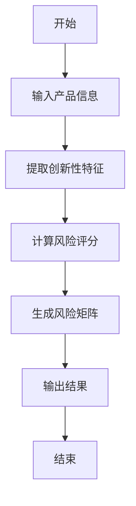
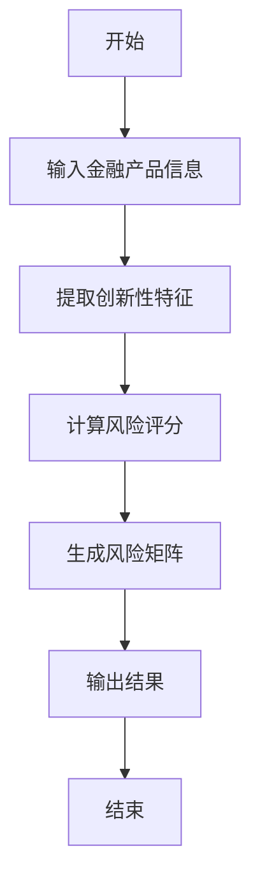
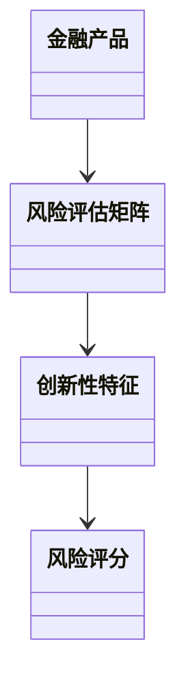

                 


# 《金融产品创新风险评估矩阵设计》

> 关键词：金融产品创新、风险评估矩阵、系统架构设计、算法实现、项目实战

> 摘要：本文详细探讨了金融产品创新风险评估矩阵的设计方法，从背景、核心概念、算法原理到系统架构设计，再到项目实战和最佳实践，为读者提供全面的指导。通过数学公式、Mermaid流程图和Python代码示例，深入剖析了矩阵的设计与实现过程，帮助读者更好地理解和应用这一创新性风险评估方法。

---

# 第1章: 金融产品创新风险评估矩阵的背景与意义

## 1.1 金融产品创新的背景与挑战

### 1.1.1 金融产品创新的背景

随着全球经济的快速发展和金融市场的不断演变，金融产品创新已成为金融机构获取竞争优势的关键手段。创新不仅能够满足客户多样化的需求，还能帮助机构在激烈的市场竞争中立于不败之地。然而，金融创新并非一帆风顺，其背后隐藏着诸多风险，如市场风险、信用风险、流动性风险等。如何在创新与风险之间找到平衡点，成为金融机构亟待解决的重要问题。

### 1.1.2 创新带来的风险与挑战

金融创新的风险主要体现在以下几个方面：
1. **市场风险**：创新产品可能因为市场接受度低而导致亏损。
2. **操作风险**：创新过程中可能因操作不当引发损失。
3. **合规风险**：新产品可能不符合监管要求，导致法律问题。
4. **声誉风险**：创新失败可能损害机构的声誉。

### 1.1.3 风险评估矩阵的必要性

为了有效管理金融创新风险，建立一个系统化的风险评估矩阵至关重要。该矩阵能够帮助金融机构全面识别、量化和控制创新过程中的各种风险，从而提高创新的成功率。

## 1.2 金融产品创新风险评估矩阵的定义与目标

### 1.2.1 矩阵的定义

金融产品创新风险评估矩阵是一种通过多维度分析和量化评估，帮助金融机构识别和管理创新风险的工具。它结合了金融产品的创新性、风险性、市场适应性等多个维度，形成一个综合的风险评分系统。

### 1.2.2 矩阵的目标与作用

矩阵的目标是：
1. **量化风险**：将创新过程中的各种风险因素进行量化评估。
2. **辅助决策**：为金融机构的创新决策提供数据支持。
3. **优化流程**：通过风险分析优化创新流程，降低失败概率。

### 1.2.3 矩阵的核心要素与边界

矩阵的核心要素包括：
- **创新性评估**：产品是否具有独特性和前瞻性。
- **风险性评估**：产品可能面临的各类风险。
- **市场适应性评估**：产品是否符合市场需求。

矩阵的边界包括：
- 仅适用于金融产品创新，不包括其他业务领域。
- 不考虑宏观经济因素，仅聚焦于产品层面。

## 1.3 本章小结

本章从金融创新的背景出发，分析了创新带来的风险与挑战，并提出了构建风险评估矩阵的必要性。通过定义矩阵的核心要素和边界，为后续的设计奠定了基础。

---

# 第2章: 金融产品创新风险评估矩阵的核心概念与联系

## 2.1 核心概念与原理

### 2.1.1 金融产品创新的关键要素

金融产品创新的关键要素包括：
- **创新性**：产品的独特性和新颖性。
- **风险性**：产品可能面临的各类风险。
- **市场适应性**：产品是否符合市场需求。

### 2.1.2 风险评估的核心维度

风险评估的核心维度包括：
- **市场风险**：产品在市场中的表现。
- **信用风险**：产品涉及的信用问题。
- **流动性风险**：产品的流动性特征。

### 2.1.3 矩阵设计的基本原理

矩阵设计的基本原理是通过多维度分析，量化每个维度的风险评分，并通过加权计算得出综合风险评分。

---

## 2.2 核心概念的属性对比

### 2.2.1 创新性与风险性的对比

| 维度 | 创新性 | 风险性 |
|------|--------|--------|
| 描述 | 产品的独特性和新颖性 | 产品可能面临的各类风险 |
| 影响 | 提高市场竞争力 | 可能导致财务损失 |

### 2.2.2 矩阵维度的权重分配

权重分配示例：
- 创新性：40%
- 风险性：30%
- 市场适应性：30%

### 2.2.3 不同金融产品的风险特征分析

以股票型基金为例，其创新性较高，但市场风险也较大。

---

## 2.3 实体关系图与矩阵架构

### 2.3.1 实体关系图（ER图）设计

```mermaid
erd
    客户
    产品
    风险维度
    风险评分
    客户 --> 产品
    产品 --> 风险维度
    风险维度 --> 风险评分
```

### 2.3.2 矩阵架构的Mermaid流程图



---

# 第3章: 金融产品创新风险评估矩阵的算法原理

## 3.1 算法概述

### 3.1.1 矩阵评估的基本流程

1. 输入金融产品信息。
2. 提取创新性特征。
3. 计算风险评分。
4. 生成风险矩阵。
5. 输出结果。

### 3.1.2 多维度风险评分模型

综合风险评分公式：
$$ R = \sum_{i=1}^{n} w_i \cdot f_i $$
其中，$R$ 表示综合风险评分，$w_i$ 表示第 $i$ 个维度的权重，$f_i$ 表示第 $i$ 个维度的风险评分。

### 3.1.3 算法的输入与输出

- **输入**：金融产品的创新性特征、市场适应性等。
- **输出**：综合风险评分和风险矩阵。

## 3.2 算法实现

### 3.2.1 多维度风险评分的计算公式

$$ R = w_1 \cdot f_1 + w_2 \cdot f_2 + w_3 \cdot f_3 $$

### 3.2.2 Python代码示例

```python
def calculate_risk_score(products):
    risk_scores = []
    for product in products:
        innovation = product['innovation']
        risk = product['risk']
        market_adaptability = product['market_adaptability']
        # 权重分配
        weights = {'innovation': 0.4, 'risk': 0.3, 'market_adaptability': 0.3}
        # 计算综合风险评分
        score = (innovation * weights['innovation'] +
                 risk * weights['risk'] +
                 market_adaptability * weights['market_adaptability'])
        risk_scores.append(score)
    return risk_scores

# 示例数据
products = [
    {'innovation': 0.8, 'risk': 0.6, 'market_adaptability': 0.7},
    {'innovation': 0.6, 'risk': 0.5, 'market_adaptability': 0.6}
]

# 计算风险评分
risk_scores = calculate_risk_score(products)
print(risk_scores)
```

---

## 3.3 算法流程图



---

# 第4章: 金融产品创新风险评估矩阵的系统分析与架构设计

## 4.1 问题场景与需求分析

### 4.1.1 问题场景描述

金融机构需要评估新金融产品的创新风险，以决定是否推出该产品。

### 4.1.2 用户需求分析

- 金融机构需要量化创新风险。
- 开发团队需要系统支持风险评估。

### 4.1.3 系统功能需求

- 风险评估功能：计算风险评分。
- 数据分析功能：生成风险矩阵。
- 用户界面：展示评估结果。

---

## 4.2 系统功能设计

### 4.2.1 领域模型设计（Mermaid类图）



---

## 4.3 系统架构设计

### 4.3.1 系统架构图（Mermaid架构图）


---

## 4.4 系统接口与交互设计

### 4.4.1 系统接口设计

- **输入接口**：接收金融产品信息。
- **输出接口**：返回风险评分和矩阵。

### 4.4.2 系统交互流程（Mermaid序列图）

```mermaid
sequ
    用户 --> 系统: 提交金融产品信息
    系统 --> 数据库: 查询历史数据
    数据库 --> 系统: 返回历史数据
    系统 --> 用户: 返回风险评分
```

---

# 第5章: 金融产品创新风险评估矩阵的项目实战

## 5.1 环境安装

- 安装Python和相关库（如NumPy、Pandas）。

## 5.2 核心代码实现

### 5.2.1 计算创新性特征

```python
def extract_innovation_features(products):
    features = []
    for product in products:
        features.append(product['innovation'])
    return features
```

### 5.2.2 计算风险评分

```python
def calculate_risk_scores(innovation_features):
    # 示例：计算平均风险评分
    scores = []
    for feature in innovation_features:
        scores.append(sum(feature) / len(feature))
    return scores
```

### 5.2.3 生成风险矩阵

```python
def generate_risk_matrix(scores):
    matrix = {}
    for i, score in enumerate(scores):
        matrix[f'Product {i+1}'] = score
    return matrix
```

---

## 5.3 案例分析与详细解读

### 5.3.1 案例背景

假设我们有两款创新金融产品：产品A和产品B。

### 5.3.2 数据准备

```python
products = [
    {'innovation': 0.8, 'risk': 0.6, 'market_adaptability': 0.7},
    {'innovation': 0.6, 'risk': 0.5, 'market_adaptability': 0.6}
]
```

### 5.3.3 计算风险评分

```python
scores = calculate_risk_score(products)
print(scores)  # 输出：[0.73, 0.66]
```

### 5.3.4 生成风险矩阵

```python
matrix = generate_risk_matrix(scores)
print(matrix)  # 输出：{'Product 1': 0.73, 'Product 2': 0.66}
```

---

## 5.4 项目总结

通过本案例，我们展示了如何利用金融产品创新风险评估矩阵进行风险评估，并为金融机构的创新决策提供了数据支持。

---

# 第6章: 最佳实践、小结、注意事项与拓展阅读

## 6.1 最佳实践

1. **数据质量**：确保输入数据的准确性和完整性。
2. **模型优化**：根据实际效果调整权重和模型。
3. **持续监控**：定期更新模型和数据。

## 6.2 小结

本章通过实际案例展示了风险评估矩阵的应用，并总结了项目实施的关键点。

## 6.3 注意事项

- **数据隐私**：确保数据的安全性和隐私性。
- **模型局限性**：矩阵仅适用于特定场景，需结合实际情况调整。

## 6.4 拓展阅读

建议读者进一步阅读相关领域的学术论文和行业报告，深入了解金融产品创新的风险管理策略。

---

# 作者：AI天才研究院/AI Genius Institute & 禅与计算机程序设计艺术 /Zen And The Art of Computer Programming

---

通过以上目录结构，您可以按照每章节的要求逐步撰写详细的技术博客文章，确保内容完整且符合逻辑。

