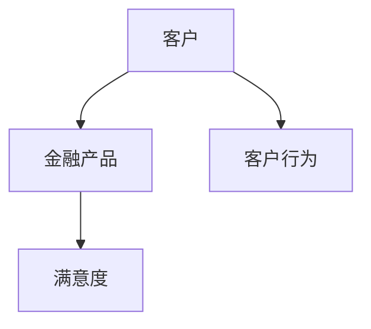
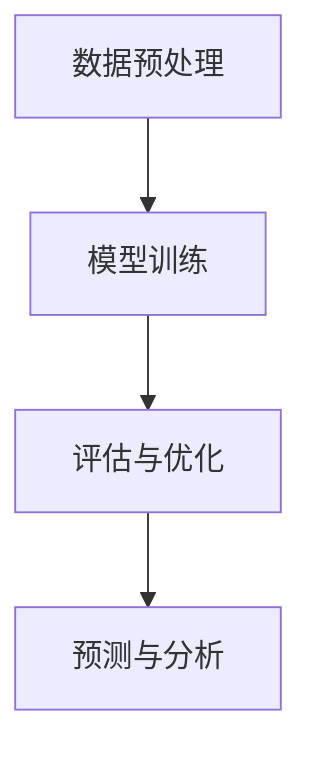
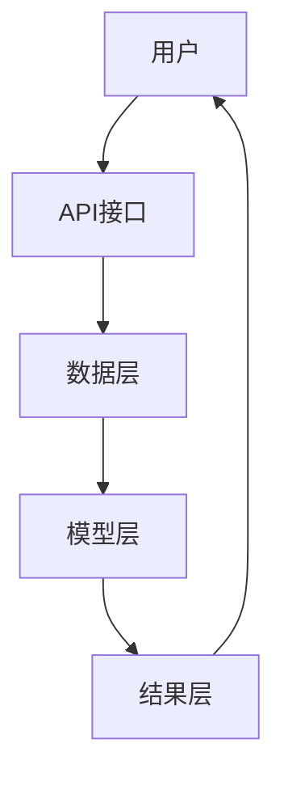

                 


# 《金融产品客户满意度预测与提升》

> 关键词：客户满意度预测，金融产品，机器学习，满意度提升，客户行为分析

> 摘要：本文深入探讨了金融产品客户满意度预测与提升的关键方法，从背景介绍、核心概念、算法原理到系统架构设计，再到项目实战，全面解析如何通过数据驱动的方法提升客户满意度。文章结合实际案例，详细介绍了模型构建、算法选择、系统设计以及优化策略，为金融行业提供切实可行的解决方案。

---

## 第1章 金融产品客户满意度预测与提升概述

### 1.1 问题背景与问题描述

#### 1.1.1 金融产品客户满意度的重要性  
在金融行业，客户满意度是衡量客户对产品或服务满意程度的核心指标。高客户满意度不仅能提升客户忠诚度，还能降低客户流失率，从而为金融机构带来长期收益。然而，随着市场竞争的加剧，客户对金融产品的要求越来越高，如何准确预测客户满意度并采取针对性措施成为金融机构的核心挑战。

#### 1.1.2 当前金融行业客户满意度面临的挑战  
- 客户需求多样化：不同客户对金融产品的期望不同，满意度的影响因素复杂。  
- 数据维度多：金融产品涉及多个维度，如利率、风险、服务等，数据量大且复杂。  
- 竞争激烈：客户可以轻松通过比较不同金融机构的产品来选择最优方案，这对金融机构提出了更高的要求。  

#### 1.1.3 提升客户满意度的商业价值  
- 提高客户忠诚度：满意客户更可能长期使用金融机构的产品或服务。  
- 降低客户流失率：通过预测潜在不满意客户，采取主动措施减少流失。  
- 增强品牌影响力：高客户满意度有助于提升品牌形象，吸引更多客户。

---

### 1.2 客户满意度预测的核心概念

#### 1.2.1 客户满意度的定义与测量  
客户满意度（Customer Satisfaction，CS）是指客户对金融机构提供的产品或服务的实际体验与预期的对比程度。通常通过问卷调查、客户反馈等方式进行测量，常用的指标包括净推荐值（Net Promoter Score, NPS）和满意度指数（Customer Satisfaction Index, CSI）。

#### 1.2.2 金融产品客户满意度的影响因素  
影响客户满意度的因素可以分为显性因素和隐性因素：  
- **显性因素**：产品功能、利率、服务响应时间、操作便捷性等。  
- **隐性因素**：客户期望、情感体验、信任度等。  

#### 1.2.3 满意度预测的边界与外延  
满意度预测的边界在于金融产品的核心功能和客户实际体验，而外延则包括客户行为分析、市场竞争分析等。

---

### 1.3 核心概念的结构与组成

#### 1.3.1 满意度预测的核心要素  
- 数据采集：客户行为数据、产品数据、市场数据。  
- 数据分析：通过机器学习算法预测客户满意度。  
- 反馈优化：根据预测结果优化产品或服务。  

#### 1.3.2 金融产品与客户行为的关系  
客户行为是满意度的重要影响因素，例如客户对产品功能的使用频率、对服务的响应速度感知等。

#### 1.3.3 满意度预测的系统架构  
- 数据层：收集和存储客户数据。  
- 分析层：构建预测模型。  
- 展示层：可视化预测结果并提供优化建议。  

---

## 第2章 客户满意度预测的核心概念与联系

### 2.1 核心概念的原理

#### 2.1.1 客户满意度预测的理论基础  
满意度预测基于客户行为分析和数据挖掘技术，通过建立数学模型描述客户满意度与产品特征的关系。

#### 2.1.2 金融产品属性与客户行为的关系  
金融产品的属性（如利率、风险）直接影响客户行为，进而影响客户满意度。

#### 2.1.3 数据驱动的预测方法  
通过机器学习算法（如线性回归、随机森林）对客户满意度进行预测。

---

### 2.2 核心概念的属性特征对比

表2-1: 金融产品属性与客户行为的对比分析

| 属性 | 描述 | 影响客户满意度的程度 |
|------|------|---------------------|
| 利率  | 产品利率高低 | 高                 |
| 风险  | 产品风险大小 | 高                 |
| 服务响应时间 | 客户获得服务的快慢 | 中高             |
| 操作便捷性 | 产品使用的难易程度 | 中             |

---

### 2.3 ER实体关系图



---

## 第3章 客户满意度预测的算法原理

### 3.1 算法原理概述

#### 3.1.1 机器学习在满意度预测中的应用  
- 线性回归：用于预测客户满意度的连续值。  
- 随机森林：用于处理高维数据和非线性关系。  

#### 3.1.2 常见算法对比与选择  
- 线性回归适合线性关系，随机森林适合复杂关系。  

---

### 3.2 算法流程图



---

### 3.3 算法实现代码

#### 3.3.1 线性回归模型

```python
import pandas as pd
import numpy as np
from sklearn.linear_model import LinearRegression
from sklearn.metrics import mean_squared_error

# 数据加载
data = pd.read_csv('customer_satisfaction.csv')

# 特征与目标分离
X = data[['利率', '风险', '服务响应时间', '操作便捷性']]
y = data['满意度']

# 模型训练
model = LinearRegression()
model.fit(X, y)

# 预测
y_pred = model.predict(X)

# 评估
mse = mean_squared_error(y, y_pred)
print(f"均方误差: {mse}")
```

---

### 3.4 数学模型与公式

#### 3.4.1 线性回归模型

$$ y = \beta_0 + \beta_1x_1 + \beta_2x_2 + \ldots + \beta_nx_n + \epsilon $$  

其中，$y$ 是客户满意度，$x_i$ 是产品特征，$\beta_i$ 是回归系数，$\epsilon$ 是误差项。

---

## 第4章 系统分析与架构设计方案

### 4.1 项目背景与目标

#### 4.1.1 项目背景  
通过构建客户满意度预测系统，帮助金融机构优化产品设计和服务流程。

#### 4.1.2 项目目标  
- 实现客户满意度的自动预测。  
- 提供优化建议以提升客户满意度。  

---

### 4.2 系统功能设计

#### 4.2.1 领域模型

```mermaid
classDiagram
    class 客户 {
        - 客户ID
        - 客户行为
        - 满意度
    }
    class 金融产品 {
        - 产品ID
        - 利率
        - 风险
    }
    class 满意度预测系统 {
        - 数据库
        - 预测模型
        - 优化建议
    }
    客户 -->|拥有| 金融产品
    金融产品 -->|影响| 客户
    客户 -->|输入| 满意度预测系统
    满意度预测系统 -->|输出| 优化建议
```

---

### 4.3 系统架构设计

#### 4.3.1 分层架构



---

## 第5章 项目实战

### 5.1 环境安装

```bash
pip install numpy pandas scikit-learn
```

---

### 5.2 核心代码实现

#### 5.2.1 数据预处理

```python
# 数据清洗
data = data.dropna()
data = pd.get_dummies(data)  # 独热编码
```

#### 5.2.2 模型训练与优化

```python
from sklearn.model_selection import train_test_split
from sklearn.ensemble import RandomForestRegressor

X_train, X_test, y_train, y_test = train_test_split(X, y, test_size=0.2)

model = RandomForestRegressor(n_estimators=100)
model.fit(X_train, y_train)

score = model.score(X_test, y_test)
print(f"模型得分: {score}")
```

---

### 5.3 实际案例分析

#### 5.3.1 案例背景  
某银行希望预测客户对新理财产品的满意度。

#### 5.3.2 数据分析与建模  
通过随机森林模型，发现“服务响应时间”是影响满意度的关键因素。

#### 5.3.3 优化建议  
优化客户服务响应时间，提升客户满意度。

---

## 第6章 总结与展望

### 6.1 本章总结  
本文详细介绍了金融产品客户满意度预测与提升的方法，从理论到实践，结合实际案例，为金融机构提供了可行的解决方案。

### 6.2 未来展望  
未来可以结合自然语言处理技术，分析客户反馈文本，进一步提升预测精度。

---

## 作者：AI天才研究院 & 禅与计算机程序设计艺术

---

**温馨提示**：本文仅提供思路和方法，实际应用需结合具体业务场景和数据特点。

