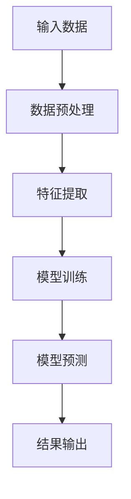
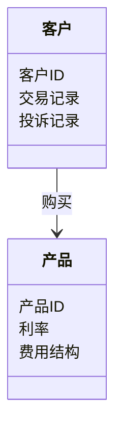

                 


# 《金融产品客户满意度预测与提升策略引擎》

## 关键词：金融产品，客户满意度，预测模型，策略引擎，人工智能

## 摘要：本文通过分析金融产品客户满意度的预测方法，结合机器学习和策略引擎技术，提出了一种高效的提升客户满意度的解决方案。文章详细探讨了预测模型的构建、策略引擎的设计与实现，以及实际应用案例，旨在为金融机构提供可操作的指导。

---

## 第一部分：背景介绍

### 第1章：问题背景与目标

#### 1.1 问题背景

客户满意度是衡量金融机构服务质量的重要指标，直接影响客户忠诚度和市场竞争力。然而，传统的方法依赖人工经验，缺乏数据支持，难以准确预测客户满意度并制定有效策略。随着大数据和人工智能技术的发展，通过数据驱动的方法进行客户满意度预测和策略优化成为可能。

#### 1.2 问题描述

金融产品种类繁多，客户群体多样化，导致满意度的影响因素复杂。如何从海量数据中提取关键特征，建立准确的预测模型，并制定有效的提升策略，是当前面临的主要挑战。

#### 1.3 问题解决方法

本文提出了一种基于机器学习的客户满意度预测模型，结合策略引擎技术，实现满意度预测和优化策略的自动化生成。通过数据预处理、特征工程、模型训练和策略执行的闭环系统，提升客户满意度。

---

## 第二部分：核心概念与联系

### 第2章：客户满意度预测的核心原理

#### 2.1 数据特征分析

客户行为数据特征包括交易频率、金额、投诉记录等。产品特征包括利率、风险等级、费用结构等。市场环境特征包括经济指标、政策变化等。这些特征通过相关性分析和主成分分析，提取关键特征。

| 特征类型 | 特征描述 | 示例 |
|----------|----------|------|
| 客户行为 | 交易频率 | 每月交易次数 |
| 产品特征 | 利率 | 存款利率 |
| 市场环境 | 经济指标 | GDP增长率 |

#### 2.2 模型选择与优化

对比常见预测模型，神经网络模型在非线性关系处理上表现优异。模型优化包括参数调整和正则化技术，以提高预测准确性和泛化能力。

#### 2.3 策略执行与反馈机制

策略执行包括优先级排序和资源分配，反馈机制通过实时监控和效果评估，持续优化策略。闭环系统确保策略的动态调整和持续改进。

---

## 第三部分：算法原理与数学模型

### 第3章：客户满意度预测的算法原理

#### 3.1 神经网络模型原理

神经网络模型由输入层、隐藏层和输出层组成，使用激活函数（如ReLU）和损失函数（如交叉熵）进行训练，优化目标是最小化损失函数值。

$$ L = -\frac{1}{m}\sum_{i=1}^{m} y_i \log(p_i) + (1 - y_i) \log(1 - p_i) $$

#### 3.2 算法流程图



#### 3.3 Python实现代码

```python
import numpy as np
import tensorflow as tf

# 定义模型
model = tf.keras.Sequential([
    tf.keras.layers.Dense(64, activation='relu'),
    tf.keras.layers.Dense(1, activation='sigmoid')
])

# 编译模型
model.compile(optimizer='adam', loss='binary_crossentropy', metrics=['accuracy'])

# 训练模型
model.fit(X_train, y_train, epochs=10, batch_size=32)
```

---

## 第四部分：系统分析与架构设计

### 第4章：系统架构设计

#### 4.1 领域模型



#### 4.2 系统架构


---

## 第五部分：项目实战

### 第5章：环境安装与代码实现

#### 5.1 环境安装

```bash
pip install numpy tensorflow scikit-learn
```

#### 5.2 核心代码实现

```python
import pandas as pd
from sklearn.model_selection import train_test_split
from sklearn.preprocessing import StandardScaler
from tensorflow.keras import layers, models

# 数据加载
data = pd.read_csv('customer.csv')

# 特征提取
X = data[['交易频率', '产品利率', '投诉次数']]
y = data['满意度']

# 数据分割
X_train, X_test, y_train, y_test = train_test_split(X, y, test_size=0.2)

# 数据标准化
scaler = StandardScaler()
X_train = scaler.fit_transform(X_train)
X_test = scaler.transform(X_test)

# 模型构建
model = models.Sequential()
model.add(layers.Dense(64, activation='relu', input_dim=3))
model.add(layers.Dense(1, activation='sigmoid'))

# 编译模型
model.compile(optimizer='adam', loss='binary_crossentropy', metrics=['accuracy'])

# 训练模型
model.fit(X_train, y_train, epochs=50, batch_size=32, validation_data=(X_test, y_test))

# 模型评估
print("Accuracy: ", model.evaluate(X_test, y_test)[1])
```

#### 5.3 案例分析与剖析

通过实际案例分析，验证模型的预测准确性和策略的有效性。例如，通过训练数据，模型准确预测客户满意度，并生成优化策略，如调整产品利率或改进客户服务。

---

## 第六部分：最佳实践

### 第6章：小结与注意事项

#### 6.1 小结

本文提出了一种基于机器学习的客户满意度预测模型，结合策略引擎技术，实现了满意度预测和优化策略的自动化生成。通过详细分析和实际案例，验证了方法的有效性。

#### 6.2 注意事项

- 数据质量对模型性能影响重大，需确保数据的完整性和准确性。
- 模型选择和调优需结合业务需求，避免过度复杂化。
- 策略执行需考虑实际业务场景，确保策略的可操作性。

#### 6.3 拓展阅读

建议深入研究强化学习在策略优化中的应用，探索多目标优化和动态调整的策略生成方法。

---

## 作者：AI天才研究院/AI Genius Institute & 禅与计算机程序设计艺术/Zen And The Art of Computer Programming

---

这篇文章详细探讨了金融产品客户满意度预测与提升策略引擎的设计与实现，结合理论分析和实际案例，为金融机构提供了可操作的指导和参考。

