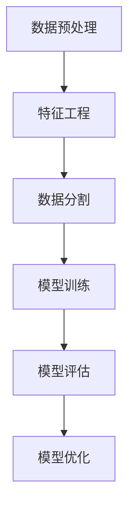
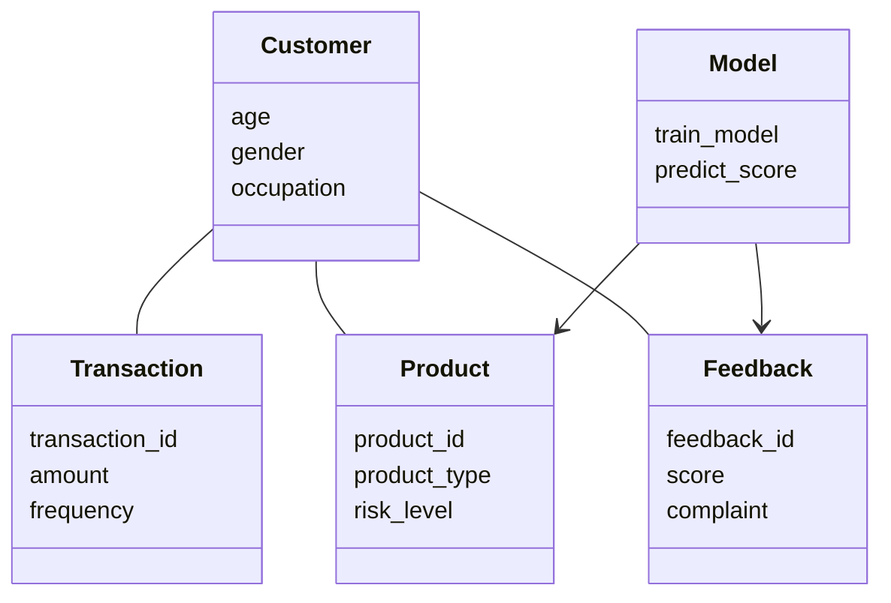
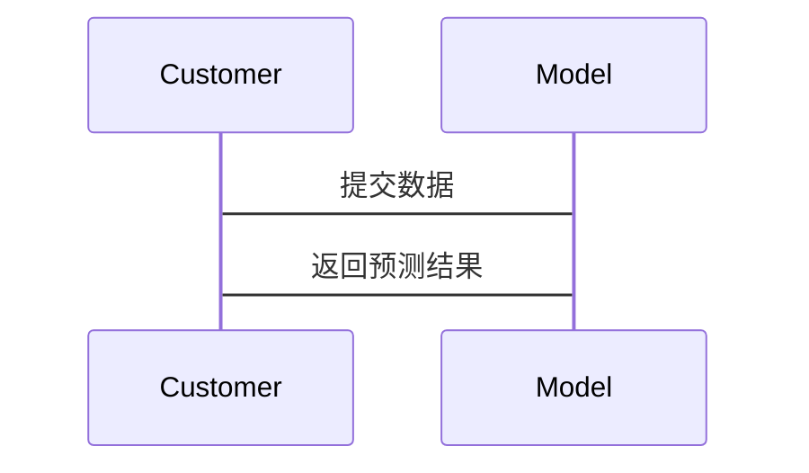

                 


# 《金融产品客户满意度预测模型》

> 关键词：客户满意度预测模型，金融产品，机器学习，数据挖掘，满意度分析，客户行为分析

> 摘要：本文详细探讨了如何利用机器学习算法构建金融产品客户满意度预测模型。从问题背景到数据准备，从算法原理到系统设计，从项目实战到模型优化，全面解析了构建客户满意度预测模型的全过程。通过理论与实践结合，展示了如何通过数据分析和模型构建，帮助金融机构提升客户满意度，优化产品设计和服务策略。

---

# 第一部分: 金融产品客户满意度预测模型概述

---

# 第1章: 金融产品客户满意度预测模型背景与概述

## 1.1 问题背景

### 1.1.1 金融产品客户满意度的重要性
金融产品的客户满意度是衡量客户对产品和服务的满意程度的重要指标。高客户满意度不仅能够提高客户忠诚度，还能间接提升金融机构的市场竞争力和盈利能力。然而，随着市场竞争的加剧，客户的需求日益多样化，金融机构如何通过数据分析和预测模型来优化产品设计和服务流程，成为一个重要的挑战。

### 1.1.2 当前客户满意度预测的挑战
传统的客户满意度调查通常依赖于问卷和人工分析，这种方式不仅耗时，而且难以捕捉到实时的客户反馈。此外，金融产品的复杂性和多样性使得客户满意度的预测需要结合多维度的数据，如客户行为、产品特性、市场环境等。

### 1.1.3 机器学习在客户满意度预测中的应用
机器学习算法能够从海量数据中提取特征，并通过训练模型来预测客户满意度。这种方法不仅提高了预测的效率，还能够发现一些传统方法难以察觉的模式和规律。

## 1.2 问题描述

### 1.2.1 客户满意度的定义
客户满意度是指客户对金融机构提供的产品或服务的满意程度。通常通过问卷调查或客户反馈数据来衡量。

### 1.2.2 金融产品客户满意度预测的目标
通过分析客户的特征、行为和反馈数据，构建一个预测模型，准确预测客户对金融产品的满意度。

### 1.2.3 数据来源与特征分析
数据来源可能包括客户的基本信息（如年龄、性别、职业）、交易记录（如投资金额、交易频率）、产品使用情况（如产品种类、使用时长）以及客户反馈（如满意度评分、投诉记录）。

## 1.3 问题解决

### 1.3.1 机器学习模型的选择
根据数据特征和问题类型，选择合适的机器学习算法。常用的算法包括逻辑回归、随机森林、支持向量机（SVM）和神经网络等。

### 1.3.2 数据预处理与特征工程
数据预处理包括数据清洗（处理缺失值、异常值）和数据标准化/归一化。特征工程则包括特征选择和特征构建，以提高模型的性能。

### 1.3.3 模型训练与评估
通过训练数据对模型进行训练，并使用验证数据进行模型调优。评估指标包括准确率、召回率、F1分数等。

## 1.4 边界与外延

### 1.4.1 模型的适用范围
该模型适用于金融机构对现有客户或潜在客户的满意度预测，但需要确保数据质量和模型的泛化能力。

### 1.4.2 模型的局限性
模型的预测结果依赖于数据质量和算法选择。此外，客户满意度的预测还受到外部环境因素（如市场波动、经济政策）的影响，这些因素可能无法完全体现在模型中。

### 1.4.3 模型的可扩展性
模型可以根据实际需求进行扩展，例如引入时间序列分析，以预测客户满意度的变化趋势。

## 1.5 概念结构与核心要素

### 1.5.1 核心概念的组成
客户满意度预测模型由数据、算法、特征和评估指标四个核心要素组成。

### 1.5.2 概念之间的关系
数据是模型的输入，算法是模型的核心，特征是数据的关键部分，评估指标是模型性能的衡量标准。

### 1.5.3 模型的核心要素
- 数据特征：客户的基本信息、交易记录、产品使用情况、客户反馈。
- 算法选择：逻辑回归、随机森林、SVM、神经网络等。
- 模型评估：准确率、召回率、F1分数等。

## 1.6 本章小结

---

# 第2章: 金融产品客户满意度预测的核心概念与联系

## 2.1 核心概念原理

### 2.1.1 客户满意度的度量方法
客户满意度可以通过客户调查问卷、客户反馈评分等方式进行度量。常用的方法包括 Likert量表和语义分割法。

### 2.1.2 金融产品的分类与特征
金融产品可以根据类型（如存款、贷款、保险、投资产品）和风险等级进行分类。不同类型的金融产品具有不同的客户满意度特征。

### 2.1.3 模型的输入与输出
输入：客户特征、产品特征、交易记录、客户反馈。
输出：客户满意度预测结果（如高、中、低）。

## 2.2 核心概念属性特征对比表格

| 特征类别 | 特征描述 | 示例 |
|----------|----------|------|
| 客户特征 | 年龄、性别、职业 | 年龄：30-60岁，性别：男/女，职业：白领/蓝领 |
| 产品特征 | 产品类型、产品风险 | 产品类型：定期存款、活期存款；产品风险：低、中、高 |
| 交易特征 | 交易金额、交易频率 | 交易金额：1万-50万，交易频率：每周1-3次 |
| 反馈特征 | 满意度评分、投诉记录 | 满意度评分：1-5分，投诉记录：有/无 |

## 2.3 ER实体关系图架构

```mermaid
erDiagram
    customer[客户] {
        age : INT
        gender : VARCHAR
        occupation : VARCHAR
        customer_id : INT
    }
    product[金融产品] {
        product_id : INT
        product_type : VARCHAR
        risk_level : VARCHAR
    }
    transaction[交易记录] {
        transaction_id : INT
        amount : DECIMAL
        frequency : VARCHAR
    }
    feedback[客户反馈] {
        feedback_id : INT
        score : INT
        complaint : BOOLEAN
    }
    customer --|{拥有}| transaction
    customer --|{参与}| product
    customer --|{提交}| feedback
```

---

## 2.4 本章小结

---

# 第3章: 金融产品客户满意度预测模型的算法原理

## 3.1 算法原理概述

### 3.1.1 机器学习算法的选择
根据数据特征和问题类型，选择逻辑回归或随机森林作为预测模型。

### 3.1.2 算法的优缺点分析
- 逻辑回归：适用于二分类问题，易于解释。
- 随机森林：适用于多分类问题，具有高精度和鲁棒性。

### 3.1.3 算法的适用场景
- 逻辑回归适用于线性可分问题。
- 随机森林适用于非线性复杂问题。

## 3.2 算法流程图



## 3.3 算法的数学模型与公式

### 3.3.1 逻辑回归模型
逻辑回归的sigmoid函数：
$$ P(y=1) = \frac{1}{1 + e^{-\beta x}} $$

### 3.3.2 随机森林模型
随机森林通过集成多个决策树的预测结果，提高模型的准确性和鲁棒性。

---

## 3.4 本章小结

---

# 第4章: 金融产品客户满意度预测模型的系统分析与架构设计

## 4.1 系统分析

### 4.1.1 问题场景介绍
金融机构希望通过客户满意度预测模型，优化产品设计和服务流程。

### 4.1.2 项目介绍
本项目旨在构建一个客户满意度预测系统，帮助金融机构提高客户满意度。

## 4.2 系统功能设计

### 4.2.1 领域模型类图


### 4.2.2 系统架构设计


## 4.3 系统接口设计

### 4.3.1 系统交互序列图


## 4.4 本章小结

---

# 第5章: 金融产品客户满意度预测模型的项目实战

## 5.1 环境配置

### 5.1.1 安装Python环境
使用Anaconda安装Python 3.8及以上版本。

### 5.1.2 安装机器学习库
安装scikit-learn、pandas、numpy等库。

## 5.2 数据集获取

### 5.2.1 数据获取方法
从金融机构内部系统或公开数据集获取客户数据。

### 5.2.2 数据格式
数据格式为CSV，包含客户特征、产品特征、交易记录和客户反馈。

## 5.3 数据预处理与特征工程

### 5.3.1 数据清洗
处理缺失值和异常值。

### 5.3.2 特征工程
进行特征选择和特征构建。

## 5.4 模型训练与评估

### 5.4.1 模型训练
使用逻辑回归或随机森林对数据进行训练。

### 5.4.2 模型评估
通过准确率、召回率和F1分数评估模型性能。

## 5.5 实际案例分析

### 5.5.1 案例背景
以某银行的客户满意度预测为例。

### 5.5.2 模型实现
通过代码实现模型训练和预测。

### 5.5.3 模型结果分析
分析模型的预测结果，优化模型参数。

## 5.6 本章小结

---

# 第6章: 金融产品客户满意度预测模型的优化与评估

## 6.1 模型优化

### 6.1.1 超参数调优
通过网格搜索或随机搜索优化模型参数。

### 6.1.2 特征选择
使用特征重要性分析选择关键特征。

## 6.2 模型评估

### 6.2.1 模型性能对比
对比不同算法的准确率、召回率和F1分数。

### 6.2.2 模型效果分析
分析模型的混淆矩阵和 ROC 曲线。

## 6.3 本章小结

---

# 第7章: 金融产品客户满意度预测模型的最佳实践与展望

## 7.1 最佳实践 tips

### 7.1.1 数据质量的重要性
确保数据的完整性和准确性。

### 7.1.2 模型选择的灵活性
根据数据特征和业务需求选择合适的算法。

## 7.2 小结

### 7.2.1 项目总结
通过机器学习算法构建客户满意度预测模型，能够帮助金融机构优化产品设计和服务流程。

## 7.3 注意事项

### 7.3.1 模型的局限性
模型的预测结果依赖于数据质量和算法选择。

### 7.3.2 数据隐私问题
在处理客户数据时，需要注意数据隐私和合规性。

## 7.4 拓展阅读

### 7.4.1 相关书籍
推荐阅读《机器学习实战》和《金融数据分析与挖掘》。

### 7.4.2 相关技术博客
推荐关注技术博客，了解最新的机器学习算法和技术动态。

## 7.5 本章小结

---

# 作者：AI天才研究院/AI Genius Institute & 禅与计算机程序设计艺术 /Zen And The Art of Computer Programming

---

本文通过系统的分析和实践，详细探讨了金融产品客户满意度预测模型的构建过程。从背景分析到算法选择，从系统设计到项目实战，从模型优化到效果评估，全面解析了客户满意度预测模型的构建方法。通过本文的学习，读者可以掌握如何利用机器学习算法，结合实际业务需求，构建高效的客户满意度预测模型。

