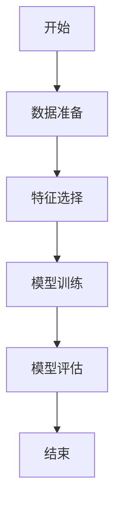
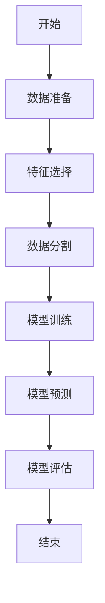
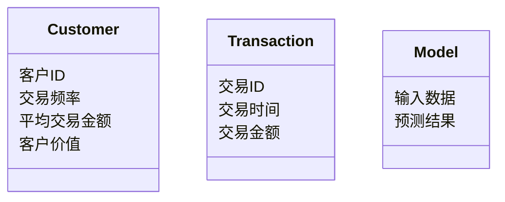
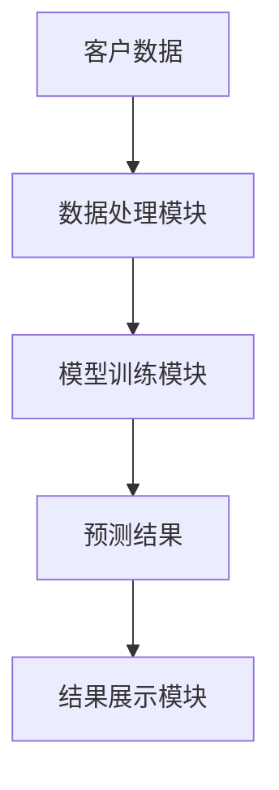
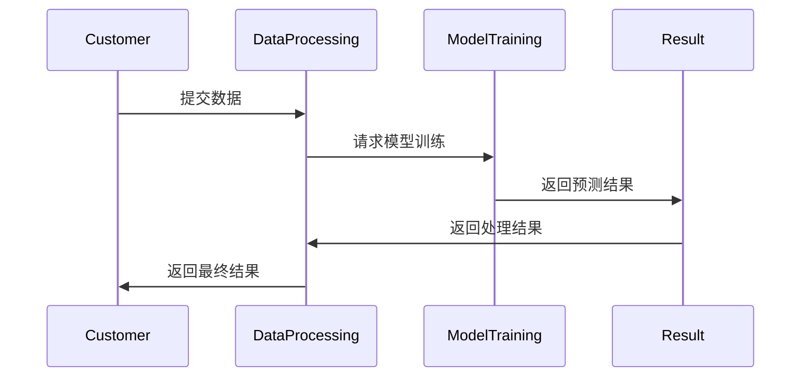

                 


# 《金融产品客户终身价值预测与提升策略》

> 关键词：客户终身价值（CLV）、金融产品、客户价值管理、预测模型、数据驱动、客户分层、提升策略

> 摘要：本文系统地探讨了金融产品客户终身价值（CLV）的预测与提升策略。通过分析CLV的核心概念、算法原理、系统架构及实际案例，本文旨在帮助金融机构优化客户管理策略，提升客户忠诚度和盈利能力。从理论到实践，本文详细阐述了如何通过数据驱动的方法实现客户价值的最大化。

---

# 第一部分：金融产品客户终身价值预测与提升策略概述

## 第1章：客户终身价值（CLV）的基本概念

### 1.1 什么是客户终身价值（CLV）

客户终身价值（Customer Lifetime Value, CLV）是指一个客户在其生命周期内为公司带来的总收益或贡献的总和。在金融产品领域，CLV不仅考虑客户的当前价值，还包括客户未来可能带来的收入和利润。CLV的计算通常需要考虑客户的历史交易数据、行为特征以及市场环境等因素。

$$ CLV = \text{客户在未来生命周期内带来的总收益} - \text{客户获取和维护的总成本} $$

### 1.2 CLV在金融产品中的重要性

在金融行业，客户终身价值是衡量客户价值的重要指标。通过CLV，金融机构可以识别高价值客户，优化资源配置，制定个性化的客户管理策略，从而提高客户忠诚度和盈利能力。此外，CLV还可以帮助金融机构预测客户流失风险，提前采取措施保留高价值客户。

### 1.3 CLV的核心要素与计算公式

CLV的核心要素包括：

1. **客户收入贡献**：客户在生命周期内带来的总收入。
2. **成本**：获取和维护客户所花费的总成本。
3. **时间价值**：考虑资金的时间价值，通常通过贴现率进行调整。

计算CLV的常用公式如下：

$$ CLV = \frac{\text{客户年收入贡献} \times (1 - \frac{1}{(1 + \text{贴现率})^{\text{生命周期长度}}})}{\text{贴现率}} $$

---

## 第2章：客户价值管理的背景与挑战

### 2.1 金融行业客户价值管理的现状

随着金融行业的竞争加剧，客户价值管理已成为金融机构的核心竞争力之一。传统的客户管理方法往往基于客户的历史交易数据，缺乏对客户未来行为的预测和分析。而通过大数据和人工智能技术，金融机构可以更精准地预测客户的价值和行为，从而优化客户管理策略。

### 2.2 客户流失与客户忠诚度问题

客户流失是金融行业面临的一个重要问题。根据研究，客户的流失往往会导致金融机构的收入下降，而获取新客户的成本远高于保留现有客户的成本。因此，如何通过CLV预测模型识别高流失风险客户，并采取针对性措施，是提升客户忠诚度的关键。

### 2.3 数据驱动的客户价值管理趋势

随着大数据和人工智能技术的快速发展，数据驱动的客户价值管理已成为行业趋势。通过分析客户的交易数据、行为数据和市场数据，金融机构可以更精准地预测客户的价值和行为，制定个性化的客户管理策略。

---

# 第二部分：客户终身价值预测的核心概念与模型

## 第3章：客户终身价值预测的理论基础

### 3.1 客户价值预测的数学模型

#### 3.1.1 简单线性回归模型

线性回归是一种常用的客户价值预测模型。其基本假设是客户的价值与某些特征变量（如交易频率、平均交易金额）之间存在线性关系。简单线性回归模型的公式如下：

$$ y = \beta_0 + \beta_1x + \epsilon $$

其中，$y$ 是客户价值，$x$ 是特征变量，$\beta_0$ 和 $\beta_1$ 是回归系数，$\epsilon$ 是误差项。

#### 3.1.2 时间序列分析模型

时间序列分析模型适用于预测客户在未来一段时间内的价值变化。常用的时间序列模型包括ARIMA（自回归积分滑动平均模型）和指数平滑法（Exponential Smoothing）。以ARIMA模型为例，其基本公式为：

$$ y_t = \phi_1 y_{t-1} + \phi_2 y_{t-2} + \theta_1 \epsilon_{t-1} + \epsilon_t $$

其中，$y_t$ 是当前时间点的客户价值，$\phi_1$ 和 $\phi_2$ 是自回归系数，$\theta_1$ 是滑动平均系数，$\epsilon_t$ 是误差项。

#### 3.1.3 集成学习模型

集成学习模型（如随机森林和梯度提升树）是一种基于机器学习的客户价值预测方法。这些模型能够处理高维数据和非线性关系，通常比线性回归模型更准确。以随机森林为例，其基本思想是通过构建多个决策树并集成其预测结果来提高预测精度。

### 3.2 客户行为分析与特征工程

#### 3.2.1 客户行为数据的特征提取

客户行为数据通常包括交易频率、平均交易金额、客户留存率、客户活跃度等指标。这些特征可以用来预测客户的未来价值。

#### 3.2.2 数据清洗与预处理

在进行客户价值预测之前，需要对数据进行清洗和预处理。这包括处理缺失值、异常值和重复值，以及对数据进行标准化或归一化处理。

#### 3.2.3 特征选择与降维技术

特征选择的目的是找到对客户价值影响最大的特征，常用的方法包括逐步回归、Lasso回归和基于树模型的特征重要性分析。降维技术（如主成分分析，PCA）则可以将高维特征空间降到低维空间，提高模型的训练效率和预测精度。

### 3.3 客户分层与细分策略

#### 3.3.1 基于RFM模型的客户分层

RFM模型是一种常用的客户分层方法，基于客户最近一次交易（Recency）、交易频率（Frequency）和交易金额（Monetary）进行客户分层。RFM模型可以帮助金融机构识别高价值客户、中价值客户和低价值客户。

#### 3.3.2 客户生命周期阶段划分

客户生命周期通常包括以下几个阶段：

1. **新客户阶段**：客户刚刚加入，尚未形成稳定的交易习惯。
2. **成长阶段**：客户的交易频率和金额逐渐增加。
3. **成熟阶段**：客户进入稳定交易阶段，贡献价值最大。
4. **衰退阶段**：客户的交易频率和金额开始下降，可能面临流失风险。

#### 3.3.3 不同客户群体的特征对比

通过对比不同客户群体的特征，金融机构可以制定针对性的客户管理策略。例如，针对高价值客户，可以提供个性化的服务和优惠；针对低价值客户，可以采取营销活动提升其价值。

---

## 第4章：客户终身价值预测的算法原理与实现

### 4.1 线性回归模型的实现

#### 4.1.1 算法流程图



#### 4.1.2 Python代码实现

```python
import pandas as pd
import numpy as np
from sklearn.linear_model import LinearRegression
from sklearn.metrics import mean_squared_error

# 数据准备
data = pd.read_csv('customer_data.csv')
X = data[['交易频率', '平均交易金额']]
y = data['客户价值']

# 模型训练
model = LinearRegression()
model.fit(X, y)

# 模型预测
y_pred = model.predict(X)

# 模型评估
mse = mean_squared_error(y, y_pred)
print(f"均方误差：{mse}")
```

### 4.2 集成学习模型的实现

#### 4.2.1 随机森林模型的流程图



#### 4.2.2 Python代码实现

```python
import pandas as pd
import numpy as np
from sklearn.ensemble import RandomForestRegressor
from sklearn.metrics import mean_absolute_error
from sklearn.model_selection import train_test_split

# 数据准备
data = pd.read_csv('customer_data.csv')
X = data[['交易频率', '平均交易金额', '客户留存率']]
y = data['客户价值']

# 数据分割
X_train, X_test, y_train, y_test = train_test_split(X, y, test_size=0.2, random_state=42)

# 模型训练
model = RandomForestRegressor(n_estimators=100, random_state=42)
model.fit(X_train, y_train)

# 模型预测
y_pred = model.predict(X_test)

# 模型评估
mae = mean_absolute_error(y_test, y_pred)
print(f"平均绝对误差：{mae}")
```

---

## 第5章：系统分析与架构设计方案

### 5.1 问题场景介绍

本项目的目标是通过客户数据预测客户终身价值，并制定提升策略。问题场景包括：

1. 数据采集与处理
2. 模型训练与评估
3. 结果展示与分析

### 5.2 系统功能设计

#### 5.2.1 领域模型



#### 5.2.2 系统架构设计



### 5.3 系统交互设计



---

## 第6章：项目实战

### 6.1 环境安装与数据准备

1. 安装必要的库：
   ```bash
   pip install pandas numpy scikit-learn
   ```

2. 数据准备：
   ```python
   import pandas as pd
   data = pd.read_csv('customer_data.csv')
   ```

### 6.2 核心代码实现

1. 数据清洗与特征选择：
   ```python
   # 删除缺失值
   data.dropna(inplace=True)
   # 标准化处理
   from sklearn.preprocessing import StandardScaler
   scaler = StandardScaler()
   X_scaled = scaler.fit_transform(data[['交易频率', '平均交易金额']])
   ```

2. 模型训练与评估：
   ```python
   from sklearn.ensemble import RandomForestRegressor
   model = RandomForestRegressor(n_estimators=100, random_state=42)
   model.fit(X_scaled, data['客户价值'])
   ```

3. 结果展示：
   ```python
   import matplotlib.pyplot as plt
   plt.scatter(data['客户价值'], model.predict(X_scaled))
   plt.xlabel('实际价值')
   plt.ylabel('预测价值')
   plt.show()
   ```

### 6.3 案例分析与结果解读

通过上述代码实现，我们可以得到客户终身价值的预测结果。例如，对于一个高交易频率和高平均交易金额的客户，模型预测其终身价值较高，因此可以制定针对性的客户保留策略。

---

## 第7章：最佳实践与小结

### 7.1 最佳实践

1. 数据质量是预测模型的基础，需确保数据的完整性和准确性。
2. 根据客户特征选择合适的模型，避免过度拟合。
3. 定期更新模型，以适应市场环境和客户行为的变化。

### 7.2 本章小结

本文详细探讨了金融产品客户终身价值预测与提升策略的核心概念、算法原理和系统架构。通过实际案例分析，展示了如何利用大数据和人工智能技术优化客户管理策略。未来的研究方向包括引入更复杂的模型（如深度学习）和实时预测技术，以进一步提升客户价值预测的准确性和实时性。

---

# 作者：AI天才研究院/AI Genius Institute & 禅与计算机程序设计艺术 /Zen And The Art of Computer Programming

