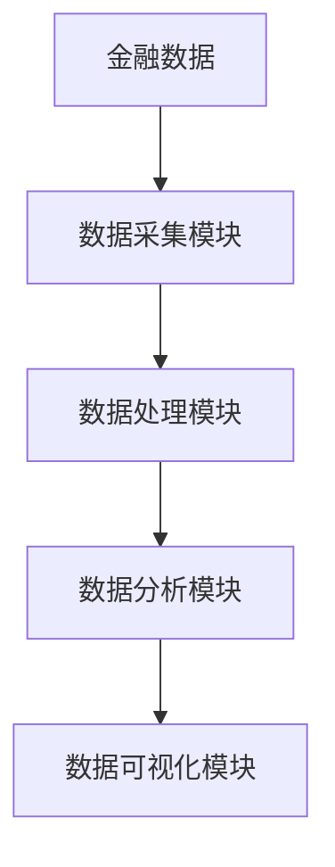
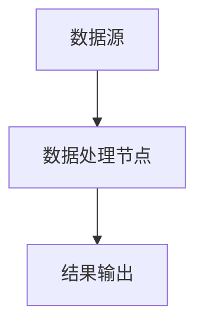
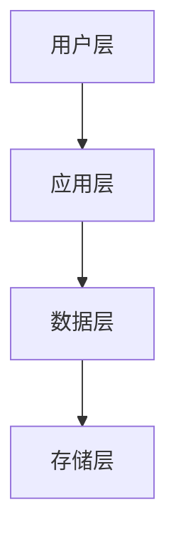
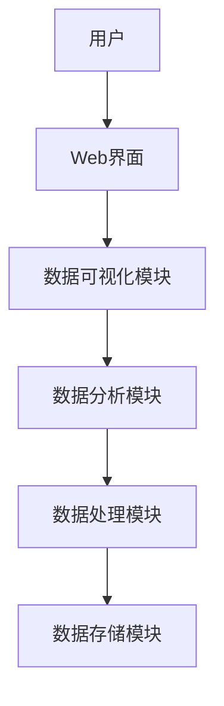

                 


# 《金融大数据实时处理与分析平台》

## 关键词：金融大数据、实时处理、数据可视化、机器学习、分布式系统、流数据处理

## 摘要：本文详细介绍了金融大数据实时处理与分析平台的构建与实现。从背景与挑战、核心概念、算法原理、系统架构设计到项目实战，全面剖析了平台的构建过程。通过实际案例分析和代码实现，深入探讨了流数据处理、分布式计算、机器学习等关键技术，并总结了最佳实践和注意事项。

---

## 第1章: 金融大数据实时处理与分析平台的背景与挑战

### 1.1 问题背景
金融行业每天产生海量数据，包括交易数据、市场数据、用户行为数据等。这些数据具有实时性高、数据量大、类型多样等特点。如何快速处理和分析这些数据，提取有价值的信息，成为金融行业的重要挑战。

### 1.2 问题描述
传统的大数据分析方法通常基于批处理，无法满足金融行业对实时性的要求。例如，高频交易需要毫秒级的响应，传统批处理无法满足这一需求。此外，金融数据的安全性和隐私保护也是重要问题。

### 1.3 问题解决
通过实时数据处理技术，可以实现对金融数据的实时分析和决策支持。例如，实时监控市场波动，及时发现异常交易，为投资者提供实时建议。

### 1.4 边界与外延
金融大数据实时处理平台的边界包括数据采集、处理、分析和可视化。外延则包括与上游数据源的集成和下游决策系统的对接。

### 1.5 核心要素
- 数据采集：实时获取金融数据。
- 数据处理：快速处理数据，提取特征。
- 数据分析：基于机器学习进行实时预测。
- 数据可视化：将分析结果以图形化方式展示。

---

## 第2章: 金融大数据实时处理与分析平台的核心概念

### 2.1 核心概念
- **大数据**：指数据量大、类型多样、处理速度快。
- **实时处理**：指对数据流进行实时处理，确保低延迟。

### 2.2 核心概念对比表

| 概念         | 特点                           |
|--------------|--------------------------------|
| 大数据       | 数据量大、类型多样、处理复杂 |
| 实时处理     | 处理速度快、低延迟           |

### 2.3 实体关系图（Mermaid）


---

## 第3章: 金融大数据实时处理与分析平台的核心算法与原理

### 3.1 流数据处理算法

#### 3.1.1 基于Flink的流处理框架


#### 3.1.2 时间窗口与事件时间
- 时间窗口：将数据流划分为多个时间窗口，进行聚合操作。
- 事件时间：数据本身携带的时间戳，用于处理乱序数据。

公式：
$$ 窗口大小 = end\_time - start\_time $$

#### 3.1.3 源代码实现
```python
from pyflink.datastream import StreamExecutionEnvironment
from pyflink.table import *

env = StreamExecutionEnvironment.get_execution_environment()
t_env = TableEnvironment.get_environment()
t_env.getConfig().set_result_type(NamedTypesConfig.RESULT_TYPE.PrintWriter)

source = t_env.from_path("input.txt")
source_window = source.window(TumblingWindow(10, 10))
source_window.select("id, count(*) as cnt") \
    .insert_into("output.txt")
```

---

## 第4章: 金融大数据实时处理与分析平台的系统架构设计

### 4.1 系统架构概述

#### 4.1.1 分层架构


#### 4.1.2 微服务架构
- 数据采集服务：实时采集金融数据。
- 数据处理服务：对数据进行清洗和转换。
- 数据分析服务：基于机器学习进行预测。
- 数据可视化服务：将结果展示给用户。

#### 4.1.3 异构系统集成
- 通过API接口与第三方数据源集成。

### 4.2 系统功能设计

#### 4.2.1 数据采集模块
- 实时采集交易数据、市场数据等。

#### 4.2.2 数据处理模块
- 数据清洗、转换、 enriching。

#### 4.2.3 数据分析模块
- 基于机器学习的实时预测。

#### 4.2.4 数据可视化模块
- 生成图表，如K线图、折线图等。

### 4.3 系统架构图（Mermaid）


### 4.4 系统接口设计

#### 4.4.1 数据接口
- REST API接口：提供数据查询服务。

#### 4.4.2 API接口
- 提供实时数据接口，如`/api/trade/data`。

#### 4.4.3 交互接口
- 用户通过Web界面进行操作。

### 4.5 系统交互流程图（Mermaid）


---

## 第5章: 金融大数据实时处理与分析平台的项目实战

### 5.1 环境搭建与配置

#### 5.1.1 开发环境搭建
- 安装Python、Java、Flink。

#### 5.1.2 依赖库安装
- 使用`pip install`安装所需的库，如`pyflink`。

### 5.2 核心代码实现

#### 5.2.1 数据采集代码
```python
import kafka
from kafka import KafkaConsumer

consumer = KafkaConsumer('finance_topic')
for message in consumer:
    print(message.value)
```

#### 5.2.2 数据处理代码
```python
from pyflink.datastream import StreamExecutionEnvironment
from pyflink.table import *

env = StreamExecutionEnvironment.get_execution_environment()
t_env = TableEnvironment.get_environment()
```

### 5.3 实际案例分析

#### 5.3.1 案例1：实时股票价格监控
- 使用Kafka采集股票价格数据，通过Flink进行流处理，生成实时K线图。

#### 5.3.2 案例2：异常交易检测
- 使用机器学习算法，实时检测异常交易行为。

### 5.4 项目小结
通过实际案例分析，验证了平台的可行性和有效性。代码实现展示了平台的核心功能，为后续优化提供了基础。

---

## 第6章: 最佳实践与总结

### 6.1 小结
本文详细介绍了金融大数据实时处理与分析平台的构建过程，包括背景、核心概念、算法原理、系统架构设计和项目实战。

### 6.2 注意事项
- 数据安全：确保数据加密传输和存储。
- 系统性能：优化代码，减少延迟。
- 可扩展性：设计模块化架构，便于扩展。

### 6.3 拓展阅读
- 推荐阅读《大数据技术与应用》和《实时数据处理实战》。

---

## 作者：AI天才研究院 & 禅与计算机程序设计艺术

---

以上是《金融大数据实时处理与分析平台》的完整目录和内容概要，您可以根据需要进一步扩展每一部分的内容，添加更多细节和技术实现。

