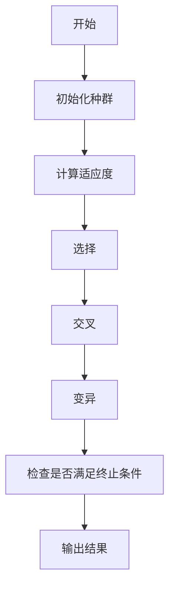
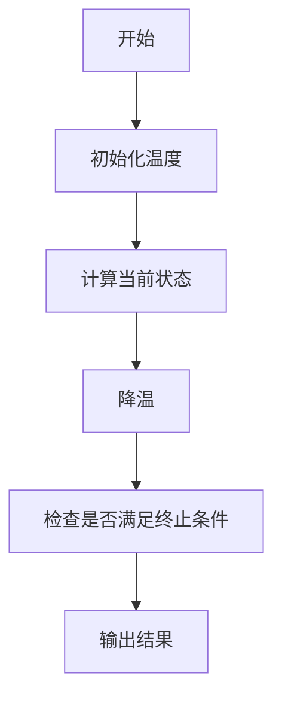
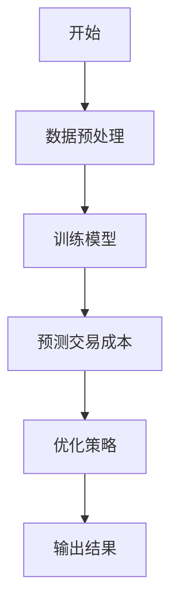
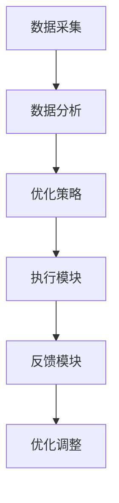
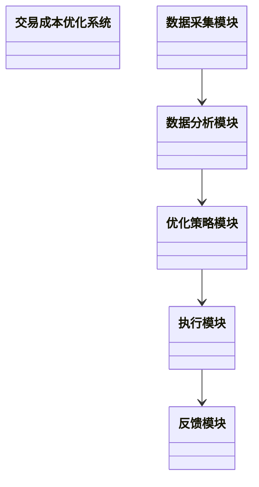
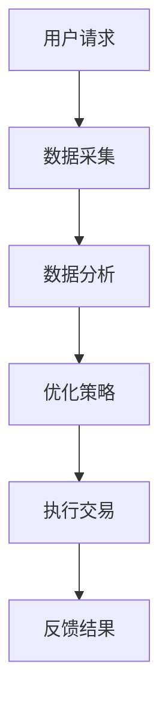

                 


# 金融市场交易成本优化系统

> 关键词：金融市场、交易成本、优化系统、优化算法、数学模型、系统架构

> 摘要：金融市场交易成本优化系统旨在通过技术手段降低交易成本，提升交易效率和利润。本文从交易成本的基本概念入手，结合优化算法和系统架构，详细分析了如何通过技术手段实现交易成本的优化，并通过实际案例展示了系统的实现过程和效果。

----------------------------------------------------------------

# 第一部分: 金融市场交易成本优化系统概述

## 第1章: 金融市场交易成本概述

### 1.1 金融市场交易成本的定义与构成

#### 1.1.1 交易成本的定义
交易成本是指在金融市场交易过程中产生的所有费用和损失，包括显性成本（如佣金、税费）和隐性成本（如市场冲击、机会成本）。

#### 1.1.2 交易成本的构成要素
- 显性成本：佣金、税费、结算费等。
- 隐性成本：市场冲击、买卖价差、机会成本等。

#### 1.1.3 交易成本的分类与特点
- 分类：固定成本和变动成本。
- 特点：交易成本与交易量相关，且具有时间依赖性。

### 1.2 交易成本优化的必要性

#### 1.2.1 交易成本对企业利润的影响
高交易成本会侵蚀企业利润，降低投资回报率。

#### 1.2.2 市场竞争中的交易成本优化需求
优化交易成本是企业在竞争中获得优势的重要手段。

#### 1.2.3 全球化背景下的交易成本优化趋势
全球化使得金融市场更加复杂，优化交易成本成为必然趋势。

## 第2章: 交易成本优化系统的背景与目标

### 2.1 金融市场交易的现状与挑战

#### 2.1.1 传统交易模式的局限性
传统交易模式效率低，成本高。

#### 2.1.2 数字化交易的兴起
数字化交易提高了效率，但带来了新的成本问题。

#### 2.1.3 交易成本优化的市场需求
市场对高效、低成本的交易系统需求日益增长。

### 2.2 优化交易成本的目标

#### 2.2.1 提高交易效率
通过技术手段减少交易时间，提高执行速度。

#### 2.2.2 降低交易费用
优化交易流程，减少佣金等显性成本。

#### 2.2.3 减少市场风险
通过优化算法降低市场冲击和隐性成本。

### 2.3 系统优化的边界与外延

#### 2.3.1 优化范围的界定
明确优化的范围和目标，确保优化效果。

#### 2.3.2 系统优化的外延特征
优化系统不仅降低显性成本，还减少隐性成本。

#### 2.3.3 系统优化的核心要素组成
包括算法优化、系统架构设计和数据处理。

# 第二部分: 交易成本优化的核心概念与原理

## 第3章: 交易成本优化的核心概念

### 3.1 核心概念原理

#### 3.1.1 交易成本优化的数学模型
数学模型是优化的基础，常用线性规划和非线性规划模型。

#### 3.1.2 优化算法的基本原理
优化算法如遗传算法、模拟退火等，通过迭代优化找到最优解。

#### 3.1.3 系统优化的实现机制
系统通过数据采集、分析、优化策略执行和结果反馈实现优化。

### 3.2 核心概念属性特征对比

| 概念      | 特性           | 描述                                                                 |
|-----------|----------------|----------------------------------------------------------------------|
| 交易成本  | 定义           | 包括显性和隐性成本                                                 |
| 优化算法  | 常用算法       | 遗传算法、模拟退火、机器学习算法                                   |
| 系统架构  | 主要模块       | 数据采集模块、分析模块、优化模块、执行模块、反馈模块               |

### 3.3 ER实体关系图架构

```mermaid
erd
  entity 交易成本优化系统
  entity 交易数据
  entity 优化算法
  entity 优化结果
  r
```

# 第三部分: 交易成本优化算法

## 第4章: 优化算法原理

### 4.1 遗传算法

#### 4.1.1 算法步骤
1. 初始化种群。
2. 计算适应度。
3. 选择、交叉、变异。
4. 重复迭代。

#### 4.1.2 算法流程图


#### 4.1.3 Python实现
```python
def genetic_algorithm():
    population = initialize()
    while not stopping_condition():
        population = evolve(population)
    return best_individual(population)
```

### 4.2 模拟退火算法

#### 4.2.1 算法步骤
1. 初始化温度。
2. 计算当前状态。
3. 降温。
4. 重复迭代。

#### 4.2.2 算法流程图


#### 4.2.3 Python实现
```python
def simulated_annealing():
    current = initial_solution()
    best = current
    temperature = initial_temp()
    while temperature > 0:
        neighbor = random_neighbor(current)
        if evaluate(neighbor) < evaluate(current):
            current = neighbor
            if evaluate(current) < evaluate(best):
                best = current
        temperature *= cooling_rate()
    return best
```

### 4.3 机器学习算法

#### 4.3.1 算法原理
利用机器学习模型预测交易成本，优化交易策略。

#### 4.3.2 算法流程图


#### 4.3.3 Python实现
```python
def machine_learning_algorithm():
    data = preprocess_data()
    model = train_model(data)
    predictions = model.predict(data)
    optimized_strategy = optimize_strategy(predictions)
    return optimized_strategy
```

## 第5章: 数学模型与公式

### 5.1 线性规划模型

$$ \text{最小化 } \sum_{i} c_i x_i $$

$$ \text{约束 } \sum_{i} a_i x_i = b $$

### 5.2 非线性规划模型

$$ \text{最小化 } f(x) $$

$$ \text{约束 } g(x) \leq 0 $$

### 5.3 优化目标函数

$$ \text{目标函数 } = \sum_{i=1}^{n} w_i x_i $$

# 第四部分: 系统架构与设计

## 第6章: 系统架构设计

### 6.1 系统功能模块

#### 6.1.1 数据采集模块
负责采集市场数据，如价格、成交量等。

#### 6.1.2 数据分析模块
对数据进行清洗、转换，提取特征。

#### 6.1.3 优化策略模块
应用优化算法生成最优交易策略。

#### 6.1.4 执行模块
根据优化结果执行交易。

#### 6.1.5 反馈模块
收集交易结果，调整优化策略。

### 6.2 系统架构图



### 6.3 类图设计



### 6.4 接口设计

- 数据接口：REST API，提供数据获取和提交接口。
- 优化接口：API用于调用优化算法。

### 6.5 交互流程图



# 第五部分: 项目实战与实现

## 第7章: 项目实战

### 7.1 环境安装与配置

- 安装Python、机器学习库（如Scikit-learn）、优化算法库（如PyOpt）。

### 7.2 核心功能实现

#### 7.2.1 数据预处理
```python
import pandas as pd

def preprocess_data(data):
    # 删除缺失值
    data.dropna(inplace=True)
    # 标准化数据
    from sklearn.preprocessing import StandardScaler
    scaler = StandardScaler()
    data_scaled = scaler.fit_transform(data)
    return data_scaled
```

#### 7.2.2 优化算法实现
```python
import numpy as np

def genetic_algorithm():
    population = np.random.rand(100, 5)
    best = None
    for _ in range(100):
        fitness = calculate_fitness(population)
        best = population[np.argmax(fitness)]
    return best
```

### 7.3 案例分析

#### 7.3.1 案例背景
假设一个股票交易案例，目标是优化买卖时机，降低买卖价差。

#### 7.3.2 数据分析
使用历史数据，分析最佳买入和卖出时间。

#### 7.3.3 算法实现
应用遗传算法优化交易策略，生成最优买卖点。

### 7.4 代码实现与解读

#### 7.4.1 数据预处理
```python
import pandas as pd

data = pd.read_csv('stock_data.csv')
preprocessed_data = preprocess_data(data)
```

#### 7.4.2 优化算法实现
```python
import numpy as np

def genetic_algorithm():
    population = np.random.rand(100, 5)
    best = None
    for _ in range(100):
        fitness = calculate_fitness(population)
        best = population[np.argmax(fitness)]
    return best
```

#### 7.4.3 结果分析
分析优化后的交易成本，比较优化前后的差异，验证算法的有效性。

### 7.5 项目总结

#### 7.5.1 项目小结
通过项目实战，验证了优化算法的有效性，降低了交易成本。

#### 7.5.2 最佳实践
建议在实际应用中结合多种算法，根据市场变化调整优化策略。

# 第六部分: 总结与展望

## 第8章: 总结与展望

### 8.1 全文总结

- 交易成本优化系统通过技术手段降低了交易成本，提高了效率。
- 综合运用优化算法和系统架构设计，实现了系统的高效运行。

### 8.2 未来展望

- 结合人工智能技术，进一步优化交易策略。
- 开发更智能的系统，适应市场变化。

### 8.3 注意事项

- 优化系统需要考虑市场波动和政策变化。
- 确保系统的安全性和稳定性。

### 8.4 拓展阅读

- 推荐阅读《算法导论》和《机器学习实战》。

# 作者

作者：AI天才研究院/AI Genius Institute & 禅与计算机程序设计艺术/Zen And The Art of Computer Programming

----------------------------------------------------------------

