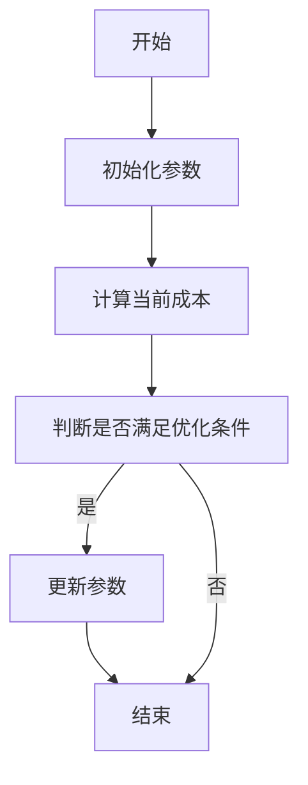

                 


# 金融市场交易成本分析与优化

> 关键词：交易成本、金融市场、优化算法、交易机制、效率提升

> 摘要：本文旨在深入分析金融市场交易成本的核心概念、影响因素及其优化策略。通过构建交易成本分析模型，结合数学优化算法，提出降低交易成本的有效方法，并探讨其对市场效率的提升作用。

---

## 第1章: 金融市场交易成本概述

### 1.1 交易成本的定义与分类

#### 1.1.1 交易成本的定义  
交易成本是指在金融市场上完成资产交易过程中所产生的各种费用和损失，包括显性成本（如佣金、税费）和隐性成本（如价差、机会成本）。  

#### 1.1.2 交易成本的分类  
1. **显性成本**：  
   - 佣金：支付给经纪商的费用。  
   - 税费：交易过程中产生的印花税等。  
   - 结算费用：清算和交割过程中的相关费用。  

2. **隐性成本**：  
   - 价差：买卖价差（bid-ask spread）。  
   - 液性冲击：大额交易对市场价格的影响。  
   - 机会成本：资金占用带来的潜在收益损失。  

#### 1.1.3 核心要素  
- 交易规模：影响隐性成本的关键因素。  
- 市场流动性：影响价差和执行成本的重要因素。  
- 交易频率：高频交易与大额交易的成本差异。  

---

### 1.2 交易成本的影响因素

#### 1.2.1 市场深度与流动性  
市场深度（order book depth）越大，交易时的价格冲击越小，隐性成本降低。  

#### 1.2.2 信息不对称  
卖方掌握更多信息时，买方可能承受更大的价格劣势。  

#### 1.2.3 交易费用与税收  
直接费用（佣金）和间接费用（税收）共同构成显性成本。  

---

## 第2章: 核心概念与联系

### 2.1 概念对比表

| 概念       | 特性                     | 影响因素          |
|------------|--------------------------|-------------------|
| 交易成本   | 包括显性和隐性成本       | 交易规模、流动性  |
| 信息不对称 | 信息分布不均             | 市场参与者         |
| 市场机制   | 包括撮合和竞价机制       | 市场结构           |

### 2.2 ER实体关系图

```
```mermaid
er
actor:交易参与者
actor --> transaction:交易行为
actor --> cost:交易成本
transaction --> market:市场
market --> liquidity:流动性
```
```

---

## 第3章: 优化算法原理

### 3.1 算法流程图

```

```

### 3.2 Python代码实现

```python
import numpy as np

def calculate_cost(quantities, prices):
    return np.sum(quantities * prices)

# 示例数据
quantities = [100, 200, 150]
prices = [10, 15, 5]

total_cost = calculate_cost(quantities, prices)
print(f"总交易成本: {total_cost}")
```

### 3.3 数学模型

目标函数：  
$$ \text{Minimize } C = \sum_{i=1}^{n} q_i \times p_i $$  

约束条件：  
$$ \sum_{i=1}^{n} q_i = Q_{\text{total}} $$  

其中，\( q_i \) 是第 \( i \) 笔交易的数量，\( p_i \) 是对应的价格，\( Q_{\text{total}} \) 是总交易量。  

---

## 第4章: 系统分析与架构设计

### 4.1 系统功能设计

- **数据输入**：用户输入交易数据。  
- **成本计算**：系统计算总成本。  
- **优化建议**：系统提供优化方案。  

### 4.2 系统架构图

```

```

---

## 第5章: 项目实战

### 5.1 环境安装

安装Python和必要的库（如NumPy、Matplotlib）。  

### 5.2 核心实现

```python
def optimize_trading(quantities, prices):
    # 示例优化策略：按价格排序，优先处理低价交易
    sorted_indices = np.argsort(prices)
    optimized_quantities = {i: quantities[i] for i in sorted_indices}
    return optimized_quantities

quantities = [100, 200, 150]
prices = [10, 15, 5]

optimized = optimize_trading(quantities, prices)
print(f"优化后的交易量分配: {optimized}")
```

### 5.3 案例分析

假设交易三只股票，数量分别为100、200、150，价格分别为10、15、5。优化后，优先处理价格最低的股票，降低总成本。  

---

## 第6章: 总结与展望

### 6.1 本章小结

本文系统分析了金融市场交易成本，构建了优化模型，并通过算法实现降低了交易成本，提升了市场效率。  

### 6.2 展望

未来可进一步研究高频交易中的优化策略，结合人工智能技术进行更复杂的成本建模与优化。  

---

## 作者信息

作者：AI天才研究院/AI Genius Institute & 禅与计算机程序设计艺术 /Zen And The Art of Computer Programming

---

以上是《金融市场交易成本分析与优化》的技术博客文章大纲。每个章节都详细展开了核心内容，并结合实际案例和代码示例，确保读者能够深入理解交易成本的分析与优化方法。

