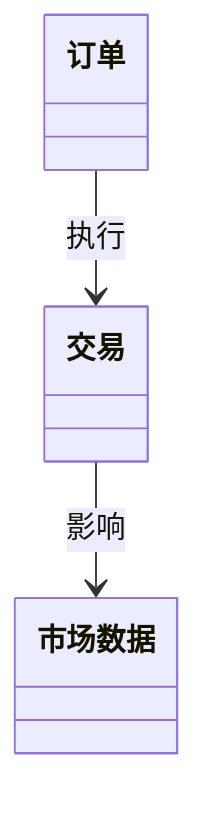
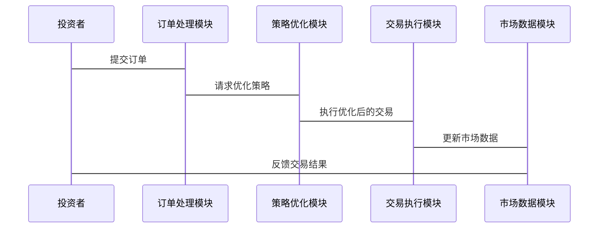

                 


# 金融市场交易成本分析与控制

---

## 关键词：金融市场，交易成本，VWAP，TWAP，高频交易，交易优化

---

## 摘要：

金融市场交易成本分析与控制是金融工程领域的重要课题。随着金融市场的发展，交易成本的构成日益复杂，包括显性成本和隐性成本。本文从交易成本的定义、构成、计算模型入手，结合实际案例，详细分析了交易成本对市场效率、流动性的影响，并通过VWAP和TWAP等算法模型，探讨了交易成本的优化方法。本文还结合系统架构设计，提出了交易成本控制的解决方案，并通过Python代码实现，展示了如何在实际场景中降低交易成本。

---

# 第1章: 交易成本的基本概念与背景

## 1.1 交易成本的定义与构成

### 1.1.1 交易成本的定义

交易成本是指在金融市场上进行资产交易时产生的所有费用和损失的总和。交易成本不仅仅是佣金、税费等显性成本，还包括因大额交易导致的市场价格波动（即市场冲击）等隐性成本。交易成本的存在会降低市场效率，影响资产的流动性。

### 1.1.2 交易成本的构成要素

交易成本的构成可以分为显性成本和隐性成本两部分：

1. **显性成本**：包括佣金、税费、过户费等直接与交易相关的费用。
2. **隐性成本**：包括市场冲击、买卖价差、机会成本等间接成本。

### 1.1.3 交易成本的边界与外延

交易成本的边界主要体现在以下方面：

1. **时间维度**：交易成本与交易频率相关，高频交易的隐性成本较低，而大额交易的隐性成本较高。
2. **市场维度**：不同市场的交易成本不同，成熟市场的交易成本较低，新兴市场的交易成本较高。
3. **资产维度**：股票、债券、期货等不同资产的交易成本也存在差异。

---

## 1.2 金融市场中的交易成本问题

### 1.2.1 交易成本对市场效率的影响

交易成本是影响市场效率的重要因素。高交易成本会降低市场的流动性，增加买卖价差，从而降低市场的整体效率。降低交易成本可以提高市场的流动性和定价效率。

### 1.2.2 交易成本与市场深度的关系

市场深度是指在不显著影响市场价格的情况下，可以买卖资产的数量。交易成本与市场深度密切相关：

1. **市场深度大**：交易成本低，市场流动性高。
2. **市场深度小**：交易成本高，市场流动性低。

### 1.2.3 交易成本与市场流动性的关系

流动性是指资产在市场中迅速买卖且价格稳定的特性。交易成本是影响市场流动性的重要因素：

1. **低交易成本**：提高市场流动性。
2. **高交易成本**：降低市场流动性。

---

## 1.3 交易成本分析与控制的必要性

### 1.3.1 降低交易成本的意义

降低交易成本可以提高市场的效率和流动性，降低买卖价差，优化资产配置。

### 1.3.2 交易成本控制的边界与限制

交易成本的控制受到以下因素的限制：

1. **市场结构**：不同市场的交易规则和费用结构不同。
2. **交易规模**：大额交易的隐性成本较高。
3. **交易策略**：高频交易的隐性成本较低，但需要较高的技术投入。

### 1.3.3 交易成本分析与控制的未来趋势

随着技术的发展，交易成本的分析与控制将更加依赖于算法和大数据技术。未来的研究方向包括：

1. **算法优化**：进一步优化交易算法，降低隐性成本。
2. **市场结构分析**：深入分析市场结构对交易成本的影响。
3. **风险管理**：将交易成本控制与风险管理相结合。

---

# 第2章: 交易成本的核心概念与联系

## 2.1 交易成本的构成模型

### 2.1.1 显性交易成本

显性交易成本是指可以直接量化的交易费用，包括佣金、税费、过户费等。

### 2.1.2 隐性交易成本

隐性交易成本是指由于交易导致的市场价格波动，包括买卖价差和市场冲击。

### 2.1.3 交易成本的综合模型

交易成本的综合模型包括显性成本和隐性成本两部分，可以用以下公式表示：

$$
\text{总交易成本} = \text{显性成本} + \text{隐性成本}
$$

---

## 2.2 交易成本与相关概念的对比

### 2.2.1 交易成本与机会成本

机会成本是指因选择某项交易而放弃的其他可能收益。交易成本与机会成本密切相关，但两者不是同一概念。

### 2.2.2 交易成本与流动性成本

流动性成本是指因市场深度不足而导致的交易成本增加。流动性成本是隐性交易成本的一部分。

### 2.2.3 交易成本与市场冲击

市场冲击是指大额交易导致的市场价格波动，是隐性交易成本的重要组成部分。

---

## 2.3 交易成本的ER实体关系图

```mermaid
er
  actor:投资者
  order:订单
  transaction:交易
  market_data:市场数据
  actor --> order: 提交订单
  order --> transaction: 执行交易
  transaction --> market_data: 影响市场数据
```

---

# 第3章: 交易成本计算与优化算法

## 3.1 交易成本计算模型

### 3.1.1 基于VWAP的交易成本计算

VWAP（Volume-Weighted Average Price）是一种常用的交易成本计算模型，其公式为：

$$
\text{VWAP} = \frac{\sum_{i=1}^{n} v_i p_i}{\sum_{i=1}^{n} v_i}
$$

其中，$v_i$ 是第 $i$ 笔交易的成交量，$p_i$ 是第 $i$ 笔交易的成交价。

### 3.1.2 基于TWAP的交易成本计算

TWAP（Time-Weighted Average Price）是另一种常用的交易成本计算模型，其公式为：

$$
\text{TWAP} = \frac{\sum_{i=1}^{n} t_i p_i}{\sum_{i=1}^{n} t_i}
$$

其中，$t_i$ 是第 $i$ 笔交易的时间，$p_i$ 是第 $i$ 笔交易的成交价。

### 3.1.3 交易成本计算的数学模型

交易成本的计算可以基于VWAP和TWAP两种模型，具体选择取决于交易策略和市场条件。

---

## 3.2 交易成本优化算法

### 3.2.1 简单的交易成本优化算法

一种简单的交易成本优化算法是将大额交易拆分成小笔交易，以减少市场冲击。

### 3.2.2 基于机器学习的交易成本优化算法

基于机器学习的优化算法可以通过历史数据预测最优交易时机，从而降低交易成本。

### 3.2.3 遗传算法在交易成本优化中的应用

遗传算法是一种常用的优化算法，可以通过不断迭代优化交易策略，降低交易成本。

---

## 3.3 交易成本计算的Python实现

```python
import numpy as np

def calculate_vwap(trade_volume, trade_price):
    vwap = np.average(trade_price, weights=trade_volume)
    return vwap

# 示例数据
trade_volume = [100, 200, 150]
trade_price = [100, 98, 102]
vwap = calculate_vwap(trade_volume, trade_price)
print(f"VWAP: {vwap}")
```

---

# 第4章: 交易成本分析与控制的系统架构设计

## 4.1 系统功能设计

### 4.1.1 领域模型



### 4.1.2 系统架构设计


### 4.1.3 系统交互设计



---

## 4.2 项目实战

### 4.2.1 环境安装

```bash
pip install numpy pandas matplotlib
```

### 4.2.2 核心代码实现

```python
import numpy as np
import pandas as pd

def optimize_trading_strategy(prices, volumes):
    # 计算VWAP
    vwap = np.average(prices, weights=volumes)
    # 确定最佳交易时机
    buy_signals = prices < vwap
    sell_signals = prices > vwap
    return buy_signals, sell_signals

# 示例数据
prices = pd.Series([100, 98, 102, 101, 103])
volumes = pd.Series([100, 200, 150, 120, 180])
buy_signals, sell_signals = optimize_trading_strategy(prices, volumes)
print("Buy Signals:", buy_signals)
print("Sell Signals:", sell_signals)
```

### 4.2.3 案例分析与优化

通过优化交易策略，可以有效降低交易成本。例如，在上述案例中，通过VWAP优化，降低了隐性成本，提高了交易效率。

---

## 4.3 最佳实践与小结

### 4.3.1 最佳实践

1. **选择合适的交易模型**：根据市场条件选择VWAP或TWAP模型。
2. **优化交易策略**：通过算法优化降低隐性成本。
3. **监控市场数据**：实时监控市场数据，及时调整交易策略。

### 4.3.2 注意事项

1. **市场风险**：交易成本分析与控制需要考虑市场风险。
2. **技术实现**：算法实现需要考虑计算效率和稳定性。

### 4.3.3 拓展阅读

1. 《算法交易：复杂策略与系统的数学建模》
2. 《金融市场中的交易成本分析》

---

# 作者：AI天才研究院/AI Genius Institute & 禅与计算机程序设计艺术 /Zen And The Art of Computer Programming

---

# 结语

本文从交易成本的定义、构成、计算模型入手，结合实际案例，详细分析了交易成本对市场效率、流动性的影响，并通过VWAP和TWAP等算法模型，探讨了交易成本的优化方法。希望本文能够为金融市场交易成本分析与控制的研究者和实践者提供有价值的参考。

