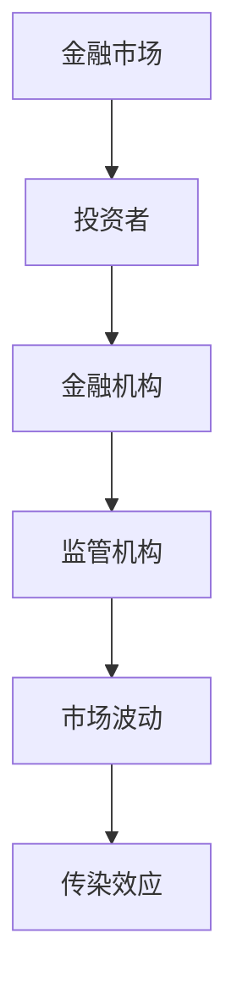
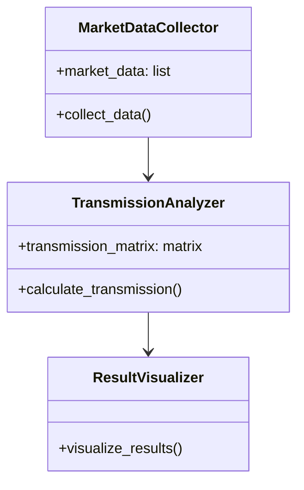
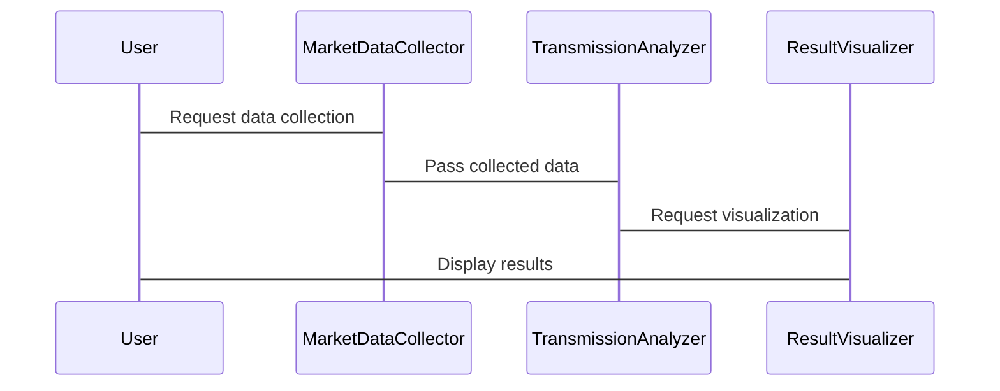

                 


# 金融市场传染效应模拟系统

## 关键词：金融市场，传染效应，风险传播，系统模拟，算法设计

## 摘要：金融市场传染效应模拟系统是一套用于研究金融市场中风险传播机制的系统。本文从背景介绍、核心概念、算法原理、系统架构、项目实战等多方面详细阐述了该系统的构建与实现，旨在为金融从业者和研究人员提供一个理论与实践相结合的工具，帮助更好地理解和应对金融市场中的传染效应。

---

## 目录大纲

### 第1章：金融市场传染效应概述

#### 1.1 背景介绍
- 1.1.1 金融市场的波动性与风险传播
- 1.1.2 传染效应的定义与核心概念
- 1.1.3 传染效应的经济意义与研究价值

#### 1.2 传染效应的表现形式
- 1.2.1 市场波动的连锁反应
- 1.2.2 风险在不同市场间的传播
- 1.2.3 传染效应的多维度分析

#### 1.3 传染效应的边界与外延
- 1.3.1 传染效应的边界条件
- 1.3.2 传染效应的外延与相关概念
- 1.3.3 传染效应的系统性特征

#### 1.4 本章小结

---

### 第2章：传染效应的核心概念与原理

#### 2.1 核心概念解析
- 2.1.1 风险源的识别与分类
- 2.1.2 传染路径的分析
- 2.1.3 传染强度的度量

#### 2.2 传染效应的属性特征对比
- 2.2.1 系统性风险与非系统性风险的对比
- 2.2.2 传染效应的时间序列特征
- 2.2.3 传染效应的空间扩散特征

#### 2.3 传染效应的ER实体关系图


---

### 第3章：传染效应模拟算法的设计与实现

#### 3.1 算法原理概述
- 3.1.1 传染效应模拟的基本原理
- 3.1.2 算法选择与优化
- 3.1.3 算法的数学模型与公式

#### 3.2 算法流程图
```mermaid
graph TD
    Start --> Initialize Parameters
    Initialize Parameters --> Simulate Market Dynamics
    Simulate Market Dynamics --> Calculate Transmission Probability
    Calculate Transmission Probability --> Update Market State
    Update Market State --> End
```

#### 3.3 算法代码实现
```python
import numpy as np

def transmission_probability(source, target):
    return 1 - np.exp(-source * target)

# 示例代码
source = 0.8
target = 0.5
prob = transmission_probability(source, target)
print(f"Transmission probability: {prob}")
```

---

### 第4章：传染效应的数学模型与公式

#### 4.1 传染效应的数学模型
- 4.1.1 传染概率公式
  $$ P = 1 - e^{-\lambda t} $$
- 4.1.2 传播强度公式
  $$ I = \sum_{i=1}^{n} \frac{P_i}{N_i} $$
- 4.1.3 风险累积公式
  $$ R = \int_{0}^{T} \lambda(t) dt $$

#### 4.2 模型对比与优化
- 4.2.1 模型的对比分析
- 4.2.2 参数优化方法
- 4.2.3 模型的适用性分析

---

### 第5章：系统分析与架构设计

#### 5.1 问题场景介绍
- 5.1.1 系统的目标与范围
- 5.1.2 系统的输入与输出
- 5.1.3 系统的约束与假设

#### 5.2 系统功能设计
- 5.2.1 数据采集模块
- 5.2.2 模拟引擎模块
- 5.2.3 结果分析模块

#### 5.3 系统架构设计


#### 5.4 系统接口设计
- 5.4.1 数据接口
- 5.4.2 模拟接口
- 5.4.3 结果接口

#### 5.5 系统交互设计


---

### 第6章：项目实战

#### 6.1 环境安装与配置
- 6.1.1 安装Python与相关库
- 6.1.2 数据源获取与预处理
- 6.1.3 系统安装与配置

#### 6.2 核心代码实现
```python
class MarketSimulator:
    def __init__(self, initial_conditions):
        self.initial_conditions = initial_conditions

    def simulate(self, time_steps):
        results = []
        for t in range(time_steps):
            # 计算传染概率
            prob = transmission_probability(self.initial_conditions[t], t)
            results.append(prob)
        return results
```

#### 6.3 案例分析与结果解读
- 6.3.1 案例背景
- 6.3.2 模拟过程
- 6.3.3 结果分析与解读

---

### 第7章：最佳实践与总结

#### 7.1 最佳实践
- 7.1.1 数据选择与处理
- 7.1.2 模型参数调整
- 7.1.3 系统优化建议

#### 7.2 总结与展望
- 7.2.1 本文总结
- 7.2.2 研究展望
- 7.2.3 实际应用价值

---

## 注意事项
- 本文所提及的算法与模型仅供参考，实际应用需结合具体场景与数据进行调整。
- 代码示例为简化版本，实际系统实现需考虑更多边界条件与优化。

## 作者
作者：AI天才研究院/AI Genius Institute  
联系邮箱：contact@ai-genius.com

