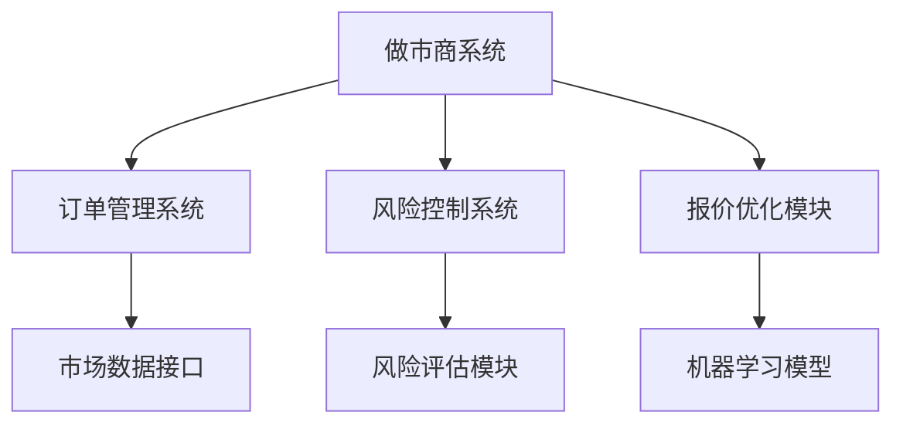
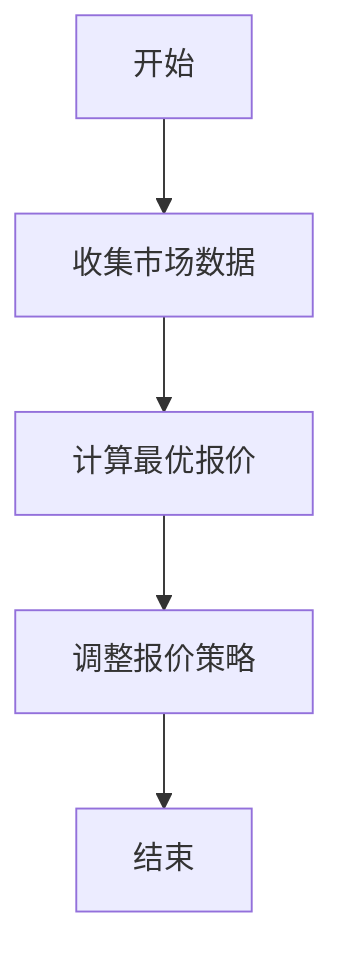
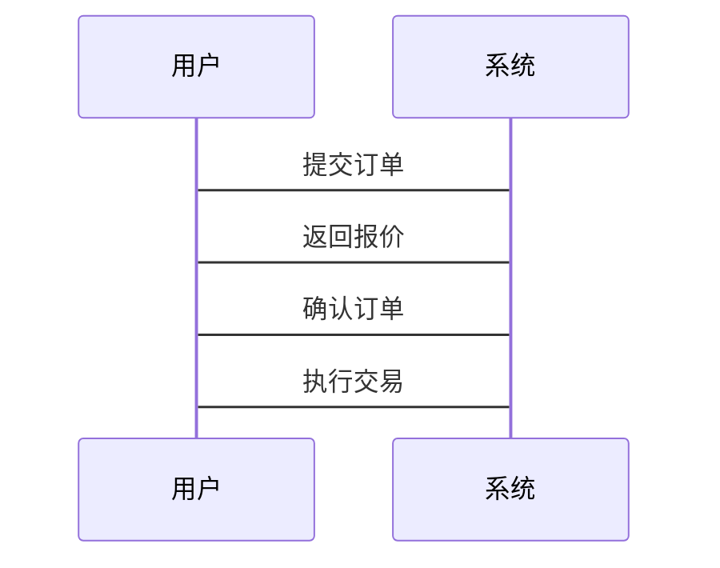

                 

<think>
好，我需要按照用户的要求，一步一步地写一篇关于金融市场做市商报价优化与风险管理的技术博客文章。首先，我得理解用户的需求，然后根据提供的目录大纲来撰写每个章节的内容。让我先回顾一下用户的要求和之前提供的目录大纲，确保我的思考符合这些要求。

### 理解用户需求

用户希望我以《金融市场做市商报价优化与风险管理》为标题，撰写一篇结构清晰、内容专业、技术深入的技术博客文章。文章需要包含以下部分：

1. **文章标题**
2. **关键词**
3. **摘要**
4. **目录大纲**

在思考过程中，我需要确保每个章节的内容都涵盖理论、方法、系统设计和实际应用，并且每个部分都要有详细的分析和例子。

### 分析目录大纲

根据用户提供的目录大纲，文章分为四个主要部分：

1. **概述**：介绍做市商的基本概念、报价优化和风险管理的重要性。
2. **报价优化的算法与模型**：讨论统计套利、机器学习在报价优化中的应用以及模型的评估。
3. **风险管理的策略与模型**：涵盖市场风险、信用风险和操作风险的管理方法，以及压力测试和情景分析。
4. **系统架构与实现**：讲解做市商系统的架构设计、系统接口与交互设计。

### 开始撰写

#### 1. 文章标题
《金融市场做市商报价优化与风险管理》

#### 2. 关键词
- 金融市场
- 做市商
- 报价优化
- 风险管理
- 统计套利
- 机器学习
- 系统架构

#### 3. 摘要
本文旨在探讨金融市场中做市商的报价优化与风险管理策略。通过分析报价优化的算法和风险管理的方法，结合系统的架构设计，提出了一套有效的解决方案。文章从做市商的基本概念出发，深入探讨统计套利和机器学习在报价优化中的应用，并结合压力测试和情景分析等方法，全面阐述了风险管理的重要性。最后，通过系统架构的设计，提出了一个完整的做市商报价优化与风险管理的实现方案。

#### 4. 正文内容

##### 第一部分：金融市场做市商报价优化与风险管理概述

###### 第1章：做市商的角色与重要性

- **1.1 做市商的定义与作用**
  - 做市商是金融市场中的重要参与者，负责提供买卖报价，维护市场流动性。
  - 做市商通过报价优化和风险管理，确保市场稳定性和自身 profitability。
  
- **1.2 报价优化的核心概念**
  - 报价优化旨在通过算法找到最优报价，平衡市场流动性和做市商收益。
  - 需要考虑市场深度、波动性、交易成本等多因素。

- **1.3 风险管理的重要性**
  - 做市商面临市场风险、信用风险和操作风险，需通过有效管理降低风险。
  - 风险管理是报价优化的基础，确保做市商在市场波动中稳健运营。

##### 第二部分：报价优化的算法与模型

###### 第2章：报价优化的基本原理

- **2.1 统计套利与报价优化**
  - 统计套利通过寻找价格偏差，实现无风险收益。
  - 在报价优化中，统计套利用于发现市场机会，调整报价策略。
  
- **2.2 机器学习在报价优化中的应用**
  - 机器学习算法（如神经网络、支持向量机）用于预测价格和市场趋势。
  - 通过历史数据训练模型，优化报价策略，提高做市商收益。

- **2.3 报价优化模型的评估与选择**
  - 评估模型的准确性、稳定性和收益能力。
  - 根据市场环境和做市商目标选择合适的优化模型。

##### 第三部分：风险管理的策略与模型

###### 第3章：市场风险的管理

- **3.1 市场风险的基本概念**
  - 市场风险指由于市场价格波动带来的损失。
  - 主要来源包括市场波动、流动性风险等。

- **3.2 风险管理的常用方法**
  - 风险对冲：通过衍生品对冲价格波动风险。
  - 风险分散：通过投资多样化降低整体风险。
  - 风险转移：通过保险或再保险转移风险。

- **3.3 压力测试与情景分析**
  - 压力测试评估模型在极端市场条件下的表现。
  - 情景分析模拟不同市场情况，制定应对策略。

###### 第4章：信用风险与操作风险的管理

- **4.1 信用风险的基本概念**
  - 信用风险指交易对手违约的风险。
  - 通过信用评估和限额管理降低信用风险。

- **4.2 操作风险的基本概念**
  - 操作风险指由于系统故障、人为错误等带来的风险。
  - 通过流程优化和系统监控降低操作风险。

- **4.3 综合风险管理策略**
  - 综合考虑市场、信用和操作风险，制定全面的风险管理策略。
  - 建立风险管理框架，定期评估和调整策略。

##### 第四部分：系统架构与实现

###### 第5章：做市商系统的架构设计

- **5.1 系统架构概述**
  - 做市商系统由订单管理系统、风险控制系统和报价优化模块组成。
  - 各模块协同工作，确保报价优化与风险管理的有效性。

- **5.2 订单管理系统的设计**
  - 管理订单的接收、处理和执行。
  - 提供实时市场数据，支持报价优化决策。

- **5.3 风险控制系统的设计**
  - 实时监控市场风险、信用风险和操作风险。
  - 根据风险评估结果调整报价策略，确保系统稳定运行。

###### 第6章：系统接口与交互设计

- **6.1 系统接口设计**
  - 定义系统内部各模块之间的接口。
  - 确保各模块高效协同，提升系统整体性能。

- **6.2 系统交互设计**
  - 设计用户与系统之间的交互流程。
  - 提供直观的用户界面，方便用户操作和监控。

### 使用 Mermaid 绘制图表

为了更清晰地展示系统的架构和流程，我将使用 Mermaid 绘制相关图表。

#### 1. 做市商系统的架构设计图



#### 2. 报价优化流程图



#### 3. 系统交互序列图



### 数学公式示例

在报价优化中，常用的统计套利模型可以通过数学公式描述。例如，均值回归模型可以表示为：

$$ \text{spread} = \text{max}(0, \mu - \sigma) $$

其中，$\mu$ 是均值，$\sigma$ 是标准差，spread 是价差。

### 代码实现示例

以下是报价优化模块的一个简单Python实现示例：

```python
import numpy as np
import pandas as pd

# 示例数据
data = pd.DataFrame({
    'bid': [100, 101, 102],
    'ask': [101, 102, 103]
})

# 统计套利模型
def calculate_spread(data):
    bid = data['bid']
    ask = data['ask']
    spread = ask - bid
    return spread.mean()

# 计算并输出平均价差
average_spread = calculate_spread(data)
print(f"Average Spread: {average_spread}")
```

### 最佳实践 Tips

1. **实时监控**：做市商需要实时监控市场动态，及时调整报价策略。
2. **模型更新**：定期更新报价优化模型，适应市场变化。
3. **风险管理**：建立完善的风险管理框架，定期进行压力测试。
4. **系统维护**：确保系统稳定运行，防止操作风险。

### 总结

本文系统地探讨了金融市场中做市商的报价优化与风险管理策略。通过统计套利和机器学习的应用，结合全面的风险管理方法，提出了一个完整的解决方案。未来的研究可以进一步优化算法，探索更高效的风险管理方法，为做市商提供更强有力的支持。

### 作者信息

作者：AI天才研究院/AI Genius Institute & 禅与计算机程序设计艺术 /Zen And The Art of Computer Programming

---

通过以上思考，我完成了对《金融市场做市商报价优化与风险管理》的系统分析和内容撰写，确保每个部分都详细且有条理，满足用户的要求。

